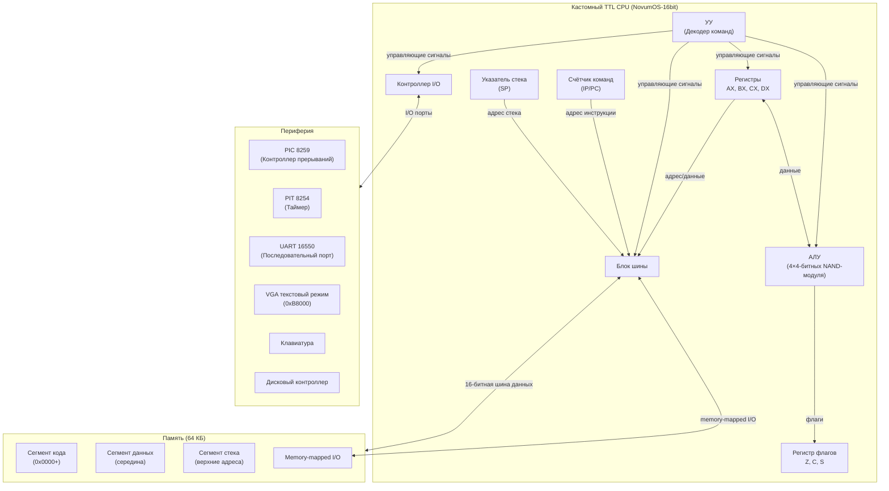

# NovumOS-16bit

**16-битная операционная система на Zig для самодельного процессора на TTL-логике**

[English version](README.md)

---

## Описание проекта

NovumOS-16bit — это экспериментальная операционная система, разрабатываемая для самодельного 16-битного процессора, собранного из дискретных TTL-микросхем серии К155ЛА (советский аналог 7400). Проект охватывает аппаратный дизайн, микроархитектуру CPU, набор команд и полноценное ядро ОС — всё с нуля.

Процессор построен по RISC-архитектуре с гибридным форматом инструкций (16/32 бит), использует 4-битный ALU из четырёх каскадных модулей на NAND-гейтах и поддерживает стандартную периферию PC (PIC 8259, PIT 8254, UART 16550, VGA текстовый режим).

---

## Навигация по документации

### Архитектура
| Тема | Ссылка |
|------|--------|
| Обзор | [ru/architecture/overview.md](ru/architecture/overview.md) |
| Регистры | [ru/architecture/registers.md](ru/architecture/registers.md) |
| Цикл выполнения | [ru/architecture/execution-cycle.md](ru/architecture/execution-cycle.md) |
| Карта памяти | [ru/architecture/memory-map.md](ru/architecture/memory-map.md) |

### Набор команд
| Тема | Ссылка |
|------|--------|
| Таблица команд | [ru/isa/instruction-set.md](ru/isa/instruction-set.md) |
| Битовая кодировка | [ru/isa/instruction-encoding.md](ru/isa/instruction-encoding.md) |
| Поведение флагов | [ru/isa/flags-behavior.md](ru/isa/flags-behavior.md) |

### Периферия
| Тема | Ссылка |
|------|--------|
| Обзор периферии | [ru/peripherals/overview.md](ru/peripherals/overview.md) |
| PIC 8259 | [ru/peripherals/pic.md](ru/peripherals/pic.md) |
| PIT 8254 | [ru/peripherals/pit.md](ru/peripherals/pit.md) |
| UART 16550 | [ru/peripherals/uart.md](ru/peripherals/uart.md) |
| VGA текстовый режим | [ru/peripherals/vga.md](ru/peripherals/vga.md) |

### Загрузка и сборка
| Тема | Ссылка |
|------|--------|
| Процесс загрузки | [ru/boot/boot-process.md](ru/boot/boot-process.md) |
| Тулчейн | [ru/build/toolchain.md](ru/build/toolchain.md) |

---

## Характеристики процессора

| Параметр | Значение |
|----------|----------|
| Разрядность слова | 16 бит |
| Формат инструкций | Гибридный 16/32 бит |
| Разрядность ALU | 4 бита (4 модуля = 16 бит) |
| Реализация ALU | NAND-гейты (К155ЛА3 / 7400 серия) |
| Регистры общего назначения | AX, BX, CX, DX (по 16 бит) |
| Системные регистры | IP/PC, SP, FLAGS |
| Адресное пространство | 64 КБ (16-битная адресация) |
| Адресация | Прямая, косвенная, через регистр |
| Порядок байтов | Little-endian |
| Стартовый адрес | `0x0000` |
| Тактирование | Кварцевый генератор TTL |
| Тип ISA | RISC-подобный |
| Периферия | PIC 8259, PIT 8254, UART 16550, VGA |

---

## Набор команд

### Базовые команды

| Категория | Команды |
|-----------|---------|
| Пересылка данных | `MOV` |
| Арифметика | `ADD`, `SUB` |
| Побитовая логика | `AND`, `OR`, `XOR` |
| Сдвиги | `SHL`, `SHR` |
| Управление | `JMP`, `JZ`, `JNZ` |
| Ввод/вывод | `IN`, `OUT` |

### Рекомендуемые дополнения

| Категория | Команды |
|-----------|---------|
| Подпрограммы | `CALL`, `RET` |
| Стек | `PUSH`, `POP` |
| Прерывания | `INT` |
| Остановка CPU | `HLT` |

---

## Блок-схема архитектуры

---

## Как это работает

1. **Аппаратный слой**: CPU собран из дискретных TTL NAND-гейтов (серия 7400), 4-битный ALU состоит из четырёх каскадных модулей, образующих полный 16-битный конвейер данных.
2. **Набор команд**: RISC-подобная ISA с компактными 16-битными инструкциями и расширенными 32-битными инструкциями для более широких иммедиатов.
3. **Операционная система**: NovumOS работает на голом железе — управление процессами, памятью, прерываниями и драйверами устройств.
4. **Периферия**: Стандартная PC-совместимая периферия (PIC 8259, PIT 8254, UART 16550) обеспечивает обработку прерываний, тайминг, последовательную связь и вывод VGA.

---

## Философия проекта

- **Железо с нуля**: Без эмуляции; реальный дизайн на TTL-логике
- **Минимализм**: RISC-подобная ISA упрощает аппаратуру
- **Практичные возможности ОС**: Прерывания, многозадачность, драйверы
- **Документация прежде всего**: Каждый слой подробно описан

---

## Лицензия

CERN Open Hardware Licence Version 2 - Weakly Reciprocal (CERN-OHL-W v2)

---

*NovumOS-16bit — от NAND-гейтов до операционной системы.*
