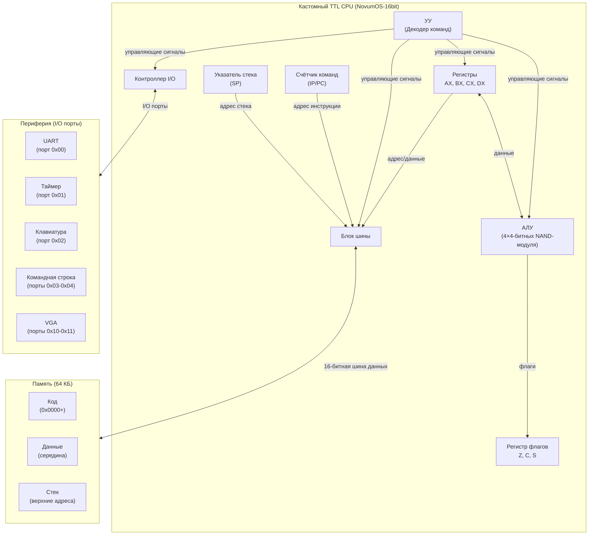

# NovumOS-16bit

**16-битная операционная система на Zig для самодельного процессора на TTL-логике**

[English version](en/README.md)

---

## Описание проекта

NovumOS-16bit — это экспериментальная операционная система, разрабатываемая для самодельного 16-битного процессора, собранного из дискретных TTL-микросхем серии К155ЛА (советский аналог 7400). Проект охватывает аппаратный дизайн, микроархитектуру CPU, набор команд и полноценное ядро ОС — всё с нуля.

Процессор построен по RISC-архитектуре с гибридным форматом инструкций (16/32 бит), использует 4-битный ALU из четырёх каскадных модулей на NAND-гейтах и систему ввода/вывода через I/O-порты с поддержкой UART, таймера, клавиатуры, командной строки и VGA.

---

## Навигация по документации

### Архитектура
| Тема | Ссылка |
|------|--------|
| Обзор | [ru/architecture/overview.md](ru/architecture/overview.md) |
| Регистры | [ru/architecture/registers.md](ru/architecture/registers.md) |
| Цикл выполнения | [ru/architecture/execution-cycle.md](ru/architecture/execution-cycle.md) |
| Карта памяти | [ru/architecture/memory-map.md](ru/architecture/memory-map.md) |

### Набор команд
| Тема | Ссылка |
|------|--------|
| Таблица команд | [ru/isa/instruction-set.md](ru/isa/instruction-set.md) |
| Битовая кодировка | [ru/isa/instruction-encoding.md](ru/isa/instruction-encoding.md) |
| Поведение флагов | [ru/isa/flags-behavior.md](ru/isa/flags-behavior.md) |

### Периферия
| Тема | Ссылка |
|------|--------|
| Обзор периферии | [ru/peripherals/overview.md](ru/peripherals/overview.md) |
| UART | [ru/peripherals/uart.md](ru/peripherals/uart.md) |
| VGA | [ru/peripherals/vga.md](ru/peripherals/vga.md) |

### Загрузка и сборка
| Тема | Ссылка |
|------|--------|
| Процесс загрузки | [ru/boot/boot-process.md](ru/boot/boot-process.md) |
| Тулчейн | [ru/build/toolchain.md](ru/build/toolchain.md) |

---

## Характеристики процессора

| Параметр | Значение |
|----------|----------|
| Разрядность слова | 16 бит |
| Формат инструкций | Гибридный 16/32 бит |
| Разрядность ALU | 4 бита (4 модуля = 16 бит) |
| Реализация ALU | NAND-гейты (К155ЛА3 / 7400 серия) |
| Регистры общего назначения | AX, BX, CX, DX (по 16 бит) |
| Системные регистры | IP/PC, SP, FLAGS |
| Адресное пространство | 64 КБ (16-битная адресация) |
| Адресация | Прямая, косвенная, через регистр |
| Порядок байтов | Little-endian |
| Стартовый адрес | `0x0000` (firmware загружается напрямую) |
| Тактирование | Кварцевый генератор TTL |
| Тип ISA | RISC-подобный |
| I/O порты | 256 × 16 бит, доступ через IN/OUT |
| Эмулятор | Циклически точный, 207+ тестов проходят |

### Карта I/O портов

| Порт | Периферия | Направление | Описание |
|------|-----------|-------------|----------|
| `0x00` | UART | R/W | Терминальный I/O (IN=rx, OUT=tx) |
| `0x01` | Таймер | Чтение | Счётчик циклов (мл. 16 бит) |
| `0x02` | Клавиатура | Чтение | Скан-код (0 если пусто) |
| `0x03` | ID команды | Чтение | ID команды (0=нет, 1-7=команда), сбрасывается при чтении |
| `0x04` | Буфер строки | Чтение | Следующий байт из буфера (0 если пусто) |
| `0x10` | VGA символ | Запись | Вывод символа |
| `0x11` | VGA управление | Запись | 0x0001=очистка, 0x0002=сброс |
| `0x05–0xFF` | Generic | R/W | Хранилище общего назначения |

---

## Набор команд

### Базовые команды

| Категория | Команды |
|-----------|---------|
| Пересылка данных | `MOV` (рег/рег, рег/конст, косвенная) |
| Арифметика | `ADD`, `SUB`, `INC`, `DEC` |
| Сравнение | `CMP`, `TEST` |
| Побитовая логика | `AND`, `OR`, `XOR`, `NOT`, `NEG` |
| Сдвиги | `SHL`, `SHR` |
| Стек | `PUSH`, `POP` |
| Управление | `JMP`, `JZ`, `JNZ`, `JC`, `JNC`, `JS`, `JNS` |
| Подпрограммы | `CALL`, `RET` |
| Прерывания | `INT`, `IRET` |
| Ввод/вывод | `IN`, `OUT` |
| Системные | `NOP`, `HLT` |

### Подкоманды ALU

| Значение | Мнемоника | Описание |
|----------|-----------|----------|
| 0x0 | ADD | dst = dst + src |
| 0x1 | SUB | dst = dst - src |
| 0x2 | CMP | Сравнение (только флаги) |
| 0x3 | TEST | Побитовое AND (только флаги) |
| 0x4 | AND | dst = dst AND src |
| 0x5 | OR | dst = dst OR src |
| 0x6 | XOR | dst = dst XOR src |
| 0x7 | SHL | dst = dst << src |
| 0x8 | SHR | dst = dst >> src |
| 0x9 | INC | dst = dst + 1 |
| 0xA | DEC | dst = dst - 1 |
| 0xB | NOT | dst = NOT dst |
| 0xC | NEG | dst = 0 - dst |
| 0xD | MUL | dst = dst * src (планируется) |
| 0xE | DIV | dst = dst / src (планируется) |

### Подкоманды условных переходов

| Значение | Мнемоника | Условие |
|----------|-----------|---------|
| 0x0 | JZ | Переход если ноль (Z=1) |
| 0x1 | JNZ | Переход если не ноль (Z=0) |
| 0x2 | JC | Переход если перенос (C=1) |
| 0x3 | JNC | Переход если нет переноса (C=0) |
| 0x4 | JS | Переход если знак (S=1) |
| 0x5 | JNS | Переход если нет знака (S=0) |

### Форматы инструкций

**16-битный формат:** `[opcode:4][dst:2][src:2][mode:2][unused:6]`

Используется: NOP, MOV рег-рег, ALU рег-рег, PUSH/POP, RET, HLT.

**32-битный формат:** `[opcode:4][dst:2][mode=01:2][immediate:16][unused:8]`

Используется: MOV рег-конст, JMP, CALL, IN, OUT, CondJump. Mode=01 в битах 25:24 отмечает 32-битный формат (CPU использует это для определения размера).

---

## Блок-схема архитектуры

---

## Как это работает

1. **Аппаратный слой**: CPU собран из дискретных TTL NAND-гейтов (серия 7400), 4-битный ALU состоит из четырёх каскадных модулей, образующих полный 16-битный конвейер данных.
2. **Набор команд**: RISC-подобная ISA с компактными 16-битными инструкциями и расширенными 32-битными инструкциями для более широких иммедиатов.
3. **Операционная система**: NovumOS работает на голом железе — управление процессами, памятью, прерываниями и драйверами устройств.
4. **Периферия**: I/O-периферия (UART, таймер, клавиатура, командная строка, VGA) обеспечивает последовательную связь, тайминг, ввод и вывод.

---

## Философия проекта

- **Железо с нуля**: Без эмуляции; реальный дизайн на TTL-логике
- **Минимализм**: RISC-подобная ISA упрощает аппаратуру
- **Практичные возможности ОС**: Прерывания, многозадачность, драйверы
- **Документация прежде всего**: Каждый слой подробно описан

---

## Статус проекта

- [x] Архитектура CPU
- [x] Определение ISA
- [x] NAND-ALU дизайн
- [x] Циклически точный эмулятор CPU (207+ тестов проходят)
- [x] Генератор firmware и система сборки
- [x] Высокоуровневые ассемблерные обёртки (asm.zig)
- [ ] Аппаратная схема (TTL)
- [ ] FPGA синтез / макет на макетной плате
- [ ] Базовый VGA драйвер
- [ ] Загрузчик
- [ ] Ядро ОС (монолитное / микроядро)
- [ ] Планировщик задач
- [ ] Файловая система

---

## Лицензия

CERN Open Hardware Licence Version 2 - Weakly Reciprocal (CERN-OHL-W v2)

---

*NovumOS-16bit — от NAND-гейтов до операционной системы.*
