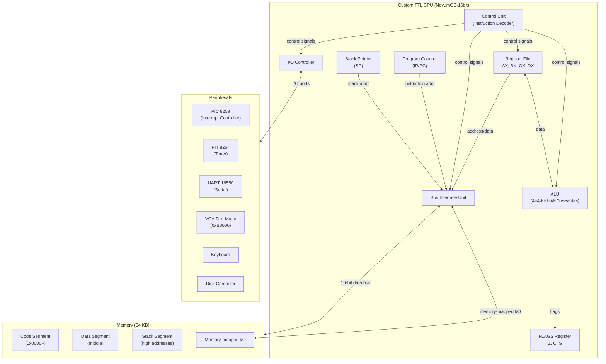

# NovumOS-16bit

**A 16-bit operating system written in Zig for a custom TTL-based CPU**

[Русская версия](../ru/README.md)

---

## Project Overview

NovumOS-16bit is a complete operating system environment built for a custom-designed 16-bit CPU constructed entirely from TTL logic chips (NAND gates, К155ЛА3 / 7400 series). The project encompasses hardware design, CPU microarchitecture, instruction set architecture, and a full OS kernel — all from first principles.

The CPU features a RISC-like hybrid 16/32-bit instruction format, four 16-bit general-purpose registers, a 4-bit ALU built from cascaded NAND-based modules, and support for standard PC peripherals (PIC 8259, PIT 8254, UART 16550, VGA text mode).

---

## Navigation

| Section | File | Description |
|---------|------|-------------|
| **Architecture** | | |
| Overview | [architecture/overview.md](architecture/overview.md) | CPU block diagram, ALU design, data paths |
| Registers | [architecture/registers.md](architecture/registers.md) | Register set, FLAGS layout, encoding |
| Execution Cycle | [architecture/execution-cycle.md](architecture/execution-cycle.md) | Fetch-decode-execute-writeback pipeline |
| Memory Map | [architecture/memory-map.md](architecture/memory-map.md) | 64KB address space layout, I/O mapping |

---

## CPU Specifications

| Parameter | Value |
|-----------|-------|
| Word size | 16-bit |
| Instruction format | Hybrid 16/32-bit |
| ALU width | 4-bit (4 modules = 16-bit) |
| ALU implementation | NAND gates (К155ЛА3 / 7400 series) |
| General-purpose registers | AX, BX, CX, DX (16-bit each) |
| Special registers | IP/PC, SP, FLAGS |
| Address space | 64 KB (16-bit addressing) |
| Addressing modes | Direct, indirect, register-indirect |
| Endianness | Little-endian |
| Boot address | `0x0000` |
| Clock | TTL crystal oscillator |
| ISA type | RISC-like |
| Supported peripherals | PIC 8259, PIT 8254, UART 16550, VGA text |

---

## Instruction Set

### Core Instructions

| Category | Instructions |
|----------|-------------|
| Data movement | `MOV` |
| Arithmetic | `ADD`, `SUB` |
| Logic | `AND`, `OR`, `XOR` |
| Shift | `SHL`, `SHR` |
| Control flow | `JMP`, `JZ`, `JNZ` |
| I/O | `IN`, `OUT` |

### Recommended Extensions

| Category | Instructions |
|----------|-------------|
| Subroutine support | `CALL`, `RET` |
| Stack operations | `PUSH`, `POP` |
| Interrupts | `INT` |
| Halting | `HLT` |

---

## Architecture Block Diagram

---

## How It Works

1. **Hardware Layer**: The CPU is built from discrete TTL NAND gates (7400 series), with a 4-bit ALU composed of four cascaded modules producing a full 16-bit datapath.
2. **Instruction Set**: A RISC-like ISA with compact 16-bit instructions and extended 32-bit instructions for wider immediates and memory offsets.
3. **Operating System**: NovumOS runs directly on the bare metal, managing processes, memory, interrupts, and device drivers.
4. **Peripherals**: Standard PC-compatible peripherals (8259 PIC, 8254 PIT, 16550 UART) provide interrupt handling, timing, serial communication, and VGA output.

---

## Design Philosophy

- **From-scratch hardware**: No emulation dependency; real TTL logic design
- **Minimalism**: RISC-like ISA keeps hardware simple
- **Practical OS features**: Interrupts, multitasking, device drivers
- **Documentation-first**: Every layer is thoroughly documented

---

*NovumOS-16bit — from NAND gates to operating system.*
