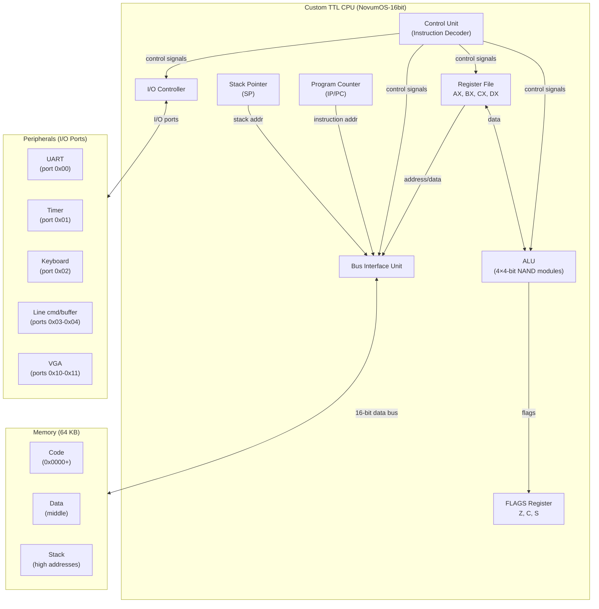

# NovumOS-16bit

**A 16-bit operating system written in Zig for a custom TTL-based CPU**

[Русская версия](../README-RU.md)

---

## Project Overview

NovumOS-16bit is a complete operating system environment built for a custom-designed 16-bit CPU constructed entirely from TTL logic chips (NAND gates, К155ЛА3 / 7400 series). The project encompasses hardware design, CPU microarchitecture, instruction set architecture, and a full OS kernel — all from first principles.

The CPU features a RISC-like hybrid 16/32-bit instruction format, four 16-bit general-purpose registers, a 4-bit ALU built from cascaded NAND-based modules, and an I/O subsystem with UART, timer, keyboard, line command/buffer, and VGA peripherals.

---

## Navigation

| Section | File | Description |
|---------|------|-------------|
| **Architecture** | | |
| Overview | [architecture/overview.md](architecture/overview.md) | CPU block diagram, ALU design, data paths |
| Registers | [architecture/registers.md](architecture/registers.md) | Register set, FLAGS layout, encoding |
| Execution Cycle | [architecture/execution-cycle.md](architecture/execution-cycle.md) | Fetch-decode-execute-writeback pipeline |
| Memory Map | [architecture/memory-map.md](architecture/memory-map.md) | 64KB address space layout, I/O mapping |
| **Emulator** | | |
| Overview | [emulator/overview.md](emulator/overview.md) | Emulator architecture, build/run, test coverage |
| **Assembly Wrappers** | | |
| Overview | [wrappers/overview.md](wrappers/overview.md) | High-level Zig API for ISA code generation |

---

## CPU Specifications

| Parameter | Value |
|-----------|-------|
| Word size | 16-bit |
| Instruction format | Hybrid 16/32-bit |
| ALU width | 4-bit (4 modules = 16-bit) |
| ALU implementation | NAND gates (К155ЛА3 / 7400 series) |
| General-purpose registers | AX, BX, CX, DX (16-bit each) |
| Special registers | IP/PC, SP, FLAGS |
| Address space | 64 KB (16-bit addressing) |
| Addressing modes | Direct, indirect, register-indirect |
| Endianness | Little-endian |
| Boot address | `0x0000` (firmware loaded directly) |
| Clock | TTL crystal oscillator |
| ISA type | RISC-like |
| I/O ports | 256 × 16-bit, accessed via IN/OUT |
| Emulator | Cycle-accurate, 207+ tests passing |

### I/O Port Map

| Port | Peripheral | Direction | Description |
|------|------------|-----------|-------------|
| `0x00` | UART | R/W | Terminal I/O (IN=rx, OUT=tx) |
| `0x01` | Timer | Read | Cycle counter (low 16 bits) |
| `0x02` | Keyboard | Read | Scan code (0 if empty) |
| `0x03` | Line cmd_id | Read | Command ID (0=none, 1-7=cmd), clears on read |
| `0x04` | Line buffer | Read | Next byte from line buffer (0 if empty) |
| `0x10` | VGA char | Write | Character output |
| `0x11` | VGA control | Write | 0x0001=clear, 0x0002=flush |
| `0x05–0xFF` | Generic | R/W | General-purpose storage |

---

## Instruction Set

### Core Instructions

| Category | Instructions |
|----------|-------------|
| Data movement | `MOV` (reg/reg, reg/imm, indirect) |
| Arithmetic | `ADD`, `SUB`, `INC`, `DEC` |
| Compare | `CMP`, `TEST` |
| Logic | `AND`, `OR`, `XOR`, `NOT`, `NEG` |
| Shift | `SHL`, `SHR` |
| Stack | `PUSH`, `POP` |
| Control flow | `JMP`, `JZ`, `JNZ`, `JC`, `JNC`, `JS`, `JNS` |
| Subroutine | `CALL`, `RET` |
| Interrupts | `INT`, `IRET` |
| I/O | `IN`, `OUT` |
| System | `NOP`, `HLT` |

### ALU Sub-Opcodes

| Value | Mnemonic | Description |
|-------|----------|-------------|
| 0x0 | ADD | dst = dst + src |
| 0x1 | SUB | dst = dst - src |
| 0x2 | CMP | Compare (flags only) |
| 0x3 | TEST | Bitwise AND (flags only) |
| 0x4 | AND | dst = dst AND src |
| 0x5 | OR | dst = dst OR src |
| 0x6 | XOR | dst = dst XOR src |
| 0x7 | SHL | dst = dst << src |
| 0x8 | SHR | dst = dst >> src |
| 0x9 | INC | dst = dst + 1 |
| 0xA | DEC | dst = dst - 1 |
| 0xB | NOT | dst = NOT dst |
| 0xC | NEG | dst = 0 - dst |
| 0xD | MUL | dst = dst * src (planned) |
| 0xE | DIV | dst = dst / src (planned) |

### Conditional Jump Sub-Opcodes

| Value | Mnemonic | Condition |
|-------|----------|-----------|
| 0x0 | JZ | Jump if Zero (Z=1) |
| 0x1 | JNZ | Jump if Not Zero (Z=0) |
| 0x2 | JC | Jump if Carry (C=1) |
| 0x3 | JNC | Jump if Not Carry (C=0) |
| 0x4 | JS | Jump if Sign (S=1) |
| 0x5 | JNS | Jump if Not Sign (S=0) |

### Instruction Formats

**16-bit format:** `[opcode:4][dst:2][src:2][mode:2][unused:6]`

Used for: NOP, MOV reg-reg, ALU reg-reg, PUSH/POP, RET, HLT.

**32-bit format:** `[opcode:4][dst:2][mode=01:2][immediate:16][unused:8]`

Used for: MOV reg-imm, JMP, CALL, IN, OUT, CondJump. Mode=01 at bits 25:24 marks the 32-bit format (CPU uses this for size detection).

---

## Architecture Block Diagram

---

## How It Works

1. **Hardware Layer**: The CPU is built from discrete TTL NAND gates (7400 series), with a 4-bit ALU composed of four cascaded modules producing a full 16-bit datapath.
2. **Instruction Set**: A RISC-like ISA with compact 16-bit instructions and extended 32-bit instructions for wider immediates.
3. **Operating System**: NovumOS runs directly on the bare metal, managing processes, memory, interrupts, and device drivers.
4. **Peripherals**: I/O-mapped peripherals (UART, timer, keyboard, line command/buffer, VGA) provide serial communication, timing, input, and display output.

---

## Design Philosophy

- **From-scratch hardware**: No emulation dependency; real TTL logic design
- **Minimalism**: RISC-like ISA keeps hardware simple
- **Practical OS features**: Interrupts, multitasking, device drivers
- **Documentation-first**: Every layer is thoroughly documented

---

## Project Status

- [x] CPU architecture design
- [x] ISA definition
- [x] NAND-ALU design
- [x] Cycle-accurate CPU emulator (207+ tests passing)
- [x] Firmware generator and build system
- [x] High-level assembly wrappers (asm.zig)
- [ ] Hardware schematic (TTL)
- [ ] FPGA synthesis / breadboard prototype
- [ ] Basic VGA driver
- [ ] Bootloader
- [ ] OS kernel (monolithic / microkernel)
- [ ] Task scheduler
- [ ] File system

---

*NovumOS-16bit — from NAND gates to operating system.*
