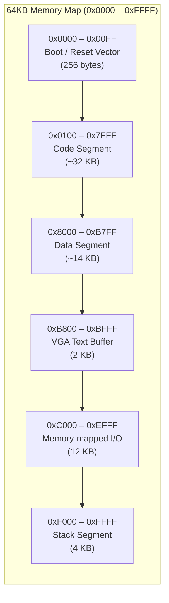
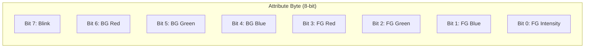
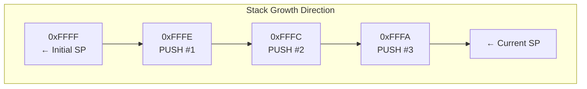
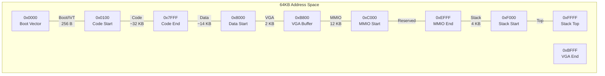
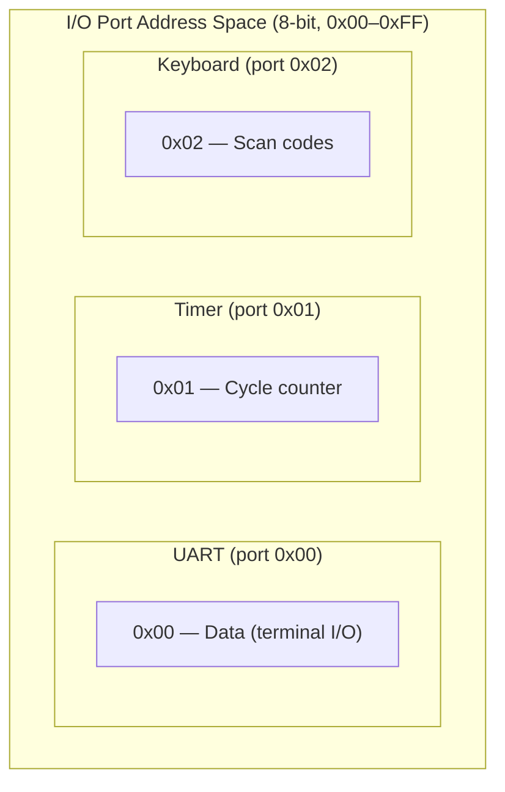
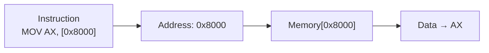
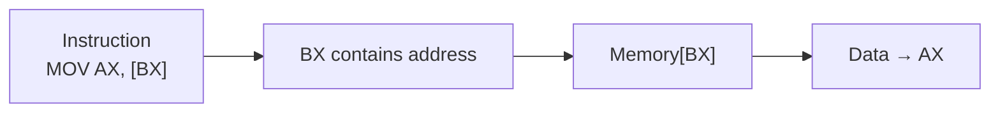
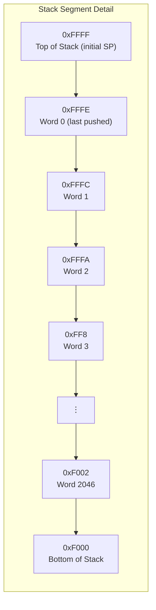

# Memory Map

[← Back to Main](../README.md) | [← Overview](overview.md) | [← Registers](registers.md) | [← Execution Cycle](execution-cycle.md)

---

## 64KB Address Space Overview

The NovumOS-16bit CPU addresses a 64 KB (65,536 byte) memory space using a 16-bit address bus.

---

## Segment Layout

### Boot / Reset Vector (0x0000 – 0x00FF)

| Address Range | Size | Purpose |
|---------------|------|---------|
| 0x0000 – 0x0003 | 4 bytes | Reset vector: initial IP value |
| 0x0004 – 0x00FF | 252 bytes | Interrupt vector table (64 vectors × 4 bytes) |

The CPU begins execution at address `0x0000` after reset. The first instruction at this address is the boot code.

**Interrupt Vector Table:**

| Vector | Address | Interrupt |
|--------|---------|-----------|
| 0 | 0x0004 | Reserved (divide error) |
| 1 | 0x0008 | Debug |
| 2 | 0x000C | NMI |
| 3 | 0x0010 | Breakpoint |
| 8 | 0x0024 | Timer interrupt |
| 9 | 0x0028 | Keyboard interrupt |
| 10 | 0x002C | Reserved |
| 11 | 0x0030 | Reserved |
| 12 | 0x0034 | Reserved |
| 13 | 0x0038 | Reserved |
| 14 | 0x003C | Reserved |
| 15 | 0x0040 | Reserved |

Each vector entry contains:
- Bytes 0–1: New IP value (target address of ISR)
- Bytes 2–3: Segment hint (reserved for future use, currently ignored)

---

### Code Segment (0x0100 – 0x7FFF)

| Address Range | Size | Purpose |
|---------------|------|---------|
| 0x0100 – 0x7FFF | ~32 KB | Executable instructions |

- Program code is loaded starting at `0x0100` (after the vector table)
- Code is **read-only** during execution (no self-modifying code)
- Instructions can be 16-bit (1 word) or 32-bit (2 words)
- Maximum code capacity: ~16,383 instructions (16-bit) or ~8,191 instructions (32-bit)

---

### Data Segment (0x8000 – 0xB7FF)

| Address Range | Size | Purpose |
|---------------|------|---------|
| 0x8000 – 0xB7FF | ~14 KB | Global variables, constants, buffers |

- Read/write data storage
- Accessed via MOV instructions with direct or indirect addressing
- No memory protection — code can read/write any data address
- Data segment starts at `0x8000` (halfway through address space)

---

### VGA Text Buffer (0xB800 – 0xBFFF)

| Address Range | Size | Purpose |
|---------------|------|---------|
| 0xB800 – 0xBFFF | 2 KB | VGA text mode framebuffer |

**VGA Text Mode Format:**

Each character cell occupies 2 bytes:

| Byte | Content |
|------|---------|
| Even address (0, 2, 4...) | ASCII character code |
| Odd address (1, 3, 5...) | Attribute byte (foreground/background color) |

**Attribute Byte Layout:**

**Text Mode Parameters:**

| Parameter | Value |
|-----------|-------|
| Columns | 80 |
| Rows | 25 |
| Total cells | 2,000 |
| Bytes per cell | 2 |
| Total buffer | 4,000 bytes (fits in 2 KB) |
| Screen address | 0xB800 |
| Cursor position | Stored in VGA registers (0x3D4/0x3D5) |

**Example:**

Writing "Hello" at row 0, column 0:

| Address | Value | Meaning |
|---------|-------|---------|
| 0xB800 | 0x48 | 'H' |
| 0xB801 | 0x07 | White on black |
| 0xB802 | 0x65 | 'e' |
| 0xB803 | 0x07 | White on black |
| 0xB804 | 0x6C | 'l' |
| 0xB805 | 0x07 | White on black |
| 0xB806 | 0x6C | 'l' |
| 0xB807 | 0x07 | White on black |
| 0xB808 | 0x6F | 'o' |
| 0xB809 | 0x07 | White on black |

---

### Memory-mapped I/O (0xC000 – 0xEFFF)

| Address Range | Size | Purpose |
|---------------|------|---------|
| 0xC000 – 0xC0FF | 256 bytes | Device control registers |
| 0xC100 – 0xC1FF | 256 bytes | DMA buffers |
| 0xC200 – 0xEFFF | ~11.5 KB | Extended memory-mapped devices |

Memory-mapped I/O regions mirror the functionality of port-mapped I/O but are accessed through regular memory instructions. This provides an alternative access path for devices.

**Note:** Memory-mapped I/O is **not compatible** with port-mapped I/O for the same device. Use one or the other, not both.

---

### Stack Segment (0xF000 – 0xFFFF)

| Address Range | Size | Purpose |
|---------------|------|---------|
| 0xF000 – 0xFFFF | 4 KB | Stack space |

**Stack characteristics:**

| Property | Value |
|----------|-------|
| Initial SP | 0xFFFF (top of memory) |
| Growth direction | Downward (toward lower addresses) |
| Word size | 16-bit (2 bytes per push/pop) |
| Max stack depth | 2,048 entries (4 KB / 2 bytes) |
| Stack frames | Supported via CALL/RET with BP-like convention |

**Stack operations:**

| Operation | SP Change | Memory Access |
|-----------|-----------|---------------|
| `PUSH AX` | SP = SP - 2 | word[SP] = AX |
| `POP AX` | SP = SP + 2 | AX = word[SP] |
| `CALL subroutine` | SP = SP - 2 | word[SP] = IP (return address) |
| `RET` | SP = SP + 2 | IP = word[SP] |
| `INT n` | SP = SP - 2 | word[SP] = FLAGS; word[SP-1] = IP |
| `IRET` | SP = SP + 2 | IP = word[SP]; FLAGS = word[SP+1] |

---

## Complete Address Map

---

## Memory Map Table

| Start | End | Size | Name | Access | Description |
|-------|-----|------|------|--------|-------------|
| 0x0000 | 0x0003 | 4 B | Reset Vector | R | CPU boot address |
| 0x0004 | 0x00FF | 252 B | IVT | R | Interrupt vector table (64 vectors) |
| 0x0100 | 0x7FFF | 32,512 B | Code | R/X | Executable code segment |
| 0x8000 | 0xB7FF | 14,336 B | Data | R/W | Global data segment |
| 0xB800 | 0xBFFF | 2,048 B | VGA | R/W | VGA text mode buffer |
| 0xC000 | 0xC0FF | 256 B | Device Reg | R/W | Device control registers |
| 0xC100 | 0xC1FF | 256 B | DMA | R/W | DMA buffer area |
| 0xC200 | 0xEFFF | 11,776 B | MMIO | R/W | Extended memory-mapped I/O |
| 0xF000 | 0xFFFF | 4,096 B | Stack | R/W | Stack segment (grows down) |

---

## I/O Port Map

The CPU uses **isolated I/O** (separate address space) for peripherals. I/O ports are accessed via `IN` and `OUT` instructions.

### Peripheral Port Allocation

### Detailed Port Table

| Port | Device | Register | R/W | Description |
|------|--------|----------|-----|-------------|
| 0x00 | UART | Data | R/W | Terminal I/O (send/receive characters) |
| 0x01 | Timer | Counter | R/W | Cycle counter |
| 0x02 | Keyboard | Scan code | R | Keyboard scan codes |

---

## Memory Access Patterns

### Direct Addressing

The instruction contains the full 16-bit address.

| Instruction | Address Source |
|-------------|----------------|
| `MOV AX, [0x8000]` | Direct: 0x8000 |
| `MOV [0xB800], AX` | Direct: 0xB800 |

### Register Indirect Addressing

The address is held in a register (typically BX).

| Instruction | Address Source |
|-------------|----------------|
| `MOV AX, [BX]` | Address = BX |
| `MOV [BX], AX` | Address = BX |
| `MOV AX, [BX+imm]` | Address = BX + offset |

### Immediate Addressing

The operand is embedded in the instruction (no memory access for the operand).

| Instruction | Value Source |
|-------------|--------------|
| `MOV AX, 0x1234` | Immediate: 0x1234 |
| `ADD AX, 5` | Immediate: 5 |

---

## Stack Memory Layout

### Stack Frame Convention

For function calls, a standard stack frame convention is used:

| Offset | Content |
|--------|---------|
| SP+0 | Return address (pushed by CALL) |
| SP+1 | Saved BP (if frame pointer used) |
| SP+2 | Local variable 1 |
| SP+3 | Local variable 2 |
| ... | ... |

**CALL/RET sequence:**

| Step | SP | Memory | Description |
|------|-----|--------|-------------|
| Before CALL | 0xFF00 | — | SP points to next free slot |
| CALL subroutine | 0xFEFF | [0xFEFF] = IP | Push return address |
| Inside subroutine | 0xFEFF | — | SP at return address |
| RET | 0xFF00 | IP = [0xFEFF] | Pop return address, resume |

---

## Memory Protection

**Current implementation:** No hardware memory protection. All segments are accessible from all privilege levels.

| Feature | Status |
|---------|--------|
| Segmentation | Flat model (no segments) |
| Paging | Not supported |
| User/supervisor modes | Not implemented |
| Read-only code | Not enforced (software convention) |
| Stack overflow detection | Not implemented |

**Software conventions for protection:**

- Code segment is treated as read-only by compiler/assembler convention
- Stack overflow is checked by comparing SP against `0xF000` (stack bottom)
- Data segment bounds are managed by the OS kernel

---

## Byte Ordering (Endianness)

The NovumOS-16bit CPU uses **little-endian** byte ordering:

| Address | Value (16-bit word 0x1234) |
|---------|---------------------------|
| N | 0x34 (low byte) |
| N+1 | 0x12 (high byte) |

This affects:
- Multi-byte data storage in memory
- Instruction word encoding
- I/O port data transfer order

---

## Summary

| Segment | Address Range | Size | Direction | Purpose |
|---------|---------------|------|-----------|---------|
| Boot/IVT | 0x0000–0x00FF | 256 B | — | Reset vector + interrupt table |
| Code | 0x0100–0x7FFF | ~32 KB | ↑ | Executable instructions |
| Data | 0x8000–0xB7FF | ~14 KB | ↑ | Global variables |
| VGA | 0xB800–0xBFFF | 2 KB | — | Text mode display buffer |
| MMIO | 0xC000–0xEFFF | 12 KB | — | Memory-mapped devices |
| Stack | 0xF000–0xFFFF | 4 KB | ↓ | Call stack (grows downward) |

**Total:** 64 KB (0x0000–0xFFFF)

---

*See [Overview](overview.md) for how the bus interface accesses this memory and [Execution Cycle](execution-cycle.md) for timing of memory operations.*
