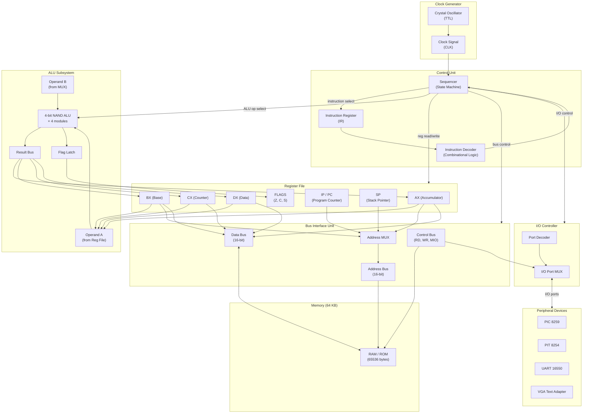
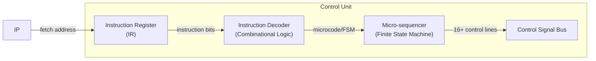
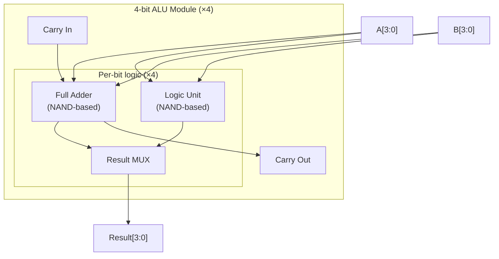
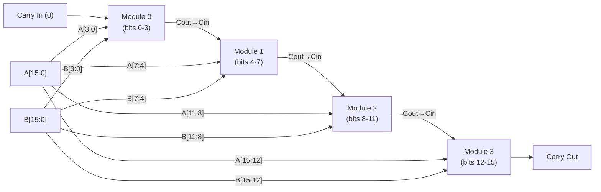
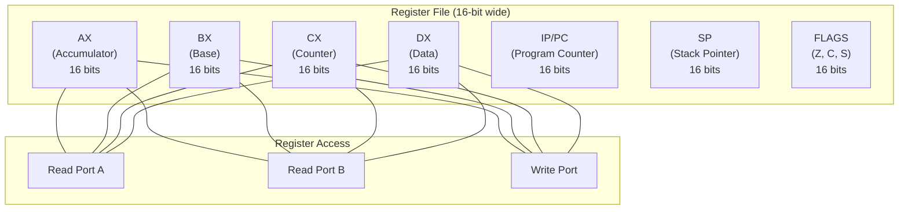
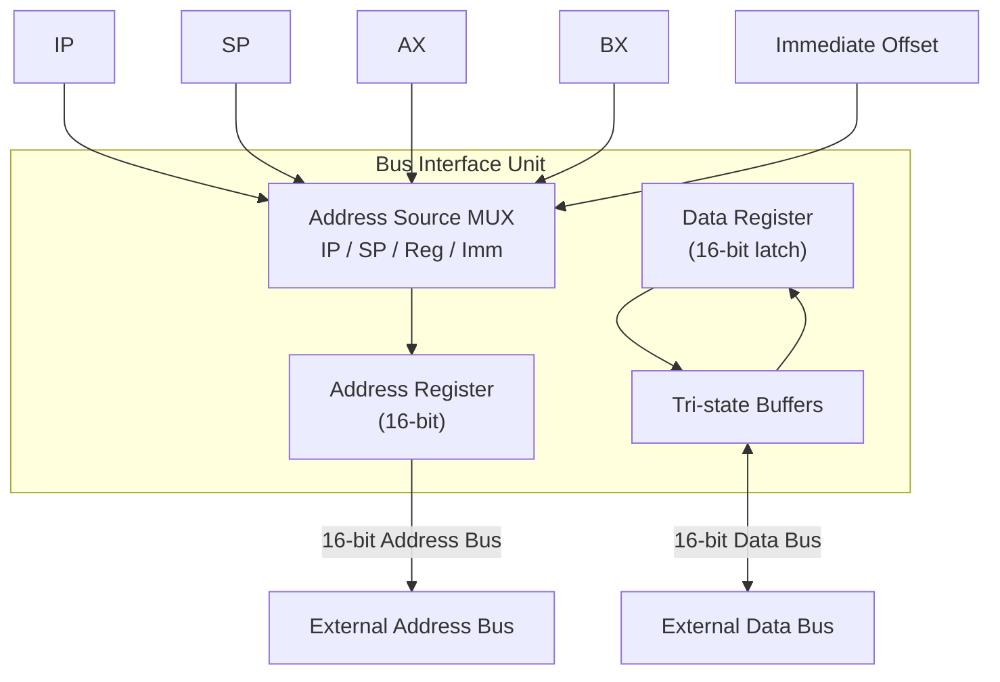
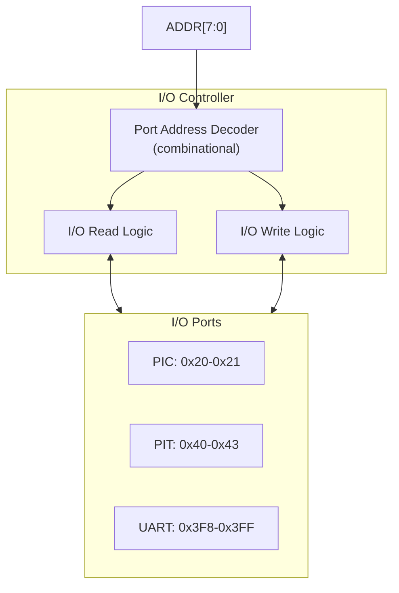
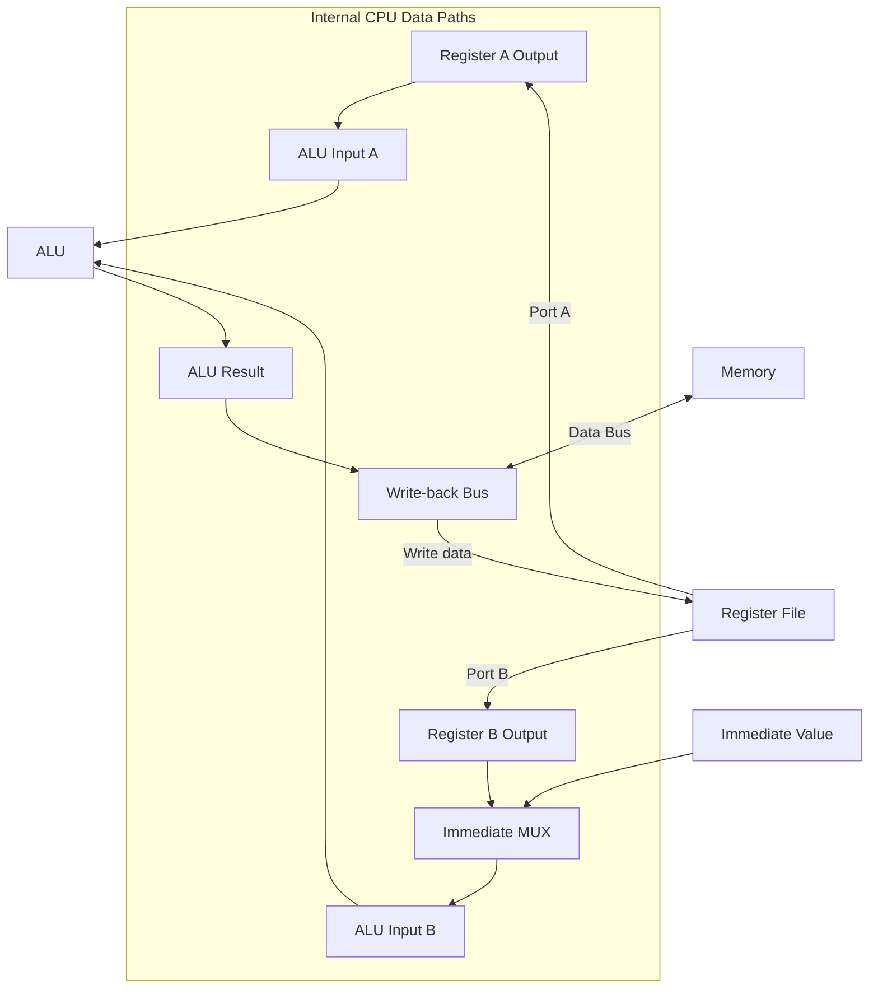
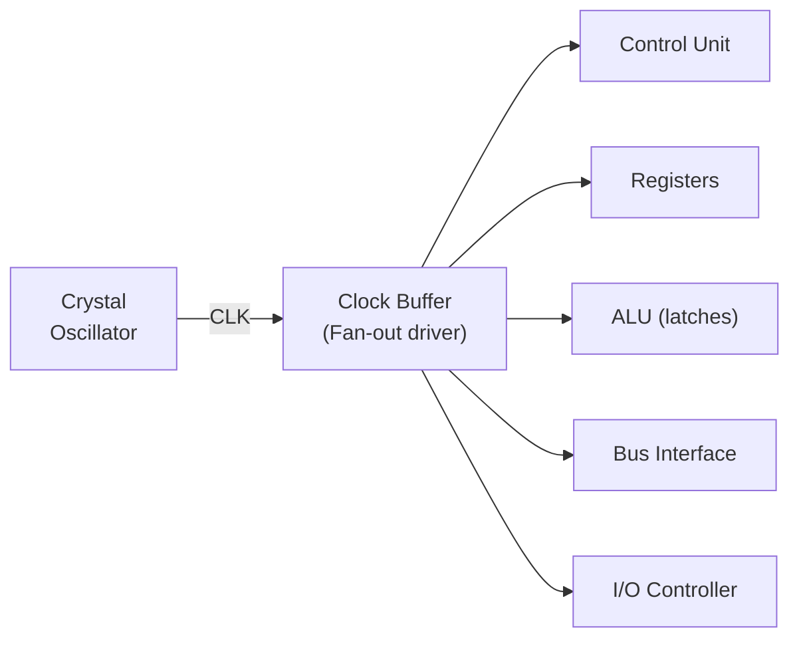
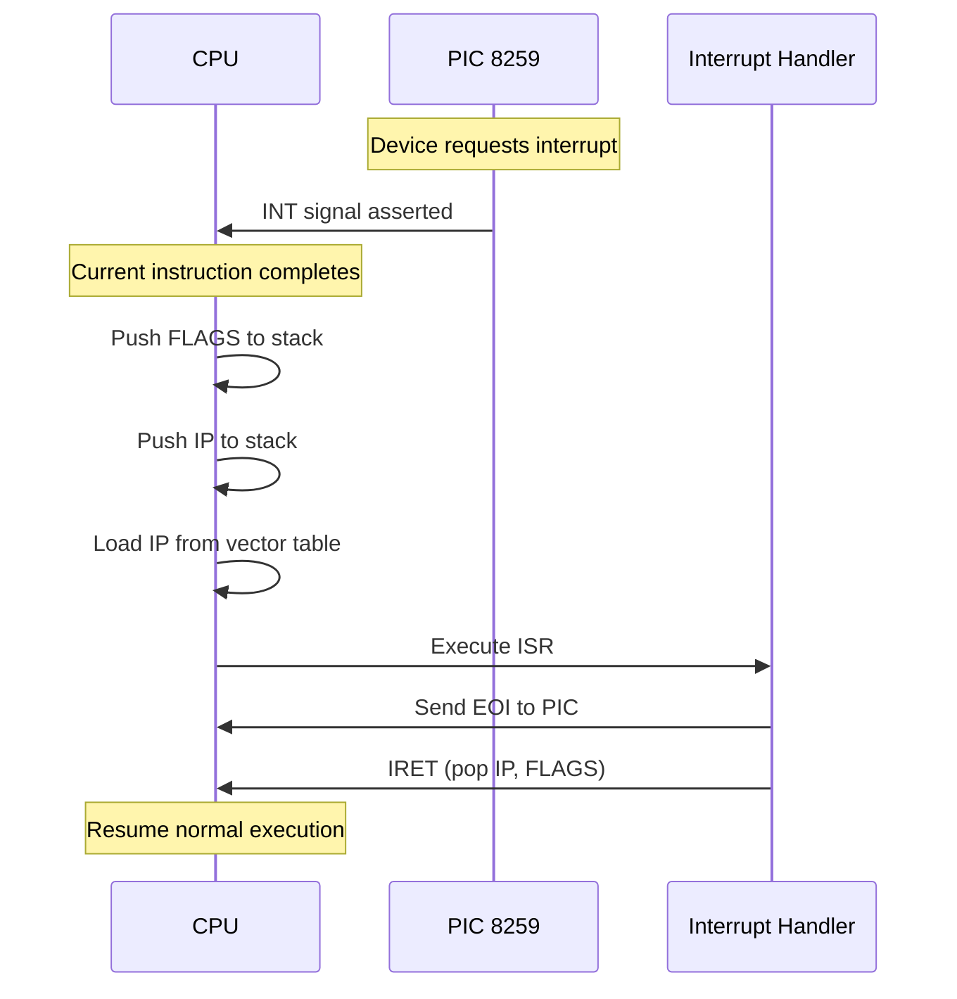

# CPU Architecture Overview

[← Back to Main](../README.md) | [Registers](registers.md) | [Execution Cycle](execution-cycle.md) | [Memory Map](memory-map.md)

---

## Block Diagram

---

## Component Descriptions

### 1. Clock Generator

The clock signal drives all sequential logic in the CPU. Built from a TTL crystal oscillator circuit, it provides a stable clock to synchronize all operations.

| Parameter | Description |
|-----------|-------------|
| Source | Crystal oscillator (quartz) |
| Distribution | Global clock line to all flip-flops |
| Timing | All operations are edge-triggered (rising edge) |
| Duty cycle | 50% (symmetric) |

Every instruction cycle and memory access is synchronized to this clock. The clock period determines the minimum execution time for any single operation.

---

### 2. Control Unit

The Control Unit is the "brain" of the CPU. It fetches instructions from memory, decodes them, and generates all control signals to orchestrate the rest of the CPU.

#### Instruction Register (IR)

- Latches the current instruction word (16 or 32 bits) from the data bus
- Holds the instruction stable during the decode and execute phases
- For 32-bit instructions, performs a second fetch to load the upper 16 bits

#### Instruction Decoder

- Pure combinational logic (NAND gates)
- Decodes opcode field from IR into control signals
- Determines: operation type, source/destination registers, addressing mode, immediate value
- Outputs: ALU operation select, register read/write enables, bus direction, memory/IO select

#### Micro-Sequencer

- Finite state machine that sequences through the phases of each instruction
- Generates timing signals for: FETCH → DECODE → EXECUTE → WRITEBACK
- Handles multi-cycle instructions (e.g., memory indirect addressing requires additional cycles)
- Manages interrupts: checks INT line after each instruction completes

---

### 3. ALU (Arithmetic Logic Unit)

The ALU is the computational core. It is built entirely from NAND gates (К155ЛА3 / 7400 series) and operates on 16-bit operands through four cascaded 4-bit modules.

#### NAND-Based ALU Design

The fundamental building block is the NAND gate (7400 quad NAND IC). From NAND gates, all other logic functions can be derived:

| Function | NAND Implementation |
|----------|---------------------|
| AND | NAND → NOT (inverted NAND output) |
| OR | De Morgan: A OR B = NOT(NOT(A) AND NOT(B)) |
| XOR | Combination of NAND gates |
| NOT | Single NAND input tied together |
| Full Adder | XOR + AND + OR from NAND gates |

#### 4-bit Module Structure

Each 4-bit ALU module contains:

Each bit slice computes:
- **Arithmetic**: Full adder sum and carry
- **Logic**: AND, OR, XOR operations
- **Selection**: MUX selects between arithmetic and logic result based on ALU operation code

#### Chaining 4-bit Modules to 16-bit

- The carry output of each module feeds the carry input of the next
- This ripple-carry chain enables 16-bit addition/subtraction
- The final carry out sets the Carry (C) flag
- Zero detection: OR of all 16 result bits (if all zero → Z flag set)
- Sign detection: MSB of result (bit 15 → S flag)

---

### 4. Register File

See [Registers](registers.md) for full details.

| Feature | Description |
|---------|-------------|
| Ports | 2 read, 1 write (simultaneous) |
| Encoding | 2-bit register select: AX=00, BX=01, CX=10, DX=11 |
| Special | IP, SP, FLAGS not directly encoded in general instructions |
| Write enable | Controlled by decode logic per instruction |

---

### 5. Bus Interface Unit (BIU)

The BIU manages all communication between the CPU and external devices (memory, I/O).

| Signal | Direction | Description |
|--------|-----------|-------------|
| `ADDR[15:0]` | Output | Memory/IO address |
| `DATA[15:0]` | Bidirectional | 16-bit data transfer |
| `RD` | Output | Read strobe (active low) |
| `WR` | Output | Write strobe (active low) |
| `M/IO` | Output | Memory vs I/O select (0=I/O, 1=Memory) |
| `CLK` | Input | System clock |
| `WAIT` | Input | Wait state input (for slow devices) |
| `INT` | Input | Interrupt request |

---

### 6. I/O Controller

Manages communication with peripheral devices through isolated I/O port addressing.

See [Memory Map - I/O Port Map](memory-map.md#io-port-map) for the complete port allocation.

---

## Data Paths

### Data Path Diagram

### Bus Width Summary

| Bus | Width | Purpose |
|-----|-------|---------|
| Data bus | 16-bit | Instruction/data transfer |
| Address bus | 16-bit | Memory addressing (64 KB) |
| I/O address bus | 8-bit (decoded from 16-bit) | Peripheral port addressing |
| Control bus | 4+ signals | RD, WR, M/IO, interrupt |

---

## Clock and Timing

### Clock Distribution

### Timing Overview

Each instruction completes in a fixed number of clock cycles, determined by the instruction type:

| Instruction Type | Cycles | Description |
|------------------|--------|-------------|
| Register-register (MOV, ADD, AND, etc.) | 2 | Fetch (1) + Execute (1) |
| Register-immediate | 2 | Fetch (1) + Execute (1) |
| Memory load/store | 3 | Fetch (1) + Address calc (1) + Memory access (1) |
| Jump (unconditional) | 2 | Fetch (1) + Branch (1) |
| Jump (conditional, taken) | 2 | Fetch (1) + Branch (1) |
| Jump (conditional, not taken) | 1 | Fetch (1) — no branch |
| I/O port read/write | 2 | Fetch (1) + I/O access (1) |
| 32-bit instruction | 3 | Fetch 1 (1) + Fetch 2 (1) + Execute (1) |

### Clock Edge Convention

- All registers update on the **rising edge** of CLK
- Combinational logic (ALU, decoder) settles during the clock low phase
- Setup and hold times are met by the rising-edge trigger

---

## Interrupt Handling

When the `INT` line is asserted by the PIC 8259:

1. Current instruction completes (never interrupted mid-cycle)
2. Program Counter (IP) is pushed onto the stack
3. FLAGS are saved on the stack
4. IP is loaded with the interrupt vector address
5. Interrupt service routine executes
6. `RET` (or IRET) restores FLAGS and IP from stack

---

## Summary

The NovumOS-16bit CPU is a complete, working processor built from fundamental TTL logic. The NAND-based ALU, RISC-like ISA, and standard peripheral interfaces create a practical and educational platform for understanding computer architecture from the ground up.

| Block | Key Function |
|-------|-------------|
| Clock Generator | Synchronizes all operations |
| Control Unit | Decodes instructions, sequences operations |
| ALU | Performs arithmetic and logic (NAND-based) |
| Register File | Stores operands and results |
| Bus Interface | Manages memory/IO data transfer |
| I/O Controller | Interfaces with peripheral devices |

---

*See [Registers](registers.md) for detailed register specifications.*
