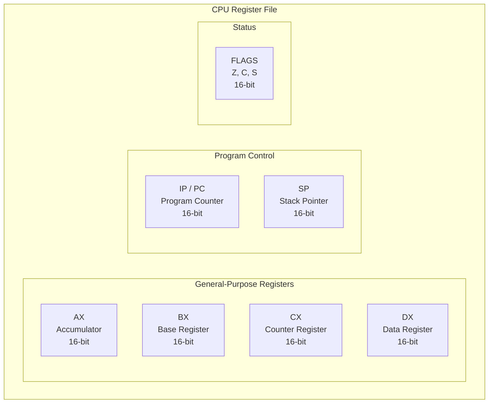
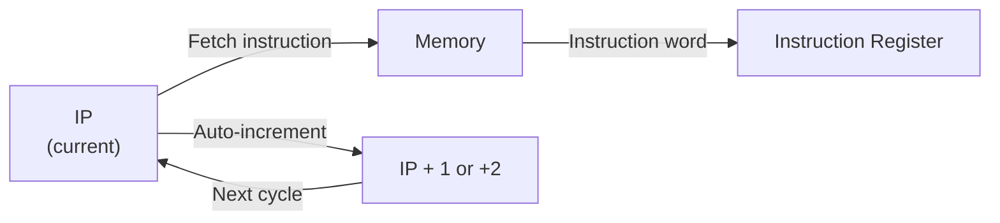
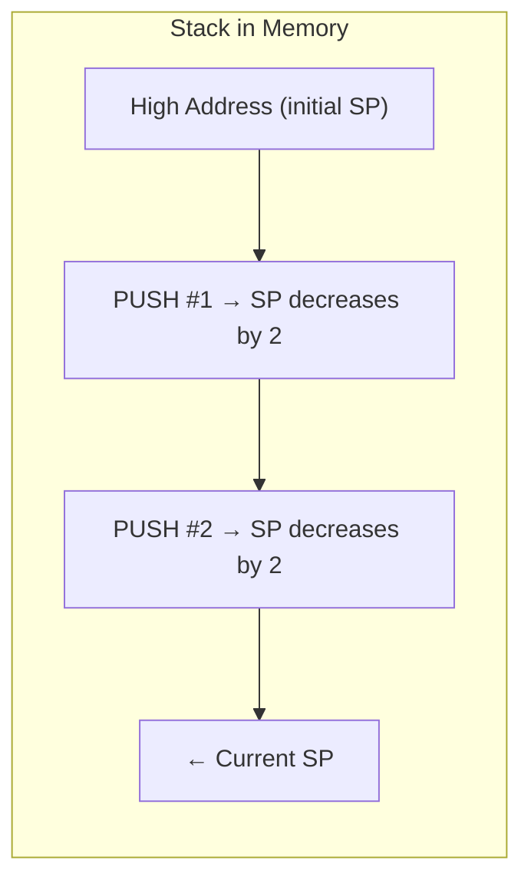
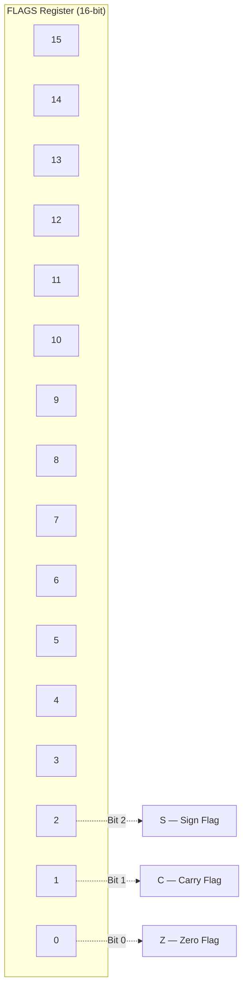
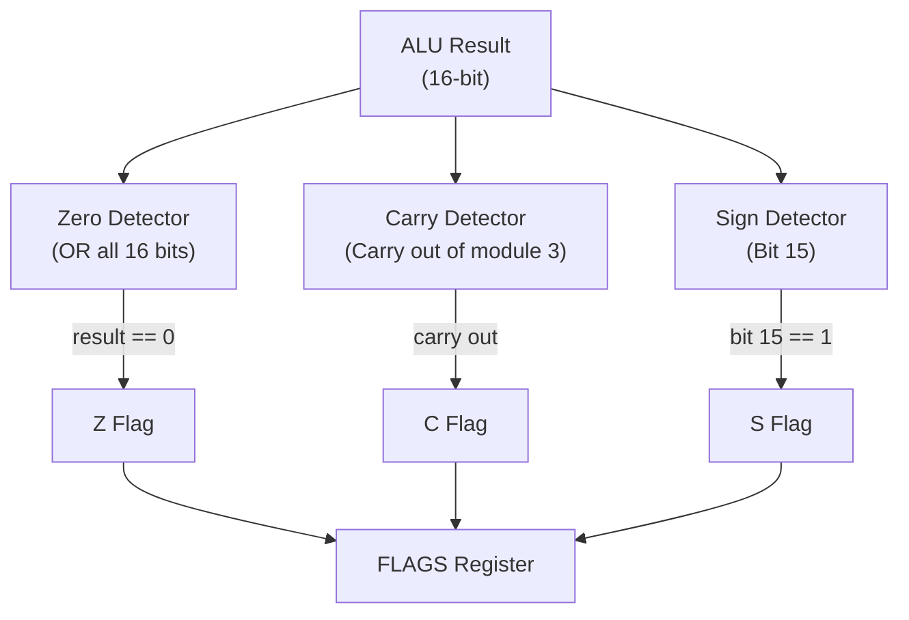
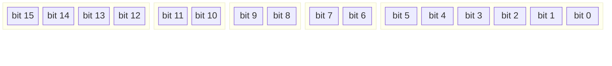
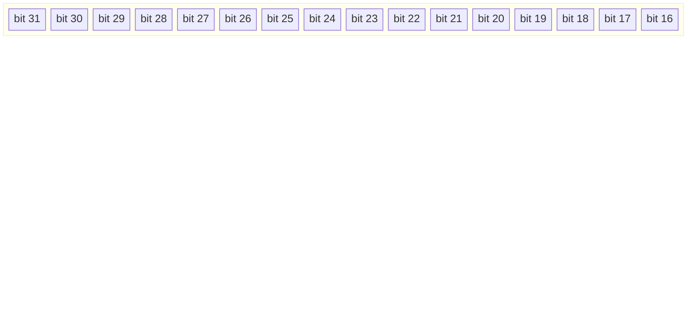

# Register Set

[← Back to Main](../README.md) | [← Overview](overview.md) | [ISA](isa.md) | [Execution Cycle →](execution-cycle.md) | [Memory Map →](memory-map.md)

---

## Register Overview

The NovumOS-16bit CPU has 7 primary registers, all 16 bits wide. They are divided into general-purpose registers, program control registers, and status flags.

---

## Register Table

| Register | Name | Width | Encoding | Primary Purpose | Volatile | Access |
|----------|------|-------|----------|-----------------|----------|--------|
| AX | Accumulator | 16-bit | `00` | Arithmetic results, I/O data | Yes | Read/Write |
| BX | Base | 16-bit | `01` | Base address for memory access | Yes | Read/Write |
| CX | Counter | 16-bit | `10` | Loop counter, shift count | Yes | Read/Write |
| DX | Data | 16-bit | `11` | Secondary data, I/O port address | Yes | Read/Write |
| IP/PC | Program Counter | 16-bit | — | Address of next instruction | Auto | Read-only (auto-increment) |
| SP | Stack Pointer | 16-bit | — | Top of stack address | Auto | Read/Write (by PUSH/POP/CALL/RET) |
| FLAGS | Flags | 16-bit | — | Condition codes (Z, C, S) | Auto | Read/Write (by arithmetic, PUSHF/POPF) |

---

## General-Purpose Registers

### AX — Accumulator

The primary register for arithmetic and logic operations. Most ALU operations use AX as one of the operands and store the result in AX.

| Use Case | Description |
|----------|-------------|
| Arithmetic result | `ADD AX, BX` → AX = AX + BX |
| Logic result | `AND AX, CX` → AX = AX AND CX |
| I/O data (IN) | `IN AX, DX` → Read from port DX into AX |
| I/O data (OUT) | `OUT DX, AX` → Write AX to port DX |
| Memory load | `MOV AX, [BX]` → Load from address in BX to AX |
| Memory store | `MOV [BX], AX` → Store AX to address in BX |

### BX — Base

Provides a base address for memory operations. Used as a pointer for indirect addressing.

| Use Case | Description |
|----------|-------------|
| Base pointer | `MOV AX, [BX]` → Load from address BX |
| Base+offset | `MOV AX, [BX+imm]` → Load from BX + immediate offset |
| Pointer arithmetic | `ADD BX, CX` → Advance pointer by CX |

### CX — Counter

General-purpose counter, especially useful for loops and shift operations.

| Use Case | Description |
|----------|-------------|
| Loop counter | `MOV CX, 10` / `DEC CX` / `JNZ loop_start` |
| Shift count | `SHL AX, CL` → Shift AX left by CL bits |
| String operations | Can serve as repeat count for block operations |

### DX — Data

Secondary data register. Used for I/O port addressing and as a second operand.

| Use Case | Description |
|----------|-------------|
| I/O port address | `IN AX, DX` → Read from port DX |
| I/O data | `OUT DX, AX` → Write AX to port DX |
| Second operand | `ADD AX, DX` → AX = AX + DX |
| Extended multiply | Can hold high word of multiply result |

---

## Program Control Registers

### IP / PC — Program Counter

Holds the address of the **next instruction** to be fetched from memory.

| Property | Value |
|----------|-------|
| Width | 16-bit |
| Initial value | `0x0000` (boot address) |
| Update | Auto-incremented by 1 (or 2 for 32-bit instructions) after each fetch |
| Branching | Overwritten by JMP, JZ, JNZ, CALL, INT |

**Auto-increment behavior:**

| Instruction Format | Words | IP Increment |
|--------------------|-------|--------------|
| 16-bit (short) | 1 | IP += 2 |
| 32-bit (long) | 2 | IP += 4 |

The IP is **not directly writable** by user instructions. It can only be modified by:
- Jump instructions (`JMP`, `JZ`, `JNZ`)
- Subroutine call (`CALL`)
- Interrupt (`INT`)
- Return (`RET`)
- Reset/boot

### SP — Stack Pointer

Holds the address of the **top of the stack** in memory.

| Property | Value |
|----------|-------|
| Width | 16-bit |
| Growth direction | Downward (toward lower addresses) |
| PUSH | SP = SP - 2; word[SP] = value |
| POP | value = word[SP]; SP = SP + 2 |
| CALL | Push IP; SP -= 2; IP = target |
| RET | Pop IP from stack; SP += 2 |

**Stack growth direction:**

| Operation | SP Change | Description |
|-----------|-----------|-------------|
| `PUSH reg` | SP = SP - 2 | Store word (2 bytes), decrement SP |
| `POP reg` | SP = SP + 2 | Load word (2 bytes), increment SP |
| `CALL` | SP = SP - 2 | Push return address (2 bytes) |
| `RET` | SP = SP + 2 | Pop return address (2 bytes) |
| `INT` | SP = SP - 2 | Push FLAGS + IP |
| `IRET` | SP = SP + 2 | Pop IP + FLAGS |

---

## FLAGS Register

The FLAGS register holds condition codes set by ALU operations and tested by conditional jumps.

### FLAGS Bit Layout

### Flags Detail Table

| Bit | Name | Set When | Cleared When | Used By |
|-----|------|----------|--------------|---------|
| 0 | **Z** (Zero) | ALU result is all zeros | ALU result is non-zero | `JZ` (jump if Z=1), `JNZ` (jump if Z=0) |
| 1 | **C** (Carry) | Arithmetic produces carry out of bit 15 (addition) or borrow (subtraction) | No carry/borrow | `JC` (if added), unsigned overflow detection |
| 2 | **S** (Sign) | ALU result bit 15 is 1 (negative in two's complement) | Result bit 15 is 0 (positive) | `JS` (if added), signed comparison |
| 3–15 | Reserved | — | — | Unused (read as 0) |

### How Flags Are Updated

Flags are updated **atomically** at the end of each ALU operation:

| Instruction | Z | C | S |
|-------------|---|---|---|
| `ADD` | ✓ Set | ✓ Set | ✓ Set |
| `SUB` | ✓ Set | ✓ Set | ✓ Set |
| `CMP` | ✓ Set | ✓ Set | ✓ Set |
| `TEST` | ✓ Set | ✗ Cleared | ✗ Cleared |
| `ADC` | ✓ Set | ✓ Set | ✓ Set |
| `SBB` | ✓ Set | ✓ Set | ✓ Set |
| `AND` | ✓ Set | ✗ Cleared | ✗ Cleared |
| `OR` | ✓ Set | ✗ Cleared | ✗ Cleared |
| `XOR` | ✓ Set | ✗ Cleared | ✗ Cleared |
| `SHL` | ✓ Set | Last shifted-out bit | ✓ Set |
| `SHR` | ✓ Set | Last shifted-out bit | ✓ Set |
| `INC` | ✓ Set | ✗ Cleared | ✓ Set |
| `DEC` | ✓ Set | ✗ Cleared | ✓ Set |
| `NOT` | ✗ Unchanged | ✗ Unchanged | ✗ Unchanged |
| `NEG` | ✓ Set | ✓ Set | ✓ Set |
| `XCHG` | ✗ Unchanged | ✗ Unchanged | ✗ Unchanged |
| `MOV` | ✗ Unchanged | ✗ Unchanged | ✗ Unchanged |

### Flag Update Logic

---

## Register Encoding

General-purpose registers are encoded using 2 bits in instruction words:

| Binary | Register | Mnemonic |
|--------|----------|----------|
| `00` | AX | Accumulator |
| `01` | BX | Base |
| `10` | CX | Counter |
| `11` | DX | Data |

This encoding appears in:
- **Source register** field (bits [5:4] in 16-bit format)
- **Destination register** field (bits [7:6] in 16-bit format)
- **Register-indirect addressing** (base register selector)

### Instruction Word Format

---

## Register Instruction Effects

This table shows which instructions modify which registers:

| Instruction | AX | BX | CX | DX | IP | SP | FLAGS |
|-------------|:--:|:--:|:--:|:--:|:--:|:--:|:-----:|
| `MOV dest, src` | ✓* | ✓* | ✓* | ✓* | Auto | — | — |
| `ADD dest, src` | ✓* | ✓* | ✓* | ✓* | Auto | — | ✓ |
| `SUB dest, src` | ✓* | ✓* | ✓* | ✓* | Auto | — | ✓ |
| `CMP dest, src` | — | — | — | — | Auto | — | ✓ |
| `TEST dest, src` | — | — | — | — | Auto | — | ✓ |
| `ADC dest, src` | ✓* | ✓* | ✓* | ✓* | Auto | — | ✓ |
| `SBB dest, src` | ✓* | ✓* | ✓* | ✓* | Auto | — | ✓ |
| `AND dest, src` | ✓* | ✓* | ✓* | ✓* | Auto | — | ✓ |
| `OR dest, src` | ✓* | ✓* | ✓* | ✓* | Auto | — | ✓ |
| `XOR dest, src` | ✓* | ✓* | ✓* | ✓* | Auto | — | ✓ |
| `SHL dest, count` | ✓* | ✓* | ✓* | ✓* | Auto | — | ✓ |
| `SHR dest, count` | ✓* | ✓* | ✓* | ✓* | Auto | — | ✓ |
| `INC dest` | ✓* | ✓* | ✓* | ✓* | Auto | — | ✓ |
| `DEC dest` | ✓* | ✓* | ✓* | ✓* | Auto | — | ✓ |
| `NOT dest` | ✓* | ✓* | ✓* | ✓* | Auto | — | — |
| `NEG dest` | ✓* | ✓* | ✓* | ✓* | Auto | — | ✓ |
| `XCHG dest, src` | ✓* | ✓* | ✓* | ✓* | Auto | — | — |
| `JMP addr` | — | — | — | — | ✓ | — | — |
| `JZ addr` | — | — | — | — | ✓† | — | — |
| `JNZ addr` | — | — | — | — | ✓† | — | — |
| `JC addr` | — | — | — | — | ✓† | — | — |
| `JNC addr` | — | — | — | — | ✓† | — | — |
| `JS addr` | — | — | — | — | ✓† | — | — |
| `JNS addr` | — | — | — | — | ✓† | — | — |
| `IN dest, port` | ✓* | — | — | ✓ | Auto | — | — |
| `OUT port, src` | — | — | — | ✓ | Auto | — | — |
| `PUSH reg` | — | — | — | — | Auto | ✓ | — |
| `POP reg` | ✓* | ✓* | ✓* | ✓* | Auto | ✓ | — |
| `CALL addr` | — | — | — | — | ✓ | ✓ | — |
| `RET` | — | — | — | — | ✓ | ✓ | — |
| `INT n` | — | — | — | — | ✓ | ✓ | ✓ |
| `HLT` | — | — | — | — | — | — | — |

*\* If that register is the destination operand.*
*† Only if the condition (Z flag) is met.*

---

## Special Register Behaviors

### Program Counter (IP) Protection

The IP register cannot be used as a general-purpose register. Attempting to use IP as a source or destination in MOV, ADD, or other ALU instructions is undefined behavior and may cause a CPU fault.

### Stack Pointer (SP) Alignment

While the hardware does not enforce alignment, it is recommended to keep SP aligned to even addresses (16-bit word boundaries) for correct PUSH/POP operations.

### FLAGS Preservation

The FLAGS register is only modified by ALU instructions (ADD, SUB, AND, OR, XOR, SHL, SHR). It is **not** modified by MOV, PUSH, POP, JMP, or I/O instructions. This allows conditional branches to test flags set by a previous arithmetic operation.

---

*See [Execution Cycle](execution-cycle.md) for how register updates are sequenced during instruction execution.*
