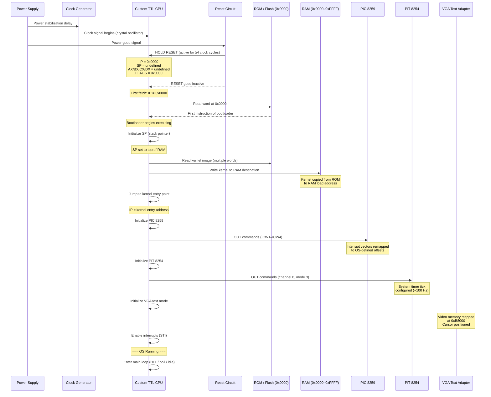

# Boot Process

**NovumOS-16bit — from power-on to a running operating system**

[Back to README](../README.md)

---

## Overview

The NovumOS-16bit boot process is the sequence of events that takes the custom TTL-based 16-bit CPU from a cold power-on state to a fully operational operating system. Because the CPU has no firmware, no BIOS, and no pre-existing software — only a hardwired reset vector — every step of the initialization must be performed by software in the correct order.

---

## High-Level Boot Sequence

The following sequence diagram shows the entire flow from power-on to the OS main loop:



---

## Step-by-Step Boot Sequence

### Step 1: Power-On and Clock Stabilization

When power is applied to the system, the power supply delivers +5V to all TTL logic chips. The crystal oscillator circuit begins generating the system clock. A power-on reset circuit holds the RESET line active (HIGH) for a minimum of 4 clock cycles to ensure all flip-flops and registers settle into a known state.

**State at this stage:**

| Register / Signal | Value | Notes |
|---|---|---|
| IP (Program Counter) | `0x0000` | Hardwired reset vector |
| SP (Stack Pointer) | Undefined | Not yet initialized |
| AX, BX, CX, DX | Undefined | Not yet initialized |
| FLAGS | `0x0000` | All flags cleared (Z=0, C=0, S=0) |
| RESET line | ACTIVE | Holding CPU in reset state |
| Clock | Running | Crystal oscillator active |

---

### Step 2: Reset Vector — First Instruction Fetch

When the RESET signal goes inactive, the CPU begins execution from the hardwired reset vector at address `0x0000`. This address is hardwired into the hardware — it cannot be changed. The CPU performs its first instruction fetch cycle:

1. The address `0x0000` is placed on the address bus.
2. The Bus Interface Unit (BIU) asserts the READ signal.
3. The ROM at address `0x0000` returns the first 16-bit instruction word.
4. The Control Unit decodes the instruction.
5. The instruction is executed.

**State at this stage:**

| Register / Signal | Value | Notes |
|---|---|---|
| IP | `0x0000` → incremented after fetch | Points to second instruction |
| Address bus | `0x0000` | First instruction address |
| Data bus | First instruction word | From ROM |
| SP | Undefined | Still uninitialized |
| FLAGS | `0x0000` | No operations performed yet |

---

### Step 3: Bootloader — Stack Pointer Initialization

The first meaningful action of the bootloader is to initialize the Stack Pointer (SP). The stack is placed at the top of RAM, growing downward. This is critical because all subsequent operations (subroutine calls, interrupt handling, PUSH/POP) depend on a valid stack.

The bootloader loads SP with the value `0xFFFF` (top of the 64KB address space) or the top of the usable RAM region. This establishes the stack area at the highest addresses of the memory map.

**Memory layout during stack initialization:**

```
Address   Contents
─────────────────────────────
0xFFFF ┌─────────────────────┐
       │  Stack Area (grows  │
       │  downward)          │
       │                     │
       │  SP = 0xFFFF ──►    │
       │                     │
0xF000 ├─────────────────────┤
       │  Free RAM           │
       │                     │
       │                     │
0x8000 ├─────────────────────┤
       │  Kernel (loaded     │
       │  here by bootloader)│
       │                     │
0x4000 ├─────────────────────┤
       │  Bootloader         │
       │  (in ROM)           │
       │                     │
0x0000 └─────────────────────┘  ← Reset Vector
```

**State at this stage:**

| Register / Signal | Value | Notes |
|---|---|---|
| IP | `0x0002`+ | Past the SP initialization instruction(s) |
| SP | `0xFFFF` | Top of stack area |
| AX | Possibly used as scratch | Depends on bootloader implementation |
| BX, CX, DX | Undefined | Not yet used |
| FLAGS | `0x0000` | No arithmetic performed yet |

---

### Step 4: Bootloader — Kernel Copy (ROM to RAM)

The kernel image resides in ROM (Flash memory) at a known offset. The bootloader must copy this image into RAM at the kernel's load address. This is a word-by-word copy loop:

1. Set a source pointer to the kernel's location in ROM.
2. Set a destination pointer to the kernel's load address in RAM (e.g., `0x4000`).
3. Set a byte/word counter to the kernel size.
4. Loop: read a word from ROM, write it to RAM, increment both pointers, decrement counter, repeat until counter is zero.

After this loop, the entire kernel image exists in RAM and is ready to execute. The copy is necessary because ROM is read-only and typically too slow for general-purpose code execution, while RAM provides fast read/write access for the running kernel.

**Memory layout during kernel copy:**

```
Address   Contents
─────────────────────────────
0xFFFF ┌─────────────────────┐
       │  Stack Area         │
       │  SP = 0xFFFF        │
       ├─────────────────────┤
       │  Free RAM           │
0x8000 ├─────────────────────┤
       │  Kernel (RAM copy)  │ ◄── Destination
       │  ◄── SP             │
0x4000 ├─────────────────────┤
       │  Kernel (ROM copy)  │ ◄── Source
       │  (still in ROM)     │
       ├─────────────────────┤
       │  Bootloader Code    │
0x0000 └─────────────────────┘
```

**State at this stage:**

| Register / Signal | Value | Notes |
|---|---|---|
| IP | Advancing through copy loop | Iterating ROM→RAM |
| SP | `0xFFFF` | Unchanged |
| AX | Source address / scratch | Used in copy loop |
| BX | Destination address / scratch | Used in copy loop |
| CX | Loop counter / word count | Decremented each iteration |
| DX | Scratch / word being copied | Temporary storage |
| FLAGS | Modified by loop | CX decrement affects Z flag |

---

### Step 5: Bootloader — Jump to Kernel Entry Point

Once the kernel copy is complete, the bootloader performs a near jump (`JMP`) to the kernel's entry point address. This transfers execution from the bootloader (which runs from ROM) to the kernel (which now runs from RAM).

The entry point is typically the very first address of the loaded kernel image. The bootloader must also ensure that SP and any other state the kernel expects is correctly set before the jump.

**State at this stage:**

| Register / Signal | Value | Notes |
|---|---|---|
| IP | Kernel entry address (e.g., `0x4000`) | After JMP instruction |
| SP | `0xFFFF` | Unchanged |
| AX, BX, CX, DX | Undefined / leftover from copy | Kernel will reinitialize |
| FLAGS | Leftover from copy loop | Kernel will reinitialize |

---

### Step 6: Kernel — Hardware Initialization

The kernel takes control and begins initializing the hardware peripherals. This must happen in a specific order because some peripherals depend on others.

#### 6a. PIC 8259 Initialization (Programmable Interrupt Controller)

The kernel sends Initialization Command Words (ICW1–ICW4) to the PIC at its I/O port address. This remaps the hardware interrupt vectors from their default locations (which overlap with CPU exception vectors) to OS-defined offsets. The PIC is configured to work in 8086 mode, with specific IRQ masks set.

#### 6b. PIT 8254 Initialization (Programmable Interval Timer)

The kernel configures PIT Channel 0 to generate periodic timer interrupts at approximately 100 Hz. This provides the system tick for multitasking, sleep timers, and scheduling. The PIT is set to Mode 3 (square wave generator) with the appropriate divisor for the system clock frequency.

#### 6c. VGA Text Mode Initialization

The kernel initializes the VGA text adapter for 80×25 character display. This involves:
- Setting the video mode (mode 03h for 80×25 text).
- Clearing the video memory at `0xB8000` (filling with spaces, default attribute).
- Positioning the hardware cursor at the top-left corner.
- Optionally setting the cursor shape.

**State at this stage:**

| Register / Signal | Value | Notes |
|---|---|---|
| IP | Advancing through init code | In kernel RAM |
| SP | `0xFFFF` | Stack in use for init calls |
| AX | Used for I/O port data | OUT instructions to PIC/PIT |
| BX | Used for port addresses | I/O port constants |
| CX | Used for loop counters | Init loops |
| DX | Used for scratch | Temp data |
| FLAGS | Modified by init operations | Arithmetic, comparisons |
| PIC | Initialized | IRQ vectors remapped |
| PIT | Initialized | Timer ticking at ~100 Hz |
| VGA | Initialized | Text mode active, cursor at (0,0) |

---

### Step 7: Kernel — Enable Interrupts and Enter Main Loop

After all hardware is initialized, the kernel executes the `STI` (Set Interrupts) instruction to enable maskable interrupts. From this point forward, the PIC can deliver hardware interrupts to the CPU.

The kernel then enters its main loop. Depending on the OS design, this loop may:

- Execute a `HLT` (Halt) instruction and wait for the next interrupt.
- Poll for pending work items.
- Switch to a user-mode process if multitasking is enabled.
- Display a command prompt or shell.

The system is now fully operational.

**Final state:**

| Register / Signal | Value | Notes |
|---|---|---|
| IP | Main loop address | HLT / poll / scheduler |
| SP | `0xFFFF` | Fully operational stack |
| AX, BX, CX, DX | General purpose | Available for kernel use |
| FLAGS.IF | 1 | Interrupts enabled |
| PIC | Active | Delivering hardware IRQs |
| PIT | Ticking | ~100 Hz system timer |
| VGA | Displaying | OS output visible |
| UART | Ready | Serial I/O available |

---

## Complete Boot Timeline

The following table summarizes the register state at each major boot stage:

| Stage | IP | SP | AX | BX | CX | DX | FLAGS |
|-------|-----|-----|-----|-----|-----|-----|-------|
| Power-on / Reset | `0x0000` | U | U | U | U | U | `0x0000` |
| First fetch (ROM) | `0x0002` | U | U | U | U | U | `0x0000` |
| SP initialized | `0x0004`+ | `0xFFFF` | scratch | U | U | U | `0x0000` |
| Kernel copying | varies | `0xFFFF` | src | dst | ctr | tmp | varies |
| Jump to kernel | kernel addr | `0xFFFF` | leftover | leftover | leftover | leftover | varies |
| PIC/PIT/VGA init | varies | `0xFFFF` | I/O data | port addr | loops | scratch | varies |
| Interrupts enabled | main loop | `0xFFFF` | available | available | available | available | IF=1 |

`U` = Undefined (power-on random state)

---

## Memory Layout During Boot

The 64KB address space is divided into logical regions. The exact boundaries are determined by the linker script and the bootloader's copy routine.

```
0x0000 ┌─────────────────────────────────────────┐
       │                                         │
       │  ROM / FLASH                            │
       │  ┌─────────────────────────────────┐    │
       │  │ Bootloader Code                 │    │
       │  │ (reads from here)               │    │
       │  └─────────────────────────────────┘    │
       │  ┌─────────────────────────────────┐    │
       │  │ Kernel Image (source copy)      │    │
       │  └─────────────────────────────────┘    │
       │                                         │
0x3FFF ├─────────────────────────────────────────┤
       │                                         │
       │  RAM                                    │
       │  ┌─────────────────────────────────┐    │
       │  │ Kernel Image (loaded here)      │    │
       │  │ Load address: 0x4000            │    │
       │  └─────────────────────────────────┘    │
       │                                         │
       │  ┌─────────────────────────────────┐    │
       │  │ Kernel Data / BSS               │    │
       │  └─────────────────────────────────┘    │
       │                                         │
       │  ┌─────────────────────────────────┐    │
       │  │ Free RAM                        │    │
       │  └─────────────────────────────────┘    │
       │                                         │
       │  ┌─────────────────────────────────┐    │
       │  │ Stack (grows downward)          │    │
       │  │ SP starts at 0xFFFF             │    │
       │  └─────────────────────────────────┘    │
       │                                         │
0xFFFF └─────────────────────────────────────────┘

Memory-Mapped I/O (not shown in normal RAM map):
  0xB8000–0xB8FA0  VGA text mode video memory
```

---

## Boot Failure Modes

| Failure | Cause | Symptom |
|---------|-------|---------|
| No execution at all | Power supply failure, clock not running | CPU remains in reset, no activity on address bus |
| Bootloader never reached | ROM not mapped at 0x0000, bad ROM chip | CPU reads garbage, undefined behavior |
| SP corruption | Bootloader SP init code faulty | Stack operations crash, interrupt handling fails |
| Kernel copy incomplete | Loop counter wrong, ROM too small | Partial kernel in RAM, crash on jump |
| Kernel crash on entry | Wrong entry point address | CPU jumps to garbage, undefined behavior |
| PIC init failure | Wrong I/O port, wrong ICW sequence | Interrupts not delivered, timer not working |
| PIT init failure | Wrong divisor, wrong mode | No timer ticks, multitasking fails |
| VGA init failure | Wrong video mode, wrong memory address | No display output, blank or garbled screen |

---

## Bootloader Source Code Location

The bootloader source code is expected to reside in the `src/boot/` directory of the project. The bootloader is assembled into raw binary and linked at address `0x0000` to match the CPU's hardwired reset vector.

---

## See Also

- [Architecture Overview](../architecture/overview.md) — CPU block diagram and data paths
- [Memory Map](../architecture/memory-map.md) — Full 64KB address space layout
- [Registers](../architecture/registers.md) — Register set and FLAGS encoding
- [Execution Cycle](../architecture/execution-cycle.md) — Fetch-decode-execute pipeline
