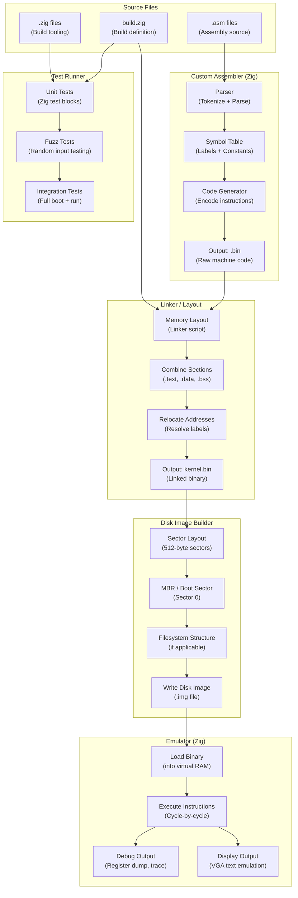
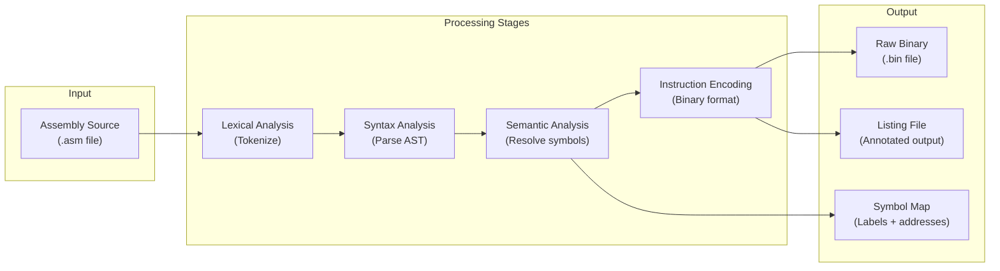
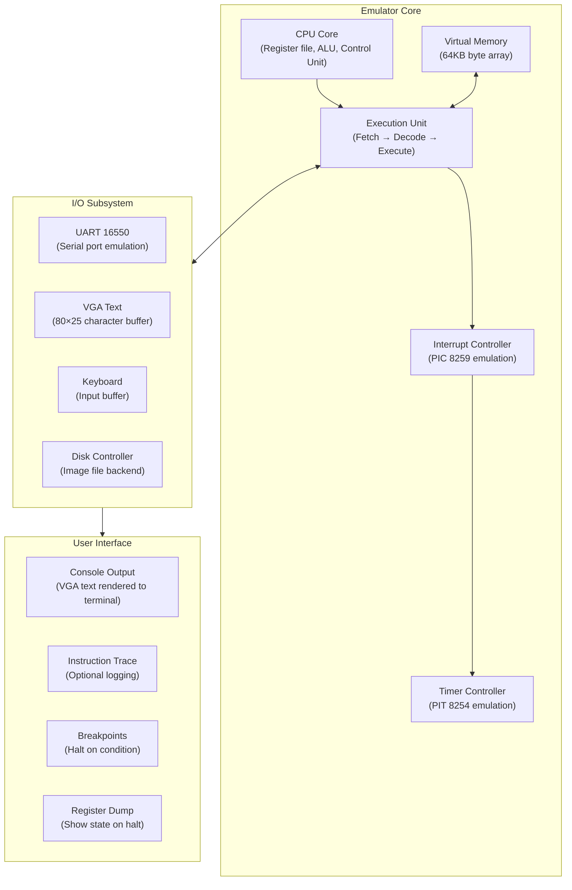
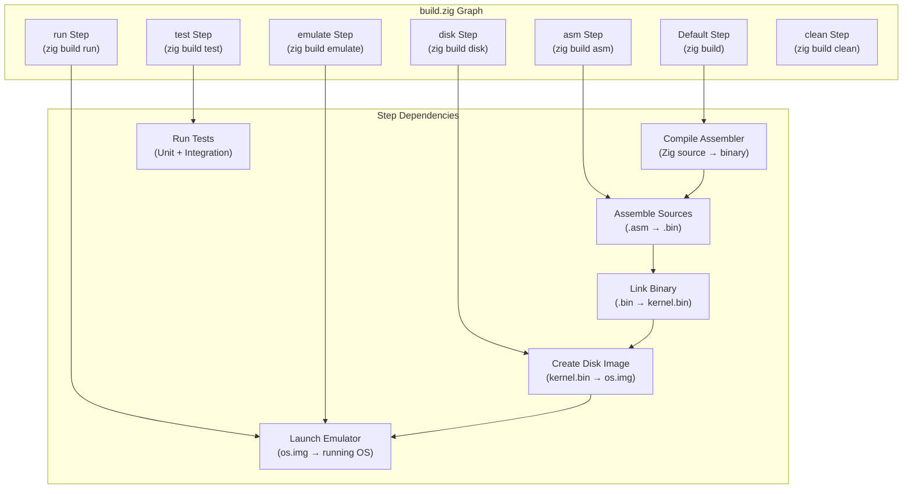
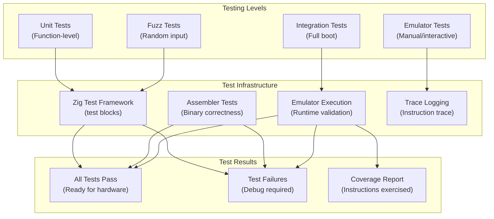
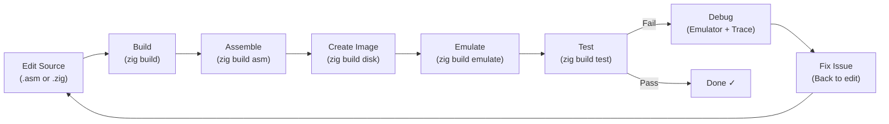

# Build System & Toolchain

**How NovumOS-16bit is built, assembled, and tested**

[Back to README](../README.md)

---

## Overview

NovumOS-16bit uses the Zig build system as its primary build orchestration tool. The toolchain consists of three major components:

1. **Assembler** — A custom assembler written in Zig, designed specifically for the NovumOS-16bit ISA (instruction set architecture). It translates assembly source files into raw binary machine code.
2. **Emulator** — A cycle-accurate CPU emulator written in Zig, used for testing the OS without physical hardware.
3. **Build System** — The Zig build graph (`build.zig`) that orchestrates all compilation, assembly, linking, and disk image creation steps.

---

## Build Process Flow

The following diagram shows the complete build pipeline from source code to a bootable disk image:



---

## Component Details

### 1. Custom Assembler

The assembler is written entirely in Zig and is purpose-built for the NovumOS-16bit ISA. It is not a general-purpose assembler — it understands only the instruction set and addressing modes defined for this CPU.

#### What the Assembler Does



#### Assembler Features

| Feature | Description |
|---------|-------------|
| Instruction encoding | Full support for the NovumOS-16bit ISA (MOV, ADD, SUB, AND, OR, XOR, SHL, SHR, JMP, JZ, JNZ, IN, OUT, and extensions) |
| Label resolution | Forward and backward label references, resolved in a single pass with a symbol table |
| Constants / EQU | Named constants for I/O ports, memory addresses, and configuration values |
| Macros | Basic macro expansion for repeated instruction sequences |
| Error reporting | Line-number-specific error messages for syntax errors, undefined labels, and overflow |
| Listing output | Annotated listing showing addresses, encoded bytes, and source lines |

#### Assembler Input/Output

```
Input:  src/boot/boot.asm        (Assembly source code)
        src/boot/constants.def   (Port addresses, constants)

Output: out/boot.bin             (Raw binary, linked at 0x0000)
        out/boot.sym             (Symbol table for debugger)
        out/boot.lst             (Human-readable listing)
```

---

### 2. Emulator

The emulator is a cycle-accurate software model of the custom TTL CPU. It is written in Zig and executes the same binary instructions that the real hardware would. The emulator is the primary testing and development tool — it allows the OS to be developed and debugged without physical hardware.

#### Emulator Architecture



#### What the Emulator Emulates

| Component | Behavior |
|-----------|----------|
| **CPU registers** | AX, BX, CX, DX, SP, IP, FLAGS — all 16-bit, faithfully modeled |
| **ALU operations** | ADD, SUB, AND, OR, XOR, SHL, SHR — with correct flag updates (Z, C, S) |
| **Memory** | 64KB flat address space, little-endian, byte-addressable |
| **Instruction fetch** | Fetches from IP, advances IP by instruction size (16-bit or 32-bit format) |
| **Addressing modes** | Direct, indirect, register-indirect — all decoded correctly |
| **Interrupts** | PIC 8259 IRQ delivery, interrupt vectoring, IF flag gating |
| **Timer** | PIT 8254 channel 0 periodic tick, configurable frequency |
| **Serial I/O** | UART 16550 receive/transmit buffers, configurable baud rate |
| **VGA text** | 80×25 character display at 0xB8000, cursor tracking |
| **Disk** | Sector-based read/write backed by a disk image file on the host |

---

### 3. Build System (Zig Build)

The build system is defined in `build.zig` at the project root. It uses the Zig build graph DSL to define compilation targets, dependencies, and custom steps.

#### Build Graph Structure



---

## Build Commands

### `zig build`

Compiles all Zig source files and the assembler. This is the default build step. It produces:

- The assembler binary
- Any build-time tools or utilities

**Output location:** `zig-out/`

```bash
zig build
```

---

### `zig build asm`

Assembles all `.asm` source files into raw binary machine code. This step:

1. Invokes the custom assembler on each assembly source file.
2. Resolves labels and constants.
3. Produces binary output files linked at the correct memory addresses.

**Output location:** `out/`

```bash
zig build asm
```

---

### `zig build disk`

Creates a bootable disk image by combining the assembled kernel binary with the necessary boot sector layout. This step:

1. Takes the linked kernel binary.
2. Creates a disk image file (`.img`) with proper sector alignment.
3. Writes the bootloader to sector 0 (MBR / boot sector).
4. Writes the kernel to the appropriate sectors.
5. Adds any filesystem metadata if required.

**Output location:** `out/os.img`

```bash
zig build disk
```

---

### `zig build emulate`

Launches the emulator with the created disk image. This step:

1. Depends on the `disk` step (ensures the image is up to date).
2. Starts the emulator with the disk image loaded.
3. The OS boots inside the emulator and begins executing.

```bash
zig build emulate
```

---

### `zig build test`

Runs all unit tests and integration tests. This step:

1. Compiles test modules defined in Zig source files.
2. Executes unit tests (basic functionality validation).
3. Runs fuzz tests (randomized input testing).
4. Optionally runs integration tests (full boot sequence in emulator).

```bash
zig build test
```

---

### `zig build clean`

Removes all build artifacts, including:

- Compiled binaries in `zig-out/`
- Assembled binaries in `out/`
- Disk images
- Cache files in `.zig-cache/`

```bash
zig build clean
```

---

## Project Structure

The project is organized with a clear separation between source code, build tooling, and documentation:

```
NovumOS-16bit/
│
├── build.zig                    # Build system definition (Zig build graph)
├── build.zig.zon                # Zig package metadata (dependencies, version)
├── 1.txt                        # Project notes / scratch file
│
├── src/                         # Source code
│   ├── main.zig                 # Main entry point for build tooling
│   ├── root.zig                 # Root module (library exports)
│   └── (future source files)    # Additional Zig modules as needed
│
├── docs/                        # Documentation
│   ├── en/                      # English documentation
│   │   ├── README.md            # Project overview and navigation
│   │   ├── architecture/        # CPU architecture docs
│   │   │   ├── overview.md
│   │   │   ├── registers.md
│   │   │   ├── execution-cycle.md
│   │   │   └── memory-map.md
│   │   ├── boot/                # Boot process documentation
│   │   │   └── boot-process.md  # ← You are here
│   │   ├── build/               # Build system documentation
│   │   │   └── toolchain.md     # ← You are here
│   │   ├── isa/                 # Instruction set architecture
│   │   └── peripherals/         # Peripheral documentation
│   │
│   └── ru/                      # Russian documentation
│       └── README.md
│
├── out/                         # Build output (generated)
│   ├── *.bin                    # Assembled binaries
│   ├── *.sym                    # Symbol tables
│   ├── *.lst                    # Assembly listings
│   └── os.img                   # Bootable disk image
│
├── zig-out/                     # Zig build output (generated)
│   └── bin/                     # Compiled Zig executables
│
└── .zig-cache/                  # Zig build cache (generated)
```

---

## How to Add New Source Files

### Adding a New Zig Module

1. Create the `.zig` source file in `src/`.
2. If it should be part of the library, add a public declaration in `src/root.zig` and re-export it.
3. If it is a standalone tool, add it as an import to the main module or create a new executable step in `build.zig`.

### Adding a New Assembly Source File

1. Create the `.asm` file in the appropriate directory (e.g., `src/boot/` for bootloader code).
2. Define constants and port addresses in a separate `.def` or include file if shared across files.
3. The build system's `asm` step will pick up new `.asm` files if the build graph includes them in the assembly step.
4. Run `zig build asm` to verify the new file assembles without errors.

### Adding a New Build Step

1. Open `build.zig`.
2. Define a new step using `b.step("step-name", "Description")`.
3. Add dependencies (e.g., compile, assemble, link steps).
4. Wire it into the build graph with `dependOn` calls.
5. The new step is immediately available via `zig build step-name`.

---

## Testing Workflow

### Unit Tests

Unit tests are defined as Zig `test` blocks within source files. They test individual functions and modules in isolation.

**Running unit tests:**

```bash
zig build test
```

This compiles and runs all `test` blocks found in:
- `src/root.zig` (library module tests)
- `src/main.zig` (executable module tests)

### Fuzz Tests

Fuzz tests use Zig's built-in fuzzing framework to stress-test functions with random inputs. They are defined alongside unit tests but use `std.testing.fuzz`.

**Running fuzz tests:**

```bash
zig build test -- --fuzz
```

### Integration Tests

Integration tests validate the complete boot sequence and OS behavior by running the emulator with a test disk image and checking output.

**Running integration tests:**

```bash
zig build emulate
```

The emulator boots the OS and displays output. Integration tests verify:
- Boot completes without crash.
- PIC initialization succeeds.
- PIT timer fires correctly.
- VGA text output appears.
- Interrupts are delivered and handled.

---

## Testing Diagram



---

## Development Cycle

The typical development workflow follows this pattern:



---

## Requirements

| Tool | Version | Purpose |
|------|---------|---------|
| Zig | 0.14.x+ | Build system, assembler, emulator |
| Terminal | Any | Running build commands |
| Disk image tool | Built-in | Creating bootable `.img` files |

---

## See Also

- [Boot Process](../boot/boot-process.md) — What happens when the OS boots
- [Architecture Overview](../architecture/overview.md) — CPU block diagram and data paths
- [Memory Map](../architecture/memory-map.md) — 64KB address space layout
- [Registers](../architecture/registers.md) — Register set and FLAGS encoding
