# NovumOS-16bit Flags Behavior

Complete reference for processor flag behavior, transitions, and interactions.

---

## Table of Contents

1. [Flags Register Overview](#flags-register-overview)
2. [Flag Definitions](#flag-definitions)
3. [Instruction Flag Effects](#instruction-flag-effects)
4. [Flag State Machine](#flag-state-machine)
5. [Carry Propagation in Multi-Word Arithmetic](#carry-propagation-in-multi-word-arithmetic)
6. [Shift Flag Behavior](#shift-flag-behavior)
7. [Comparison and Testing](#comparison-and-testing)
8. [Flag Interaction Patterns](#flag-interaction-patterns)

---

## Flags Register Overview

The FLAGS register is a 16-bit register, but only the lower 3 bits are defined. All upper bits (15–3) read as zero and are reserved for future use.

### FLAGS Register Layout

```
Bit:  15 14 13 12 11 10  9  8  7  6  5  4  3  2  1  0
      ──────────── reserved (read as 0) ────────────  S  C  Z
```

| Bit | Name | Set when... | Cleared when... |
|-----|------|-------------|-----------------|
| 0   | **Z** (Zero) | Operation result equals 0x0000 | Operation result is non-zero |
| 1   | **C** (Carry) | Unsigned overflow (ADD: result > 0xFFFF) or unsigned borrow (SUB: source > dest) | Operation does not produce carry/borrow |
| 2   | **S** (Sign) | Result MSB (bit 15) is 1 | Result MSB (bit 15) is 0 |
| 3–15| Reserved | Always 0 | Always 0 |

### Flags and Arithmetic Interpretation

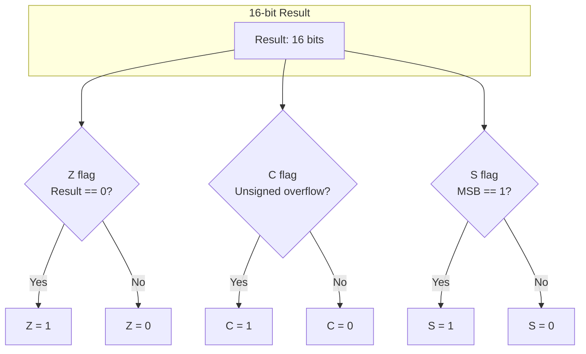

---

## Flag Definitions

### Z — Zero Flag

**Purpose:** Indicates whether the result of the last operation was zero.

**Semantics:**

- **Z = 1:** The operation produced a result of exactly `0x0000`
- **Z = 0:** The operation produced a non-zero result

**How it works:**

The zero flag is computed by OR-reducing all 16 bits of the result. If the OR of all bits is zero, the Z flag is set. This is a single-cycle operation in hardware.

```mermaid
flowchart LR
    subgraph "Result bits"
        B15["b15"] B14["b14"] B13["..."] B1["b1"] B0["b0"]
    end

    B15 --> OR["16-input OR gate"]
    B14 --> OR
    B13 --> OR
    B1 --> OR
    B0 --> OR
    OR --> NOT["NOT gate"]
    NOT --> ZF["Z flag"]
```

**Usage:**

- After SUB/AND/OR/XOR: check if values are equal or result is zero
- After loop counter decrement: check if loop is complete
- After AND with mask: test if specific bits are set

### C — Carry Flag

**Purpose:** Indicates unsigned overflow or borrow in arithmetic operations.

**Semantics for ADD:**

- **C = 1:** The addition produced a carry out of bit 15 (result > 0xFFFF unsigned)
- **C = 0:** No carry out occurred

**Semantics for SUB:**

- **C = 1:** A borrow occurred (source > destination unsigned)
- **C = 0:** No borrow (destination ≥ source unsigned)

**Semantics for SHL:**

- **C = 1:** The last bit shifted out of the MSB was 1
- **C = 0:** The last bit shifted out of the MSB was 0

**Semantics for SHR:**

- **C = 1:** The last bit shifted out of the LSB was 1
- **C = 0:** The last bit shifted out of the LSB was 0

**Note on SUB carry inversion:**

For subtraction, the carry flag represents a **borrow** — it is the logical inverse of what ADD would produce for the same operands. This is standard for processors that implement SUB as `A + (~B) + 1`:

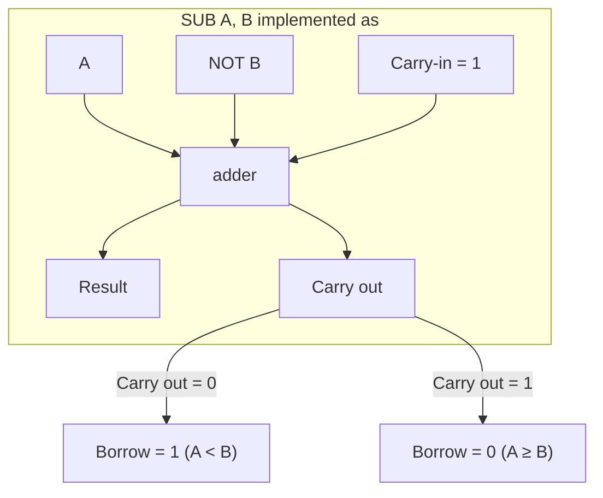

This inversion means:

| Condition | C flag after SUB A, B |
|-----------|----------------------|
| A > B (unsigned) | 0 |
| A = B (unsigned) | 0 |
| A < B (unsigned) | 1 |

### S — Sign Flag

**Purpose:** Indicates the sign of the result when interpreted as a signed 16-bit integer (two's complement).

**Semantics:**

- **S = 1:** Result MSB is 1 (negative in signed interpretation)
- **S = 0:** Result MSB is 0 (non-negative in signed interpretation)

**Note:** The S flag is a direct copy of bit 15 of the result. It does not account for overflow in signed arithmetic. For signed comparison, both S and V (overflow, not available in base ISA) are needed.

**Practical limitation:** Without a signed overflow (V) flag, the S flag alone is insufficient for reliable signed comparison. For signed arithmetic, the software must manually check for overflow conditions.

---

## Instruction Flag Effects

### Complete Flag Reference Table

| Instruction | Z | C | S | Notes |
|-------------|---|---|---|-------|
| **MOV**     | — | — | — | No flags modified |
| **ADD**     | ✓ | ✓ | ✓ | Z = (result == 0); C = (carry out); S = (MSB) |
| **SUB**     | ✓ | ✓ | ✓ | Z = (result == 0); C = (borrow); S = (MSB) |
| **AND**     | ✓ | — | ✓ | Z = (result == 0); S = (MSB); C unchanged |
| **OR**      | ✓ | — | ✓ | Z = (result == 0); S = (MSB); C unchanged |
| **XOR**     | ✓ | — | ✓ | Z = (result == 0); S = (MSB); C unchanged |
| **SHL**     | ✓ | ✓ | ✓ | Z = (result == 0); C = (last bit out MSB); S = (MSB) |
| **SHR**     | ✓ | ✓ | ✓ | Z = (result == 0); C = (last bit out LSB); S = (MSB) |
| **JMP**     | — | — | — | No flags tested or modified |
| **JZ**      | — | — | — | Tests Z, does not modify flags |
| **JNZ**     | — | — | — | Tests Z, does not modify flags |
| **CALL**    | — | — | — | No flags modified |
| **RET**     | — | — | — | No flags modified |
| **PUSH**    | — | — | — | No flags modified |
| **POP**     | — | — | — | No flags modified |
| **IN**      | — | — | — | No flags modified |
| **OUT**     | — | — | — | No flags modified |
| **INT**     | — | — | — | FLAGS saved to stack, not modified |
| **HLT**     | — | — | — | No flags modified |

**Legend:** ✓ = modified, — = unchanged

### Flag Update Timing

Flags are updated at the **end** of the execute stage, after the operation completes. This means:

1. The instruction fetches operands
2. The ALU performs the operation
3. The result is written back to the destination register
4. Flags are updated from the result
5. The next instruction can use the updated flags

There is no pipeline hazard for flag-dependent branches because the flag update occurs before the next instruction's decode stage.

---

## Flag State Machine

### Z Flag State Diagram

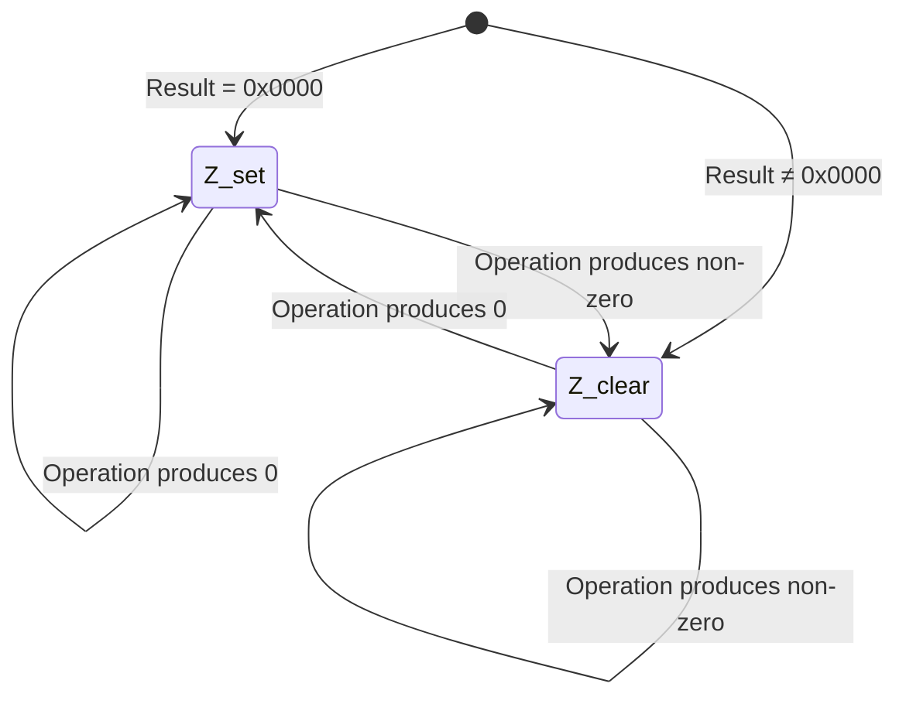

### C Flag State Diagram

```mermaid
stateDiagram-v2
    [*] --> C_set: Carry/borrow occurred
    [*] --> C_clear: No carry/borrow

    C_set --> C_set: Next op: carry/borrow again
    C_set --> C_clear: Next op: no carry/borrow
    C_clear --> C_set: Next op: carry/borrow
    C_clear --> C_clear: Next op: no carry/borrow

    note right of C_set: ADD: result > 0xFFFF\nSUB: source > dest\nSHL: last bit out = 1\nSHR: last bit out = 1
```

### S Flag State Diagram

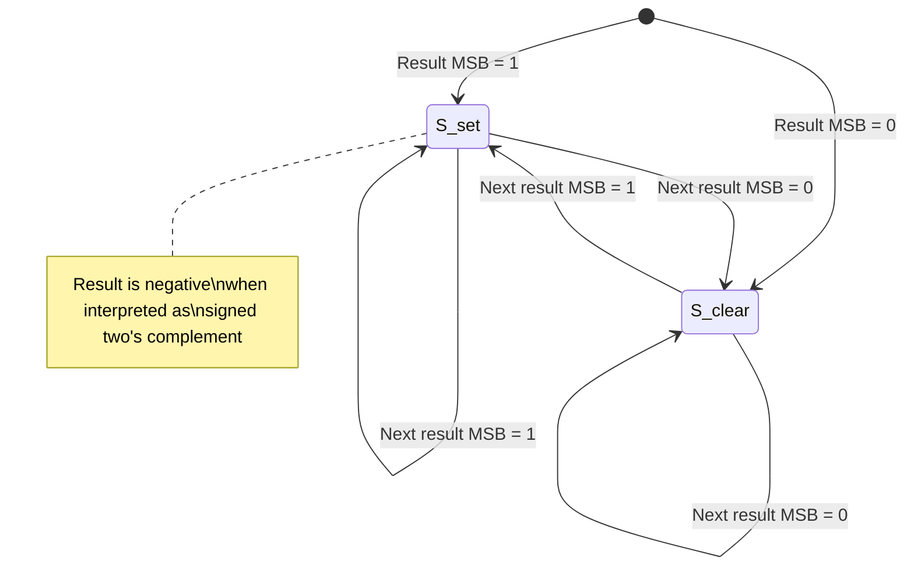

### Combined Flag State Diagram

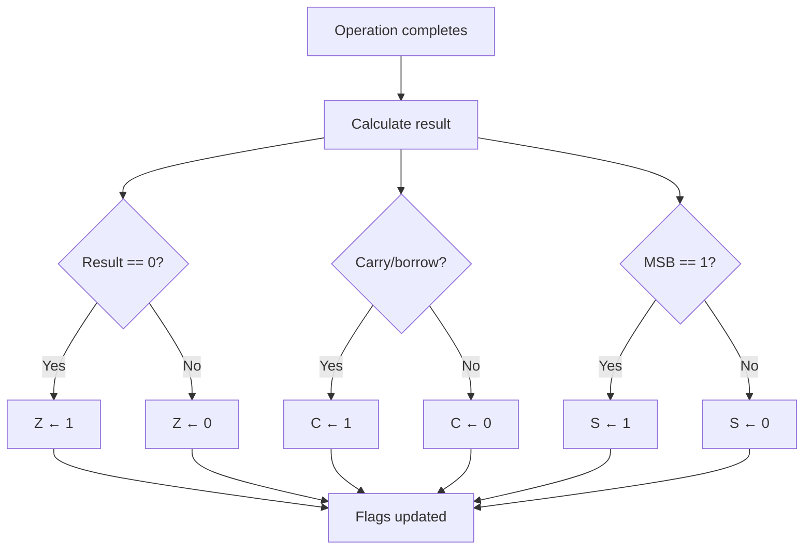

---

## Carry Propagation in Multi-Word Arithmetic

The carry flag enables arithmetic on values larger than 16 bits by chaining operations across multiple words.

### 32-bit Addition

To add two 32-bit values stored in register pairs (high:DX, low:AX for each operand):

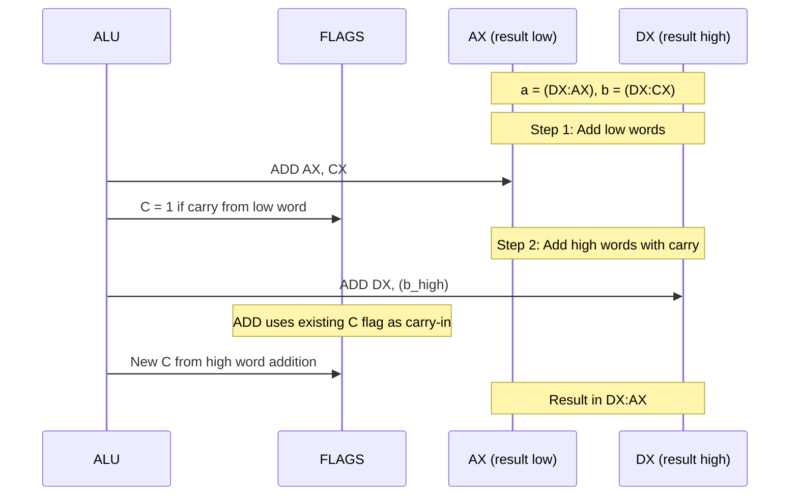

**Step-by-step explanation:**

1. **Low-word addition:** `ADD AX, CX` — adds the low 16 bits. If the result exceeds 0xFFFF, C is set.
2. **High-word addition:** `ADD DX, (b_high)` — adds the high 16 bits. The ADD instruction incorporates the carry flag from step 1, effectively performing `DX + b_high + C`.

This gives a correct 32-bit addition: `(DX:AX) = (DX:AX) + (b_high:CX)`.

### 32-bit Subtraction

The same pattern applies, but the carry/borrow behavior is inverted:

1. **Low-word subtraction:** `SUB AX, CX` — C is set if a borrow occurred (CX > AX).
2. **High-word subtraction:** `SUB DX, (b_high)` — C is set if a borrow occurred. The SUB instruction incorporates the previous borrow.

**Important:** After `SUB AX, CX`, the C flag indicates whether a borrow is needed from the high word. The next `SUB DX, (b_high)` must account for this borrow.

### 48-bit and 64-bit Arithmetic

For wider arithmetic, extend the chain:

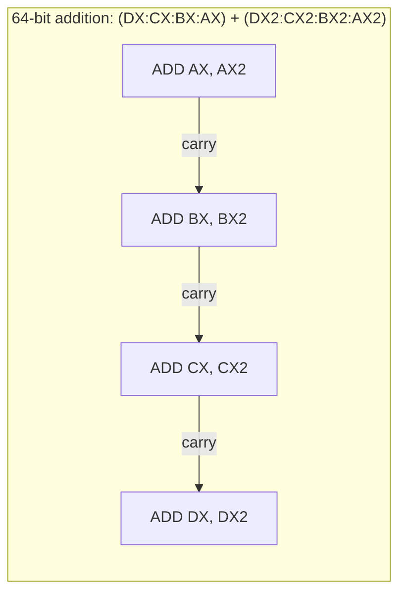

Each step propagates the carry to the next higher word. The final carry out (if any) indicates 64-bit unsigned overflow.

### Multi-Precision Subtraction

For multi-precision subtraction, the borrow propagates identically:

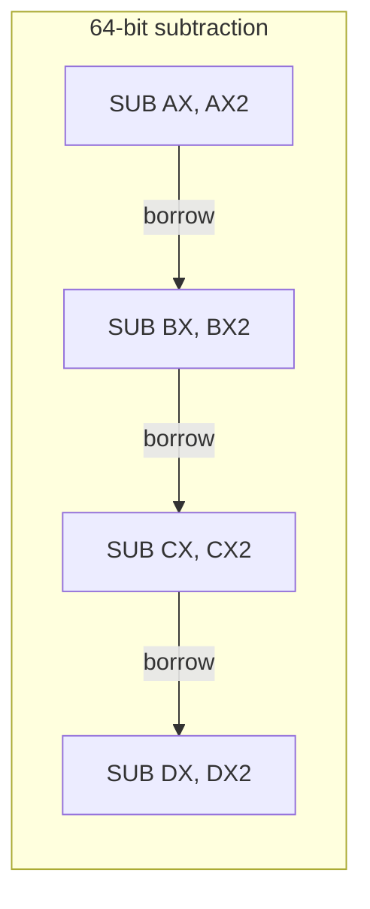

After `SUB AX, AX2`:
- If C=0: no borrow needed, next SUB operates normally
- If C=1: borrow needed, next SUB incorporates this borrow

---

## Shift Flag Behavior

### SHL — Shift Left

SHL shifts all bits toward the MSB. The MSB is shifted into the carry flag. The LSB is filled with zero.

**Single-bit shift:**

```mermaid
flowchart LR
    subgraph "Before SHL AX, 1"
        A15["b15"] A14["b14"] A13["..."] A1["b1"] A0["b0"]
    end

    subgraph "After SHL AX, 1"
        N14["b14"] N13["b13"] N12["..."] N0["b0"] ZERO["0"]
    end

    A15 -->|"→ C flag"| CF["C"]
    A14 --> N14
    A13 --> N13
    A1 --> N0
    A0 --> ZERO
```

**Multi-bit shift:**

For a shift by N bits, the carry flag is set to bit (15 − N) of the original value. Intermediate carry values from each individual bit shift are lost.

| Shift count | C flag after SHL | Z flag | S flag |
|-------------|-------------------|--------|--------|
| 0           | Unchanged         | Unchanged | Unchanged |
| 1           | Original bit 15   | (result == 0) | New MSB |
| 2           | Original bit 14   | (result == 0) | New MSB |
| 4           | Original bit 12   | (result == 0) | New MSB |
| 8           | Original bit 8    | (result == 0) | New MSB |
| 16          | Original bit 0    | Always 1 (result=0) | 0 |

**Special case: SHL by 16**

Shifting a 16-bit register left by 16 produces zero. The carry flag is set to the original LSB (bit 0), which is the last bit to exit the register.

### SHR — Shift Right

SHR shifts all bits toward the LSB. The LSB is shifted into the carry flag. The MSB is filled with zero (logical shift, not arithmetic).

**Single-bit shift:**

```mermaid
flowchart LR
    subgraph "Before SHR AX, 1"
        A15["b15"] A14["b14"] A13["..."] A1["b1"] A0["b0"]
    end

    subgraph "After SHR AX, 1"
        ZERO["0"] N15["b15"] N14["b14"] N13["..."] N1["b1"]
    end

    A0 -->|"→ C flag"| CF["C"]
    A15 --> N15
    A14 --> N14
    A1 --> N1
```

**Multi-bit shift:**

For a shift by N bits, the carry flag is set to bit (N − 1) of the original value.

| Shift count | C flag after SHR | Z flag | S flag |
|-------------|-------------------|--------|--------|
| 0           | Unchanged         | Unchanged | Unchanged |
| 1           | Original bit 0    | (result == 0) | 0 (MSB always 0) |
| 2           | Original bit 1    | (result == 0) | 0 |
| 4           | Original bit 3    | (result == 0) | 0 |
| 8           | Original bit 7    | (result == 0) | 0 |
| 16          | Original bit 15   | Always 1 (result=0) | 0 |

**Special case: SHR by 16**

Shifting a 16-bit register right by 16 produces zero. The carry flag is set to the original MSB (bit 15), which is the last bit to exit the register.

**Note:** SHR always clears the S flag because it fills the MSB with zero. For sign-preserving right shift, a SAR instruction would be needed (not in base ISA).

---

## Comparison and Testing

The NovumOS-16bit does not have a dedicated CMP instruction. Comparisons are performed using SUB or AND, then inspecting the flags.

### Equality Test

To test if AX equals BX:

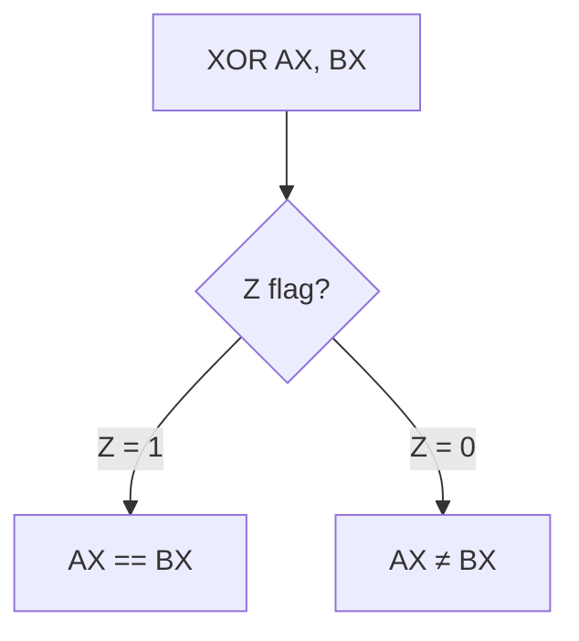

Using XOR preserves the original value (destination is overwritten with the XOR result). The Z flag indicates whether the values were equal.

**Alternative using SUB:** `SUB AX, BX` destroys the original value of AX.

### Unsigned Greater Than

To test if AX > BX (unsigned):

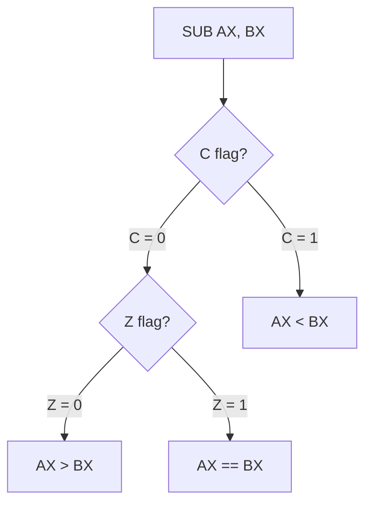

**Logic:** After `SUB AX, BX`:
- C = 0 and Z = 0: no borrow, not equal → AX > BX
- C = 0 and Z = 1: no borrow, equal → AX == BX
- C = 1: borrow occurred → AX < BX

### Unsigned Less Than

To test if AX < BX (unsigned):

After `SUB AX, BX`: if C = 1, then AX < BX.

### Signed Comparison

Signed comparison is more complex without an overflow flag. The S flag alone is unreliable for signed comparison because it does not detect overflow.

**Approximate signed comparison (works when no overflow occurs):**

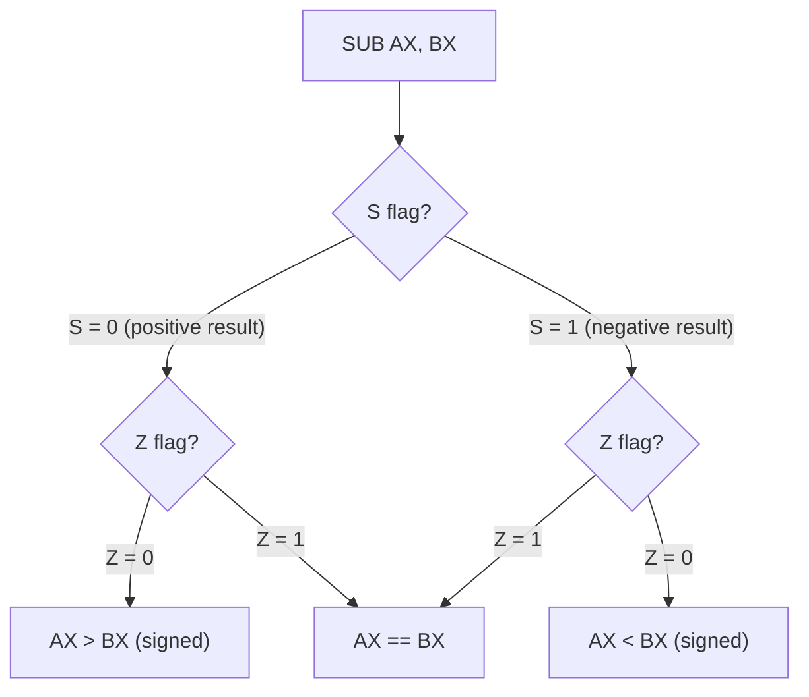

**Warning:** This fails when overflow occurs (e.g., large positive − large negative = overflow). For reliable signed comparison, the software must check for overflow conditions manually.

### Bit Testing

To test if specific bits are set in a value:

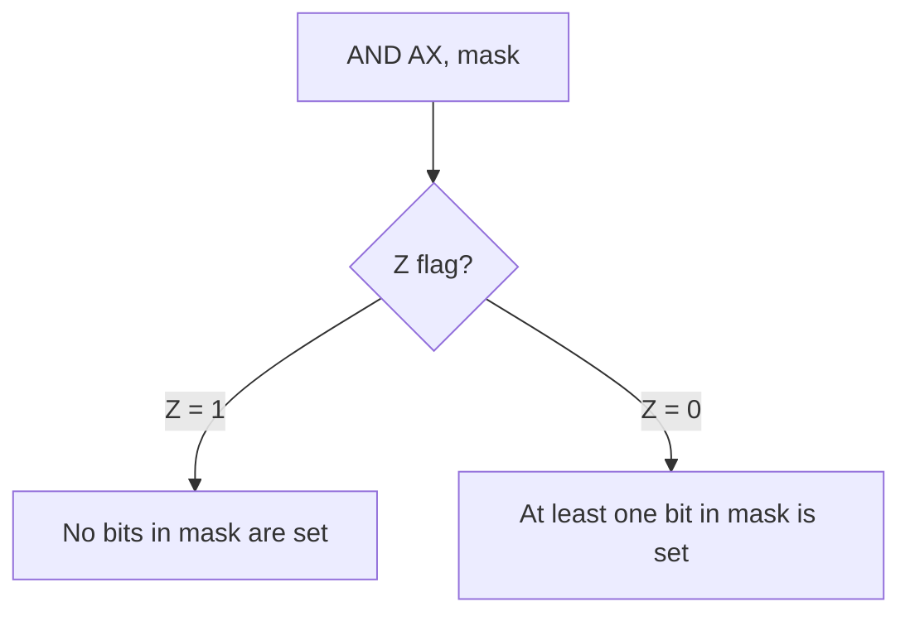

The AND operation isolates the bits specified by the mask. If the result is zero, none of the masked bits were set.

**Example: Test bit 3 of AX**

`AND AX, 0x0008` — if Z = 1, bit 3 is clear; if Z = 0, bit 3 is set.

### Bit Testing Without Destruction

To test bits without modifying the source register, use a scratch register:

`MOV CX, AX` then `AND CX, mask` — tests AX's bits without destroying AX.

---

## Flag Interaction Patterns

### Setting Specific Flag Combinations

| Desired Flags | How to achieve |
|---------------|----------------|
| Z=1, C=0, S=0 | `MOV AX, 0` (if immediate MOV available) or `XOR AX, AX` |
| Z=0, C=0, S=0 | `MOV AX, 1` or `OR AX, AX` (if AX was already non-zero) |
| Z=0, C=0, S=1 | `MOV AX, 0x8000` |
| Z=0, C=1, S=0 | `ADD AX, 0xFFFF` when AX = 1 (produces carry, result = 0x0000... need careful) |
| Z=1, C=1, S=0 | `SUB AX, AX` (Z=1, C=0, S=0) then `ADD AX, 0x10000` is impossible in 16-bit |

**Note:** Some flag combinations are impossible to achieve naturally in 16-bit arithmetic. The CPU does not provide direct manipulation of individual flags.

### Flag Preservation Across Instructions

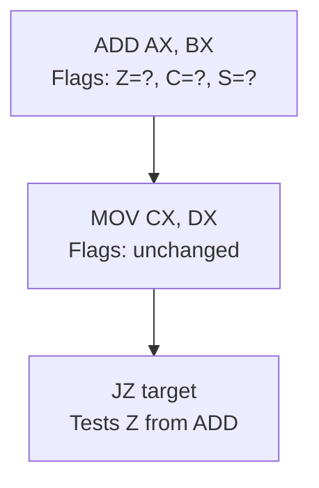

Data transfer instructions (MOV, PUSH, POP) do not modify flags. This means flags set by a previous ALU instruction persist until the next ALU instruction modifies them.

**Safe flag-consuming instructions:**

- JZ, JNZ: test Z without modifying flags
- Any subsequent ALU instruction: overwrites all flags

**Flag-destructive instructions:**

- ADD, SUB, AND, OR, XOR, SHL, SHR: all flags updated from result
- MOV, PUSH, POP, IN, OUT, JMP, CALL, RET, HLT: flags unchanged

### Flag Hazards

There are no flag hazards in the NovumOS-16bit because:

1. Flags are updated at the end of the execute stage
2. The next instruction's decode stage reads the updated flags
3. There is no out-of-order execution
4. There is no flag forwarding needed

### Common Flag Patterns

**Zero-test after operation:**

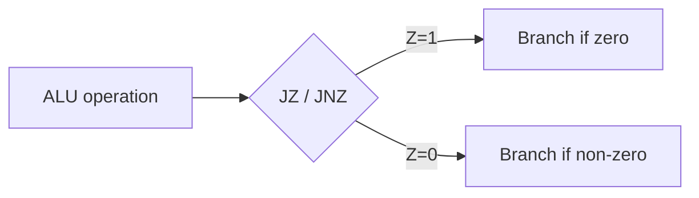

**Carry-chain arithmetic:**

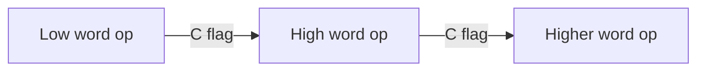

**Loop with counter:**

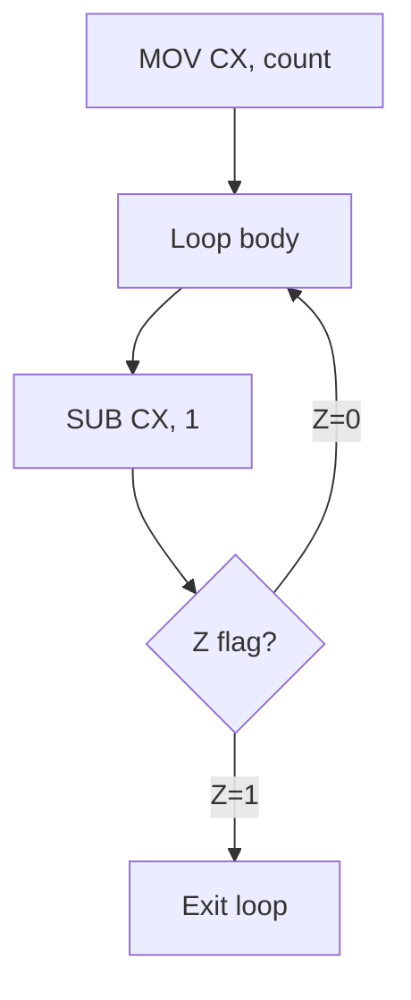

---

## Quick Reference: Flag Behavior by Instruction

### ADD

```
Result = dst + src
Z ← (Result == 0)
C ← (Result < dst)     // unsigned overflow
S ← (Result[15] == 1)
```

### SUB

```
Result = dst - src
Z ← (Result == 0)
C ← (src > dst)        // unsigned borrow
S ← (Result[15] == 1)
```

### AND / OR / XOR

```
Result = dst OP src
Z ← (Result == 0)
C ← (unchanged)
S ← (Result[15] == 1)
```

### SHL

```
for i in 1..count:
    C ← dst[15]
    dst ← dst << 1
Z ← (dst == 0)
S ← (dst[15] == 1)
```

### SHR

```
for i in 1..count:
    C ← dst[0]
    dst ← dst >> 1
Z ← (dst == 0)
S ← 0   // MSB always 0 after logical shift
```

---

*This document describes the complete flags behavior for the NovumOS-16bit CPU. All flag updates follow these rules precisely and consistently.*
