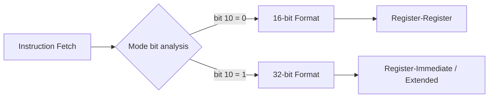
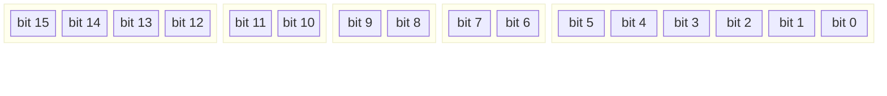
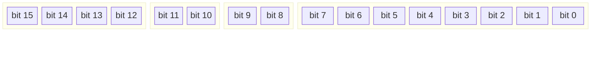
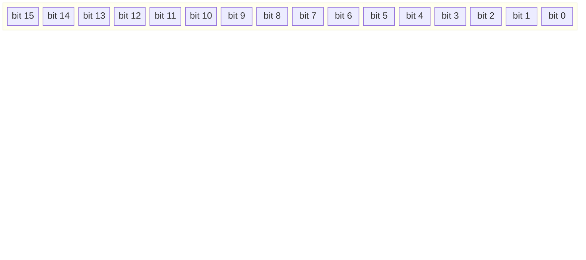
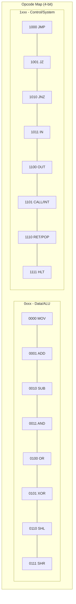
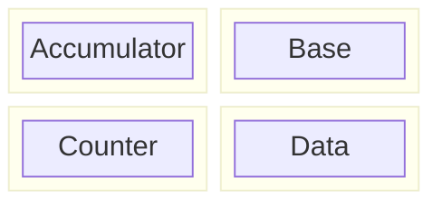
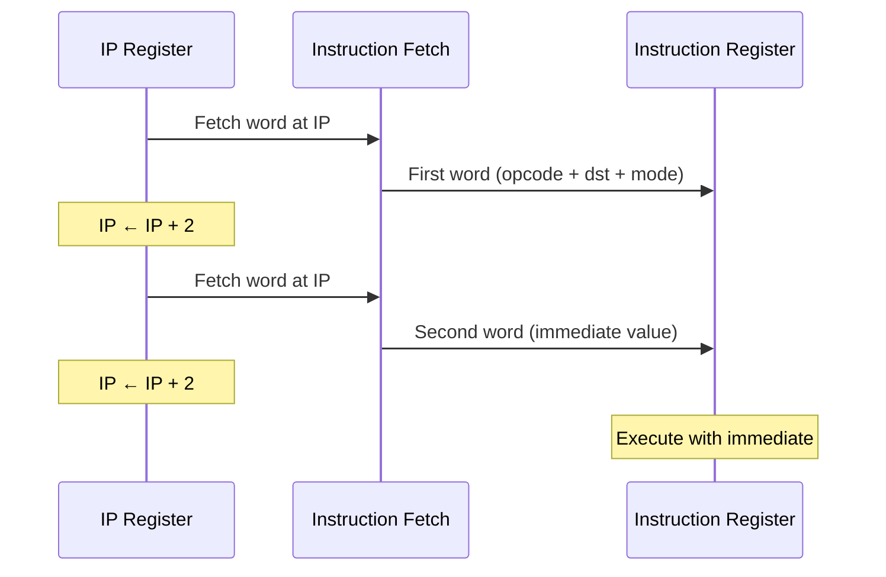
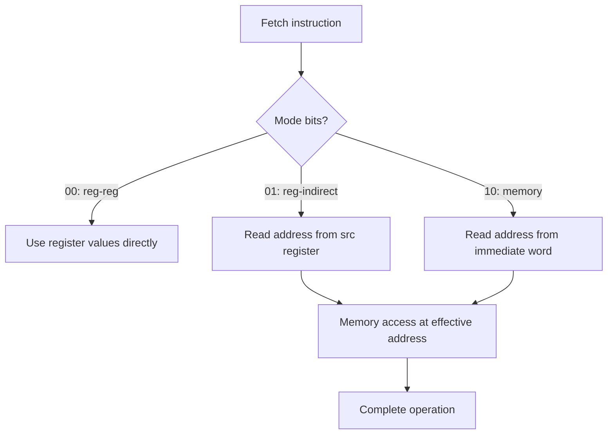
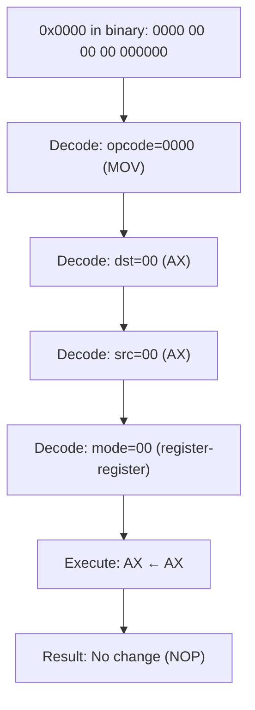

# NovumOS-16bit Instruction Encoding

Complete reference for binary instruction formats, opcode maps, and encoding rules.

---

## Table of Contents

1. [Encoding Overview](#encoding-overview)
2. [16-bit Instruction Format](#16-bit-instruction-format)
3. [32-bit Instruction Format](#32-bit-instruction-format)
4. [Opcode Map](#opcode-map)
5. [Operand Encoding](#operand-encoding)
6. [Addressing Modes](#addressing-modes)
7. [NOP Encoding](#nop-encoding)
8. [Encoding Examples](#encoding-examples)
9. [Illegal and Reserved Encodings](#illegal-and-reserved-encodings)

---

## Encoding Overview

The NovumOS-16bit uses a hybrid instruction encoding scheme with two formats:



The CPU determines the instruction format by examining the **mode bits** (bits 9–8) of the first word:

- If mode bits indicate register-register operation: **16-bit format**, single word
- If mode bits indicate immediate or extended operation: **32-bit format**, two words

All instructions are fetched on 16-bit word boundaries. The IP always points to the next word to fetch.

---

## 16-bit Instruction Format

The 16-bit format is used for register-to-register operations.

### Bit Field Layout



### Field Descriptions

| Field   | Bits    | Width | Description                                     |
|---------|---------|-------|-------------------------------------------------|
| Opcode  | 15–12   | 4     | Instruction type (0000–1111)                     |
| Dst     | 11–10   | 2     | Destination register encoding (00–11)            |
| Src     | 9–8     | 2     | Source register encoding (00–11)                 |
| Mode    | 7–6     | 2     | Operation mode (see addressing modes)            |
| Unused  | 5–0     | 6     | Reserved, must be zero. Reads as 0.              |

### Hex Notation

A 16-bit instruction is written as four hexadecimal digits: `0xODSMUU` where:
- `O` = opcode nibble (1 hex digit)
- `D` = destination register (1 hex digit, 0–3)
- `S` = source register (1 hex digit, 0–3)
- `M` = mode (1 hex digit, 0–3)
- `UU` = unused bits, always 0

Example: `MOV AX, BX` encodes as `0x0120` (opcode=0, dst=00, src=01, mode=00, unused=0)

---

## 32-bit Instruction Format

The 32-bit format is used for register-immediate operations, where the second word contains a 16-bit immediate value or extended operand.

### Bit Field Layout — First Word



### Bit Field Layout — Second Word (Immediate)



### Field Descriptions — First Word

| Field   | Bits    | Width | Description                                         |
|---------|---------|-------|-----------------------------------------------------|
| Opcode  | 15–12   | 4     | Instruction type (0000–1111)                         |
| Dst     | 11–10   | 2     | Destination register encoding (00–11)                |
| Mode    | 9–8     | 2     | Operation mode — selects immediate encoding          |
| Unused1 | 7–0     | 8     | Reserved, must be zero. Reads as 0.                  |

### Field Descriptions — Second Word

| Field   | Bits    | Width | Description                                         |
|---------|---------|-------|-----------------------------------------------------|
| Imm16   | 15–0    | 16    | 16-bit immediate value or address operand            |

### Hex Notation

A 32-bit instruction occupies two consecutive words:

```
Word 1: 0xOMXX (opcode + dst + mode + 8 unused bits)
Word 2: 0xIIII (16-bit immediate value)
```

Example: `MOV AX, #0x1234` encodes as two words: `0x0080` then `0x1234`
- Word 1: opcode=0 (MOV), dst=00 (AX), mode=01 (immediate), unused=0x00
- Word 2: 0x1234 (the immediate value)

---

## Opcode Map

### Complete Opcode Table

| Opcode (binary) | Opcode (hex) | Mnemonic | Category          | Description              |
|------------------|--------------|----------|-------------------|--------------------------|
| `0000`           | `0x0`        | MOV      | Data Transfer     | Move / Load              |
| `0001`           | `0x1`        | ADD      | Arithmetic        | Integer addition         |
| `0010`           | `0x2`        | SUB      | Arithmetic        | Integer subtraction      |
| `0011`           | `0x3`        | AND      | Logic             | Bitwise AND              |
| `0100`           | `0x4`        | OR       | Logic             | Bitwise OR               |
| `0101`           | `0x5`        | XOR      | Logic             | Bitwise exclusive OR     |
| `0110`           | `0x6`        | SHL      | Shift             | Shift left logical       |
| `0111`           | `0x7`        | SHR      | Shift             | Shift right logical      |
| `1000`           | `0x8`        | JMP      | Control Flow      | Unconditional jump       |
| `1001`           | `0x9`        | JZ       | Control Flow      | Jump if zero             |
| `1010`           | `0xA`        | JNZ      | Control Flow      | Jump if not zero         |
| `1011`           | `0xB`        | IN       | I/O               | Input from port          |
| `1100`           | `0xC`        | OUT      | I/O               | Output to port           |
| `1101`           | `0xD`        | CALL/INT | Control Flow/System | Call subroutine / Interrupt |
| `1110`           | `0xE`        | RET/POP  | Control Flow/Stack | Return / Pop             |
| `1111`           | `0xF`        | HLT      | System            | Halt CPU                 |

### Opcode Map Visualization



### Register Encoding

| Encoding | Register | Alias |
|----------|----------|-------|
| `00`     | AX       | Accumulator |
| `01`     | BX       | Base |
| `10`     | CX       | Counter |
| `11`     | DX       | Data |

### Mode Encoding — 16-bit Format

| Mode (bits 9–8) | Value | Meaning |
|------------------|-------|---------|
| `00`             | 0     | Register-register operation |
| `01`             | 1     | Register-indirect (address in src register) |
| `10`             | 2     | Reserved (future use) |
| `11`             | 3     | Reserved (future use) |

### Mode Encoding — 32-bit Format

| Mode (bits 9–8) | Value | Meaning |
|------------------|-------|---------|
| `00`             | 0     | Register-immediate operation (lower 8 bits of instruction unused) |
| `01`             | 1     | Register-immediate with 16-bit immediate in second word |
| `10`             | 2     | Extended addressing (memory indirect) |
| `11`             | 3     | Reserved (future use) |

---

## Operand Encoding

### Register Operands

Registers are encoded as 2-bit fields within the instruction. The encoding applies to both source and destination fields.



Register operands can appear in:

- **Dst field** (bits 11–10 in 16-bit, bits 11–10 in 32-bit): Target of the operation
- **Src field** (bits 9–8 in 16-bit): Source of the operation (register-register mode only)

### Immediate Operands

Immediate values are encoded in the second word of 32-bit instructions. The immediate is a full 16-bit unsigned value (0x0000–0xFFFF).

**Immediate representation:**

- Stored in two's complement form for signed interpretation
- Range: 0 to 65535 (unsigned) or −32768 to +32767 (signed)
- The CPU treats the immediate as a raw bit pattern; signedness depends on the instruction

**Immediate instruction flow:**



### Memory Indirect Operands

Memory indirect operands use a register as a pointer to a memory location. The effective address is the value held in the specified register.

**Encoding in 16-bit format:**

| Mode | Src field | Effective address |
|------|-----------|-------------------|
| `01` | Register  | Value in register (0–65535) used as memory address |

**Encoding in 32-bit format (mode `10`):**

| Mode | Second word | Effective address |
|------|-------------|-------------------|
| `10` | Immediate   | 16-bit address used directly as memory address |

**Memory access flow:**



---

## Addressing Modes

The NovumOS-16bit supports three addressing modes, selected by the mode field:

### Mode 0: Register-Register

All operands are in registers. No memory access occurs (except instruction fetch).

**Instruction format:** 16-bit

```
[opcode:4][dst:2][src:2][00:2][unused:6]
```

**Operation:** `R[dst] ← R[dst] op R[src]`

**Examples:**

| Instruction | Opcode | Dst | Src | Mode | Hex |
|-------------|--------|-----|-----|------|-----|
| MOV AX, BX  | 0000   | 00  | 01  | 00   | 0x0120 |
| ADD CX, DX  | 0001   | 10  | 11  | 00   | 0x13A0 |
| XOR AX, AX  | 0101   | 00  | 00  | 00   | 0x5020 |
| AND BX, CX  | 0011   | 01  | 10  | 00   | 0x3260 |

### Mode 1: Register-Indirect (16-bit format)

The source operand is a memory location pointed to by the source register.

**Instruction format:** 16-bit

```
[opcode:4][dst:2][src:2][01:2][unused:6]
```

**Operation:** `R[dst] ← R[dst] op Memory[R[src]]`

**Examples:**

| Instruction | Opcode | Dst | Src | Mode | Hex |
|-------------|--------|-----|-----|------|-----|
| MOV AX, [BX] | 0000  | 00  | 01  | 01   | 0x0124 |
| ADD CX, [DX] | 0001  | 10  | 11  | 01   | 0x13A4 |

### Mode 0: Register-Immediate (32-bit format)

The source operand is an immediate value in the second instruction word.

**Instruction format:** 32-bit

```
Word 1: [opcode:4][dst:2][00:2][unused:8]
Word 2: [immediate:16]
```

**Operation:** `R[dst] ← R[dst] op imm16`

**Examples:**

| Instruction | Opcode | Dst | Mode | Immediate | Hex words |
|-------------|--------|-----|------|-----------|-----------|
| MOV AX, #0x1234 | 0000 | 00 | 00 | 0x1234 | 0x0080, 0x1234 |
| ADD BX, #10 | 0001 | 01 | 00 | 0x000A | 0x1080, 0x000A |
| SUB CX, #1 | 0010 | 10 | 00 | 0x0001 | 0x2080, 0x0001 |

### Mode 1: Register-Immediate with Address (32-bit format)

Used for operations that need both a register and a full 16-bit address, such as memory loads in future extensions.

**Instruction format:** 32-bit

```
Word 1: [opcode:4][dst:2][01:2][unused:8]
Word 2: [address:16]
```

### Mode 2: Memory Indirect (32-bit format)

The second word contains the direct memory address to access.

**Instruction format:** 32-bit

```
Word 1: [opcode:4][dst:2][10:2][unused:8]
Word 2: [address:16]
```

**Operation:** `R[dst] ← R[dst] op Memory[imm16]`

---

## NOP Encoding

**NOP (No Operation)** is encoded as `0x0000`.

This encoding corresponds to `MOV AX, AX` — moving AX into itself. Since no state changes occur, this functions as a NOP.

### Why 0x0000 is NOP



### NOP Properties

| Property | Value |
|----------|-------|
| Encoding | `0x0000` |
| Equivalent instruction | `MOV AX, AX` |
| Flags affected | None |
| Cycles | 1 |
| Side effects | None |

### Alternative NOP

Any instruction that has no observable effect can serve as a NOP:

| Instruction | Encoding | Notes |
|-------------|----------|-------|
| `MOV AX, AX` | `0x0020` | Primary NOP encoding |
| `MOV BX, BX` | `0x0160` | Alternative NOP |
| `MOV CX, CX` | `0x02A0` | Alternative NOP |
| `MOV DX, DX` | `0x03E0` | Alternative NOP |
| `XOR AX, AX` | `0x5020` | Also clears AX to zero (not a true NOP) |

The canonical NOP is `0x0000` (`MOV AX, AX`).

---

## Encoding Examples

### Example 1: Register-Register ADD

**Instruction:** `ADD AX, BX`

**Binary breakdown:**

```
Opcode: ADD = 0001
Dst:    AX  = 00
Src:    BX  = 01
Mode:   reg-reg = 00
Unused: 000000

Binary: 0001 00 01 00 000000
Hex:    0x1100
```

### Example 2: Register-Immediate MOV

**Instruction:** `MOV CX, #0xBEEF`

**Word 1 breakdown:**

```
Opcode: MOV = 0000
Dst:    CX  = 10
Mode:   immediate = 00
Unused: 00000000

Binary word 1: 0000 10 00 00000000
Hex word 1:    0x0280
```

**Word 2:** `0xBEEF`

### Example 3: Conditional Jump (JZ)

**Instruction:** `JZ #0x0100`

**Word 1 breakdown:**

```
Opcode: JZ  = 1001
Dst:    (unused for jumps)
Mode:   immediate = 01
Unused: 00000000

Binary word 1: 1001 00 01 00000000
Hex word 1:    0x9040
```

**Word 2:** `0x0100` (target address)

### Example 4: OUT to Port

**Instruction:** `OUT #0x0010, AX`

**Word 1 breakdown:**

```
Opcode: OUT = 1100
Dst:    port = #0x0010 (in immediate)
Mode:   immediate = 01
Unused: 00000000

Binary word 1: 1100 00 01 00000000
Hex word 1:    0xC040
```

**Word 2:** `0x0010` (port number)

### Example 5: PUSH register

**Instruction:** `PUSH AX`

**Binary breakdown:**

```
Opcode: PUSH = 1101 (shared with CALL/INT)
Dst:    (unused)
Src:    AX  = 00
Mode:   register = 00
Unused: 000000

Binary: 1101 00 00 00 000000
Hex:    0xD000
```

---

## Illegal and Reserved Encodings

### Undefined Opcode Behavior

Opcodes in the range `1111` (`0xF`) through unused combinations are treated as HLT. The CPU halts on encountering an undefined opcode.

### Reserved Mode Bits

Mode values `10` and `11` in the 16-bit format are reserved. If encountered, the CPU behavior is:

- **Mode `10`:** Treated as NOP (instruction ignored)
- **Mode `11`:** Treated as NOP (instruction ignored)

### Unused Bits

The unused bits in both instruction formats (bits 5–0 in 16-bit, bits 7–0 in first word of 32-bit) must be written as zero during normal operation. The CPU ignores these bits during decoding. However:

- The assembler must set unused bits to zero
- The CPU may use these bits in future extensions
- Debug tools may use them for metadata (e.g., breakpoints)

### Encoding Sanity Rules

| Rule | Description |
|------|-------------|
| Word alignment | All instructions start on 16-bit word boundaries |
| Immediate alignment | 32-bit instructions occupy exactly two consecutive words |
| Unused zeros | All unused bits must be zero |
| Stack bounds | PUSH/POP must not cause SP to go below 0x0000 or above 0xFFFF |
| Jump targets | JMP/JZ/JNZ targets must be word-aligned (even addresses) |

---

*This document defines the complete binary encoding for the NovumOS-16bit instruction set. Assembler implementations must follow these encoding rules exactly.*
