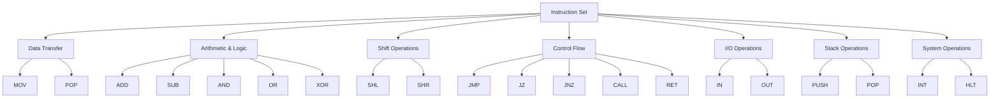
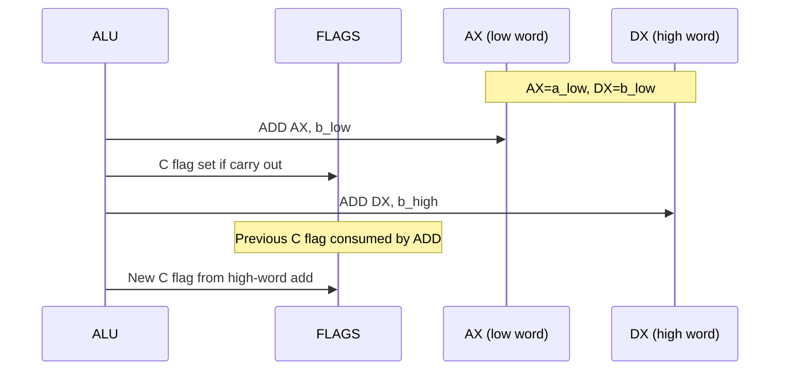
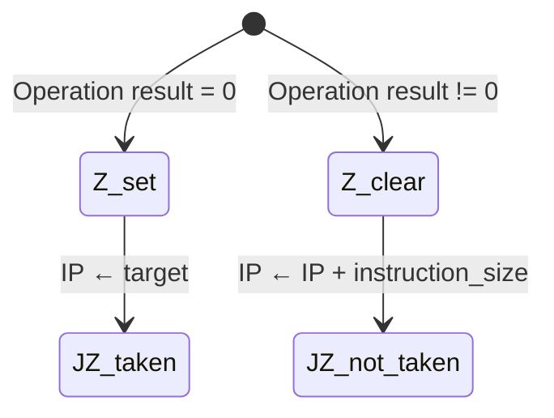
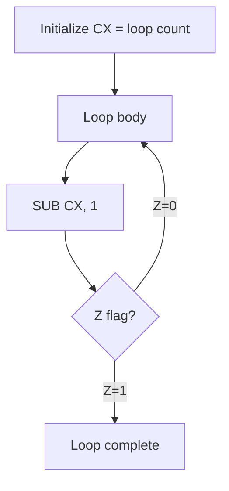
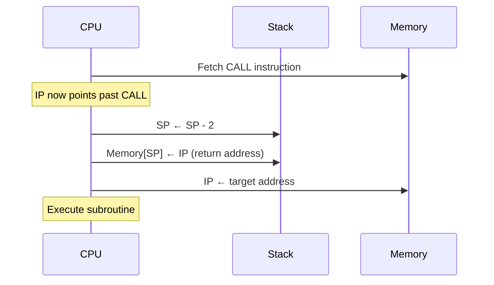
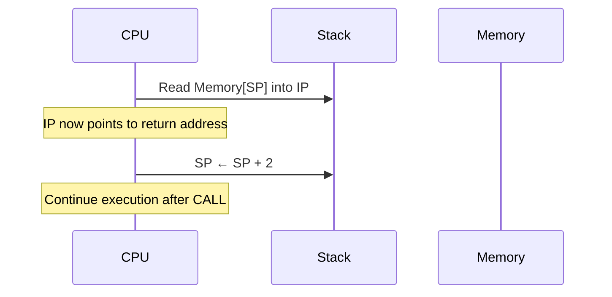
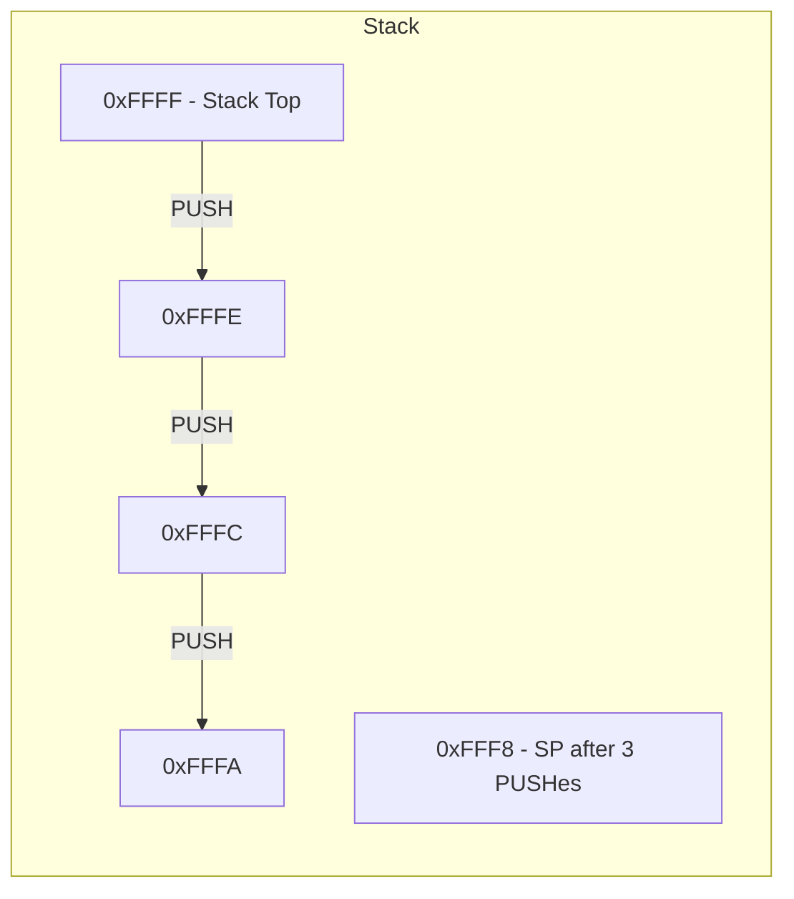
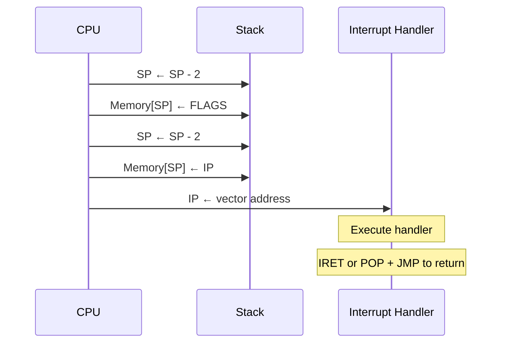

# NovumOS-16bit Instruction Set Architecture

Complete reference for the NovumOS-16bit CPU instruction set.

---

## Table of Contents

1. [CPU Overview](#cpu-overview)
2. [Registers](#registers)
3. [Instruction Categories](#instruction-categories)
   - [Data Transfer](#data-transfer)
   - [Arithmetic and Logic](#arithmetic-and-logic)
   - [Shift Operations](#shift-operations)
   - [Control Flow](#control-flow)
   - [I/O Operations](#io-operations)
   - [Stack Operations](#stack-operations)
   - [System Operations](#system-operations)
4. [Flag Behavior Summary](#flag-behavior-summary)
5. [Instruction Timing](#instruction-timing)

---

## CPU Overview

The NovumOS-16bit CPU is a RISC-like processor built entirely from TTL logic gates. It features a hybrid 16/32-bit instruction format, four general-purpose 16-bit registers, and a simplified flag register.

Key characteristics:

- **Word size:** 16 bits
- **Data bus:** 16 bits
- **Address bus:** 16 bits (64 KiB addressable memory)
- **Instruction formats:** 16-bit (register-register) and 32-bit (register-immediate)
- **Pipeline stages:** Fetch, Decode, Execute, Writeback
- **Clock:** Single-phase synchronous

---

## Registers

| Register | Encoding | Size    | Purpose                                 |
|----------|----------|---------|-----------------------------------------|
| **AX**   | `00`     | 16-bit  | Accumulator — primary arithmetic target |
| **BX**   | `01`     | 16-bit  | Base — secondary operand / address base |
| **CX**   | `10`     | 16-bit  | Counter — loop counter / temp storage   |
| **DX**   | `11`     | 16-bit  | Data — I/O port operand / temp storage  |
| **IP**   | (hidden) | 16-bit  | Instruction Pointer — next instruction  |
| **SP**   | (hidden) | 16-bit  | Stack Pointer — top of stack            |
| **FLAGS**| (hidden) | 16-bit  | Processor status flags                  |

### FLAGS Register Layout

```
Bit:  15 14 13 12 11 10  9  8  7  6  5  4  3  2  1  0
      [  unused (reserved, reads as 0)  ]  S  C  Z
```

| Bit | Flag | Name  | Description                                |
|-----|------|-------|--------------------------------------------|
| 0   | **Z** | Zero  | Set when an operation result equals zero   |
| 1   | **C** | Carry | Set on unsigned overflow / borrow          |
| 2   | **S** | Sign  | Set when the result's MSB is 1 (negative)  |
| 3–15| —    | Reserved | Reads as zero; do not rely on value     |

---

## Instruction Categories

### Overview Diagram



---

### Data Transfer

Data transfer instructions move values between registers, between registers and memory, or load immediate values.

---

#### MOV — Move

**Mnemonic:** `MOV`  
**Opcode:** `0000`  
**Operands:** `dst, src`  
**Format:** 16-bit (reg-reg) or 32-bit (reg-imm)

| Aspect | Detail |
|--------|--------|
| **Operation** | `dst ← src` |
| **16-bit encoding** | `MOV Rdst, Rsrc` — copies the value of source register into destination register |
| **32-bit encoding** | `MOV Rdst, #imm16` — loads a 16-bit immediate value into destination register |
| **Flags affected** | None |
| **Cycles** | 1 (reg-reg), 2 (reg-imm, requires memory fetch) |

**Description:**

The MOV instruction transfers data without modifying it. The source operand is unchanged. In register-register mode, the copy completes in a single clock cycle. In register-immediate mode (32-bit format), the CPU fetches the second word of the instruction from the instruction stream, which adds one cycle.

MOV cannot directly transfer data between memory locations. To move data between memory addresses, use MOV to load into a register, then MOV to store.

**Operand combinations:**

| Source | Destination | Notes |
|--------|-------------|-------|
| Register | Register | Single-cycle register-to-register transfer |
| Immediate | Register | 32-bit instruction; immediate fetched from instruction stream |
| Register | Memory | (Future extension — not in base ISA) |
| Memory | Register | (Future extension — not in base ISA) |

---

#### PUSH — Push to Stack

**Mnemonic:** `PUSH`  
**Opcode:** `1101` (CALL slot — redefined for PUSH in extended encoding)  
**Operands:** `Rsrc` or `#imm16`  
**Format:** 16-bit (reg) or 32-bit (imm)

| Aspect | Detail |
|--------|--------|
| **Operation** | `SP ← SP - 2; Memory[SP] ← src` |
| **Flags affected** | None |
| **Cycles** | 2 |

**Description:**

PUSH decrements the stack pointer by 2 (one word), then writes the source operand to the memory location pointed to by SP. The stack grows downward — toward lower addresses. PUSH is used before CALL to save registers or before entering a subroutine to preserve context.

The stack must remain within valid memory bounds. PUSH with SP at address 0 results in a wraparound to 0xFFFF, which is undefined behavior.

---

#### POP — Pop from Stack

**Mnemonic:** `POP`  
**Opcode:** `1110` (RET slot — redefined for POP in extended encoding)  
**Operands:** `Rdst`  
**Format:** 16-bit

| Aspect | Detail |
|--------|--------|
| **Operation** | `dst ← Memory[SP]; SP ← SP + 2` |
| **Flags affected** | None |
| **Cycles** | 2 |

**Description:**

POP reads the 16-bit value at the current stack pointer, stores it in the destination register, then increments SP by 2. The popped value remains in memory until overwritten — POP does not clear the source location.

POP must be paired with a corresponding PUSH to maintain stack integrity. Mismatched PUSH/POP sequences cause stack pointer corruption and unpredictable behavior.

---

### Arithmetic and Logic

All ALU operations follow the same pattern: the result is stored in the destination operand, and the FLAGS register is updated based on the result.

---

#### ADD — Integer Addition

**Mnemonic:** `ADD`  
**Opcode:** `0001`  
**Operands:** `dst, src`  
**Format:** 16-bit (reg-reg) or 32-bit (reg-imm)

| Aspect | Detail |
|--------|--------|
| **Operation** | `dst ← dst + src` |
| **Flags affected** | Z (set if result is 0), C (set on unsigned overflow), S (set if MSB is 1) |
| **Cycles** | 1 (reg-reg), 2 (reg-imm) |

**Description:**

ADD performs unsigned binary addition of the source and destination operands. The 16-bit result is stored in the destination register. If the addition produces a result greater than 0xFFFF (65535), the carry flag is set, indicating unsigned overflow. The zero flag reflects whether the result is zero. The sign flag reflects the most significant bit of the result.

For signed interpretation, the S flag indicates a negative result. The C flag for ADD indicates unsigned overflow regardless of signed/unsigned interpretation.

**Multi-word addition example flow:**

To add two 32-bit numbers using 16-bit registers:



The carry flag propagates from the low-word addition into the high-word addition. The ADD instruction uses the existing carry flag as an input for the addition (ADC semantics when carry is active).

---

#### SUB — Integer Subtraction

**Mnemonic:** `SUB`  
**Opcode:** `0010`  
**Operands:** `dst, src`  
**Format:** 16-bit (reg-reg) or 32-bit (reg-imm)

| Aspect | Detail |
|--------|--------|
| **Operation** | `dst ← dst - src` |
| **Flags affected** | Z (set if result is 0), C (set on unsigned borrow), S (set if MSB is 1) |
| **Cycles** | 1 (reg-reg), 2 (reg-imm) |

**Description:**

SUB subtracts the source operand from the destination operand and stores the result in the destination. The subtraction is performed as `dst + (~src) + 1` using two's complement arithmetic.

The carry flag acts as a **borrow flag** for subtraction: it is SET when the source is greater than the destination (unsigned), indicating a borrow occurred. This is the inverse of the ADD carry behavior — for SUB, C=1 means the result wrapped around.

**Unsigned comparison:** After `CMP A, B` (implemented as `SUB A, B`):
- If A ≥ B (unsigned): C = 0
- If A < B (unsigned): C = 1

---

#### AND — Bitwise AND

**Mnemonic:** `AND`  
**Opcode:** `0011`  
**Operands:** `dst, src`  
**Format:** 16-bit (reg-reg) or 32-bit (reg-imm)

| Aspect | Detail |
|--------|--------|
| **Operation** | `dst ← dst & src` |
| **Flags affected** | Z (set if result is 0), S (set if MSB is 1), C (unchanged) |
| **Cycles** | 1 (reg-reg), 2 (reg-imm) |

**Description:**

AND performs a bitwise logical AND of the destination and source operands. Each bit of the result is 1 only if both corresponding bits of the operands are 1. AND is commonly used for bit masking — isolating or clearing specific bits.

The carry flag is not affected by AND. The zero flag is set if the result is zero (all bits cleared). The sign flag reflects the MSB of the result.

**Common uses:**

- **Masking:** `AND AX, 0x00FF` — isolates the lower 8 bits of AX
- **Clearing bits:** `AND AX, ~0x0010` — clears bit 4
- **Testing if zero:** After AND, check Z flag

---

#### OR — Bitwise OR

**Mnemonic:** `OR`  
**Opcode:** `0100`  
**Operands:** `dst, src`  
**Format:** 16-bit (reg-reg) or 32-bit (reg-imm)

| Aspect | Detail |
|--------|--------|
| **Operation** | `dst ← dst \| src` |
| **Flags affected** | Z (set if result is 0), S (set if MSB is 1), C (unchanged) |
| **Cycles** | 1 (reg-reg), 2 (reg-imm) |

**Description:**

OR performs a bitwise logical OR. Each bit of the result is 1 if at least one of the corresponding bits is 1. OR is commonly used for setting specific bits without affecting others.

The carry flag is unaffected. Zero flag is set only if the result is zero, which for OR means both operands were zero.

**Common uses:**

- **Setting bits:** `OR AX, 0x0008` — sets bit 3
- **Combining flags:** Build a combined status byte from individual flags
- **Force non-zero:** `OR AX, AX` — sets flags based on AX without changing AX (used as a test)

---

#### XOR — Bitwise Exclusive OR

**Mnemonic:** `XOR`  
**Opcode:** `0101`  
**Operands:** `dst, src`  
**Format:** 16-bit (reg-reg) or 32-bit (reg-imm)

| Aspect | Detail |
|--------|--------|
| **Operation** | `dst ← dst ^ src` |
| **Flags affected** | Z (set if result is 0), S (set if MSB is 1), C (unchanged) |
| **Cycles** | 1 (reg-reg), 2 (reg-imm) |

**Description:**

XOR performs a bitwise exclusive OR. Each bit of the result is 1 if exactly one of the corresponding bits is 1. XOR with the same value twice returns the original value, making it useful for temporary swaps and toggling.

**Common uses:**

- **Zeroing a register:** `XOR AX, AX` — sets AX to 0 (also clears C and S, sets Z)
- **Toggling bits:** `XOR AX, 0x00FF` — flips all bits in the low byte
- **Simple encryption:** XOR data with a key; XOR again with the same key to decrypt
- **Comparing values:** `XOR AX, BX` — result is zero if AX equals BX

---

### Shift Operations

Shift operations move all bits in a register left or right by a specified count. The vacated bits are filled with zeros, and the last bit shifted out is captured in the carry flag.

---

#### SHL — Shift Left (Logical)

**Mnemonic:** `SHL`  
**Opcode:** `0110`  
**Operands:** `dst, count`  
**Format:** 16-bit (reg-reg, count in src register) or 32-bit (reg-imm, count as immediate)

| Aspect | Detail |
|--------|--------|
| **Operation** | `dst ← dst << count; C ← last bit shifted out` |
| **Flags affected** | Z (set if result is 0), C (set to last bit shifted out), S (set if MSB is 1) |
| **Cycles** | 1 + count (each bit shift is one cycle) |

**Description:**

SHL shifts all bits of the destination register to the left by the count value. Bits shifted out of the MSB are captured in the carry flag. Zeros are shifted into the LSB position.

For multi-bit shifts, the carry flag contains the value of the bit that was shifted out of the MSB on the **final** shift operation. Intermediate carry values from individual bit shifts are lost.

**Shift behavior:**

| Count | Effect on dst | C flag after |
|-------|---------------|--------------|
| 0     | No change     | Unchanged    |
| 1     | All bits shift left by 1; LSB=0 | Previous MSB |
| 2     | All bits shift left by 2; bits 0–1=0 | Bit (MSB-1) of original |
| 8     | Low byte zeroed, high byte = original low byte | Bit 7 of original |
| 16    | Result is 0   | Bit 15 of original |

**SHL by N is equivalent to multiplication by 2^N** (unsigned). SHL by 1 doubles the value (modulo 2^16).

---

#### SHR — Shift Right (Logical)

**Mnemonic:** `SHR`  
**Opcode:** `0111`  
**Operands:** `dst, count`  
**Format:** 16-bit (reg-reg, count in src register) or 32-bit (reg-imm, count as immediate)

| Aspect | Detail |
|--------|--------|
| **Operation** | `dst ← dst >> count; C ← last bit shifted out` |
| **Flags affected** | Z (set if result is 0), C (set to last bit shifted out), S (set if MSB is 1) |
| **Cycles** | 1 + count (each bit shift is one cycle) |

**Description:**

SHR shifts all bits of the destination register to the right by the count value. Bits shifted out of the LSB are captured in the carry flag. Zeros are shifted into the MSB position (logical shift, not arithmetic).

For multi-bit shifts, the carry flag contains the value of the bit that was shifted out of the LSB on the **final** shift operation.

**SHR by N is equivalent to unsigned division by 2^N** (truncated). SHR by 1 halves the value (unsigned).

**Important:** SHR performs a **logical** shift — it fills with zeros from the left. For arithmetic right shift (sign-extending), use SAR (not in base ISA; must be emulated with AND + SHR + OR).

---

### Control Flow

Control flow instructions modify the instruction pointer (IP), causing execution to jump to a different location in the program.

---

#### JMP — Unconditional Jump

**Mnemonic:** `JMP`  
**Opcode:** `1000`  
**Operands:** `target` (register or immediate address)  
**Format:** 16-bit (reg-reg, target in src register) or 32-bit (reg-imm, target as immediate)

| Aspect | Detail |
|--------|--------|
| **Operation** | `IP ← target` |
| **Flags affected** | None |
| **Cycles** | 2 |

**Description:**

JMP unconditionally sets the instruction pointer to the target address. Execution continues from the new location on the next cycle. JMP does not save the return address — it is a permanent redirection.

The target can be a register containing the address or an immediate value embedded in the 32-bit instruction format. Relative jumps (offset from current IP) are supported through the immediate encoding by computing `IP + offset` at assembly time.

**Flow:**


---

#### JZ — Jump if Zero

**Mnemonic:** `JZ`  
**Opcode:** `1001`  
**Operands:** `target`  
**Format:** 16-bit (reg-reg) or 32-bit (reg-imm)

| Aspect | Detail |
|--------|--------|
| **Operation** | `if (Z == 1) then IP ← target` |
| **Flags affected** | None |
| **Cycles** | 2 (taken), 1 (not taken) |

**Description:**

JZ tests the zero flag. If Z is set (result of previous operation was zero), execution jumps to the target address. If Z is clear, execution continues with the next sequential instruction.

JZ is typically used after comparison or test instructions. Since all ALU operations update flags, JZ can follow any ALU instruction to branch on a zero result.

**Flag dependency:**



---

#### JNZ — Jump if Not Zero

**Mnemonic:** `JNZ`  
**Opcode:** `1010`  
**Operands:** `target`  
**Format:** 16-bit (reg-reg) or 32-bit (reg-imm)

| Aspect | Detail |
|--------|--------|
| **Operation** | `if (Z == 0) then IP ← target` |
| **Flags affected** | None |
| **Cycles** | 2 (taken), 1 (not taken) |

**Description:**

JNZ tests the zero flag. If Z is clear (result was non-zero), execution jumps to the target. If Z is set, execution falls through to the next instruction.

JNZ is the complement of JZ. It is commonly used for loop constructs — decrement a counter, JNZ back to the loop body.

**Loop pattern:**



---

#### CALL — Call Subroutine

**Mnemonic:** `CALL`  
**Opcode:** `1101`  
**Operands:** `target`  
**Format:** 16-bit (reg-reg) or 32-bit (reg-imm)

| Aspect | Detail |
|--------|--------|
| **Operation** | `SP ← SP - 2; Memory[SP] ← IP + instruction_size; IP ← target` |
| **Flags affected** | None |
| **Cycles** | 3 |

**Description:**

CALL saves the return address (the address of the instruction immediately following the CALL) onto the stack, then jumps to the target address. The return address is the IP value after the CALL instruction has been fully fetched — for a 32-bit CALL, this is IP + 4 bytes; for a 16-bit CALL, IP + 2 bytes.

The saved return address allows RET to resume execution after the CALL.

**CALL flow:**



---

#### RET — Return from Subroutine

**Mnemonic:** `RET`  
**Opcode:** `1110`  
**Operands:** None  
**Format:** 16-bit

| Aspect | Detail |
|--------|--------|
| **Operation** | `IP ← Memory[SP]; SP ← SP + 2` |
| **Flags affected** | None |
| **Cycles** | 3 |

**Description:**

RET pops the return address from the stack into the instruction pointer. Execution resumes at the instruction following the original CALL. The stack pointer is incremented by 2 after the read.

RET must be called with a valid return address on the stack. Calling RET without a prior CALL corrupts the instruction pointer with unpredictable data.

**RET flow:**



---

### I/O Operations

The NovumOS-16bit uses memory-mapped I/O through dedicated I/O instructions. The DX register specifies the I/O port, and data is transferred through AX.

---

#### IN — Input from Port

**Mnemonic:** `IN`  
**Opcode:** `1011`  
**Operands:** `dst, port`  
**Format:** 16-bit (reg-reg, port in src) or 32-bit (reg-imm, port as immediate)

| Aspect | Detail |
|--------|--------|
| **Operation** | `dst ← Port[port]` |
| **Flags affected** | None |
| **Cycles** | 3 |

**Description:**

IN reads a 16-bit value from the specified I/O port and stores it in the destination register. The port number is specified by the source operand (register or immediate). I/O ports are separate from the memory address space.

The typical pattern is: load the port number into DX, then use `IN AX, DX` to read from that port into AX.

**Typical usage:**

- Read keyboard input from port `0x0020`
- Read timer counter from port `0x0040`
- Read serial data from port `0x0060`

---

#### OUT — Output to Port

**Mnemonic:** `OUT`  
**Opcode:** `1100`  
**Operands:** `port, src`  
**Format:** 16-bit (reg-reg, port in dst) or 32-bit (reg-imm, port as immediate)

| Aspect | Detail |
|--------|--------|
| **Operation** | `Port[port] ← src` |
| **Flags affected** | None |
| **Cycles** | 3 |

**Description:**

OUT writes the source operand value to the specified I/O port. The port number is encoded in the destination field (or immediate in 32-bit format). The data value comes from the source register.

**Typical usage:**

- Write character to display port `0x0010`
- Send serial data to port `0x0060`
- Configure hardware via control port `0x0000`

---

### Stack Operations

Stack operations manipulate the stack pointer and memory at the stack location. The stack grows downward (toward lower addresses).

---

#### PUSH (detailed)

The stack pointer SP always points to the **next available** stack location (empty descending stack convention).

**Stack growth:**



Each PUSH:

1. SP ← SP − 2
2. Memory[SP] ← value

Each POP:

1. value ← Memory[SP]
2. SP ← SP + 2

---

### System Operations

System operations interact with the CPU control logic, halt execution, or trigger interrupt handling.

---

#### INT — Software Interrupt

**Mnemonic:** `INT`  
**Opcode:** `1101` (shared with CALL — distinguished by mode bits)  
**Operands:** `vector` (immediate)  
**Format:** 32-bit

| Aspect | Detail |
|--------|--------|
| **Operation** | `SP ← SP - 2; Memory[SP] ← FLAGS; SP ← SP - 2; Memory[SP] ← IP; IP ← vector` |
| **Flags affected** | None directly (saved state preserved) |
| **Cycles** | 4 |

**Description:**

INT triggers a software interrupt by pushing the current FLAGS and IP onto the stack, then jumping to the address specified by the vector operand. The interrupt handler must restore state and return with IRET (not in base ISA; use manual POP + JMP).

**INT flow:**



**Standard interrupt vectors (recommended):**

| Vector | Purpose |
|--------|---------|
| `0x0000` | System call |
| `0x0004` | Timer interrupt |
| `0x0008` | Keyboard interrupt |
| `0x000C` | Serial I/O interrupt |
| `0x00FF` | Breakpoint / debug |

---

#### HLT — Halt

**Mnemonic:** `HLT`  
**Opcode:** `1111`  
**Operands:** None  
**Format:** 16-bit

| Aspect | Detail |
|--------|--------|
| **Operation** | `CPU ← HALTED` |
| **Flags affected** | None |
| **Cycles** | 1 |

**Description:**

HLT stops instruction execution. The CPU enters a low-power halted state and does not fetch or execute instructions until a hardware reset or interrupt occurs. The instruction pointer retains the address of the HLT instruction.

HLT is used at the end of the operating system idle loop or to wait for an interrupt.

---

## Flag Behavior Summary

| Instruction | Z | C | S | Notes |
|-------------|---|---|---|-------|
| MOV         | — | — | — | No flags affected |
| PUSH        | — | — | — | No flags affected |
| POP         | — | — | — | No flags affected |
| ADD         | ✓ | ✓ | ✓ | C = unsigned overflow, S = MSB of result |
| SUB         | ✓ | ✓ | ✓ | C = unsigned borrow (source > dest), S = MSB of result |
| AND         | ✓ | — | ✓ | C unchanged |
| OR          | ✓ | — | ✓ | C unchanged |
| XOR         | ✓ | — | ✓ | C unchanged |
| SHL         | ✓ | ✓ | ✓ | C = last bit shifted out of MSB |
| SHR         | ✓ | ✓ | ✓ | C = last bit shifted out of LSB |
| JMP         | — | — | — | No flags affected |
| JZ          | — | — | — | Tests Z, does not modify it |
| JNZ         | — | — | — | Tests Z, does not modify it |
| CALL        | — | — | — | No flags affected |
| RET         | — | — | — | No flags affected |
| IN          | — | — | — | No flags affected |
| OUT         | — | — | — | No flags affected |
| INT         | — | — | — | FLAGS saved to stack, not modified |
| HLT         | — | — | — | No flags affected |

**Legend:** ✓ = modified, — = unchanged

---

## Instruction Timing

All timing values assume single-phase clock with no wait states. Actual cycle counts may vary based on memory access speed and hardware configuration.

| Instruction | 16-bit format | 32-bit format | Notes |
|-------------|---------------|---------------|-------|
| MOV         | 1 cycle       | 2 cycles      | 32-bit requires instruction stream fetch |
| ADD         | 1 cycle       | 2 cycles      | |
| SUB         | 1 cycle       | 2 cycles      | |
| AND         | 1 cycle       | 2 cycles      | |
| OR          | 1 cycle       | 2 cycles      | |
| XOR         | 1 cycle       | 2 cycles      | |
| SHL         | 1+count       | 2+count       | Each shift bit = 1 cycle |
| SHR         | 1+count       | 2+count       | Each shift bit = 1 cycle |
| JMP         | 2 cycles      | 2 cycles      | Pipeline flush |
| JZ (taken)  | 2 cycles      | 2 cycles      | Pipeline flush on taken branch |
| JZ (fall-thru)| 1 cycle    | 1 cycle       | No pipeline flush |
| JNZ (taken) | 2 cycles      | 2 cycles      | Pipeline flush on taken branch |
| JNZ (fall-thru)| 1 cycle  | 1 cycle       | No pipeline flush |
| CALL        | 3 cycles      | 3 cycles      | Stack write + branch |
| RET         | 3 cycles      | N/A           | Stack read + branch |
| IN          | 3 cycles      | 3 cycles      | I/O bus cycle |
| OUT         | 3 cycles      | 3 cycles      | I/O bus cycle |
| PUSH        | 2 cycles      | 2 cycles      | Stack write |
| POP         | 2 cycles      | N/A           | Stack read |
| INT         | N/A           | 4 cycles      | FLAGS save + IP save + branch |
| HLT         | 1 cycle       | N/A           | |

---

## Appendix: NOP

**NOP — No Operation**

The NOP instruction performs no operation and advances the IP by one instruction word.

**Encoding:** `0x0000` (all bits zero — interpreted as `MOV AX, AX`)

Since `MOV AX, AX` copies AX to itself, the effect is identical to a NOP. The encoding `0x0000` is the natural consequence of the opcode map where opcode `0000` = MOV, dst=`00` = AX, src=`00` = AX.

**Usage:**

- Padding for alignment
- Placeholder for self-modifying code
- Timing delays in I/O sequences
- Breakpoint targets (replace first byte with `HLT` at runtime)

---

*This document describes the complete base instruction set of the NovumOS-16bit CPU. Future extensions may add additional instructions through the unused opcode space (currently mapped to HLT and reserved slots).*
