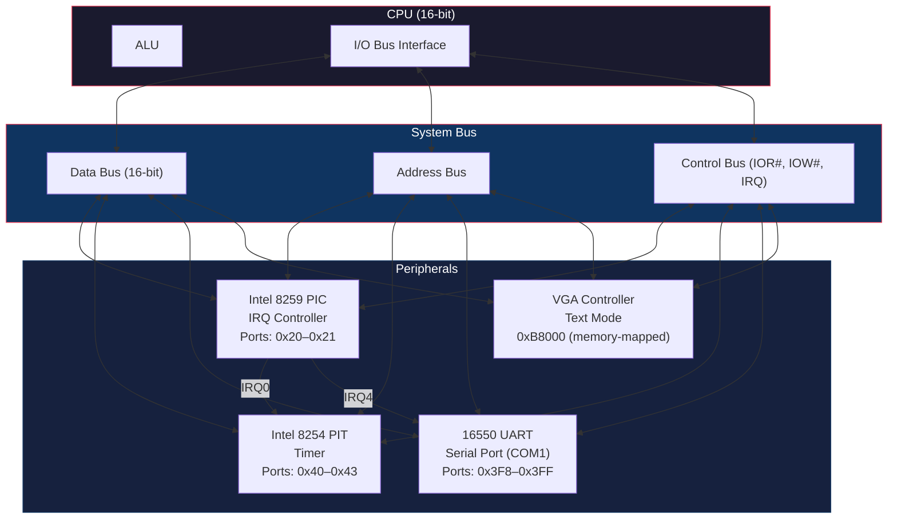

# Peripheral Overview

## Architecture Summary

NovumOS-16bit communicates with hardware peripherals through the x86 I/O port address space using dedicated `IN` and `OUT` instructions. The CPU's address bus connects to all peripheral controllers through a shared system bus. Each peripheral is assigned a fixed range of I/O port addresses and one or more IRQ lines on the Intel 8259 PIC.

## Block Diagram

## I/O Port Address Map

| Peripheral | Port Address Range | Size | Description |
|---|---|---|---|
| PIC (Master) | `0x20` – `0x21` | 2 ports | Interrupt Command Register, Interrupt Data Register |
| PIT | `0x40` – `0x43` | 4 ports | Channel 0–2 data ports + Control register |
| PIC (Slave, reserved) | `0xA0` – `0xA1` | 2 ports | Cascaded 8259 for IRQ8–IRQ15 (unused in NovumOS) |
| COM1 (UART) | `0x3F8` – `0x3FF` | 8 ports | Full 16550 UART register set |
| VGA | `0x3B0` – `0x3DF` | 16+ ports | VGA registers (mode, sequencing, CRT controller) |
| VGA Memory | `0xB8000` – `0xB8F9F` | 4000 bytes | 80×25×2 bytes text buffer |

## IRQ Assignments

NovumOS-16bit uses a simplified IRQ layout on the master 8259 PIC. Only IRQ lines that are actively used are enabled.

| IRQ Line | Peripheral | Function | Vector |
|---|---|---|---|
| IRQ0 | PIT (Channel 0) | System clock tick | 0x08 |
| IRQ1 | Keyboard | Keyboard controller (reserved) | 0x09 |
| IRQ2 | Cascaded PIC | Cascade (unused) | 0x0A |
| IRQ3 | Reserved | Reserved for future use | 0x0B |
| IRQ4 | COM1 (UART) | Serial port data ready | 0x0C |
| IRQ5 | Reserved | Reserved for future use | 0x0D |
| IRQ6 | Reserved | Reserved for future use | 0x0E |
| IRQ7 | Reserved | Reserved for future use | 0x0F |

## IN and OUT Instructions

The x86 architecture provides two instructions for accessing I/O ports:

### IN Instruction — Reading from a Peripheral

The `IN` instruction reads a byte or word from an I/O port address into the accumulator register (`AL` for 8-bit, `AX` for 16-bit). The port address is specified either as an immediate value (0–255) or via the `DX` register (0–65535).

**Operation:**

1. The CPU places the port address on the address bus.
2. The CPU asserts the `IOR#` (I/O Read) control signal.
3. The peripheral places data on the data bus.
4. The CPU reads the data from the data bus into the target register.

**Timing:** The I/O read cycle is slower than a memory read. The CPU automatically inserts wait states. On the original 8086, an I/O read takes approximately 8–10 clock cycles. For 16-bit operations, two consecutive byte reads occur at the same port address.

### OUT Instruction — Writing to a Peripheral

The `OUT` instruction writes a byte or word from the accumulator register to an I/O port address. The port address is specified either as an immediate value (0–255) or via the `DX` register (0–65535).

**Operation:**

1. The CPU places the port address on the address bus.
2. The CPU places the data on the data bus.
3. The CPU asserts the `IOW#` (I/O Write) control signal.
4. The peripheral latches the data from the data bus.

**Timing:** Similar to IN, an I/O write cycle takes approximately 8–10 clock cycles on the original 8086. The peripheral must latch data within the asserted period of `IOW#`.

### Address Decoding

Each peripheral contains an internal address decoder that compares the address bus value against its assigned I/O port range. When a match is detected, the peripheral enables its data bus interface and responds to the control signal. Peripherals that do not match the address remain in a high-impedance state on the data bus.

### Wait States and Timing

16-bit peripherals like the 16550 UART and 8254 PIT can handle data transfers at the full bus speed of NovumOS-16bit. The 8259 PIC may require wait states during read-modify-write operations. The CPU's bus controller automatically handles timing by extending the bus cycle when a peripheral signals that it is not ready.

## Memory-Mapped vs. Port-Mapped I/O

NovumOS-16bit uses two distinct I/O methods:

| Method | Used By | Address Space | Notes |
|---|---|---|---|
| Port-Mapped I/O | PIC, PIT, UART | `0x0000` – `0xFFFF` (I/O space) | Accessed via `IN`/`OUT` instructions |
| Memory-Mapped I/O | VGA text buffer | `0xB8000` – `0xBFFFF` | Accessed via standard `MOV` instructions to memory |

Memory-mapped I/O means the VGA text buffer appears to the CPU as regular memory. A `MOV` instruction to address `0xB8000` writes a character to the top-left cell of the screen. This is faster than port-mapped I/O because it uses the full memory bus and can be optimized with string instructions (`REP MOVSW`).
