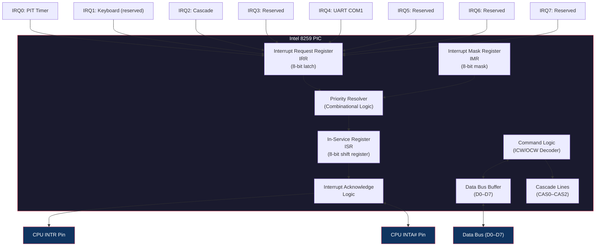
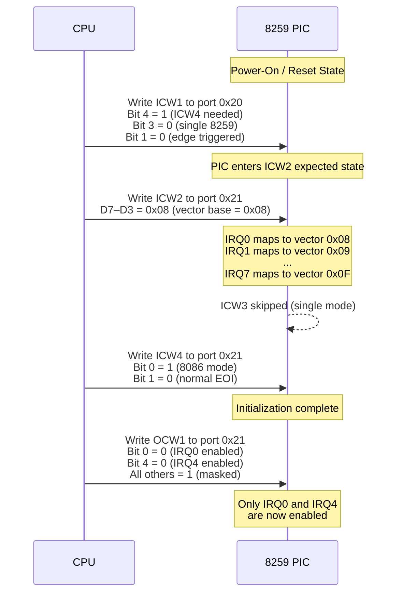
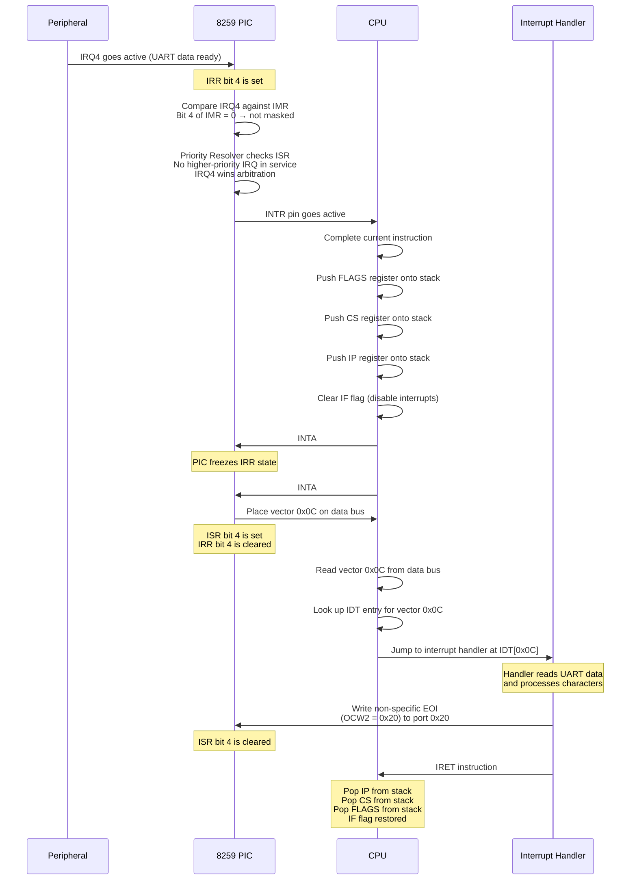

# Programmable Interrupt Controller (8259)

## Overview

The Intel 8259 Programmable Interrupt Controller (PIC) manages hardware interrupt requests from peripherals. It arbitrates multiple IRQ lines, determines priority, and presents a single interrupt signal to the CPU. NovumOS-16bit uses one master 8259 in a simplified configuration with only IRQ0 (PIT timer) and IRQ4 (UART serial) enabled.

## Block Diagram

## Register Table

### Initialization Command Words (ICW)

| Register | Port | Bits | Description |
|---|---|---|---|
| ICW1 | 0x20 | D7–D0 | Initialization command. Bit 4 must be 1. Specifies ICW4 needed, single/cascade mode, interval size, edge/level trigger. |
| ICW2 | 0x21 | D7–D0 | Vector base address. Upper 5 bits (D7–D3) define the interrupt vector number for IRQ0. Lower 3 bits (D2–D0) are overwritten by IRQ number. |
| ICW3 | 0x21 | D7–D0 | Slave program register. Not used in single 8259 mode. Present in initialization sequence for protocol compliance. |
| ICW4 | 0x21 | D7–D0 | Additional control. Bit 0 selects 8086 mode (must be 1 for NovumOS). Bit 1 enables automatic EOI. |

### Operation Command Words (OCW)

| Register | Port | Bits | Description |
|---|---|---|---|
| OCW1 | 0x21 | D7–D0 | Interrupt Mask Register (IMR). Each bit masks (disables) the corresponding IRQ. Bit 0 = IRQ0, Bit 4 = IRQ4. |
| OCW2 | 0x20 | D7–D0 | End of Interrupt (EOI) command. Bits D7–D5 encode the EOI type: non-specific EOI (001), specific EOI (011), rotate-on-non-specific (101), rotate-on-specific (111). |
| OCW3 | 0x20 | D7–D0 | Read register command. Selects which register (IRR or ISR) is read through port 0x20. Also controls poll mode and special mask mode. |

### Internal Registers

| Register | Size | Description |
|---|---|---|
| IRR (Interrupt Request Register) | 8 bits | Latches incoming IRQ signals. Bit N corresponds to IRQN. Set when an IRQ line goes active. |
| ISR (In-Service Register) | 8 bits | Tracks which IRQ is currently being serviced. Set when the CPU acknowledges the interrupt. |
| IMR (Interrupt Mask Register) | 8 bits | Masks IRQ lines. When a bit is set, the corresponding IRQ is blocked from reaching the priority resolver. |

## I/O Port Addresses

| Port Address | Read | Write |
|---|---|---|
| `0x20` | Read IRR or ISR (selected by OCW3) | Write ICW1 or OCW2/OCW3 |
| `0x21` | Read IMR | Write ICW2, ICW3, ICW4, or OCW1 |

**Note:** The PIC determines whether a read or write is ICW or OCW based on a state machine that progresses through initialization stages. Once initialized, all writes to port 0x20 are interpreted as OCW2/OCW3, and all writes to port 0x21 are interpreted as OCW1.

## Initialization Sequence

The 8259 must receive ICW1 through ICW4 in strict order during initialization. The sequence is triggered by writing ICW1 to port 0x20.

### Step-by-Step Process

### Initialization State Machine

The PIC uses a state machine that advances through stages as each ICW is received:

| Stage | Current State | Next Write To | Interpreted As |
|---|---|---|---|
| Reset | A | Port 0x20 with D4=1 | ICW1 |
| Waiting for ICW2 | B | Port 0x21 | ICW2 |
| Waiting for ICW3 | C | Port 0x21 | ICW3 (skipped if single mode) |
| Waiting for ICW4 | D | Port 0x21 | ICW4 |
| Initialized | E | Port 0x20 | OCW2 or OCW3 |
| Initialized | E | Port 0x21 | OCW1 |

## IRQ Handling Flow

When a hardware interrupt occurs, the following sequence executes:

## End of Interrupt (EOI) Process

After the interrupt handler completes servicing the device, it must signal the PIC that the interrupt is finished. This is done by writing an EOI command.

### EOI Types

| EOI Type | OCW2 Value | Bit Pattern | Description |
|---|---|---|---|
| Non-Specific EOI | `0x20` | `0 0 1 0 0 0 0 0` | Clears the highest-priority in-service bit. Used when the handler knows it serviced the only active interrupt. |
| Specific EOI | `0x20 + N` | `0 1 1 L2 L1 L0 0 0` | Clears a specific IRQ level (L2–L0 = IRQ number). Used when multiple IRQs may be in service simultaneously. |
| Rotate-on-Non-Specific EOI | `0xA0` | `1 0 1 0 0 0 0 0` | Clears highest-priority ISR bit and rotates priority so the serviced IRQ becomes lowest priority. |
| Rotate-on-Specific EOI | `0xE0 + N` | `1 1 1 L2 L1 L0 0 0` | Clears specific ISR bit and rotates priority. |

### EOI in NovumOS-16bit

NovumOS-16bit uses the non-specific EOI (`0x20`) for simplicity. Since only one IRQ is typically serviced at a time (IRQ0 for timer ticks or IRQ4 for UART data), the non-specific EOI clears the correct ISR bit without needing to specify which IRQ was serviced.

The EOI write sequence:

1. The handler completes its work (e.g., reads UART data, increments tick counter).
2. The handler writes `0x20` to I/O port `0x20`.
3. The PIC clears the highest-priority bit in the ISR.
4. If another IRQ is pending and unmasked, the PIC asserts INTR again.

### Critical Timing Note

The EOI **must** be sent before the `IRET` instruction. If the handler returns without sending EOI, the PIC keeps the ISR bit set, which prevents the same IRQ (and all lower-priority IRQs) from being serviced again. This is a common source of system hangs.
