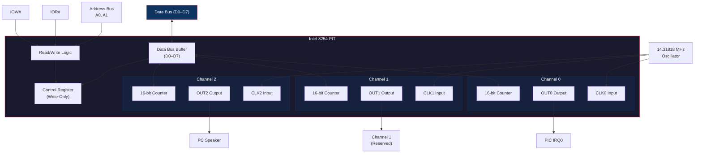
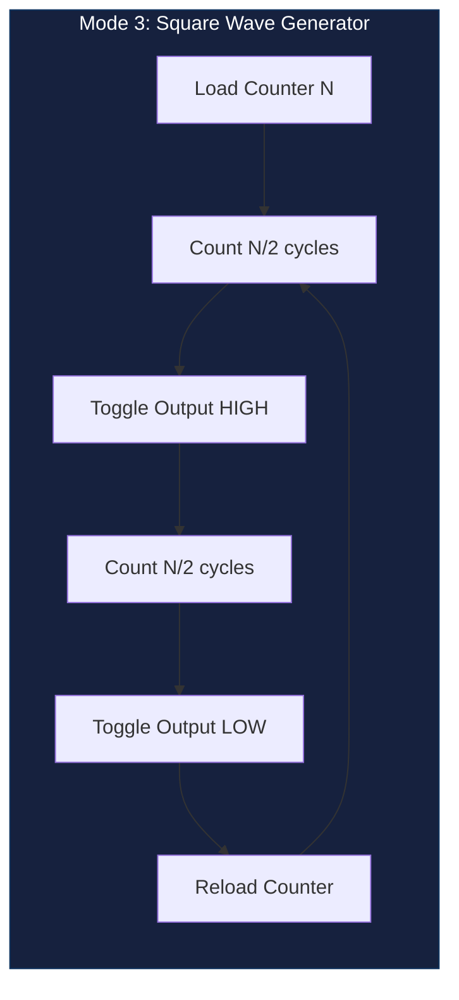

# Programmable Interval Timer (8254)

## Overview

The Intel 8254 Programmable Interval Timer (PIT) provides three independent 16-bit countdown channels. Each channel counts down from a loaded value and generates an output signal when the count reaches zero. NovumOS-16bit uses Channel 0 for the system clock tick (driving IRQ0) and Channel 2 for the PC speaker tone generator.

## Block Diagram

## Three Channels

### Channel 0 — System Clock

| Property | Value |
|---|---|
| Port Addresses | `0x40` (data), `0x43` (control) |
| Clock Source | 1.193182 MHz (divided from 14.31818 MHz oscillator) |
| Output | Connected to PIC IRQ0 |
| Default Count | 11932 (yields ~100 Hz tick) |
| Purpose | Drives the system clock interrupt for scheduling and timekeeping |

**Frequency Calculation:** The PIT oscillator runs at 14.31818 MHz. Divided by 12, this yields approximately 1.193182 MHz. To generate a 100 Hz tick, the counter is loaded with `1193182 / 100 = 11932`. Each tick fires IRQ0, which the PIC translates to interrupt vector 0x08.

### Channel 1 — Reserved

| Property | Value |
|---|---|
| Port Addresses | `0x41` (data), `0x43` (control) |
| Clock Source | 1.193182 MHz |
| Output | Reserved for future use (e.g., DRAM refresh) |
| Purpose | Available for expansion in NovumOS-16bit |

### Channel 2 — PC Speaker

| Property | Value |
|---|---|
| Port Addresses | `0x42` (data), `0x43` (control) |
| Clock Source | 1.193182 MHz |
| Output | Connected to PC speaker gate and amplifier |
| Purpose | Generates audible tones at specified frequencies |

**Frequency Selection:** Loading a count of `N` into Channel 2 produces a tone at frequency `1193182 / N` Hz. For example, loading 11932 produces a 100 Hz tone, loading 5966 produces a 200 Hz tone, and loading 2932 produces a 407 Hz tone (approximately middle C).

## I/O Port Addresses

| Port Address | Direction | Description |
|---|---|---|
| `0x40` | Read/Write | Channel 0 count register |
| `0x41` | Read/Write | Channel 1 count register |
| `0x42` | Read/Write | Channel 2 count register |
| `0x43` | Write-Only | Control register (mode and access selection) |

**Note:** The 8254's data ports can be both read and written. Reading returns the current counter value (or latch value). Writing loads a new count. The control register at port 0x43 is write-only; reading from it returns undefined data.

## Operating Modes

The 8254 supports six operating modes per channel. NovumOS-16bit uses Mode 3 for Channel 0 and Mode 3 for Channel 2.

| Mode | Name | Description | Output Behavior |
|---|---|---|---|
| 0 | Interrupt on Terminal Count | Counts down from loaded value. Output goes low when count reaches 0. | Low after terminal count |
| 1 | Programmable One-Shot | Triggered by GATE input. Output goes low for one clock cycle after count reaches 0. | One-shot pulse |
| 2 | Rate Generator | Counts down. Output goes low for one clock cycle when count reaches 0, then reloads. | Continuous train at frequency `f_clk / N` |
| 3 | Square Wave Generator | Counts down in halves. Output toggles at half the frequency. | 50% duty cycle square wave |
| 4 | Software Triggered Strobe | Counts down. Output goes low for one clock cycle at terminal count. | Single strobe pulse |
| 5 | Hardware Triggered Strobe | Triggered by GATE input. Counts down and generates one strobe pulse. | Triggered single pulse |

### Mode 3 Detail — Square Wave Generator (Used by Channel 0 and 2)

In Mode 3, the counter counts down by 2 each clock cycle. When the count reaches zero, the output toggles and the counter reloads. This produces a symmetrical square wave with exactly 50% duty cycle.

For Channel 0 with count 11932: the output toggles every 5966 clocks, producing a 100 Hz square wave that drives IRQ0.

## Initialization Sequence

```mermaid
sequenceDiagram
    participant CPU as CPU
    participant PIT as 8254 PIT
    participant PIC as 8259 PIC

    Note over CPU,PIT: System Boot — PIT Initialization

    rect rgb(20, 30, 50)
    Note over CPU,PIT: Step 1: Configure Channel 0 for system clock

    CPU->>PIT: Write 0x36 to port 0x43<br/>(Channel 0, lobyte/hibyte, Mode 3, binary)
    Note over PIT: Control register latched<br/>Next two writes go to Channel 0

    CPU->>PIT: Write 0x34 to port 0x40<br/>(Low byte of count = 0x34 = 52)
    Note over PIT: Low byte latched in<br/>Channel 0 count register

    CPU->>PIT: Write 0x2E to port 0x40<br/>(High byte of count = 0x2E = 46)
    Note over PIT: High byte latched<br/>Count = 0x2E34 = 11828<br/>PIT begins counting down<br/>OUT0 generates ~100 Hz
    end

    rect rgb(20, 30, 50)
    Note over CPU,PIT: Step 2: Configure Channel 2 for speaker

    CPU->>PIT: Write 0xB6 to port 0x43<br/>(Channel 2, lobyte/hibyte, Mode 3, binary)
    Note over PIT: Control register latched<br/>Next two writes go to Channel 2
    end

    rect rgb(20, 30, 50)
    Note over CPU,PIT: Step 3: Enable IRQ0 on PIC

    CPU->>PIC: Write 0xFE to port 0x21<br/>(Mask all IRQs except IRQ0)
    Note over PIC: IMR = 0xFE<br/>Only IRQ0 (PIT) is enabled
    end
```

### Control Register Bit Fields

The control word written to port 0x43 has the following format:

| Bit | Name | Values |
|---|---|---|
| D7–D6 | SC1–SC0 (Select Channel) | 00 = Channel 0, 01 = Channel 1, 10 = Channel 2 |
| D5–D4 | RW1–RW0 (Read/Write) | 01 = Lobyte only, 10 = Hibyte only, 11 = Lobyte then Hibyte |
| D3–D1 | M2–M0 (Mode) | 000–101 = Modes 0–5 |
| D0 | BCD | 0 = Binary counter (16-bit), 1 = BCD counter (4 decades) |

**Common Control Words for NovumOS-16bit:**

| Control Word | Hex | Meaning |
|---|---|---|
| Channel 0, lobyte/hibyte, Mode 3, binary | `0x36` | System clock square wave |
| Channel 2, lobyte/hibyte, Mode 3, binary | `0xB6` | Speaker tone generator |
| Channel 0, lobyte only, Mode 0, binary | `0x30` | One-shot timer (if needed) |

## GATE and OUT Signals

Each channel has a GATE input and an OUT output. The GATE input enables or disables counting. The OUT output reflects the counter state based on the selected mode.

| Channel | GATE Source | OUT Destination |
|---|---|---|
| Channel 0 | Tied HIGH (always enabled) | PIC IRQ0 input |
| Channel 1 | Tied HIGH (always enabled) | Reserved (available) |
| Channel 2 | Port 0x61 bit 0 (speaker gate) | PC speaker amplifier via port 0x61 bit 1 |

**Port 0x61 Control:** Bits 0 and 1 of port 0x61 control the speaker:

| Bit | Function |
|---|---|
| Bit 0 | GATE2 — Enables/disables Channel 2 counting |
| Bit 1 | SPEAKER — Connects/disconnects Channel 2 OUT to speaker |

To enable the speaker: set both bits 0 and 1 of port 0x61 to 1. To disable: clear both bits.
