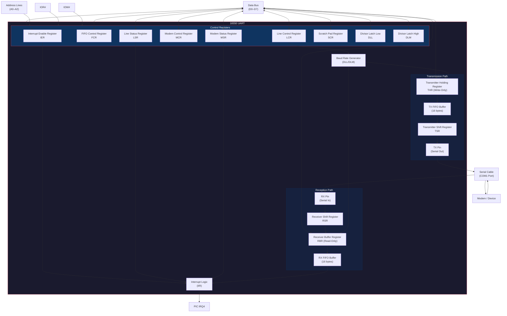
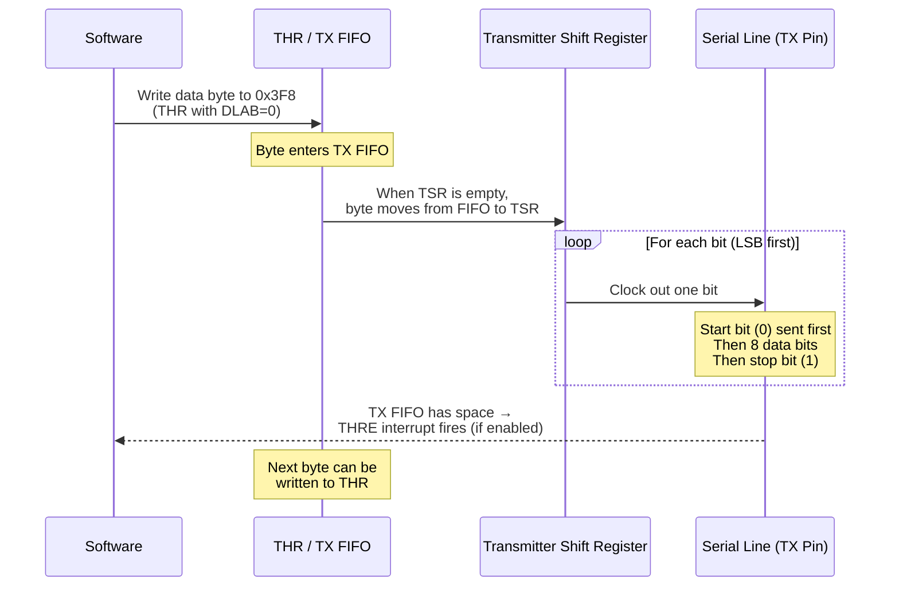
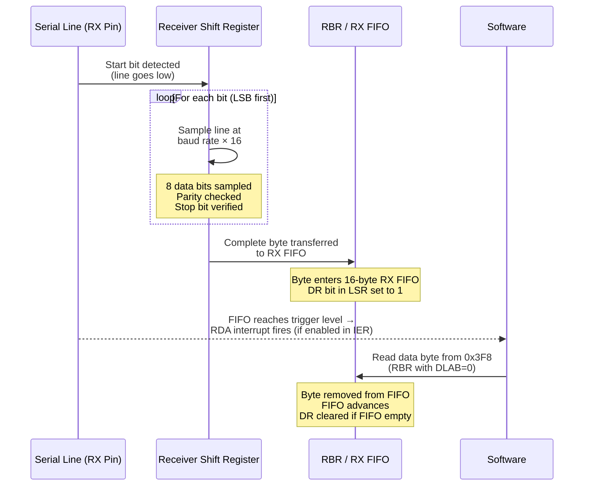
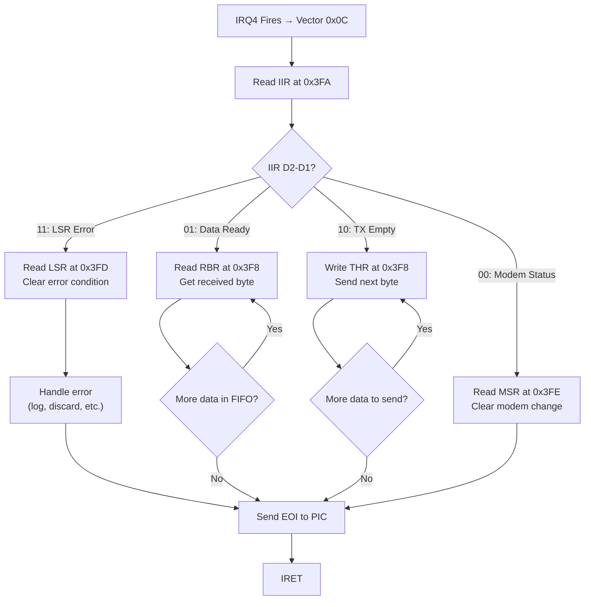

# UART (16550)

## Overview

The 16550 Universal Asynchronous Receiver/Transmitter (UART) provides serial communication through the COM1 port. It features a 16-byte FIFO buffer for both transmission and reception, hardware flow control, and modem control signals. NovumOS-16bit uses COM1 at I/O address `0x3F8` with IRQ4 for interrupt-driven data reception.

## Block Diagram

## Register Table

The 16550 uses three address lines (A0–A2) to select among its registers. Access to certain registers changes when the Divisor Latch Access Bit (DLAB) in LCR is set.

| Port Address | DLAB=0 Read | DLAB=0 Write | DLAB=1 Read | DLAB=1 Write |
|---|---|---|---|---|
| `0x3F8` | RBR (Receive Buffer) | THR (Transmit Holding) | DLL (Divisor Low) | DLL (Divisor Low) |
| `0x3F9` | IER (Interrupt Enable) | IER (Interrupt Enable) | DLM (Divisor High) | DLM (Divisor High) |
| `0x3FA` | IIR (Interrupt ID, Read-Only) | FCR (FIFO Control, Write-Only) | IIR | FCR |
| `0x3FB` | LCR (Line Control) | LCR (Line Control) | LCR | LCR |
| `0x3FC` | MCR (Modem Control) | MCR (Modem Control) | MCR | MCR |
| `0x3FD` | LSR (Line Status) | LSR (Line Status) | LSR | LSR |
| `0x3FE` | MSR (Modem Status) | MSR (Modem Status) | MSR | MSR |
| `0x3FF` | SCR (Scratch Pad) | SCR (Scratch Pad) | SCR | SCR |

### Register Descriptions

#### RBR — Receiver Buffer Register (0x3F8, Read, DLAB=0)

| Bit | Name | Description |
|---|---|---|
| D7–D0 | DATA | Received data byte. Contains the oldest unread character from the RX FIFO. Reading this register advances the FIFO. |

#### THR — Transmitter Holding Register (0x3F8, Write, DLAB=0)

| Bit | Name | Description |
|---|---|---|
| D7–D0 | DATA | Data byte to transmit. Writing to this register places the byte into the TX FIFO. The UART transmits it when the TSR is empty. |

#### IER — Interrupt Enable Register (0x3F9, Read/Write, DLAB=0)

| Bit | Name | Description |
|---|---|---|
| D0 | ERBFI | Enable Received Data Available Interrupt. When set, IRQ4 fires when data is available in the RX FIFO. |
| D1 | ETBEI | Enable Transmitter Holding Register Empty Interrupt. When set, IRQ4 fires when the TX FIFO is empty and ready for new data. |
| D2 | ELBI | Enable Receiver Line Status Interrupt. When set, IRQ4 fires on overrun, parity, framing, or break errors. |
| D3 | EDSSI | Enable Modem Status Interrupt. When set, IRQ4 fires on modem status changes (CTS, DSR, DCD, RI). |
| D7–D4 | Reserved | Always 0. |

#### FCR — FIFO Control Register (0x3FA, Write-Only, DLAB=X)

| Bit | Name | Description |
|---|---|---|
| D0 | FIFOE | FIFO Enable. 1 = Enable FIFO mode, 0 = Disable (16450 compatibility mode). |
| D1 | RFIFOR | Receiver FIFO Reset. 1 = Clear RX FIFO contents and counter. Self-clearing. |
| D2 | XFIFOR | Transmitter FIFO Reset. 1 = Clear TX FIFO contents and counter. Self-clearing. |
| D5–D4 | DMA | DMA Mode Select. 00 = Use mode 0 (no DMA), 01 = Use mode 1. |
| D7–D6 | RT | Receiver Trigger Level. Controls how many bytes must be in RX FIFO before an interrupt fires. |

| RT Bits | Trigger Level |
|---|---|
| 00 | 1 byte |
| 01 | 4 bytes |
| 10 | 8 bytes |
| 11 | 14 bytes |

#### LCR — Line Control Register (0x3FB, Read/Write)

| Bit | Name | Description |
|---|---|---|
| D1–D0 | WLS | Word Length Select. 00 = 5 bits, 01 = 6 bits, 10 = 7 bits, 11 = 8 bits. |
| D2 | STB | Number of Stop Bits. 0 = 1 stop bit, 1 = 1.5 or 2 stop bits (depending on word length). |
| D4–D3 | PEN/EPS | Parity Enable and Type. 00 = No parity, 01 = Odd parity, 10 = No parity, 11 = Even parity. |
| D5 | STKP | Stick Parity. When enabled with PEN, transmits and checks for constant parity. |
| D6 | BRK | Break Control. 1 = Forces TX low (break condition). Used for attention signaling. |
| D7 | DLAB | Divisor Latch Access Bit. 1 = Ports 0x3F8/0x3F9 access DLL/DLM instead of RBR/THR/IER. |

#### MCR — Modem Control Register (0x3FC, Read/Write)

| Bit | Name | Description |
|---|---|---|
| D0 | DTR | Data Terminal Ready. 1 = Assert DTR signal to modem. |
| D1 | RTS | Request To Send. 1 = Assert RTS signal to modem. |
| D2 | OUT1 | General purpose output (reserved). |
| D3 | OUT2 | General purpose output. On some systems, enables IRQ to PIC. |
| D4 | Loop | Loopback Mode. 1 = UART internally loops TX to RX for diagnostics. |

#### LSR — Line Status Register (0x3FD, Read-Only)

| Bit | Name | Description |
|---|---|---|
| D0 | DR | Data Ready. 1 = At least one byte is available in the RX FIFO. |
| D1 | OE | Overrun Error. 1 = Data arrived but RX FIFO was full (data lost). |
| D2 | PE | Parity Error. 1 = Received byte has incorrect parity. |
| D3 | FE | Framing Error. 1 = Received byte has no valid stop bit. |
| D4 | BI | Break Interrupt. 1 = Break condition detected (continuous low for > 1 frame). |
| D5 | THRE | Transmitter Holding Register Empty. 1 = TX FIFO is empty and ready for new data. |
| D6 | TEMT | Transmitter Empty. 1 = Both TX FIFO and shift register are empty. |
| D7 | FIFOE | FIFO Error. 1 = At least one byte in FIFO has a parity, framing, or break error. |

#### MSR — Modem Status Register (0x3FE, Read-Only)

| Bit | Name | Description |
|---|---|---|
| D0 | DCTS | Delta Clear To Send. Changed since last read. |
| D1 | DDSR | Delta Data Set Ready. Changed since last read. |
| D2 | TERI | Trailing Edge Ring Indicator. RI went from low to high. |
| D3 | DDCD | Delta Data Carrier Detect. DCD changed since last read. |
| D4 | CTS | Clear To Send. Modem ready to receive data. |
| D5 | DSR | Data Set Ready. Modem is on and connected. |
| D6 | RI | Ring Indicator. Modem detects incoming call. |
| D7 | DCD | Data Carrier Detect. Modem has established carrier. |

#### SCR — Scratch Pad Register (0x3FF, Read/Write)

| Bit | Name | Description |
|---|---|---|
| D7–D0 | SCRATCH | General-purpose storage. Not used by hardware. Software can store one byte here. |

## I/O Port Addresses

| Port | Address | Description |
|---|---|---|
| COM1 | `0x3F8` – `0x3FF` | Primary serial port (used by NovumOS) |
| COM2 | `0x2F8` – `0x2FF` | Secondary serial port (reserved) |
| COM3 | `0x3E8` – `0x3EF` | Third serial port (reserved) |
| COM4 | `0x2E8` – `0x2EF` | Fourth serial port (reserved) |

NovumOS-16bit uses COM1 only. The other COM ports are reserved for future expansion.

## Baud Rate Configuration

Baud rate is set by writing a 16-bit divisor to the Divisor Latch registers (DLL at 0x3F8 and DLM at 0x3F9) with DLAB=1 in LCR.

**Formula:** `Baud Rate = 1,843,200 / Divisor`

The 1.8432 MHz crystal oscillator is the standard UART clock. It is specifically chosen to be evenly divisible by common baud rates.

### Common Baud Rates

| Baud Rate | Divisor (Decimal) | Divisor (Hex) | DLM | DLL |
|---|---|---|---|---|
| 50 | 36864 | 0x9000 | 0x90 | 0x00 |
| 300 | 6144 | 0x1800 | 0x18 | 0x00 |
| 1200 | 1536 | 0x0600 | 0x06 | 0x00 |
| 2400 | 768 | 0x0300 | 0x03 | 0x00 |
| 4800 | 384 | 0x0180 | 0x01 | 0x80 |
| 9600 | 192 | 0x00C0 | 0x00 | 0xC0 |
| 19200 | 96 | 0x0060 | 0x00 | 0x60 |
| 38400 | 48 | 0x0030 | 0x00 | 0x30 |
| 57600 | 32 | 0x0020 | 0x00 | 0x20 |
| 115200 | 16 | 0x0010 | 0x00 | 0x10 |

**Default for NovumOS-16bit:** 9600 baud, 8 data bits, no parity, 1 stop bit (9600 8N1).

## Interrupt Handling

The 16550 generates interrupts on IRQ4 (PIC interrupt vector 0x0C) when specific conditions are met. The interrupt identification is read from the IIR register.

### Interrupt Identification Register (IIR) — Port 0x3FA, Read-Only

| Bit | Name | Description |
|---|---|---|
| D0 | IP | Interrupt Pending. 0 = Interrupt pending, 1 = No interrupt. |
| D2–D1 | IID | Interrupt Identification. Identifies the highest-priority pending interrupt. |
| D3 | (reserved) | Always 0 in 16550. |
| D7–D6 | FIFOE | FIFOs Enabled. Reflects FCR bit 0. |

### Interrupt Priority and Identification

| Priority | IID (D2–D1) | IER Bit | Source | Description |
|---|---|---|---|---|
| Highest | 11 | ELBI (D2) | LSR | Line status error (overrun, parity, framing, break) |
| | 01 | ERBFI (D0) | RX FIFO | Data available in receive FIFO |
| | 10 | ETBEI (D1) | TX FIFO | Transmitter holding register empty |
| Lowest | 00 | EDSSI (D3) | MSR | Modem status change |

### Interrupt Clearing

Each interrupt source is cleared by reading or writing a specific register:

| Interrupt Source | Cleared By |
|---|---|
| Data Available | Reading RBR when FIFO is below trigger level |
| Transmitter Empty | Writing THR or reading IIR |
| Line Status | Reading LSR |
| Modem Status | Reading MSR |

## Data Transmission/Reception Flow

### Transmission Flow

**Flow Description:**
1. Software writes a byte to the THR (port 0x3F8, DLAB=0).
2. The byte enters the 16-byte TX FIFO.
3. When the TSR is empty, the next byte transfers from FIFO to TSR.
4. The TSR shifts out each bit serially: start bit (low), 8 data bits (LSB first), stop bit (high).
5. When the TX FIFO has room for another byte, the THRE interrupt fires (if enabled in IER).

### Reception Flow

**Flow Description:**
1. The RSR detects a start bit (line transitions from high to low).
2. The RSR samples the line 16 times per bit period for accurate centering.
3. After receiving 8 data bits, parity and stop bits are checked.
4. The complete byte is placed into the 16-byte RX FIFO.
5. If the FIFO reaches the configured trigger level (set in FCR), the RDA interrupt fires on IRQ4.
6. Software reads the byte from the RBR (port 0x3F8, DLAB=0), which advances the FIFO.

### Interrupt Service Routine Flow

**Key Point:** The ISR must check the IIR register to determine which interrupt source fired. The 16550 latches the highest-priority pending interrupt in the IIR, so the ISR reads IIR once and handles the specific condition. If multiple conditions exist, the ISR will be called again after sending EOI because the lower-priority conditions still generate interrupts.
