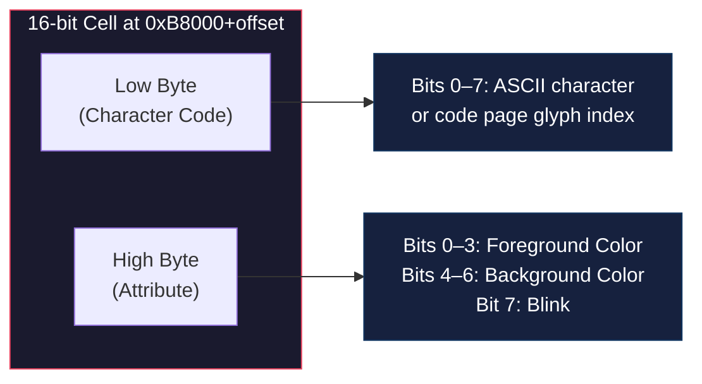
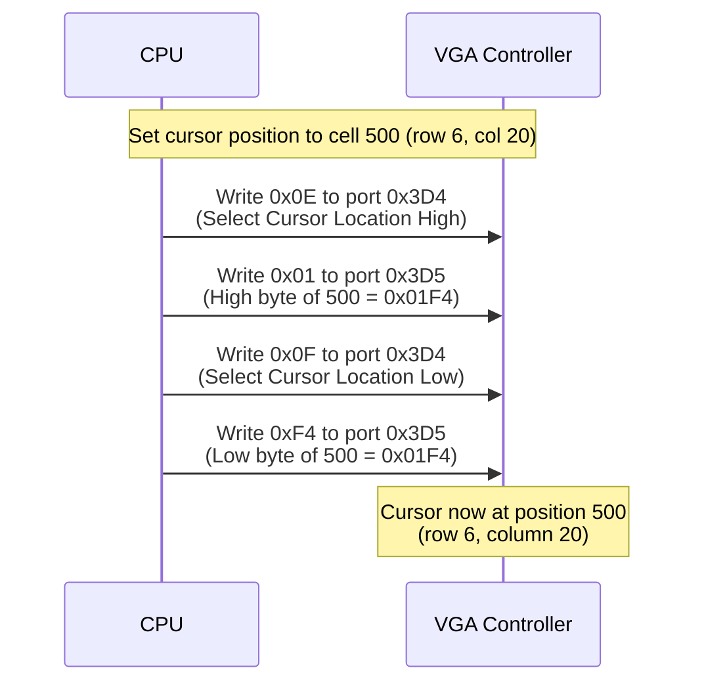
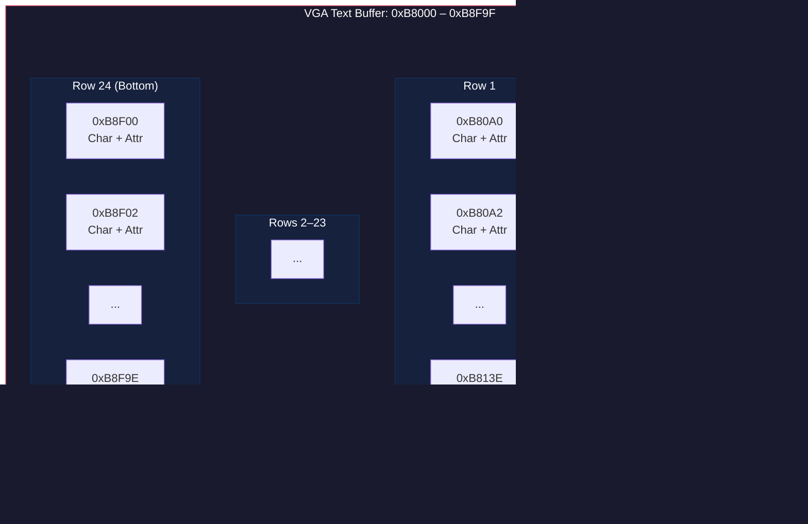

# VGA Text Mode

## Overview

NovumOS-16bit uses the VGA adapter in text mode. In this mode, the VGA hardware automatically renders characters from a font stored in ROM, converting character codes and attribute bytes into pixels on screen. The CPU does not need to draw individual pixels — it only writes character/attribute pairs to video memory. The VGA controller scans this memory at approximately 60 Hz and outputs the video signal to the display.

## Memory-Mapped Text Buffer

The VGA text buffer is mapped at physical address `0xB8000`. Each screen cell occupies 2 bytes (16 bits): one byte for the character code and one byte for the color attribute.

### Buffer Layout

| Property | Value |
|---|---|
| Base Address | `0xB8000` |
| Cell Size | 2 bytes (character + attribute) |
| Columns | 80 |
| Rows | 25 |
| Total Buffer Size | `80 × 25 × 2 = 4000 bytes` |
| Maximum Address | `0xB8000 + 3999 = 0xB8F9F` |

### Address Calculation

The address of any cell on screen is computed as:

```
address = 0xB8000 + (row × 80 + column) × 2
```

| Cell Position | Row | Column | Offset | Physical Address |
|---|---|---|---|---|
| Top-left | 0 | 0 | 0 | `0xB8000` |
| Top-right | 0 | 79 | 158 | `0xB809E` |
| Bottom-left | 24 | 0 | 3840 | `0xB8F00` |
| Bottom-right | 24 | 79 | 3998 | `0xB8F9E` |

### Cell Format (16 Bits)

Each 16-bit cell is organized as:



**Note:** On the x86, the character byte is at the lower address and the attribute byte is at the higher address. For a cell at address `A`: byte `A` is the character, byte `A+1` is the attribute.

## Color Attributes

The attribute byte controls the foreground color, background color, and blinking of a character. It uses 4 bits for foreground (16 colors), 3 bits for background (8 colors), and 1 bit for blink.

### Attribute Byte Format

| Bit | Name | Description |
|---|---|---|
| D0 | Foreground Blue | Blue channel of foreground color |
| D1 | Foreground Green | Green channel of foreground color |
| D2 | Foreground Red | Red channel of foreground color |
| D3 | Foreground Intensity | Brightness of foreground color (0=dim, 1=bright) |
| D4 | Background Blue | Blue channel of background color |
| D5 | Background Green | Green channel of background color |
| D6 | Background Red | Red channel of background color |
| D7 | Blink | 1 = Character blinks at ~1.8 Hz, 0 = Normal |

### Color Table

| Foreground Value (D3–D0) | Background Value (D6–D4) | Color Name |
|---|---|---|
| 0x0 | 0x0 | Black |
| 0x1 | 0x1 | Blue |
| 0x2 | 0x2 | Green |
| 0x3 | 0x3 | Cyan |
| 0x4 | 0x4 | Red |
| 0x5 | 0x5 | Magenta |
| 0x6 | 0x6 | Brown (dark yellow) |
| 0x7 | 0x7 | Light Gray (white) |
| 0x8 | — | Dark Gray (bright black) |
| 0x9 | — | Light Blue |
| 0xA | — | Light Green |
| 0xB | — | Light Cyan |
| 0xC | — | Light Red |
| 0xD | — | Light Magenta |
| 0xE | — | Yellow |
| 0xF | — | Bright White |

### Common Attribute Values

| Attribute Byte (Hex) | Foreground | Background | Effect |
|---|---|---|---|
| `0x07` | Light Gray (7) | Black (0) | Default text (normal) |
| `0x0F` | Bright White (F) | Black (0) | Bright/normal text |
| `0x70` | Black (0) | Light Gray (7) | Inverted (highlighted) |
| `0x4F` | Bright White (F) | Red (4) | Error message |
| `0x2F` | Bright White (F) | Green (2) | Success message |
| `0x1F` | Bright White (F) | Blue (1) | Information |
| `0x5F` | Bright White (F) | Magenta (5) | Warning |
| `0x87` | Light Gray (7) | Black (0) | Blinking text |

**Note:** With blink enabled (D7=1), the background color alternates between the specified color and black at approximately 1.8 Hz. Some VGA adapters support enabling 16 background colors by disabling blink via the VGA Attribute Controller register. NovumOS-16bit uses the default blink behavior.

## VGA Registers for Cursor Control

The VGA adapter has dedicated registers that control the hardware cursor position and appearance. These are accessed through the CRT Controller registers at I/O ports `0x3D4` (index) and `0x3D5` (data).

### CRT Controller Register Index Table

| Index | Register Name | Description |
|---|---|---|
| 0x09 | Maximum Scan Line | Maximum scan line per character cell (typically 15 for 16-pixel-high fonts) |
| 0x0A | Cursor Start | Cursor start scan line and cursor mode (bit 5 = disable) |
| 0x0B | Cursor End | Cursor end scan line |
| 0x0E | Cursor Location High | High byte of cursor position (offset into video memory, divided by 2) |
| 0x0F | Cursor Location Low | Low byte of cursor position |

### Cursor Position Registers

The cursor position is a 16-bit value representing the cell number (not byte offset) in the text buffer.

| Register | Port | Bits | Description |
|---|---|---|---|
| Cursor Location High | 0x3D4 (index 0x0E) | D7–D0 | Bits 15–8 of cursor position |
| Cursor Location Low | 0x3D4 (index 0x0F) | D7–D0 | Bits 7–0 of cursor position |

**Cursor Position Calculation:** `position = row × 80 + column`. For example, row 12, column 40 = `12 × 80 + 40 = 1000 = 0x03E8`. Write `0x03` to index 0x0E and `0xE8` to index 0x0F.

### Cursor Appearance Registers

| Register | Port | Bits | Description |
|---|---|---|---|
| Cursor Start | 0x3D4 (index 0x0A) | D4–D0 | Scan line where cursor begins within character cell |
| Cursor Start | 0x3D4 (index 0x0A) | D5 | Cursor mode: 0 = Normal, 1 = Hidden |
| Cursor End | 0x3D4 (index 0x0B) | D4–D0 | Scan line where cursor ends within character cell |
| Cursor End | 0x3D4 (index 0x0B) | D6–D5 | Skew: number of character clocks to delay cursor display |

**Common Cursor Configurations:**

| Style | Cursor Start | Cursor End | Description |
|---|---|---|---|
| Underline | 14 | 15 | Thin line at bottom of character cell |
| Block | 0 | 15 | Full-height block cursor |
| Half Block | 8 | 15 | Bottom half of character cell |
| Hidden | 0x20 | 0x00 | Bit 5 set in Cursor Start disables cursor |

### VGA Register Access Pattern

To write a VGA register, the index is sent to the index port and the data is sent to the data port:



**Important:** The VGA controller may be in the middle of a video refresh cycle when registers are written. Always read back and verify critical registers, or wait for vertical retrace (via VGA Status Register at port 0x3DA, bit 3) before making changes.

## Screen Buffer Layout

### Text Mode Memory Map



### Buffer Organization Details

| Property | Value |
|---|---|
| Total Cells | 2000 (80 columns × 25 rows) |
| Bytes per Cell | 2 |
| Total Bytes | 4000 |
| Start Address | `0xB8000` |
| End Address | `0xB8F9F` |

### Row Byte Offsets

| Row | Start Address | Byte Offset from Base |
|---|---|---|
| 0 | `0xB8000` | 0 |
| 1 | `0xB80A0` | 160 |
| 2 | `0xB8140` | 320 |
| 3 | `0xB81E0` | 480 |
| ... | ... | `row × 160` |
| 24 | `0xB8F00` | 3840 |

### Scrolling

When the screen needs to scroll, the entire content is shifted upward in memory. Row 1 moves to Row 0, Row 2 moves to Row 1, and so on. Row 24 is cleared (filled with space characters `0x20` with the default attribute `0x07`). This can be done by:

1. Copying bytes `0xB80A0` through `0xB8F9F` to `0xB8000` through `0xB8EFE` (1920 cells × 2 bytes = 3840 bytes).
2. Filling bytes `0xB8F00` through `0xB8F9F` with `0x0720` (space with default attribute).

This is the standard VGA text mode scrolling approach used by NovumOS-16bit.

### VGA Port Summary

| Port Address | Direction | Description |
|---|---|---|
| `0x3B0` – `0x3B3` | — | VGA adapter select (MDA/CGA legacy, not used in NovumOS) |
| `0x3B4` | Write | CRT Controller Index (MDA/CGA) |
| `0x3B5` | Read/Write | CRT Controller Data (MDA/CGA) |
| `0x3BA` | Read | Input Status Register 1 (MDA/CGA) |
| `0x3D4` | Write | CRT Controller Index (VGA color mode) |
| `0x3D5` | Read/Write | CRT Controller Data (VGA color mode) |
| `0x3DA` | Read | Input Status Register 1 (VGA color mode) |
| `0x3C0` | Write | Attribute Controller Index/Data |
| `0x3C4` | Write | Sequencer Index |
| `0x3C5` | Read/Write | Sequencer Data |
| `0x3CE` | Write | Graphics Controller Index |
| `0x3CF` | Read/Write | Graphics Controller Data |

**Note:** NovumOS-16bit targets VGA in color mode. The 0x3D4/0x3D5 ports are used for CRT controller access. The 0x3B4/0x3B5 ports are for MDA/CGA adapters and are not used.
