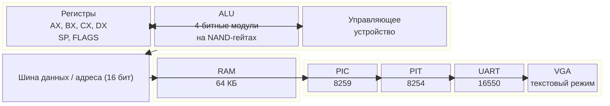

# NovumOS-16bit — Главная страница

> 16-битная операционная система для самодельного процессора на TTL-логике (К155ЛА / 7400 series)

[English version](../en/README.md)

---

## Описание проекта

NovumOS-16bit — это экспериментальная операционная система, разрабатываемая для самодельного 16-битного процессора, собранного из дискретных TTL-микросхем серии К155ЛА (советский аналог 7400). Процессор построен по RISC-архитектуре с гибридным форматом инструкций (16/32 бит) и использует ALU на базе NAND-гейтов, организованную в 4-битные модули.

Проект демонстрирует возможность построения полноценной вычислительной системы на дискретной логике — от процессора до операционной системы.

---

## Навигация по документации

| Раздел | Описание |
|--------|----------|
| [Архитектура — Обзор](architecture/overview.md) | Блок-схема, описание блоков, принцип NAND-ALU |
| [Архитектура — Регистры](architecture/registers.md) | Все регистры, их назначение, кодировка |
| [Архитектура — Цикл выполнения](architecture/execution-cycle.md) | Fetch → Decode → Execute → Writeback |
| [Архитектура — Карта памяти](architecture/memory-map.md) | 64 КБ пространства, сегменты, I/O |

---

## Характеристики процессора

| Параметр | Значение |
|----------|----------|
| Разрядность | 16 бит |
| ISA | RISC-подобная, гибридный формат 16/32 бит |
| Адресуемая память | 64 КБ (16 адресных линий) |
| Регистры общего назначения | 4 × 16 бит (AX, BX, CX, DX) |
| Специальные регистры | IP/PC, SP, FLAGS |
| ALU | 4-битные модули на NAND-гейтах |
| Тактовая частота | Зависит от реализации (рекомендация: ≤ 1 МГц) |
| Команды | MOV, ADD, SUB, AND, OR, XOR, SHL, SHR, JMP, JZ, JNZ, IN, OUT |
| Рекомендуемые добавления | CALL, RET, PUSH, POP, INT, HLT |

### Системные периферийные устройства

| Устройство | Микросхема | Назначение |
|------------|-----------|------------|
| PIC | 8259 | Контроллер прерываний |
| PIT | 8254 | Таймер/счётчик |
| UART | 16550 | Последовательный порт |
| VGA | — | Текстовый режим (640×400, 80×25) |

---

## Архитектура — Блок-схема

---

## Принцип работы

1. **Загрузка**: При включении процессор начинает выполнять инструкции с адреса `0x0000`
2. **Декодирование**: Управляющее устройство считывает инструкцию из памяти и декодирует её
3. **Выполнение**: ALU выполняет арифметико-логические операции над данными из регистров
4. **Запись**: Результат записывается обратно в регистр или память
5. **Переход**: IP/PC автоматически увеличивается на размер инструкции (1 или 2 слова)

---

## Версии документации

| Язык | Ссылка |
|------|--------|
| Русский | Текущая версия (docs/ru/) |
| English | [English version](../en/README.md) |

---

## Статус проекта

- [x] Проектирование архитектуры процессора
- [x] Определение ISA
- [x] Проектирование NAND-ALU
- [ ] Разработка схемы процессора
- [ ] Прошивка FPGA / сборка на макетной плате
- [ ] Базовый драйвер VGA
- [ ] Загрузчик (bootloader)
- [ ] Ядро ОС (monolithic / microkernel)
- [ ] Планировщик задач
- [ ] Файловая система
