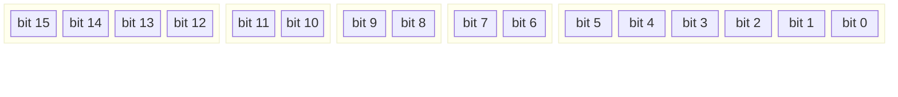
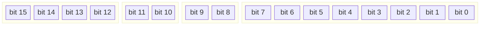
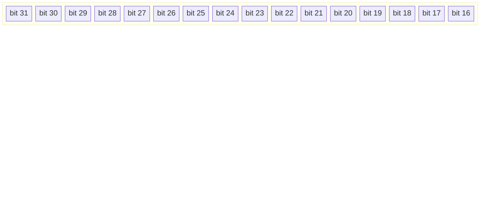
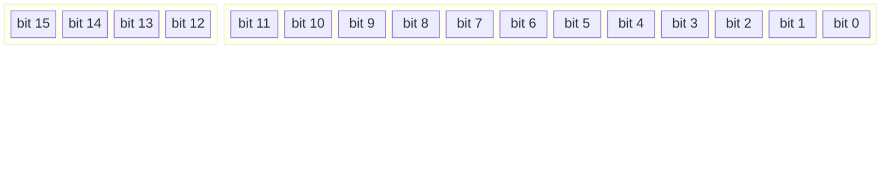
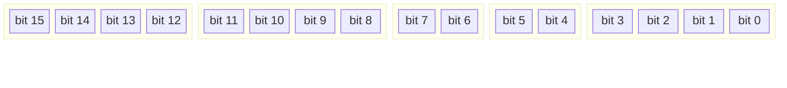
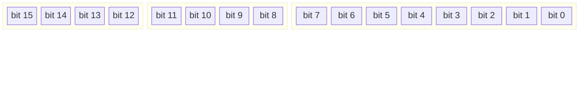

# Набор команд (ISA)

[← К основной](../README.md) | [← Обзор](overview.md) | [Регистры →](registers.md)

---

## Обзор

Процессор NovumOS-16bit использует гибридный 16/32-битный формат инструкций с 4-битными опкодами. Инструкции делятся на **простые** (один опкод = одна команда) и **групповые** (один опкод = несколько команд, поддекодируется по битам Mode/Size).

---

## Форматы инструкций

### 16-битный формат

| Поле | Биты | Ширина | Описание |
|------|------|--------|----------|
| `Opcode` | 15:12 | 4 | Код операции |
| `Dst` | 11:10 | 2 | Регистр назначения |
| `Src` | 9:8 | 2 | Регистр источника |
| `Mode` | 7:6 | 2 | Режим адресации |
| `Unused` | 5:0 | 6 | Не используется |

### 32-битный формат (с немедленным значением)

| Поле | Биты | Ширина | Описание |
|------|------|--------|----------|
| `Opcode` | 15:12 | 4 | Код операции |
| `Dst` | 11:10 | 2 | Регистр назначения |
| `Mode` | 9:8 | 2 | Режим адресации |
| `Unused` | 7:0 | 8 | Не используется |
| `Immediate` | 31:16 | 16 | Немедленное значение |

### Формат групповых команд

Для групповых команд биты [11:8] переназначаются на **Mode** и **Size** (4-битный подопкод):

| Поле | Биты | Ширина | Описание |
|------|------|--------|----------|
| `Opcode` | 15:12 | 4 | Код операции |
| `Sub-opcode` | 11:0 | 12 | Подопкод (Mode+Size) или Dst/Src |

---

## Карта опкодов

| Опкод | Мнемоника | Тип | Описание |
|-------|-----------|-----|----------|
| `0x0` | NOP | Простая | Без операции |
| `0x1` | MOV | Простая | Пересылка данных |
| `0x2` | JMP | Простая | Безусловный переход |
| `0x3` | CALL | Простая | Вызов подпрограммы |
| `0x4` | RET | Простая | Возврат из подпрограммы |
| `0x5` | INT | Простая | программное прерывание |
| `0x6` | IRET | Простая | Возврат из прерывания |
| `0x7` | HLT | Простая | Останов процессора |
| `0x8` | IN | Простая | Чтение из I/O порта |
| `0x9` | OUT | Простая | Запись в I/O порт |
| `0xA` | ALU | Групповая | АЛУ операции (16 подоп.) |
| `0xB` | CondJump | Групповая | Условные переходы (6 подоп.) |
| `0xC` | PushPop | Групповая | Стековые операции (2 подоп.) |
| `0xD` | — | Зарезервирован | Будущее |
| `0xE` | — | Зарезервирован | Будущее |
| `0xF` | — | Зарезервирован | Будущее |

---

## Группа ALU (0xA)

Поддекодируется по Mode[11:10] + Size[9:8]:

| Подоп | Двоичный | Мнемоника | Описание | Флаги |
|-------|----------|-----------|----------|-------|
| 0 | `0000` | ADD | Сложение | Z, C, S |
| 1 | `0001` | SUB | Вычитание | Z, C, S |
| 2 | `0010` | CMP | Сравнение (только флаги) | Z, C, S |
| 3 | `0011` | TEST | Тест (только флаги) | Z |
| 4 | `0100` | ADC | Сложение с переносом | Z, C, S |
| 5 | `0101` | SBB | Вычитание с заёмом | Z, C, S |
| 6 | `0110` | AND | Побитовое И | Z |
| 7 | `0111` | OR | Побитовое ИЛИ | Z |
| 8 | `1000` | XOR | Побитовое XOR | Z |
| 9 | `1001` | SHL | Сдвиг влево | Z, C |
| 10 | `1010` | SHR | Сдвиг вправо | Z, C |
| 11 | `1011` | INC | Инкремент | Z, S |
| 12 | `1100` | DEC | Декремент | Z, S |
| 13 | `1101` | NOT | Побитовое НЕ | — |
| 14 | `1110` | NEG | Negate (дополнительный код) | Z, C, S |
| 15 | `1111` | XCHG | Обмен регистров | — |

### Формат инструкции ALU

| Поле | Биты | Ширина | Описание |
|------|------|--------|----------|
| `Opcode` | 15:12 | 4 | 0xA (группа ALU) |
| `ALU sub-opcode` | 11:8 | 4 | Подопкод ALU операции |
| `Dst` | 7:6 | 2 | Регистр назначения |
| `Src` | 5:4 | 2 | Регистр источника |
| `Unused` | 3:0 | 4 | Не используется |

---

## Группа условных переходов (0xB)

Поддекодируется по Mode[11:10] + Size[9:8]:

| Подоп | Двоичный | Мнемоника | Условие | Описание |
|-------|----------|-----------|---------|----------|
| 0 | `0000` | JZ / JE | Z = 1 | Переход если ноль / равно |
| 1 | `0001` | JNZ / JNE | Z = 0 | Переход если не ноль / не равно |
| 2 | `0010` | JC / JB | C = 1 | Переход если перенос / меньше (беззнак.) |
| 3 | `0011` | JNC / JAE | C = 0 | Переход если нет переноса / больше или равно |
| 4 | `0100` | JS | S = 1 | Переход если знак (отрицательное) |
| 5 | `0101` | JNS | S = 0 | Переход если нет знака (положительное) |

### Формат условного перехода

| Поле | Биты | Ширина | Описание |
|------|------|--------|----------|
| `Opcode` | 15:12 | 4 | 0xB (группа условных переходов) |
| `CondJump sub-opcode` | 11:8 | 4 | Подопкод условия |
| `Unused` | 7:0 | 8 | Не используется |
| `Target` | 31:16 | 16 | Адрес перехода |

---

## Группа PUSH/POP (0xC)

Поддекодируется по Mode[9:8]:

| Подоп | Двоичный | Мнемоника | Описание |
|-------|----------|-----------|----------|
| 0 | `00` | PUSH | З_PUSHить регистр в стек |
| 1 | `01` | POP | Забрать из стека в регистр |

### Формат PUSH/POP

| Поле | Биты | Ширина | Описание |
|------|------|--------|----------|
| `Opcode` | 15:12 | 4 | 0xC (группа стековых операций) |
| `Reg` | 11:10 | 2 | Регистр операнда |
| `Mode` | 9:8 | 2 | Режим (00=PUSH, 01=POP) |
| `Unused` | 7:0 | 8 | Не используется |

---

## Простые инструкции

### NOP (0x0)

Без операции. Процессор продолжает со следующей инструкции.

### MOV (0x1)

Пересылка данных между регистрами или между регистром и памятью.

| Формат | Пример | Описание |
|--------|--------|----------|
| Reg→Reg | `MOV AX, BX` | Копировать BX в AX |
| Imm→Reg | `MOV AX, 0x1234` | Загрузить немедленное значение (32-бит) |
| [Reg]→Reg | `MOV AX, [BX]` | Загрузить из памяти по адресу в BX |
| Reg→[Reg] | `MOV [BX], AX` | Записать AX в память по адресу в BX |
| [Reg+off]→Reg | `MOV AX, [BX+0x10]` | Загрузить из BX + смещение |

### JMP (0x2)

Безусловный переход по адресу.

### CALL (0x3)

Вызов подпрограммы. ПUSHит адрес возврата (IP+4) в стек, затем прыгает по адресу.

### RET (0x4)

Возврат из подпрограммы. Извлекает адрес возврата из стека в IP.

### INT (0x5)

Программное прерывание. ПUSHит FLAGS и IP в стек, загружает IP из таблицы векторов.

### IRET (0x6)

Возврат из прерывания. Извлекает IP и FLAGS из стека.

### HLT (0x7)

Останов процессора до следующего прерывания.

### IN (0x8)

Чтение 16-битного значения из I/O порта.

### OUT (0x9)

Запись 16-битного значения в I/O порт.

---

## Режимы адресации

| Режим | Двоичный | Описание |
|-------|----------|----------|
| Reg→Reg | `00` | Регистр в регистр |
| Немедленный | `01` | Немедленное значение (32-бит) |
| Косвенный | `10` | Память по адресу в регистре |
| Косвенный+смещение | `11` | Память: регистр + смещение |

---

## Флаги

| Флаг | Бит | Имя | Описание |
|------|-----|-----|----------|
| Z | 0 | Zero | Устанавливается если результат ALU равен нулю |
| C | 1 | Carry | Устанавливается при переносе из старшего бита |
| S | 2 | Sign | Устанавливается если бит 15 результата = 1 (отрицательное) |
| 3–15 | — | Зарезервирован | Не используется |

---

## Кодировка регистров

| Двоичный | Регистр | Имя |
|----------|---------|-----|
| `00` | AX | Аккумулятор |
| `01` | BX | Базовый |
| `10` | CX | Счётчик |
| `11` | DX | Данные |

---

*См. [Регистры](registers.md) для подробного описания регистров.*
