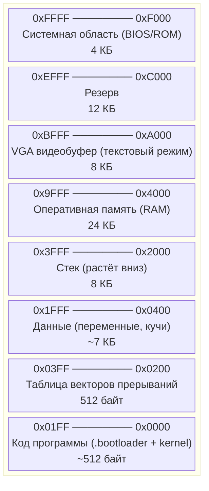
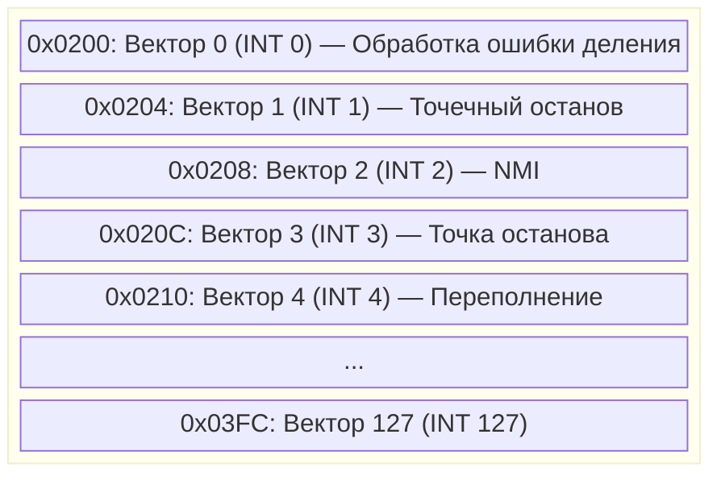
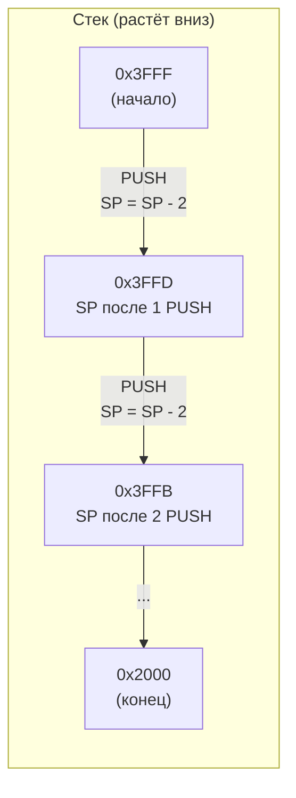
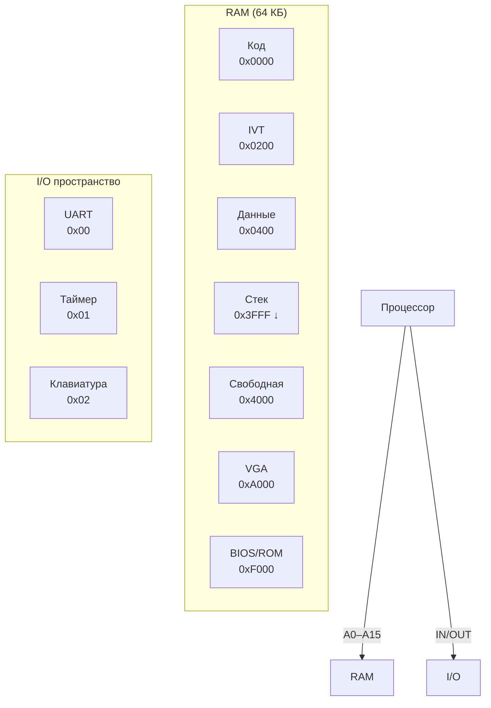

# Архитектура — Карта памяти

> Распределение 64 КБ адресного пространства процессора NovumOS-16bit

---

## Навигация

| Предыдущий | Текущий | Следующий |
|------------|---------|-----------|
| [Цикл выполнения](execution-cycle.md) | Карта памяти | [Главная](../README.md) |

---

## Общая карта памяти

Процессор адресует 64 КБ (0x0000–0xFFFF) через 16 адресных линий.

---

## Детальное распределение

| Диапазон адресов | Размер | Назначение | Доступ |
|------------------|--------|------------|--------|
| 0x0000–0x01FF | 512 байт | Код программы (загрузчик) | R/X |
| 0x0200–0x03FF | 512 байт | Таблица векторов прерываний (IVT) | R/W |
| 0x0400–0x1FFF | ~7 КБ | Данные (переменные, куча) | R/W |
| 0x2000–0x3FFF | 8 КБ | Стек (растёт вниз от 0x3FFF) | R/W |
| 0x4000–0x9FFF | 24 КБ | Оперативная память (RAM) | R/W |
| 0xA000–0xBFFF | 8 КБ | VGA видеобуфер (текстовый режим) | R/W |
| 0xC000–0xEFFF | 12 КБ | Резерв | — |
| 0xF000–0xFFFF | 4 КБ | Системная область (BIOS/ROM) | R |

---

## Сегменты

### Код программы (0x0000–0x01FF)

- **Начальный адрес**: 0x0000 — именно сюда загружается процессор при включении
- **Содержимое**: Загрузчик (bootloader) и начальный код ядра
- **Доступ**: Только чтение и выполнение (R/X)
- **Размер**: 512 байт (1 сектор диска)

### Таблица векторов прерываний (0x0200–0x03FF)

- **Назначение**: Хранит адреса обработчиков прерываний
- **Формат записи**: 2 слова (4 байта) на каждый вектор
- **Количество векторов**: 128
- **Доступ**: R/W

### Данные (0x0400–0x1FFF)

- **Назначение**: Хранение переменных, констант, динамических данных
- **Структура**: Куча (heap) начинается с 0x0400 и растёт вверх
- **Доступ**: R/W

### Стек (0x2000–0x3FFF)

- **Начальный адрес**: 0x3FFF (верх стека)
- **Направление роста**: Вниз (к меньшим адресам)
- **Размер**: 8 КБ (4096 слов по 2 байта)
- **Операции**:
  - PUSH: SP ← SP - 2, запись по адресу SP
  - POP: чтение по адресу SP, SP ← SP + 2

### Оперативная память (0x4000–0x9FFF)

- **Назначение**: Основная рабочая область для программ
- **Размер**: 24 КБ
- **Доступ**: R/W

### VGA видеобуфер (0xA000–0xBFFF)

- **Назначение**: Хранение текста для отображения на экране
- **Режим**: Текстовый (80×25 символов)
- **Формат символа**: 2 байта (символ + атрибут)
- **Размер буфера**: 80 × 25 × 2 = 4000 байт
- **Доступ**: R/W

| Байт | Содержимое |
|------|------------|
| Чётный (0, 2, 4...) | ASCII-код символа |
| Нечётный (1, 3, 5...) | Атрибут (цвет фона/текста) |

### Системная область (0xF000–0xFFFF)

- **Назначение**: Постоянная память (ROM) с системными программами
- **Содержимое**: Инициализация системы, обработчики прерываний
- **Доступ**: Только чтение (R)

---

## Карта I/O портов

Процессор использует изолированное I/O-пространство (не пересекается с RAM) через инструкции IN/OUT.

| Порт | Устройство | Регистр | Описание |
|------|-----------|---------|----------|
| 0x00 | UART | Data | Терминальный I/O (отправка/приём символов) |
| 0x01 | Таймер | Counter | Счётчик циклов |
| 0x02 | Клавиатура | Scan code | Сканирующие коды клавиатуры |

---

## Схема адресации

---

## Рекомендации по распределению памяти

| Область | Рекомендуемое использование |
|---------|----------------------------|
| 0x0000–0x01FF | Только загрузчик (bootloader) |
| 0x0200–0x03FF | IVT — не изменять после инициализации |
| 0x0400–0x1FFF | Данные ОС и пользовательские данные |
| 0x2000–0x3FFF | Стек — не использовать для других целей |
| 0x4000–0x9FFF | Куча для динамических данных |
| 0xA000–0xBFFF | Только для VGA |
| 0xF000–0xFFFF | Только для BIOS/ROM |

---

## См. также

- [Регистры](registers.md) — SP указывает на стек
- [Цикл выполнения](execution-cycle.md) — IP обращается к коду
- [Обзор](overview.md) — общая архитектура
