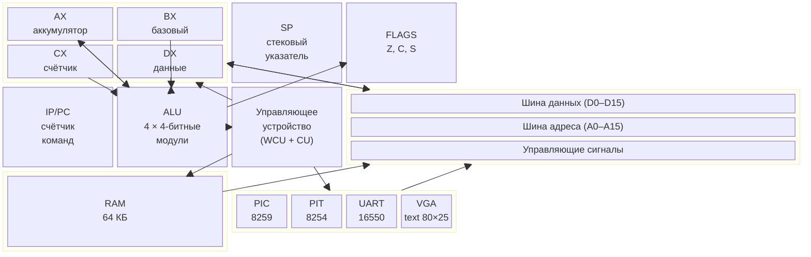
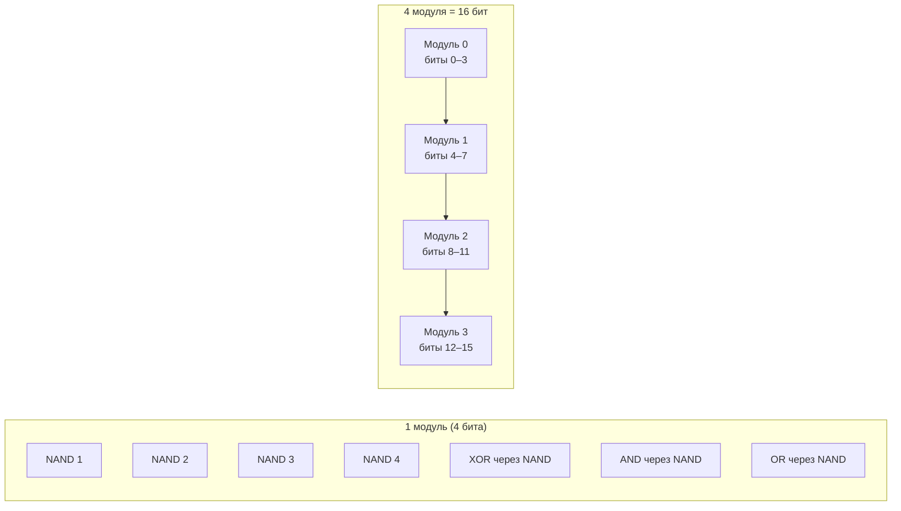
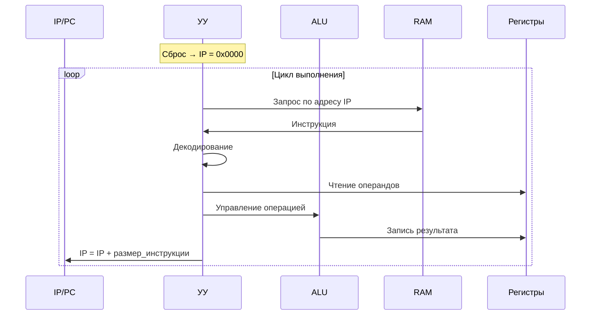
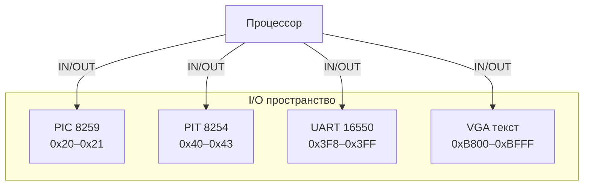

# Архитектура — Обзор

> Подробное описание архитектуры процессора NovumOS-16bit, построенного на TTL-логике

---

## Навигация

| Предыдущий | Текущий | Следующий |
|------------|---------|-----------|
| [Главная](../README.md) | Обзор архитектуры | [ISA](isa.md) | [Регистры](registers.md) |

---

## Блок-схема процессора



---

## Описание блоков

### Регистры (Registers)

Процессор содержит 4 регистра общего назначения и 3 специальных регистра. Подробное описание — в разделе [Регистры](registers.md).

| Регистр | Разрядность | Назначение |
|---------|-------------|------------|
| AX | 16 бит | Аккумулятор — основной регистр для арифметических операций |
| BX | 16 бит | Базовый регистр — используется для адресации и временного хранения |
| CX | 16 бит | Счётчик — используется в циклах и для подсчёта операций |
| DX | 16 бит | Данные — вспомогательный регистр для передачи данных |
| IP/PC | 16 бит | Счётчик команд — указатель на текущую инструкцию |
| SP | 16 бит | Стековый указатель — указывает на вершину стека |
| FLAGS | 16 бит | Флаги — Z (ноль), C (перенос), S (знак) |

### ALU (Арифметико-логическое устройство)

ALU построена из 4-битных модулей на NAND-гейтах. Каждый модуль реализует полный сумматор и логические операции.

#### Структура NAND-ALU



#### Принцип NAND-ALU

Любая логическая функция может быть выражена через NAND-гейты:

- **AND** = NAND с инвертированными входами (NOT через NAND)
- **OR** = NAND с инвертированным выходом
- **XOR** = комбинация из 4 NAND-гейтов
- **SUM** (полный сумматор) = комбинация из 9 NAND-гейтов

Один 4-битный модуль содержит approximately 36 NAND-гейтов (К155ЛА3). Всего 4 модуля = ~144 NAND-гейта для ALU.

#### Операции ALU

| Операция | Описание | Влияние на флаги |
|----------|----------|-------------------|
| ADD | Сложение | Z, C |
| SUB | Вычитание | Z, C, S |
| AND | Побитовое И | Z |
| OR | Побитовое ИЛИ | Z |
| XOR | Побитовое исключающее ИЛИ | Z |
| SHL | Сдвиг влево на 1 | Z, C |
| SHR | Сдвиг вправо на 1 | Z, C |

### Управляющее устройство (Control Unit)

Управляющее устройство генерирует управляющие сигналы на основе декодированной инструкции. Включает:

- **Декодер инструкций** — определяет тип команды и режим адресации
- **Генератор микрокоманд** — управляет последовательностью микроопераций
- **Контроллер шины** — управляет доступом к шине данных и адреса



### Шина (Bus)

Процессор использует 16-битную шину данных и 16-битную шину адреса:

| Шина | Разрядность | Назначение |
|------|-------------|------------|
| Данные (D0–D15) | 16 бит | Передача данных между блоками |
| Адреса (A0–A15) | 16 бит | Адресация памяти и I/O портов |
| Управления | — | Сигналы WR, RD, MREQ, IOREQ |

### I/O периферийные устройства



---

## Пути данных

### Основной поток данных

```
RAM → Шина → УУ → Декодер → Регистры → ALU → Регистры → Шина → RAM
```

### Поток при чтении из памяти

```
A0–A15 → RAM → D0–D15 → Регистр
```

### Поток при записи в память

```
Регистр → D0–D15 → RAM ← A0–A15
```

### Поток при IN/OUT

```
Регистр → D0–D15 → I/O устройство (OUT)
I/O устройство → D0–D15 → Регистр (IN)
```

---

## Тактирование

Процессор работает синхронно с тактовым генератором. Каждая инструкция занимает от 4 до 8 тактов в зависимости от типа:

| Тип инструкции | Количество тактов | Пример |
|----------------|-------------------|--------|
| Регистр-регистр | 4 такта | MOV AX, BX |
| Регистр-память | 6 тактов | MOV AX, [BX] |
| Память-регистр | 6 тактов | MOV [BX], AX |
| Ввод-вывод | 6 тактов | IN AL, 0x20 |
| Условный переход | 5–6 тактов | JZ address |

---

## См. также

- [Регистры](registers.md) — подробное описание всех регистров
- [Цикл выполнения](execution-cycle.md) — пошаговый процесс выполнения инструкции
- [Карта памяти](memory-map.md) — расположение сегментов и I/O
