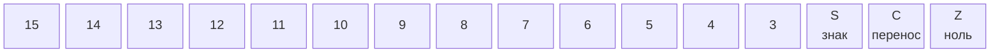

# Архитектура — Регистры

> Полное описание всех регистров процессора NovumOS-16bit

---

## Навигация

| Предыдущий | Текущий | Следующий |
|------------|---------|-----------|
| [Обзор](overview.md) | Регистры | [ISA](isa.md) | [Цикл выполнения](execution-cycle.md) |

---

## Общая структура

Процессор содержит 7 регистров:

| # | Регистр | Разрядность | Код | Назначение |
|---|---------|-------------|-----|------------|
| 1 | AX | 16 бит | 00 | Аккумулятор — основной рабочий регистр |
| 2 | BX | 16 бит | 01 | Базовый — хранение адресов и данных |
| 3 | CX | 16 бит | 10 | Счётчик — циклы и подсчёт |
| 4 | DX | 16 бит | 11 | Данные — вспомогательный |
| 5 | IP/PC | 16 бит | — | Счётчик команд |
| 6 | SP | 16 бит | — | Стековый указатель |
| 7 | FLAGS | 16 бит | — | Регистр флагов |

---

## Регистры общего назначения

### AX — Аккумулятор

Основной рабочий регистр. Используется как источник и приёмник для большинства арифметико-логических операций.

- Является неявным операндом для ADD, SUB, AND, OR, XOR, SHL, SHR
- Используется как первый операнд в大多数 инструкциях
- Результат多数 арифметических операций записывается именно сюда

### BX — Базовый регистр

Используется для хранения базовых адресов при косвенной адресации.

- Может использоваться как указатель в инструкциях MOV с косвенной адресацией
- Сохраняет адреса массивов, структур, стека

### CX — Регистр-счётчик

Используется для организации циклов и подсчёта операций.

- Автоматически уменьшается при использовании в циклических конструкциях
- Используется как счётчик повторений

### DX — Регистр данных

Вспомогательный регистр для временного хранения данных.

- Используется как второй операнд в инструкциях
- Хранит промежуточные результаты

---

## Кодировка регистров

Для кодирования регистров в инструкциях используется 2 бита:

| Код | Регистр |
|-----|---------|
| 00 | AX |
| 01 | BX |
| 10 | CX |
| 11 | DX |

Эта кодировка используется в полях `reg` и `r/m` формата инструкций.

---

## Специальные регистры

### IP/PC — Счётчик команд

Хранит адрес следующей инструкции для выполнения.

- После чтения инструкции автоматически увеличивается на её длину (1 или 2 слова)
- Изменяется только при переходах (JMP, JZ, JNZ, CALL, RET)
- Не доступен для прямого чтения/записи через инструкции

### SP — Стековый указатель

Указывает на вершину стека в оперативной памяти.

- Стек растёт в сторону уменьшения адресов (от 0xFFFF вниз)
- PUSH уменьшает SP на 2 перед записью
- RET увеличивает SP на 2 после чтения

---

## Регистр FLAGS

FLAGS содержит флаги состояния, устанавливаемые ALU после арифметико-логических операций.

### Описание флагов

| Бит | Имя | Название | Описание |
|-----|-----|----------|----------|
| 0 | Z | Zero | Устанавливается, если результат операции равен нулю |
| 1 | C | Carry | Устанавливается при переносе из старшего бита |
| 2 | S | Sign | Устанавливается, если результат отрицательный (бит 15 = 1) |
| 3–15 | — | — | Резервные биты |

### Влияние операций на флаги

| Операция | Z | C | S |
|----------|---|---|---|
| ADD | ✓ | ✓ | ✓ |
| SUB | ✓ | ✓ | ✓ |
| AND | ✓ | — | ✓ |
| OR | ✓ | — | ✓ |
| XOR | ✓ | — | ✓ |
| SHL | ✓ | ✓ | ✓ |
| SHR | ✓ | ✓ | ✓ |
| INC | ✓ | — | ✓ |
| DEC | ✓ | — | ✓ |
| NOT | — | — | — |
| NEG | ✓ | ✓ | ✓ |
| CMP | ✓ | ✓ | ✓ |
| TEST | ✓ | — | — |
| ADC | ✓ | ✓ | ✓ |
| SBB | ✓ | ✓ | ✓ |
| XCHG | — | — | — |
| MOV | — | — | — |

**Примечание**: флаг S устанавливается для SUB и логических операций, но не определён для ADD (поведение зависит от реализации).

---

## Какие команды работают с какими регистрами

### Инструкции пересылки данных

| Инструкция | Источник | Приёмник | Описание |
|------------|----------|----------|----------|
| MOV reg, reg | Любой GPR | Любой GPR | Пересылка между регистрами |
| MOV reg, imm | Непосредственное значение | Любой GPR | Загрузка константы |
| MOV reg, [addr] | Память | Любой GPR | Чтение из памяти |
| MOV [addr], reg | Любой GPR | Память | Запись в память |
| MOV reg, [BX+CX] | Косвенная адресация | Любой GPR | Косвенное чтение |
| IN reg, port | I/O порт | AX | Ввод из порта |
| OUT port, reg | AX | I/O порт | Вывод в порт |

### Арифметико-логические инструкции

| Инструкция | Операнд 1 | Операнд 2 | Результат |
|------------|-----------|-----------|-----------|
| ADD reg, reg | AX (неявный) | Любой GPR | AX |
| SUB reg, reg | AX (неявный) | Любой GPR | AX |
| AND reg, reg | AX (неявный) | Любой GPR | AX |
| OR reg, reg | AX (неявный) | Любой GPR | AX |
| XOR reg, reg | AX (неявный) | Любой GPR | AX |
| NOT reg | AX (неявный) | — | AX |
| NEG reg | AX (неявный) | — | AX |
| INC reg | — | — | тот же |
| DEC reg | — | — | тот же |
| CMP reg, reg | — | Любой GPR | FLAGS |
| TEST reg, reg | — | Любой GPR | FLAGS |
| ADC reg, reg | — | Любой GPR | FLAGS |
| SBB reg, reg | — | Любой GPR | FLAGS |
| XCHG reg, reg | — | Любой GPR | оба |
| SHL reg | AX (неявный) | — | AX |
| SHR reg | AX (неявный) | — | AX |

### Инструкции перехода

| Инструкция | Условие | Регистр |
|------------|---------|---------|
| JMP addr | Безусловный | — |
| JZ / JE addr | Z = 1 | FLAGS |
| JNZ / JNE addr | Z = 0 | FLAGS |
| JC / JB addr | C = 1 | FLAGS |
| JNC / JAE addr | C = 0 | FLAGS |
| JS addr | S = 1 | FLAGS |
| JNS addr | S = 0 | FLAGS |

### Инструкции стека

| Инструкция | Регистр | Описание |
|------------|---------|----------|
| PUSH reg | Любой GPR | Положить на стек |
| POP reg | Любой GPR | Снять со стека |

---

## Рекомендации по использованию регистров

| Регистр | Рекомендуемое использование |
|---------|----------------------------|
| AX | Основной рабочий регистр, результат операций |
| BX | Базовый адрес, указатели на данные |
| CX | Счётчик циклов, количество операций |
| DX | Временное хранение, второй операнд |
| SP | Только для стека |
| IP | Только для переходов |

---

## См. также

- [Обзор архитектуры](overview.md) — общая структура процессора
- [Цикл выполнения](execution-cycle.md) — как регистры обновляются
- [Карта памяти](memory-map.md) — куда обращается SP
