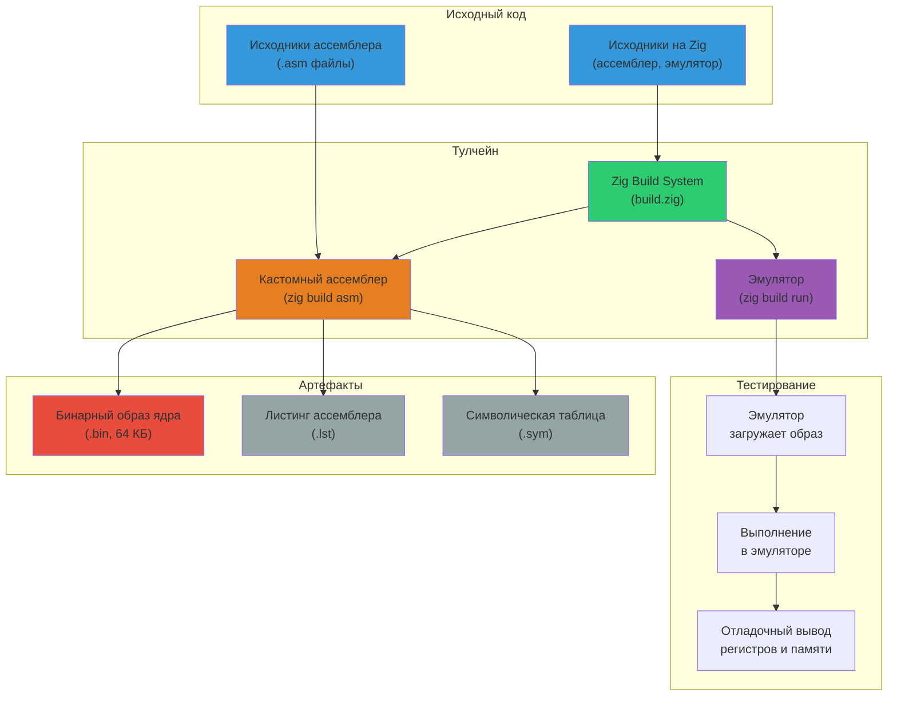
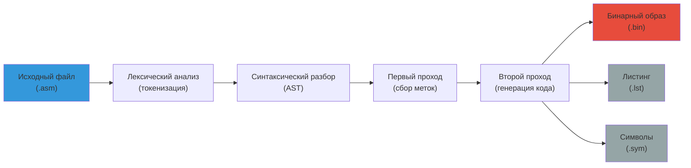
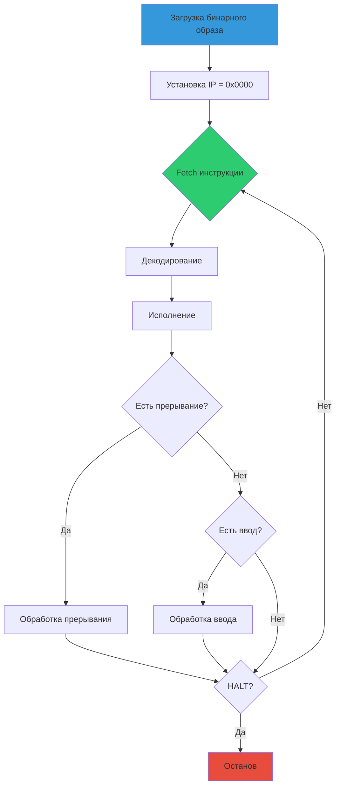
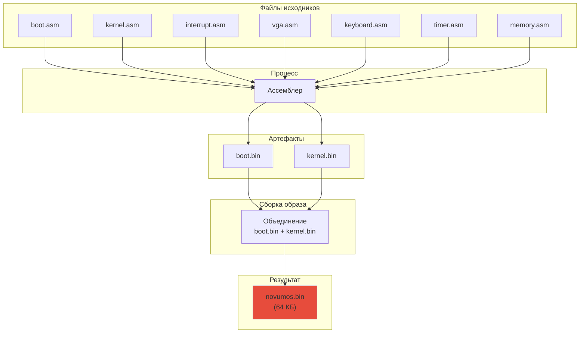
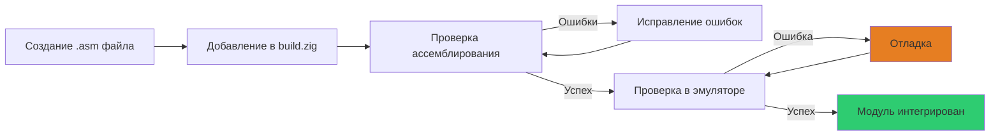
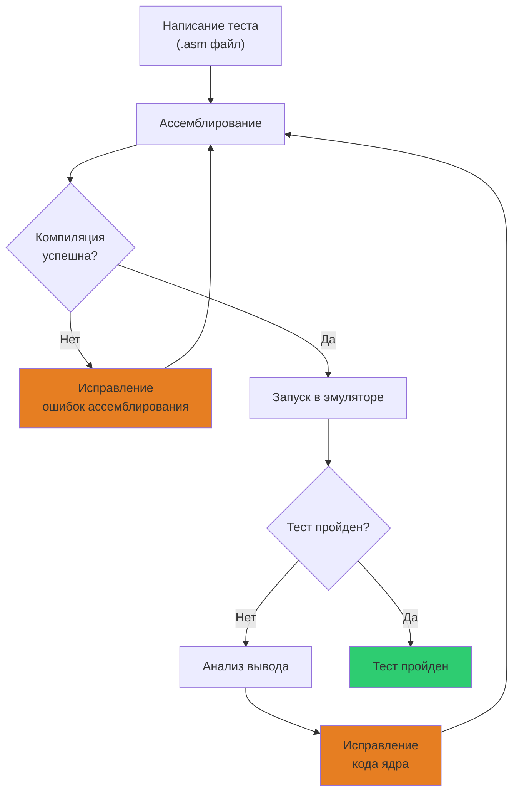
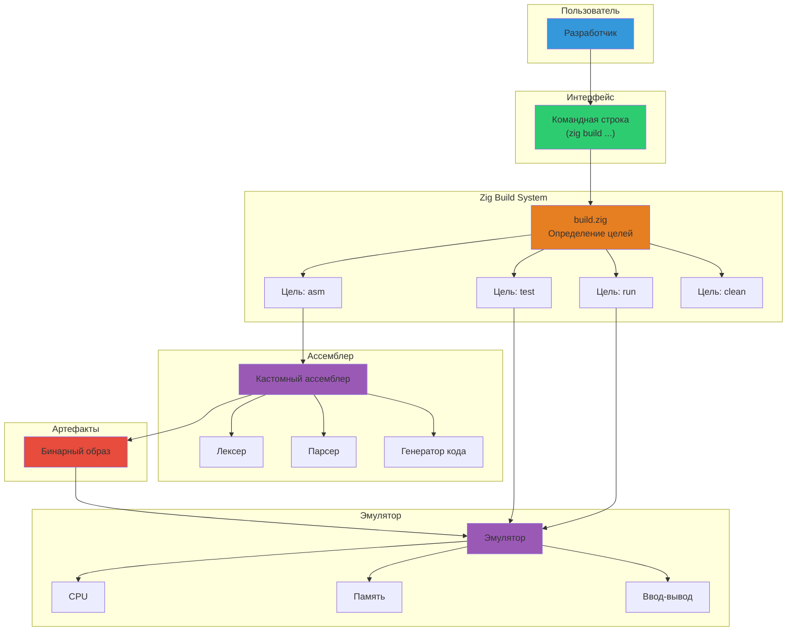
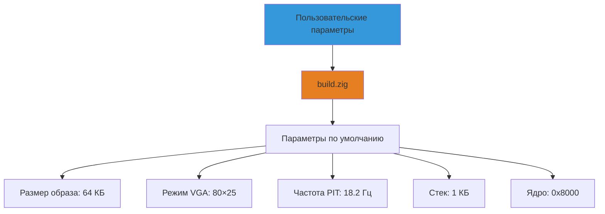
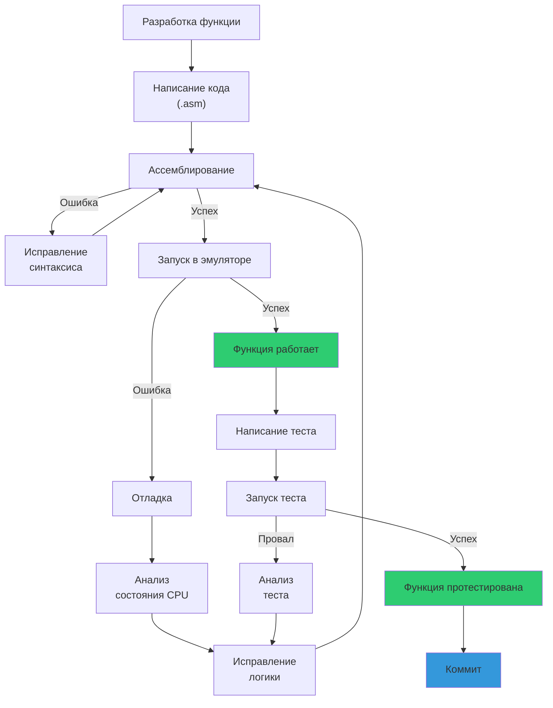
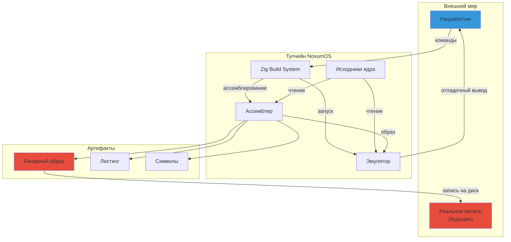

# Тулчейн и система сборки NovumOS-16bit

## Обзор

NovumOS-16bit собирается с помощью полностью кастомного тулчейна, написанного на языке Zig. Тулчейн включает ассемблер для кастомной ISA, эмулятор для тестирования и систему сборки на основе Zig Build System. Все компоненты работают на Windows, Linux и macOS.

---

## Диаграмма процесса сборки



---

## Компоненты тулчейна

### 1. Кастомный ассемблер

Ассемблер написан на Zig и предназначен специально для кастомной ISA процессора NovumOS-16bit.

**Назначение:**
- Чтение файлов исходного кода ассемблера (`.asm`)
- Лексический разбор токенов (метки, инструкции, директивы, операнды)
- Синтаксический разбор в абстрактное синтаксическое дерево (AST)
- Генерация машинного кода (16-битные инструкции)
- Обработка меток и адресов (два прохода)
- Генерация вспомогательных файлов (листинг, символы)

**Возможности:**
- Двухпроходная ассемблирование
- Поддержка меток и символов
- Макросы (базовые)
- Директивы данных (`.db`, `.dw`, `.ds`)
- Директивы сегментов
- Вычисление адресов и констант
- Диагностические сообщения об ошибках с указанием строки

---

### 2. Эмулятор

Эмулятор написан на Zig и воспроизводит архитектуру процессора NovumOS-16bit.

**Назначение:**
- Загрузка бинарного образа в виртуальную память (64 КБ)
- Декодирование и выполнение 16-битных инструкций
- Эмуляция регистров CPU (AX, BX, CX, DX, SI, DI, BP, SP, IP)
- Эмуляция флагов (ZF, CF, SF, OF, IF)
- Эмуляция портов ввода-вывода (VGA, PIC, PIT, клавиатура)
- Текстовый вывод на экран терминала (эмуляция VGA 80×25)
- Ввод с клавиатуры (эмуляция сканирования)
- Отладочный режим с трассировкой执行 инструкций

**Режимы работы:**
- **Нормальный режим:** выполнение до HALT или бесконечного цикла
- **Отладочный режим:** пошаговое выполнение с выводом состояния регистров
- **Тихий режим:** только выход программы без отладочной информации

---

### 3. Система сборки (Zig Build System)

Система сборки координирует весь процесс компиляции и тестирования.

**Назначение:**
- Определение целей сборки (ассемблирование, запуск, тестирование)
- Управление зависимостями между файлами
- Автоматическое пересборки при изменении исходников
- Запуск эмулятора с нужными параметрами
- Генерация отчётов о сборке

---

## Структура проекта

```
NovumOS-16bit/
├── build.zig                  # Определение целей сборки
├── build.zig.zon              # Метаданные проекта
│
├── src/
│   ├── assembler/
│   │   ├── main.zig           # Точка входа ассемблера
│   │   ├── lexer.zig          # Лексический анализатор
│   │   ├── parser.zig         # Синтаксический анализатор
│   │   ├── codegen.zig        # Генерация машинного кода
│   │   ├── labels.zig         # Обработка меток и адресов
│   │   └── directives.zig     # Обработка директив
│   │
│   ├── emulator/
│   │   ├── main.zig           # Точка входа эмулятора
│   │   ├── cpu.zig            # Эмуляция CPU
│   │   ├── memory.zig         # Эмуляция памяти (64 КБ)
│   │   ├── io.zig             # Эмуляция портов ввода-вывода
│   │   ├── vga.zig            # Эмуляция VGA
│   │   ├── keyboard.zig       # Эмуляция клавиатуры
│   │   └── timer.zig          # Эмуляция PIT
│   │
│   └── kernel/
│       ├── boot.asm           # Загрузчик
│       ├── kernel.asm         # Ядро
│       ├── interrupt.asm      # Обработчики прерываний
│       ├── vga.asm            # Работа с VGA
│       ├── keyboard.asm       # Обработка клавиатуры
│       ├── timer.asm          # Таймер
│       └── memory.asm         # Управление памятью
│
├── docs/
│   └── ru/
│       ├── boot/
│       │   └── boot-process.md
│       ├── build/
│       │   └── toolchain.md
│       ├── isa/
│       │   └── instruction-set.md
│       └── architecture/
│           └── overview.md
│
└── tests/
    ├── test-boot.asm          # Тест загрузки
    ├── test-vga.asm           # Тест VGA
    ├── test-keyboard.asm      # Тест клавиатуры
    └── test-timer.asm         # Тест таймера
```

---

## Команды сборки

### Основные команды

| Команда | Описание |
|---------|----------|
| `zig build` | Собрать всё (ассемблер + ядро) |
| `zig build asm` | Запустить ассемблер для сборки ядра |
| `zig build run` | Собрать и запустить в эмуляторе |
| `zig build debug` | Запустить эмулятор в отладочном режиме |
| `zig build test` | Запустить все тесты |
| `zig build clean` | Удалить артефакты сборки |
| `zig build help` | Показать доступные цели |

### Часто используемые комбинации

| Сценарий | Команда |
|----------|---------|
| Полная пересборка | `zig build clean && zig build` |
| Быстрая проверка | `zig build asm && zig build run` |
| Отладка загрузки | `zig build asm && zig build debug` |
| Запуск конкретного теста | `zig build test -- --filter test-boot` |

---

## Диаграмма процесса ассемблирования



### Описание этапов

**Лексический анализ (токенизация):**
- Файл читается посимвольно
- Пробелы и комментарии отбрасываются
- Идентификаторы (метки, инструкции, директивы) выделяются как токены
- Числа (десятичные, шестнадцатеричные, двоичные) распознаются
- Строковые литералы обрабатываются

**Синтаксический разбор:**
- Токены организуются в структуру AST
- Инструкции разбираются на оператор и операнды
- Директивы обрабатываются отдельно
- Выражения (адреса, константы) вычисляются

**Первый проход:**
- Проход по всем инструкциям для подсчёта размеров
- Метки связываются с адресами
- Символическая таблица заполняется
- Передние ссылки (forward references) регистрируются

**Второй проход:**
- Генерация машинного кода для каждой инструкции
- Адреса меток подставляются в код
- Данные директив записываются в образ
- Формируется бинарный файл

---

## Диаграмма работы эмулятора



---

## Диаграмма зависимостей сборки



---

## Добавление новых файлов

### Пошаговая инструкция

**Шаг 1:** Создайте новый файл `.asm` в директории `src/kernel/`

**Шаг 2:** Определите сегмент и адрес в файле загрузчика, если новый модуль требует размещения в определённом месте памяти

**Шаг 3:** Обновите зависимости в `build.zig`, если новый модуль зависит от других

**Шаг 4:** Включите модуль в основной файл ядра через директиву включения или как отдельный объект

**Шаг 5:** Запустите `zig build asm` для проверки, что новый модуль ассемблируется без ошибок

**Шаг 6:** Запустите `zig build run` для проверки, что модуль работает корректно

### Диаграмма добавления модуля



---

## Процесс тестирования

### Диаграмма тестирования



### Уровни тестирования

| Уровень | Что проверяется | Метод |
|---------|-----------------|-------|
| Ассемблирование | Корректность синтаксиса | `zig build asm` |
| Единичные тесты | Отдельные инструкции | Эмулятор в отладочном режиме |
| Интеграционные тесты | Взаимодействие модулей | Полный запуск ядра |
| Системные тесты | Полная функциональность | Запуск всех подсистем |

### Структура теста

Каждый тестовый файл `.asm` содержит:

1. **Заголовок** — имя теста и описание
2. **Настройка** — инициализация нужного оборудования
3. **Действие** — выполнение тестируемой операции
4. **Проверка** — сравнение результата с ожидаемым
5. **Вывод** — сообщение об успехе или ошибке
6. **Останов** — инструкция HALT

---

## Диаграмма архитектуры тулчейна



---

## Конфигурация сборки

### Параметры по умолчанию

| Параметр | Значение | Описание |
|----------|----------|----------|
| Размер образа | 64 КБ | Полное адресное пространство |
| Режим VGA | Текстовый 80×25 | Стандартный текстовый режим |
| Частота PIT | 18.2 Гц | Стандартная частота таймера |
| Размер стека | 1 КБ | От 0xFC00 до 0xFFFE |
| Начальный адрес ядра | `0x8000` | Середина адресного пространства |
| Начальный адрес стека | `0xFFFE` | Верх адресного пространства |

### Диаграмма конфигурации



---

## Диаграмма потока данных


---

## Диаграмма жизненного цикла разработки



---

## Ошибки сборки и их решение

| Ошибка | Причина | Решение |
|--------|---------|---------|
| `Undefined label` | Метка не определена | Проверьте написание и наличие метки |
| `Duplicate label` | Метка определена дважды | Удалите дублирующее определение |
| `Invalid instruction` | Инструкция не существует | Проверьте ISA и написание |
| `Operand mismatch` | Неправильные операнды | Проверьте количество и тип операндов |
| `Address out of range` | Адрес за пределами 64 КБ | Проверьте раскладку памяти |
| `ROM overflow` | ROM не помещается в отведённую область | Оптимизируйте размер кода |
| `Stack overflow` | Стек переполнен | Увеличьте область стека или уменьшите вложенность |

---

## Сводная диаграмма всего тулчейна



---

## Резюме

Тулчейн NovumOS-16bit состоит из трёх компонентов:

1. **Ассемблер** — транслирует исходники ассемблера в бинарный образ (двухпроходной, с генерацией листинга и символов)
2. **Эмулятор** — загружает и выполняет образ, эмулирует CPU, память и устройства ввода-вывода
3. **Система сборки** — координирует процесс через команды `zig build`, управляет зависимостями и артефактами

Весь тулчейн написан на Zig, кроссплатформен, и не требует сторонних зависимостей. Добавление новых файлов — процесс описанный и детерминированный. Тестирование проводится на четырёх уровнях: ассемблирование, единичные тесты, интеграционные тесты, системные тесты.
