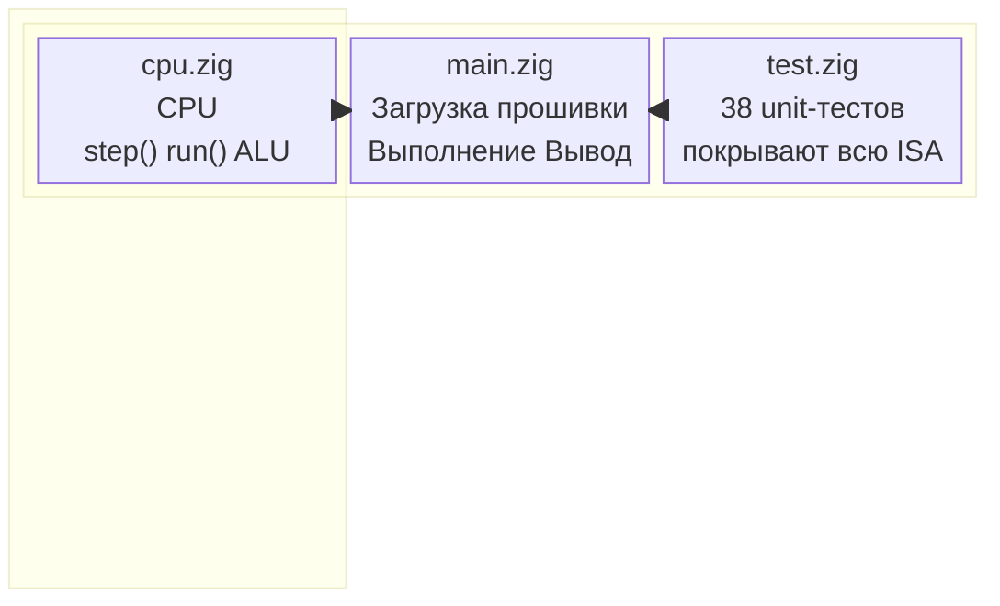

# Обзор эмулятора

[English version](../../en/emulator/overview.md)

---

## Что такое эмулятор?

Эмулятор NovumOS-16bit — это программная реализация пользовательского TTL-процессора с циклической точностью, написанная на Zig. Он загружает бинарный файл прошивки с диска и выполняет его на виртуальном процессоре с 64 КБ памяти и 256 портами ввода-вывода.

Эмулятор используется для:
- **Тестирования** — запуск unit-тестов над набором инструкций процессора
- **Разработки** — тестирование прошивки без физического оборудования
- **Отладки** — проверка состояния процессора после каждой инструкции

---

## Архитектура



### Файлы

| Файл | Назначение |
|------|-----------|
| `src/emulator/cpu.zig` | Реализация CPU — регистры, память, декодирование инструкций, ALU |
| `src/emulator/main.zig` | Точка входа — загрузка firmware.bin, выполнение, вывод состояния |
| `src/emulator/test.zig` | 38 unit-тестов по всем категориям инструкций |
| `src/codegen.zig` | Функции кодирования ISA и генератор прошивки |

---

## Сборка и запуск

### Команды сборки

```bash
zig build firmware    # Генерация build/firmware.bin (1024 байта)
zig build emulate     # Запуск эмулятора (загружает firmware.bin)
zig build test        # Запуск всех 38 тестов
```

### Вывод эмулятора

```
Loaded firmware: 1024 bytes

First 32 bytes: 00 00 00 FF 00 11 00 0F 00 15 10 A0 ...

=== CPU State ===
AX=0x0000 BX=0x0000 CX=0x0000 DX=0x0000
IP=0x0000 SP=0xFFFE FLAGS=0x0000 [Z=false C=false S=false]
Halted=false

Executed 29 cycles

=== CPU State ===
AX=0x00FF BX=0x0000 CX=0x0001 DX=0xFFF0
IP=0x0044 SP=0x0002 FLAGS=0x0000 [Z=false C=false S=false]
Halted=true
```

---

## Состояние CPU

### Регистры

| Регистр | Размер | Назначение |
|---------|--------|------------|
| AX | 16 бит | Аккумулятор — основной рабочий регистр |
| BX | 16 бит | Базовый — адресация с базой |
| CX | 16 бит | Счётчик — счётчик циклов, количество сдвигов |
| DX | 16 бит | Данные — адрес порта ввода-вывода |
| IP | 16 бит | Указатель инструкций — адрес следующей инструкции |
| SP | 16 бит | Указатель стека — верхушка стека (0xFFFE при сбросе) |
| FLAGS | 16 бит | Регистр флагов (Z, C, S) |

### Флаги

| Флаг | Бит | Устанавливается когда |
|------|-----|----------------------|
| Z (Zero) | 0 | Результат ALU == 0 |
| C (Carry) | 1 | Беззнаковое переполнение/заём |
| S (Sign) | 2 | Бит 15 результата == 1 (отрицательное число) |

### Память

- 64 КБ адресуемой памяти (побайтовая адресация)
- Little-endian порядок байтов
- Стек растёт вниз от 0xFFFE
- Прошивка загружается по адресу 0x0000

### Порты ввода-вывода

- 256 × 16-битных портов ввода-вывода
- Доступны через инструкции `IN` и `OUT`

---

## Поддерживаемые инструкции

Все инструкции полностью реализованы и протестированы:

| Категория | Инструкции | Тесты |
|-----------|-----------|-------|
| Перемещение данных | `MOV` (reg/reg, reg/imm, indirect) | ✓ |
| Арифметика | `ADD`, `SUB`, `INC`, `DEC` | ✓ |
| Сравнение | `CMP`, `TEST` | ✓ |
| Логика | `AND`, `OR`, `XOR`, `NOT`, `NEG` | ✓ |
| Сдвиги | `SHL`, `SHR` | ✓ |
| Обмен | `XCHG` | ✓ |
| С переносом | `ADC`, `SBB` | ✓ |
| Стек | `PUSH`, `POP` | ✓ |
| Управление потоком | `JMP`, `JZ`, `JNZ`, `JC`, `JNC`, `JS`, `JNS` | ✓ |
| Подпрограммы | `CALL`, `RET` | ✓ |
| Прерывания | `INT`, `IRET` | ✓ |
| Ввод-вывод | `IN`, `OUT` | ✓ |
| Системные | `NOP`, `HLT` | ✓ |

---

## Определение размера инструкции

CPU использует эвристику для определения 16-битной vs 32-битной инструкции:

```
raw32 = lo16 | (hi16 << 16)
mode = (raw32 >> 24) & 0x3

если mode == 0b01:
    32-битная инструкция — декодировать opcode из бит 31:28
иначе:
    16-битная инструкция — декодировать opcode из lo16 бит 15:12
```

Это работает потому что `encode32()` всегда ставит mode=01 в биты 25:24, а `encode16()` никогда не использует mode=01 в этой позиции.

---

## Тестирование

### Покрытие тестами (38 тестов)

| Категория | Количество | Тесты |
|-----------|-----------|-------|
| Сброс CPU | 1 | Сброс очищает все регистры |
| NOP | 1 | Без операции — IP увеличивается |
| MOV | 2 | reg/reg, reg/imm |
| ALU Арифметика | 2 | ADD, SUB |
| CMP | 2 | Равенство, меньше |
| ALU Логика | 3 | AND, OR, XOR |
| ALU Сдвиги | 2 | SHL, SHR |
| ALU Inc/Dec | 2 | INC, DEC |
| ALU Битовые | 2 | NOT, NEG |
| ALU Обмен | 1 | XCHG |
| ADC/SBB | 2 | С переносом/заёмом |
| Стек | 1 | PUSH/POP пара |
| Условные переходы | 7 | JZ, JNZ, JC, JNC, JS, JNS (взят/не взят) |
| HLT | 1 | Остановка CPU |
| CALL/RET | 1 | Вызов и возврат подпрограммы |
| IN/OUT | 1 | Чтение/запись порта |
| Интеграционный | 1 | Полная программа: MOV, SUB, HLT |

### Запуск тестов

```bash
zig build test
```

Все 38 тестов должны пройти с кодом выхода 0.

---

## Формат прошивки

Бинарный файл прошивки (`build/firmware.bin`) — это чистый бинарный файл размером 1024 байта, содержащий инструкции в порядке little-endian. Он загружается по адресу 0x0000 при запуске эмулятора.

### Тестовая прошивка по умолчанию

Прошивка проверяет большую часть ISA:

```nasm
0x00: NOP                    ; без операции
0x02: MOV AX, 0x00FF         ; загрузка немедленного значения 255
0x06: MOV BX, 0x000F         ; загрузка немедленного значения 15
0x0A: ADD AX, BX             ; AX = 0xFF + 0x0F = 0x0108
0x0C: SUB CX, AX             ; CX = 0 - 0x0108 = 0xFF00
0x0E: CMP DX, AX             ; сравнение (только флаги)
0x10: AND DX, AX             ; побитовое И
0x12: OR DX, BX              ; побитовое ИЛИ
0x14: XOR AX, AX             ; обнуление AX
0x16: SHL BX, AX             ; сдвиг влево на 0
0x18: SHR BX, AX             ; сдвиг вправо на 0
0x1A: INC DX                 ; инкремент DX
0x1C: DEC CX                 ; декремент CX
0x1E: SHR CX, AX             ; сдвиг вправо на 0
0x20: INC AX                 ; инкремент AX
0x22: DEC BX                 ; декремент BX
0x24: NOT CX                 ; побитовое дополнение
0x26: NEG DX                 ; дополнение до двух
0x28: XCHG AX, BX            ; обмен регистров
0x2A: ADC AX, BX             ; сложение с переносом
0x2C: SBB AX, BX             ; вычитание с заёмом
0x2E: TEST AX, BX            ; побитовое И (только флаги)
0x30: PUSH AX                ; запись в стек
0x32: POP BX                 ; чтение из стека
0x34: MOV AX, 0x1234         ; загрузка тестового значения
0x38: IN AX, 0x00            ; чтение порта ввода-вывода
0x3C: OUT 0x00, AX           ; запись порта ввода-вывода
0x40: MOV AX, 0x00FF         ; конечное значение
0x44: HLT                    ; остановка CPU
```

---

## Отладка

### Вывод состояния CPU

Эмулятор выводит состояние CPU до и после выполнения:

```
=== CPU State ===
AX=0x00FF BX=0x0000 CX=0x0001 DX=0xFFF0
IP=0x0044 SP=0x0002 FLAGS=0x0000 [Z=false C=false S=false]
Halted=true
```

### Вывод памяти

Первые 128 байт памяти выводятся в шестнадцатеричном формате:

```
Memory (first 128 bytes):
  0x0000: 00 00 00 FF 00 11 00 0F ...
  0x0008: 00 15 10 A0 80 A1 C0 A2 ...
```

### Добавление отладочного вывода

Для добавления пользовательского отладочного вывода используйте `std.debug.print()` в `cpu.zig`:

```zig
pub fn step(self: *CPU) !void {
    // Добавить отладочный вывод перед выполнением инструкции
    std.debug.print("IP=0x{X:0>4} ", .{self.ip});
    // ... существующий код ...
}
```
