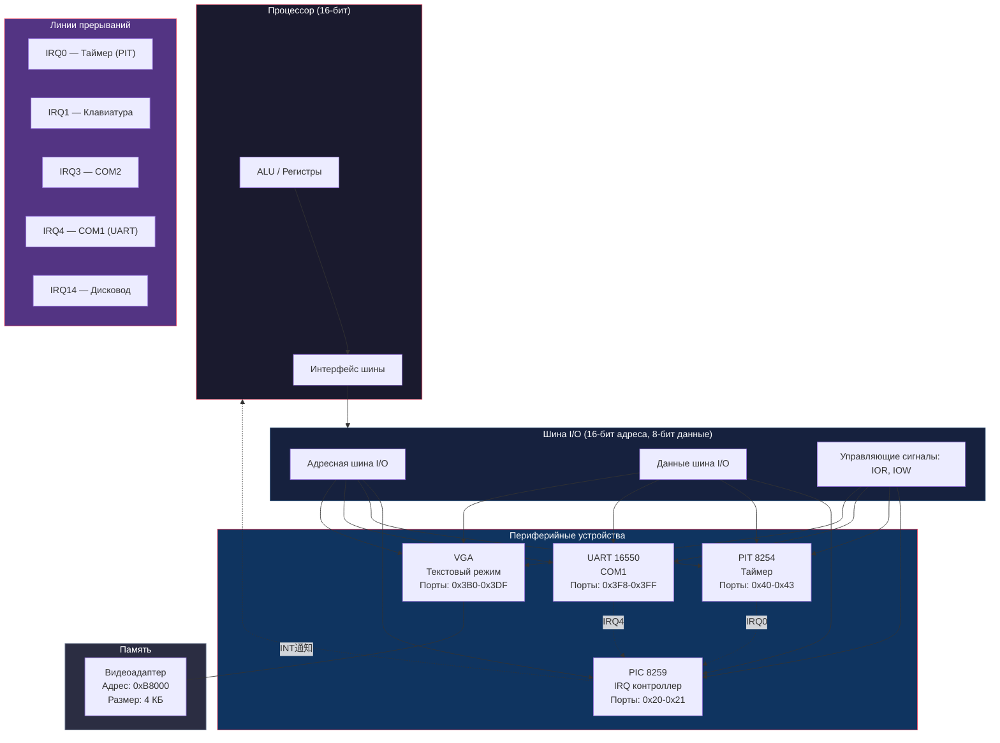
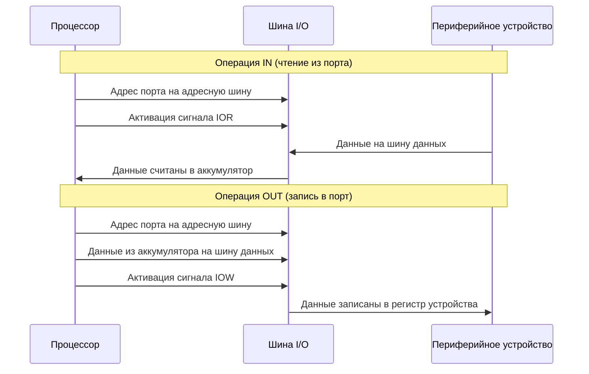
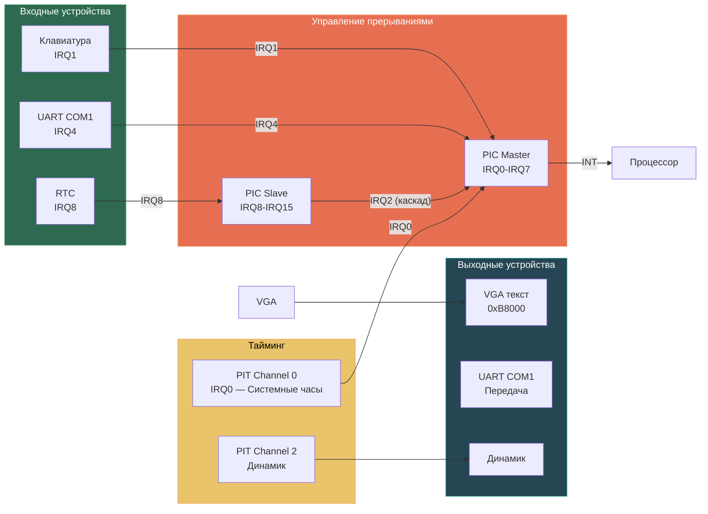

# Обзор периферии NovumOS-16bit

## Введение

NovumOS-16bit работает на пользовательском 16-битном процессоре, совместимом по архитектуре с IBM PC по интерфейсу ввода-вывода. Все периферийные устройства подключаются через шину I/O, используя стандартные 16-битные порты ввода-вывода. Процессор обращается к периферии с помощью инструкций `IN` и `OUT`.

Операционная система взаимодействует с четырьмя основными группами периферийных устройств:

- **PIC** (Programmable Interrupt Controller) — контроллер прерываний, управляет приоритетами и доставкой аппаратных прерываний от устройств к процессору.
- **PIT** (Programmable Interval Timer) — программируемый интервальный таймер, генерирует периодические прерывания для системных часов и точного отсчёта времени.
- **UART** (Universal Asynchronous Receiver/Transmitter) — последовательный порт, обеспечивает асинхронный обмен данными с внешними устройствами.
- **VGA** — адаптер текстового дисплея, выводит текстовую информацию на экран в режиме 80×25 символов.

---

## Блок-схема периферийных устройств

---

## Карта I/O портов

NovumOS-16bit использует следующую карту распределения I/O портов:

### Таблица 1: Полная карта портов ввода-вывода

| Диапазон адресов | Устройство | Назначение |
|---|---|---|
| 0x0000 – 0x000F | DMA-контроллер | Управление прямым доступом к памяти (8237) |
| 0x0020 – 0x0021 | PIC (Master) | Контроллер прерываний (8259) — основной |
| 0x0040 – 0x0043 | PIT | Таймер (8254) — 3 канала + управляющий регистр |
| 0x0060 – 0x0064 | Клавиатура | Контроллер клавиатуры (8042) |
| 0x0070 – 0x0071 | RTC | Часы реального времени (CMOS) |
| 0x0080 – 0x008F | DMA-страницы | Регистры страниц DMA |
| 0x00A0 – 0x00A1 | PIC (Slave) | Контроллер прерываний (8259) — ведомый |
| 0x00C0 – 0x00DF | Канал 3 DMA | Управление DMA-каналом 3 |
| 0x0170 – 0x0177 | Вторичный IDE | Второй канал жёсткого диска |
| 0x01F0 – 0x01F7 | Первичный IDE | Первый канал жёсткого диска |
| 0x0200 – 0x0207 | Игровой порт | Игровой адаптер (Game Port) |
| 0x0278 – 0x027F | LPT2 | Параллельный порт 2 |
| 0x02F8 – 0x02FF | COM2 | Последовательный порт 2 |
| 0x0300 – 0x031F | Прототипы | Карта原型 |
| 0x0378 – 0x037F | LPT1 | Параллельный порт 1 |
| 0x03B0 – 0x03DF | VGA | Видеоадаптер VGA (текстовый/графический режимы) |
| 0x03F0 – 0x03F7 | floppy | Контроллер гибких дисков |
| 0x03F8 – 0x03FF | COM1 | Последовательный порт 1 (UART 16550) |

### Таблица 2: Порты, используемые NovumOS-16bit

| Адрес | Регистр / Назначение | Режим доступа | Описание |
|---|---|---|---|
| 0x20 | PIC Command (Master) | Write | Команды основного PIC (ICW, OCW) |
| 0x21 | PIC Data (Master) | Read/Write | Маска прерываний основного PIC |
| 0x40 | PIT Channel 0 | Read/Write | Счётчик канал 0 (системные часы) |
| 0x41 | PIT Channel 1 | Read/Write | Счётчик канал 1 (ОЗУ — редко используется) |
| 0x42 | PIT Channel 2 | Read/Write | Счётчик канал 2 (динамик) |
| 0x43 | PIT Command | Write | Управляющий регистр PIT |
| 0x3F8 | COM1 RBR/THR | Read/Write | Регистр приёма / передачи |
| 0x3F9 | COM1 IER | Read/Write | Регистр разрешения прерываний |
| 0x3FA | COM1 IIR | Read | Регистр идентификации прерываний |
| 0x3FB | COM1 LCR | Read/Write | Регистр управления линией |
| 0x3FC | COM1 MCR | Read/Write | Регистр управления модемом |
| 0x3FD | COM1 LSR | Read | Регистр статуса линии |
| 0x3FE | COM1 MSR | Read | Регистр статуса модема |
| 0x3FF | COM1 SCR | Read/Write | Регистр скретч-пада |
| 0xB8000 (память) | VGA Text Buffer | Write | Буфер текстового экрана (4 КБ) |

---

## Назначение линий прерываний (IRQ)

Каждое периферийное устройство подключено к определённой линии прерывания на контроллере прерываний (PIC). Когда устройство требует внимания процессора (например, таймер сработал, данные получены по UART), он активирует свою линию IRQ, и PIC передаёт прерывание процессору.

### Таблица 3: Распределение IRQ

| IRQ | Источник | Описание |
|---|---|---|
| IRQ0 | PIT (Channel 0) | Таймер — системные часы. Генерирует ~18.2 прерывания в секунду (базовая частота 1.193182 МГц / 65536). Используется для планировщика задач и отсчёта времени. |
| IRQ1 | Клавиатура | Контроллер клавиатуры (8042) генерирует прерывание при нажатии или отпускании клавиши. |
| IRQ2 | Каскадный | Сигнал каскада с ведомого PIC. Все прерывания с IRQ8-IRQ15 проходят через IRQ2. |
| IRQ3 | COM2 | Последовательный порт 2 (не используется в базовой конфигурации). |
| IRQ4 | COM1 (UART) | Последовательный порт 1 — прерывания при приёме данных, завершении передачи или изменении состояния линии. |
| IRQ5 | LPT2 / Звук | Параллельный порт 2 или звуковая карта (Sound Blaster). |
| IRQ6 | Флоппи-дисковод | Контроллер гибкого диска (8272). |
| IRQ7 | LPT1 | Параллельный порт 1. |
| IRQ8 | RTC | Часы реального времени (прерывание будильника). |
| IRQ9 | — | Свободен (или ACPI). |
| IRQ10 | — | Свободен. |
| IRQ11 | — | Свободен. |
| IRQ12 | Клон мыши | PS/2 порт мыши. |
| IRQ13 | Копроцессор | FPU (сопроцессор плавающей запятой). |
| IRQ14 | Primary IDE | Первичный канал IDE (жёсткий диск). |
| IRQ15 | Secondary IDE | Вторичный канал IDE. |

---

## Принцип обращения к периферии: инструкции IN и OUT

Процессор NovumOS-16bit взаимодействует с периферийными устройствами через специальные инструкции ввода-вывода, которые используют отдельное адресное пространство (I/O address space), не связанное с основной оперативной памятью.

### Инструкция IN (ввод из порта)

Инструкция `IN` читает данные из указанного порта ввода-вывода в аккумулятор (AL для 8 бит, AX для 16 бит).

**Формат:** `IN accumulator, port`

**Процесс:**
1. Процессор выставляет на адресную шину I/O номер порта.
2. Процессор активирует сигнал `IOR` (I/O Read).
3. Устройство, адресованное данным портом, размещает свои данные на шине данных.
4. Процессор считывает данные из шины данных в аккумулятор.

**Пример (псевдокод):** чтение регистра статуса линии UART (LSR) из порта 0x3FD:
- Процессор помещает адрес 0x3FD на адресную шину.
- Активируется сигнал `IOR`.
- UART размещает содержимое регистра LSR на шине данных.
- Процессор считывает байт в AL.

### Инструкция OUT (вывод в порт)

Инструкция `OUT` записывает данные из аккумулятора в указанный порт ввода-вывода.

**Формат:** `OUT port, accumulator`

**Процесс:**
1. Процессор выставляет на адресную шину I/O номер порта.
2. Процессор выставляет данные из аккумулятора на шину данных.
3. Процессор активирует сигнал `IOW` (I/O Write).
4. Устройство, адресованное данным портом, записывает данные из шины данных в свой внутренний регистр.

**Пример (псевдокод):** запись команды в PIC (контроллер прерываний) в порт 0x20:
- Процессор помещает адрес 0x20 на адресную шину.
- Процессор помещает значение команды на шину данных.
- Активируется сигнал `IOW`.
- PIC считывает команду и выполняет соответствующее действие.

### Схема взаимодействия

### 16-битные особенности

В 16-битном режиме процессор NovumOS может выполнять чтение/запись 16 бит за одну операцию `IN`/`OUT`. Это позволяет:
- Считывать 16-битный счётчик таймера за один раз (два байта).
- Записывать 16-битное значение divisor'а в UART для настройки скорости передачи.
- Осуществлять доступ к 16-битным портам DMA-контроллера.

Однако большинство периферийных устройств PC-совместимости работают с 8-битными портами, поэтому в большинстве случаев используется `IN AL, port` / `OUT port, AL`.

---

## Связь между устройствами

Периферийные устройства NovumOS-16bit тесно взаимодействуют друг с другом:

1. **PIT → PIC**: Таймер (PIT) периодически генерирует сигнал на линии IRQ0, который поступает на основной PIC. PIC в свою очередь передаёт прерывание процессору.

2. **UART → PIC**: Последовательный порт (UART) генерирует прерывания на IRQ4 при получении данных, завершении передачи или изменении состояния линии. PIC доставляет эти прерывания процессору.

3. **PIC → CPU**: Контроллер прерываний агрегирует все входящие IRQ-сигналы и передаёт один общий сигнал `INT` процессору, одновременно выставляя на шину данных номер вектора прерывания.

4. **VGA — независимое устройство**: Видеоадаптер не генерирует прерываний в текстовом режиме. Процессор записывает данные непосредственно в видеоадаптер по фиксированному адресу 0xB8000 в оперативной памяти ( memory-mapped I/O).

---

## Итоговая архитектура периферии

