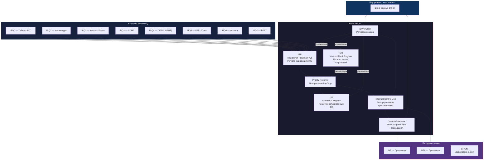
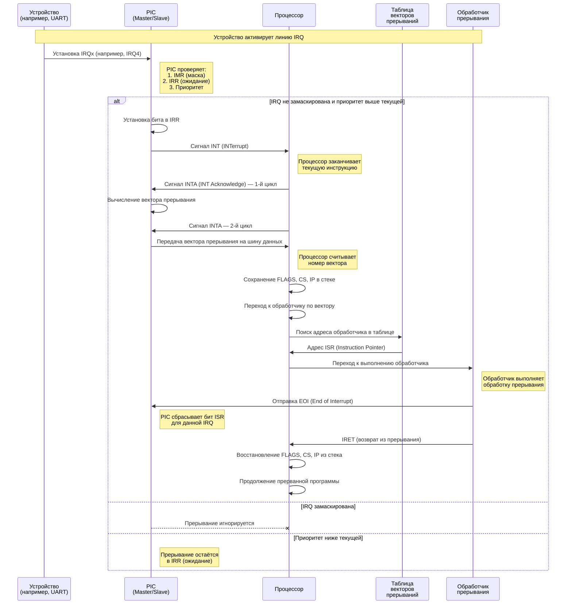
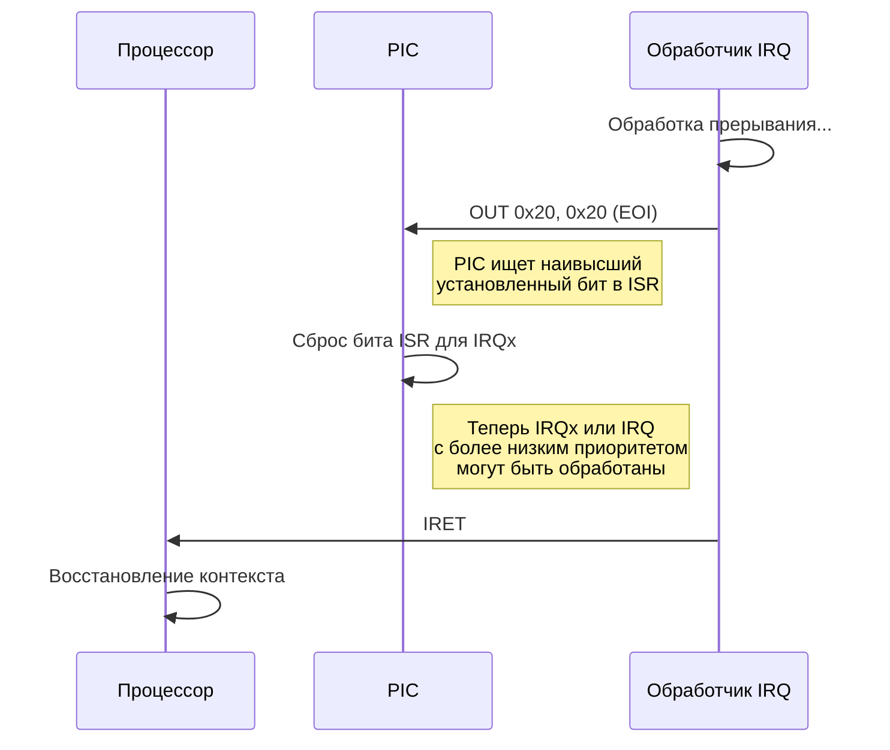
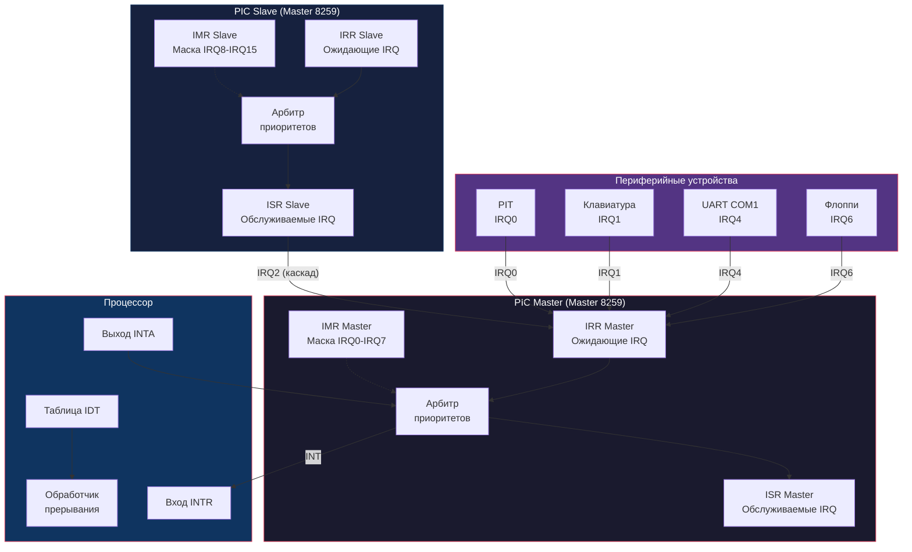

# Контроллер прерываний 8259 — NovumOS-16bit

## Введение

Intel 8259 (Programmable Interrupt Controller, PIC) — это программируемый контроллер прерываний, который управляет приоритетами и маршрутизацией аппаратных прерываний от периферийных устройств к процессору. В системе NovumOS-16bit используются два контроллера 8259, работающих в каскадной конфигурации:

- **Master (основной)** — управляет прерываниями IRQ0–IRQ7.
- **Slave (ведомый)** — управляет прерываниями IRQ8–IRQ15. Подключён к IRQ2 основного контроллера.

Такая конфигурация позволяет обрабатывать до 15 аппаратных прерываний (IRQ2 используется для каскада и недоступен для подключения устройств).

---

## Блок-схема 8259

---

## Регистры 8259

### Внутренние регистры

8259 содержит несколько внутренних регистров, которые не доступны программисту напрямую через I/O порты, но определяют поведение контроллера:

| Регистр | Название | Описание |
|---|---|---|
| **IRR** | Interrupt Request Register | Регистр запросов прерываний. Каждый из 8 бит соответствует одной линии IRQ. Устанавливается в 1, когда на линии IRQ обнаружен активный уровень. Бит очищается после подачи INTR ( acknowledges прерывания). |
| **ISR** | In-Service Register | Регистр обслуживания. Устанавливается в 1 для IRQ, которое в данный момент обрабатывается (после подачи INTA). Бит очищается при получении EOI (End of Interrupt). |
| **IMR** | Interrupt Mask Register | Регистр маски. Доступен через порт данных (0x21). Каждый бит маскирует соответствующую IRQ: 1 = прерывание заблокировано, 0 = прерывание разрешено. |

### Таблица 1: Внутренние регистры и их биты

| Регистр | Бит 7 | Бит 6 | Бит 5 | Бит 4 | Бит 3 | Бит 2 | Бит 1 | Бит 0 |
|---|---|---|---|---|---|---|---|---|
| IRR | IRQ7 | IRQ6 | IRQ5 | IRQ4 | IRQ3 | IRQ2 | IRQ1 | IRQ0 |
| ISR | IRQ7 | IRQ6 | IRQ5 | IRQ4 | IRQ3 | IRQ2 | IRQ1 | IRQ0 |
| IMR | IRQ7 | IRQ6 | IRQ5 | IRQ4 | IRQ3 | IRQ2 | IRQ1 | IRQ0 |

---

## I/O порты PIC

В каскадной конфигурации используются 4 I/O порта (2 на каждый контроллер):

### Таблица 2: Распределение I/O портов

| Порт | Адрес | Доступ | Описание |
|---|---|---|---|
| Master Command | 0x20 | Write | Регистр команд основного PIC (ICW1, OCW2, OCW3) |
| Master Data | 0x21 | Read/Write | Регистр данных основного PIC (ICW2-4, OCW1/IMR) |
| Slave Command | 0xA0 | Write | Регистр команд ведомого PIC (ICW1, OCW2, OCW3) |
| Slave Data | 0xA1 | Read/Write | Регистр данных ведомого PIC (ICW2-4, OCW1/IMR) |

### Порт команд (0x20 / 0xA0)

Запись в порт команд определяет, какой тип команды передаётся:

- Если **бит D4 = 1** → команда является **ICW1** (Initialization Command Word 1)
- Если **бит D4 = 0 и бит D3 = 0** → команда является **OCW2** (Operation Control Word 2)
- Если **бит D4 = 0 и бит D3 = 1** → команда является **OCW3** (Operation Control Word 3)

### Порт данных (0x21 / 0xA1)

Запись/чтение в порт данных зависит от состояния инициализации:
- Во время инициализации: записываются последовательные ICW2, ICW3, ICW4.
- После инициализации: чтение/запись IMR (регистр маски прерываний).

---

## Командные слова (ICW — Initialization Command Words)

Для настройки PIC необходимо последовательно записать 4 командных слова инициализации. Каждое слово выполняет определённую функцию настройки.

### ICW1 — Команда инициализации 1

Записывается в порт команд (0x20 для Master, 0xA0 для Slave).

#### Таблица 3: Формат ICW1

| Бит | Название | Описание |
|---|---|---|
| D7 | A7 | Адрес вектора прерывания (бит 7) — зависит от бита SNGL |
| D6 | A6 | Адрес вектора прерывания (бит 6) — зависит от бита SNGL |
| D5 | A5 | Адрес вектора прерывания (бит 5) — зависит от ADI |
| D4 | 1 | **Обязательный бит**: всегда должен быть равен 1 для ICW1. Определяет, что записываемое слово является ICW1. |
| D3 | LTIM | Тип.Level/Edge Triggered. 0 = Edge-triggered (по фронту), 1 = Level-triggered (по уровню). В NovumOS-16bit используется 0 (edge-triggered). |
| D2 | ADI | ADO Call Address Interval. 0 = интервал 8 (8080/8085), 1 = интервал 4 (8086/8088). Для 8086 используется 0. |
| D1 | SNGL | Single/Cascade. 1 = одиночный PIC (без каскада), 0 = каскадная конфигурация (Master + Slave). |
| D0 | IC4 | Необходимость ICW4. 1 = ICW4 требуется, 0 = ICW4 не требуется. Для 8086 используется 1. |

**Значение ICW1 для NovumOS-16bit (Master):** `0001 0001` = `0x11`
- D4 = 1 (ICW1)
- LTIM = 0 (edge-triggered)
- ADI = 0 (8086 mode)
- SNGL = 0 (каскад)
- IC4 = 1 (нужен ICW4)

### ICW2 — Базовый адрес вектора прерывания

Записывается в порт данных (0x21 / 0xA1). Определяет, какой вектор прерывания будет передан процессору при срабатывании IRQ0.

#### Таблица 4: Формат ICW2

| Бит | Название | Описание |
|---|---|---|
| D7 | T7 | Старший бит базового адреса вектора прерывания |
| D6 | T6 | |
| D5 | T5 | |
| D4 | T4 | |
| D3 | T3 | Младший бит базового адреса вектора прерывания |
| D2 | A2 | Номер IRQ0 (вектор = T7-T3 + 000) |
| D1 | A1 | Номер IRQ1 (вектор = T7-T3 + 001) |
| D0 | A0 | Номер IRQ2 (вектор = T7-T3 + 010) |

**NovumOS-16bit использует:**
- **Master:** ICW2 = `0x08` → IRQ0 генерирует вектор `0x08`, IRQ1 → `0x09`, ..., IRQ7 → `0x0F`.
- **Slave:** ICW2 = `0x70` → IRQ8 генерирует вектор `0x70`, IRQ9 → `0x71`, ..., IRQ15 → `0x77`.

### ICW3 — Конфигурация каскада

Записывается в порт данных (0x21 / 0xA1). Определяет, какой IRQ используется для связи Master и Slave.

#### Таблица 5: Формат ICW3

**Для Master (D7-D0 = S7-S0):**

| Бит | Название | Описание |
|---|---|---|
| D7 | S7 | IRQ7 подключён к выходу Slave? 1 = да, 0 = нет |
| D6 | S6 | IRQ6 подключён к выходу Slave? |
| D5 | S5 | IRQ5 подключён к выходу Slave? |
| D4 | S4 | IRQ4 подключён к выходу Slave? |
| D3 | S3 | IRQ3 подключён к выходу Slave? |
| D2 | S2 | IRQ2 подключён к выходу Slave? **В NovumOS-16bit = 1** |
| D1 | S1 | IRQ1 подключён к выходу Slave? |
| D0 | S0 | IRQ0 подключён к выходу Slave? |

**Для Slave (D7-D0 = ID2-ID0):**

| Бит | Название | Описание |
|---|---|---|
| D7-D3 | 0 | Не используются |
| D2 | ID2 | ID номер IRQ на Master, к которому подключён Slave |
| D1 | ID1 | |
| D0 | ID0 | |

**NovumOS-16bit:**
- Master ICW3 = `0x04` (бит S2 = 1 → Slave подключён к IRQ2).
- Slave ICW3 = `0x02` (Slave подключён к IRQ2 на Master).

### ICW4 — Режим работы

Записывается в порт данных (0x21 / 0xA1). Определяет режим работы PIC.

#### Таблица 6: Формат ICW4

| Бит | Название | Описание |
|---|---|---|
| D7 | 0 | Не используется |
| D6 | 0 | Не используется |
| D5 | 0 | Не используется |
| D4 | SFNM | Special Fully Nested Mode. 1 = режим special fully nested, 0 = обычный режим. |
| D3 | BUF | Buffered Mode. 0 = не буферизованный, 1 = буферизованный. |
| D2 | M/S | Master/Slave (актуально при BUF=1). 1 = Master, 0 = Slave. |
| D1 | AEOI | Automatic End-of-Interrupt. 1 = автоматический EOI (PIC автоматически очищает ISR при подаче INTR), 0 = ручной EOI (требуется OCW2 с EOI). |
| D0 | μPM | Microprocessor Mode. 0 = 8080/8085, 1 = 8086/8088. |

**NovumOS-16bit использует:** ICW4 = `0x01`
- μPM = 1 (8086 mode)
- AEOI = 0 (ручной EOI — более предсказуемое поведение)
- M/S = 0
- BUF = 0
- SFNM = 0

---

## Операционные командные слова (OCW — Operation Control Words)

После инициализации PIC принимает операционные команды (OCW) для управления маскированием и приоритетами прерываний.

### OCW1 — Маска прерываний (IMR)

Записывается/читается из порта данных (0x21 / 0xA1) после завершения инициализации.

#### Таблица 7: Формат OCW1

| Бит | Название | Описание |
|---|---|---|
| D7 | IRQ7/Mask7 | 1 = IRQ7 заблокирована, 0 = IRQ7 разрешена |
| D6 | IRQ6/Mask6 | 1 = IRQ6 заблокирована, 0 = IRQ6 разрешена |
| D5 | IRQ5/Mask5 | 1 = IRQ5 заблокирована, 0 = IRQ5 разрешена |
| D4 | IRQ4/Mask4 | 1 = IRQ4 заблокирована, 0 = IRQ4 разрешена |
| D3 | IRQ3/Mask3 | 1 = IRQ3 заблокирована, 0 = IRQ3 разрешена |
| D2 | IRQ2/Mask2 | 1 = IRQ2 заблокирована, 0 = IRQ2 разрешена |
| D1 | IRQ1/Mask1 | 1 = IRQ1 заблокирована, 0 = IRQ1 разрешена |
| D0 | IRQ0/Mask0 | 1 = IRQ0 заблокирована, 0 = IRQ0 разрешена |

**Примечание:** В каскадной конфигурации, чтобы разрешить прерывания с Slave (IRQ8-IRQ15), необходимо также разрешить IRQ2 на Master, так как Slave подключён через IRQ2.

**NovumOS-16bit:** маска по умолчанию = `0xFC` (биты 2 и 4 разрешены → IRQ2 для каскада и IRQ4 для UART, остальные заблокированы).

### OCW2 — Управление приоритетами и EOI

Записывается в порт команд (0x20 / 0xA0).

#### Таблица 8: Формат OCW2

| Бит | Название | Описание |
|---|---|---|
| D7 | R | Rotate — включение вращения приоритетов |
| D6 | SL | Specific — указание конкретной IRQ |
| D5 | EOI | End of Interrupt — завершение прерывания |
| D4 | 0 | Обязательный бит (всегда 0 для OCW2) |
| D3 | 0 | Обязательный бит (всегда 0 для OCW2) |
| D2 | L2 | Номер IRQ для Specific EOI/Rotate |
| D1 | L1 | |
| D0 | L0 | |

#### Таблица 9: Основные команды OCW2

| R | SL | EOI | L2-L0 | Команда | Описание |
|---|---|---|---|---|---|
| 0 | 0 | 1 | 000 | **Non-Specific EOI** | Сбрасывает бит ISR для наивысшего приоритета из обслуживаемых. Используется при ручном EOI. |
| 0 | 1 | 1 | LLL | **Specific EOI** | Сбрасывает бит ISR для указанной IRQ (L2-L0). |
| 1 | 0 | 1 | 000 | **Rotate in Non-Specific EOI** | EOI + вращение приоритетов: IRQ, которая была обслужена, получает наименьший приоритет. |
| 1 | 1 | 1 | LLL | **Rotate in Specific EOI** | Specific EOI + вращение приоритетов для указанной IRQ. |
| 1 | 0 | 0 | 000 | **Rotate on Automatic EOI (Set)** | Включает автоматическое вращение приоритетов. |
| 0 | 0 | 0 | 000 | **Rotate on Automatic EOI (Reset)** | Отключает автоматическое вращение приоритетов. |
| 1 | 1 | 0 | LLL | **Set Priority** | Устанавливает приоритет для указанной IRQ. |
| 0 | 1 | 0 | 011 | **NOP** | Нет операции (специфическая команда). |

**NovumOS-16bit использует:** OCW2 = `0x20` (Non-Specific EOI) для завершения обработки прерывания.

### OCW3 — Управление чтением регистров

Записывается в порт команд (0x20 / 0xA0).

#### Таблица 10: Формат OCW3

| Бит | Название | Описание |
|---|---|---|
| D7 | 0 | Не используется |
| D6 | ESMM | Enable Special Mask Mode. 1 = включить, 0 = отключить |
| D5 | SMM | Special Mask Mode. 1 = Special Mask Mode, 0 = обычный. Действует только при ESMM=1. |
| D4 | 1 | Обязательный бит (всегда 1 для OCW3) |
| D3 | 1 | Обязательный бит (всегда 1 для OCW3) |
| D2 | P | Poll. 1 = запрос Poll (чтение наивысшего приоритета IRQ), 0 = без Poll. |
| D1 | RR | Read Register. 1 = разрешить чтение IRR/ISR. |
| D0 | RIS | Read In-Service. 1 = ISR, 0 = IRR (действует при RR=1). |

**NovumOS-16bit использует:** OCW3 = `0x0A` (RR=1, RIS=0) для чтения IRR, или `0x0B` (RR=1, RIS=1) для чтения ISR.

---

## Последовательность инициализации PIC

Инициализация PIC должна выполняться строго в определённом порядке. Каждое ICW записывается последовательно: сначала ICW1, затем ICW2, ICW3 и ICW4. PIC автоматически отслеживает состояние инициализации.

### Последовательность:

```mermaid
sequenceDiagram
    participant OS as Ядро NovumOS
    participant MASTER as PIC Master (0x20/0x21)
    participant SLAVE as PIC Slave (0xA0/0xA1)

    Note over OS,SLAVE: Начало инициализации PIC

    rect rgb(30, 30, 60)
        Note over OS,MASTER: Инициализация Master PIC

        OS->>MASTER: OUT 0x20, 0x11 (ICW1)
        Note right of MASTER: ICW1: каскад, 8086,<br/>edge-triggered, нужен ICW4

        OS->>MASTER: OUT 0x21, 0x08 (ICW2)
        Note right of MASTER: ICW2: базовый вектор 0x08<br/>IRQ0→0x08, IRQ7→0x0F

        OS->>MASTER: OUT 0x21, 0x04 (ICW3)
        Note right of MASTER: ICW3: Slave на IRQ2

        OS->>MASTER: OUT 0x21, 0x01 (ICW4)
        Note right of MASTER: ICW4: 8086 mode,<br/>ручной EOI
    end

    rect rgb(60, 30, 30)
        Note over OS,SLAVE: Инициализация Slave PIC

        OS->>SLAVE: OUT 0xA0, 0x11 (ICW1)
        Note right of SLAVE: ICW1: каскад, 8086,<br/>edge-triggered, нужен ICW4

        OS->>SLAVE: OUT 0xA1, 0x70 (ICW2)
        Note right of SLAVE: ICW2: базовый вектор 0x70<br/>IRQ8→0x70, IRQ15→0x77

        OS->>SLAVE: OUT 0xA1, 0x02 (ICW3)
        Note right of SLAVE: ICW3: подключён к IRQ2<br/>на Master

        OS->>SLAVE: OUT 0xA1, 0x01 (ICW4)
        Note right of SLAVE: ICW4: 8086 mode,<br/>ручной EOI
    end

    rect rgb(30, 60, 30)
        Note over OS,SLAVE: Установка масок прерываний

        OS->>MASTER: OUT 0x21, 0xFC (OCW1)
        Note right of MASTER: Маска Master: IRQ0, IRQ2, IRQ4<br/>разрешены, остальные заблокированы

        OS->>SLAVE: OUT 0xA1, 0xFF (OCW1)
        Note right of SLAVE: Маска Slave: все IRQ<br/>заблокированы
    end

    Note over OS,SLAVE: Инициализация завершена
```

### Порядок записи (детально):

1. **ICW1 → порт команд** (0x20 / 0xA0): Указывает начало инициализации. Определяет режим (каскад/одиночный), тип прерывания (edge/level), необходимость ICW4.

2. **ICW2 → порт данных** (0x21 / 0xA1): Задаёт базовый адрес вектора прерывания. Все IRQ этого PIC будут генерировать векторы начиная с этого адреса.

3. **ICW3 → порт данных** (0x21 / 0xA1): Конфигурация каскада. Для Master указывает, какой IRQ используется для подключения Slave. Для Slave указывает, к какому IRQ на Master он подключён.

4. **ICW4 → порт данных** (0x21 / 0xA1): Дополнительные настройки: режим процессора (8086), автоматический/ручной EOI, буферизация.

5. **OCW1 → порт данных** (0x21 / 0xA1): Установка маски прерываний. Разрешает или блокирует отдельные IRQ.

---

## Процесс обработки прерывания (IRQ)

Когда периферийное устройство активирует свою линию IRQ, PIC обрабатывает это событие и передаёт прерывание процессору. Ниже подробно описан полный цикл.

### Последовательная диаграмма обработки IRQ

### Пошаговое описание процесса:

**Шаг 1: Активация IRQ**
Устройство (например, UART при получении данных) устанавливает активный уровень на соответствующей линии IRQ. Для edge-triggered режима это переход от логического 0 к логической 1.

**Шаг 2: Проверка в PIC**
PIC проверяет:
- Установлен ли бит маски для данной IRQ в IMR (если да → прерывание блокировано).
- Не является ли текущее обслуживаемое прерывание более высокого приоритета (если да → IRQ остаётся в IRR).

**Шаг 3: Сигнал INT**
Если прерывание допустимо, PIC устанавливает сигнал `INT` на высокий уровень, оповещая процессор.

**Шаг 4: Подтверждение (INTA)**
Процессор, завершив текущую инструкцию, отправляет два последовательных сигнала `INTA` (Interrupt Acknowledge). PIC считывает эти сигналы и готовит вектор прерывания.

**Шаг 5: Передача вектора**
На втором цикле `INTA` PIC выставляет на шину данных 8-битный номер вектора прерывания (например, `0x0C` для IRQ4). Процессор считывает его.

**Шаг 6: Переход к обработчику**
Процессор сохраняет регистры (FLAGS, CS, IP) в стеке и выполняет переход по адресу из таблицы прерываний (IDT), соответствующему полученному вектору.

**Шаг 7: Выполнение обработчика**
Обработчик прерывания (ISR — Interrupt Service Routine) выполняет необходимую обработку: читает данные из устройства, обновляет флаги, уведомляет ядро и т.д.

**Шаг 8: Отправка EOI**
После завершения обработки обработчик отправляет команду End of Interrupt (EOI) в PIC. Это указывает PIC сбросить соответствующий бит в ISR, разрешая обработку следующих прерываний.

**Шаг 9: Возврат из прерывания**
Инструкция `IRET` восстанавливает регистры FLAGS, CS, IP из стека, и процессор продолжает выполнение прерванной программы.

---

## Процесс End of Interrupt (EOI)

EOI (End of Interrupt) — это команда, которая сообщает PIC, что обработка текущего прерывания завершена. Без отправки EOI PIC будет блокировать прерывания того же или более низкого приоритета, так как бит в ISR не будет сброшен.

### Типы EOI

| Тип | Команда | Описание |
|---|---|---|
| **Non-Specific EOI** | `OUT 0x20, 0x20` | Сбрасывает бит ISR для IRQ с наивысшим приоритетом из текущего ISR. Используется в большинстве случаев. |
| **Specific EOI** | `OUT 0x20, 0x6x` (где x = номер IRQ) | Сбрасывает бит ISR для конкретной IRQ. Используется, когда нужно гарантированно сбросить определённую IRQ. |
| **Automatic EOI** | Настройка в ICW4 (AEOI=1) | PIC автоматически сбрасывает ISR при подаче INTR. Не требует явной команды EOI. Не рекомендуется для NovumOS-16bit из-за риска потери прерываний. |

### Последовательность EOI:

### Важные замечания по EOI:

1. **EOI всегда отправляется в порт команд** (0x20 для Master, 0xA0 для Slave).
2. Если прерывание пришло через каскад (IRQ8-IRQ15), необходимо отправить **два EOI**: один в Slave, затем один в Master.
3. **Порядок важен**: сначала EOI для Slave, затем EOI для Master. Это гарантирует, что PIC Master не начнёт обрабатывать прерывания с Slave до завершения обработки на Slave.
4. Если используется Automatic EOI (AEOI=1 в ICW4), отправка EOI не требуется, но это может привести к проблемам с повторным входом прерывания.

---

## Приоритеты IRQ

По умолчанию PIC использует вложенную систему приоритетов, где IRQ0 имеет наивысший приоритет, а IRQ7 — наименьший.

### Таблица приоритетов (по умолчанию):

| Приоритет | IRQ (Master) | Устройство |
|---|---|---|
| Наивысший | IRQ0 | PIT (Таймер) |
| 2 | IRQ1 | Клавиатура |
| 3 | IRQ2 | Каскад (Slave) |
| 4 | IRQ3 | COM2 |
| 5 | IRQ4 | COM1 (UART) |
| 6 | IRQ5 | LPT2 / Звук |
| 7 | IRQ6 | Флоппи |
| Наименьший | IRQ7 | LPT1 |

Для IRQ8-IRQ15 (Slave) приоритеты аналогичны: IRQ8 — наивысший, IRQ15 — наименьший.

### Режимы приоритетов:

1. **Fully Nested Mode (по умолчанию)**: IRQ0 имеет наивысший приоритет, IRQ7 — наименьший. Если обрабатывается IRQ4, только IRQ0–IRQ3 могут прервать текущий обработчик.

2. **Rotating Priority Mode (вращение приоритетов)**: После обслуживания IRQ её приоритет становится наименьшим. Это обеспечивает справедливое распределение времени обработки.

---

## Итоговая блок-схема PIC в системе

---

## Резюме

| Параметр | Значение |
|---|---|
| Чип | Intel 8259 (два в каскаде) |
| Master I/O порты | 0x20 (команды), 0x21 (данные) |
| Slave I/O порты | 0xA0 (команды), 0xA1 (данные) |
| Master ICW1 | 0x11 |
| Master ICW2 | 0x08 (векторы 0x08-0x0F) |
| Master ICW3 | 0x04 (Slave на IRQ2) |
| Master ICW4 | 0x01 (8086 mode, ручной EOI) |
| Slave ICW1 | 0x11 |
| Slave ICW2 | 0x70 (векторы 0x70-0x77) |
| Slave ICW3 | 0x02 (подключён к IRQ2) |
| Slave ICW4 | 0x01 |
| EOI команда | Non-Specific: OUT 0x20, 0x20 |
| Разрешённые IRQ | IRQ0 (таймер), IRQ2 (каскад), IRQ4 (UART) |
| Тип прерывания | Edge-triggered |
| Режим | 8086, ручной EOI |
