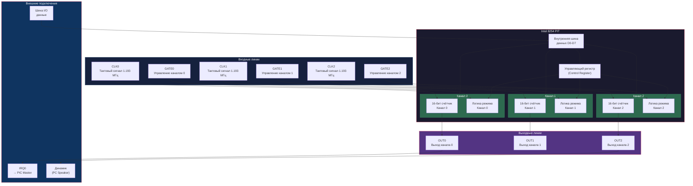
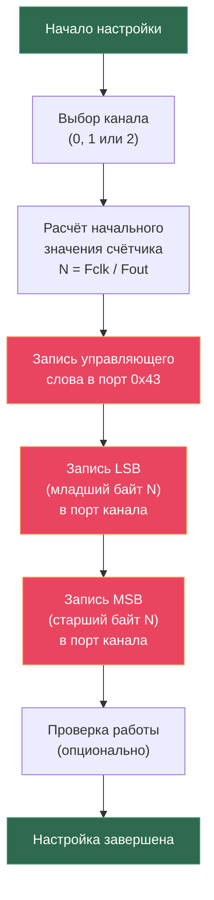
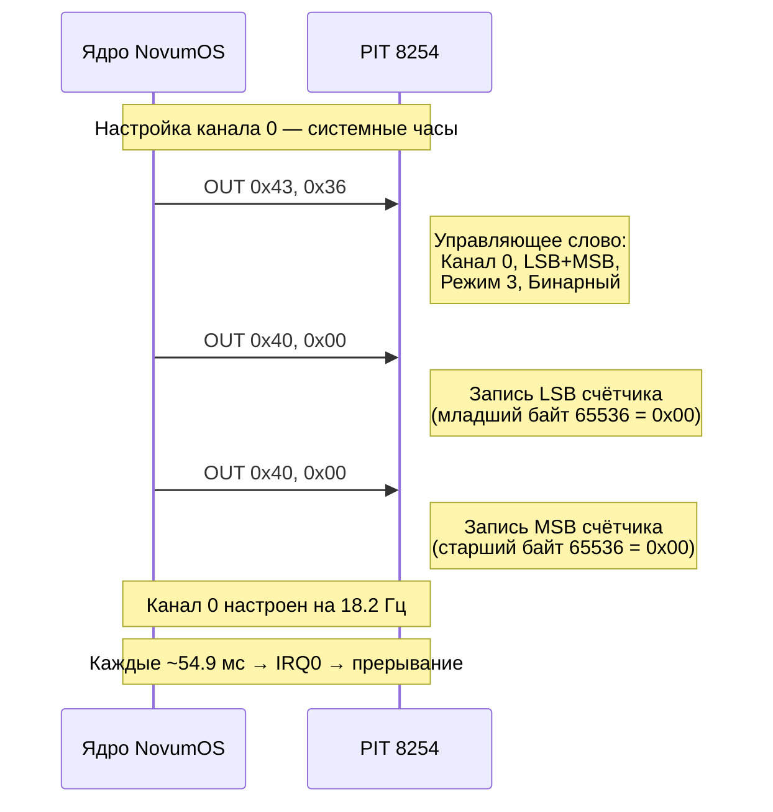
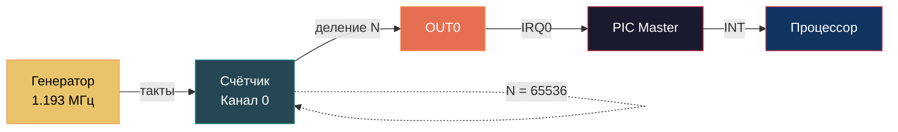
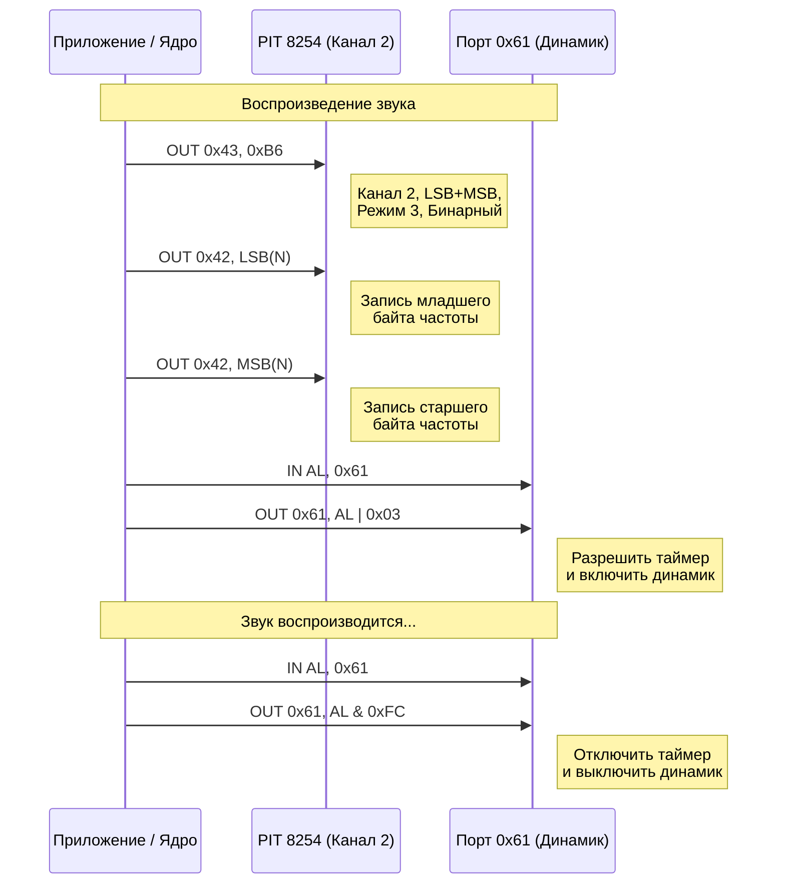
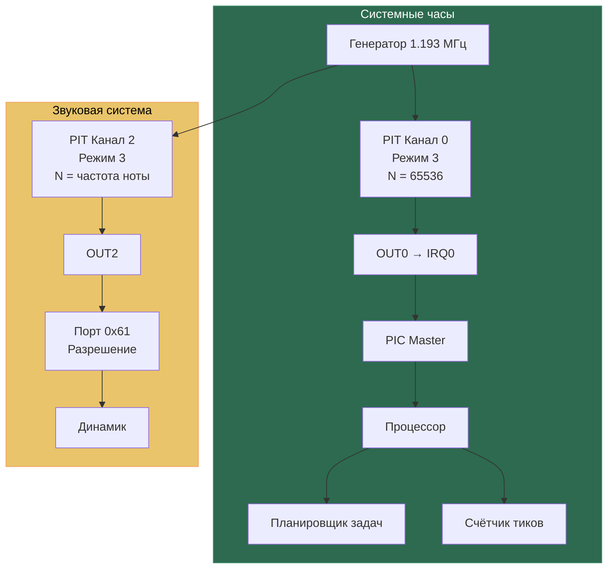

# Программируемый интервальный таймер 8254 — NovumOS-16bit

## Введение

Intel 8254 (Programmable Interval Timer, PIT) — это программируемый интервальный таймер, который обеспечивает точный отсчёт времени, генерацию периодических прерываний и управление звуком динамика. В системе NovumOS-16bit используется как совместимая замена Intel 8253 с расширенными возможностями.

Пит-таймер содержит три независимых 16-битных счётчика (канала), каждый из которых может работать в различных режимах генерации импульсов. Основная тактовая частота таймера составляет **1.193182 МГц** — это частота генератора, которая делится для получения нужных интервалов.

### Назначение каналов в NovumOS-16bit:

| Канал | Назначение | Интервал | Режим |
|---|---|---|---|
| Канал 0 | Системные часы (IRQ0) | ~54.9 мс (18.2 Гц) | Режим 3 (симметричный меандр) |
| Канал 1 | ОЗУ (не используется) | — | — |
| Канал 2 | Динамик (PC Speaker) | Зависит от частоты тона | Режим 3 (симметричный меандр) |

---

## Блок-схема 8254



---

## I/O порты PIT

### Таблица 1: Распределение I/O портов

| Адрес | Имя | Доступ | Описание |
|---|---|---|---|
| 0x40 | Counter 0 | Read/Write | Регистр счётчика канала 0. Читается/записывается младший и старший байты. |
| 0x41 | Counter 1 | Read/Write | Регистр счётчика канала 1. Аналогично каналу 0. |
| 0x42 | Counter 2 | Read/Write | Регистр счётчика канала 2. Аналогично каналу 0. |
| 0x43 | Control | Write | Управляющий регистр. Определяет: номер канала, режим работы, формат чтения/записи. |

### Доступ к счётчикам

Счётчики 8254 are 16-битные, но I/O порты являются 8-битными. Поэтому для чтения или записи полного 16-битного значения необходимо Performs два обращения к порту: сначала младший байт (LSB), затем старший байт (MSB), или наоборот, в зависимости от настройки в управляющем регистре.

---

## Управляющий регистр (Control Register)

Управляющий регистр доступен только для записи по адресу 0x43. Каждая запись в этот регистр определяет параметры работы для выбранного канала.

### Таблица 2: Формат управляющего регистра

| Бит | Название | Описание |
|---|---|---|
| D7 | SC1 | Select Counter (бит 1) — старший бит выбора канала |
| D6 | SC0 | Select Counter (бит 0) — младший бит выбора канала |
| D5 | RW1 | Read/Write (бит 1) — старший бит формата доступа |
| D4 | RW0 | Read/Write (бит 0) — младший бит формата доступа |
| D3 | M2 | Mode (бит 2) — старший бит номера режима |
| D2 | M1 | Mode (бит 1) — средний бит номера режима |
| D1 | M0 | Mode (бит 0) — младший бит номера режима |
| D0 | BCD | BCD/Binary. 0 = двоичный счётчик, 1 = BCD (десятичный). |

### Таблица 3: Выбор канала (SC1, SC0)

| SC1 | SC0 | Канал |
|---|---|---|
| 0 | 0 | Канал 0 |
| 0 | 1 | Канал 1 |
| 1 | 0 | Канал 2 |
| 1 | 1 | Чтение обратного значения (Read-Back Command — только 8254, не 8253) |

### Таблица 4: Формат доступа (RW1, RW0)

| RW1 | RW0 | Формат | Описание |
|---|---|---|---|
| 0 | 0 | Counter Latch | Заморозить текущее значение счётчика для чтения (не изменяет работающий счётчик) |
| 0 | 1 | Only LSB | Доступ только к младшему байту (8-бит) |
| 1 | 0 | Only MSB | Доступ только к старшему байту (8-бит) |
| 1 | 1 | LSB then MSB | Сначала младший байт, затем старший (16-бит) |

### Таблица 5: Режимы работы (M2, M1, M0)

| M2 | M1 | M0 | Режим | Описание |
|---|---|---|---|---|
| 0 | 0 | 0 | **Режим 0** | Interrupt on Terminal Count. Счётчик уменьшается до 0, затем OUT становится активным. Одноразовый. |
| 0 | 0 | 1 | **Режим 1** | Programmable One-Shot. Генерирует один импульс заданной длительности. |
| X | 1 | 0 | **Режим 2** | Rate Generator. Генерирует периодические импульсы (делитель частоты). |
| X | 1 | 1 | **Режим 3** | Square Wave Generator. Генерирует симметричный меандр (50% скважность). |
| 1 | 0 | 0 | **Режим 4** | Software Triggered Strobe. Генерирует один короткий импульс по достижении 0. |
| 1 | 0 | 1 | **Режим 5** | Hardware Triggered Strobe. Аналогичен режиму 4, но с аппаратным запуском через GATE. |

---

## Подробное описание режимов

### Режим 0 — Interrupt on Terminal Count

Счётчик загружается начальным значением и декрементируется на каждый входящий такт CLK. Когда счётчик достигает 0, выход OUT переключается на высокий уровень. Режим однократный — после достижения 0 счётчик останавливается.

**Применение:** Генерация одиночного прерывания по истечении заданного времени.

### Режим 1 — Programmable One-Shot

При активации GATE счётчик начинает отсчёт. OUT уходит в низкий уровень на время, пока счётчик не достигнет 0. После достижения 0 OUT возвращается на высокий уровень.

**Применение:** Генерация одиночного импульса заданной длительности.

### Режим 2 — Rate Generator

Счётчик работает циклически: загружается начальным значением, декрементируется до 1, затем OUT кратковременно уходит в низкий уровень на один такт, после чего счётчик перезагружается. Получается делитель частоты.

**Формула частоты:** `F_out = F_clk / N`, где N — начальное значение счётчика.

**Применение:** Генерация периодических сигналов заданной частоты.

### Режим 3 — Square Wave Generator (симметричный меандр)

Счётчик работает циклически, но OUT переключается на каждом полупериоде. Для чётных значений N: высокий уровень — N/2 тактов, низкий уровень — N/2 тактов. Для нечётных: высокий — (N+1)/2, низкий — (N-1)/2.

**Применение:**
- **Канал 0:** Системные часы — 18.2 Гц (N = 65536 → ~54.9 мс на тик).
- **Канал 2:** PC Speaker — генерация звуковых тонов.

### Режим 4 — Software Triggered Strobe

Счётчик декрементируется до 1, затем OUT уходит в низкий уровень на один такт, после чего возвращается на высокий. Одноразовый режим.

**Применение:** Генерация короткого стробирующего импульса.

### Режим 5 — Hardware Triggered Strobe

Аналогичен режиму 4, но отсчёт начинается при переходе GATE от 0 к 1 (аппаратный запуск).

**Применение:** Синхронизация по аппаратному сигналу.

---

## Последовательность программирования PIT

### Алгоритм настройки канала



### Пример формирования управляющего слова

Для настройки канала 0 в режиме 3 (меандр), LSB then MSB, двоичный:

```
SC1=0, SC0=0 (канал 0)
RW1=1, RW0=1 (LSB then MSB)
M2=0, M1=1, M0=1 (режим 3)
BCD=0 (двоичный)

Управляющее слово = 00 11 011 0 = 0x36
```

---

## Расчёт значения счётчика

### Формула

Для канала 0 (системные часы):

```
N = F_clk / F_desired
```

где:
- `F_clk` = 1,193,182 Гц (базовая частота таймера)
- `F_desired` = желаемая частота прерываний
- `N` = начальное значение счётчика (16 бит: 0–65535)

### Таблица 6: Типичные значения для каналов

| Канал | Назначение | Желаемая частота | N (начальное значение) | Интервал |
|---|---|---|---|---|
| 0 | Системные часы | 18.2 Гц | 65536 (0x0000) | ~54.9 мс |
| 0 | Высокоточный таймер | 100 Гц | 11932 (0x2E9C) | 10 мс |
| 0 | Высокоточный таймер | 1000 Гц | 1193 (0x04A9) | 1 мс |
| 2 | Нота A4 (440 Гц) | 440 Гц | 2712 (0x0A98) | ~2.27 мс |
| 2 | Нота C5 (523 Гц) | 523 Гц | 2282 (0x08E6) | ~1.91 мс |
| 2 | Нота A5 (880 Гц) | 880 Гц | 1356 (0x054C) | ~1.14 мс |

### Расчёт для системных часов (канал 0)

Частота 18.2 Гц означает, что таймер генерирует 18.2 прерывания в секунду. Это исторически сложившееся значение IBM PC.

```
N = 1,193,182 / 18.2 ≈ 65,560
```

Поскольку 16-бит счётчик максимум 65535, используется значение 65536 (переполнение, что даёт максимальный интервал).

**Фактическая частота:** 1,193,182 / 65,536 ≈ 18.206 Гц

**Фактический интервал:** 1 / 18.206 ≈ 0.05493 секунды ≈ 54.93 мс

---

## Канал 0 — Системные часы

Канал 0 является наиболее важным каналом в NovumOS-16bit. Он генерирует периодические прерывания IRQ0, которые используются для:

1. **Планировщика задач** — каждое прерывание таймера может вызывать переключение контекста между задачами.
2. **Отсчёта времени** — обновление системного счётчика тиков (tick counter) для измерения интервалов.
3. **Задержек** — функция sleep/ задержка основана на подсчёте тиков таймера.
4. **Кооперативной многозадачности** — уступка процессорного времени другим задачам.

### Последовательность настройки канала 0



### Схема генерации прерывания



---

## Канал 2 — Динамик (PC Speaker)

Канал 2 используется для управления звуковым динамиком компьютера. Выход OUT2 подключён к динамику через простую схему усиления. В режиме 3 (меандр) канал генерирует звуковые тоны заданной частоты.

### Управление динамиком

Для работы динамика необходимо:

1. **Настроить канал 2** на нужную частоту (ноту) через управляющий регистр.
2. **Разрешить прохождение сигнала** к динамику через порт 0x61 (биты PIt and SPK).
3. **Запретить звук** — отключить канал 2 или установить GATE2 = 0.

### Порт 0x61 — Управление динамиком

| Бит | Назначение | Описание |
|---|---|---|
| D0 | PIt | Разрешение таймера. 1 = разрешить прохождение OUT2 к динамику. |
| D1 | SPK | Включение динамика. 1 = динамик активен. |

**Для включения звука:** установить биты 0 и 1 в порту 0x61.
**Для выключения звука:** очистить биты 0 и 1.

### Формирование звуковых тонов

Частота звука определяется формулой:

```
F_tone = 1,193,182 / N
```

где N — начальное значение счётчика канала 2.

### Таблица 7: Музыкальные ноты и значения счётчика

| Нота | Частота (Гц) | N (значение счётчика) | Интервал (мс) |
|---|---|---|---|
| C4 (до) | 261.63 | 4560 | 3.82 |
| D4 (ре) | 293.66 | 4063 | 3.41 |
| E4 (ми) | 329.63 | 3619 | 3.03 |
| F4 (фа) | 349.23 | 3417 | 2.86 |
| G4 (соль) | 392.00 | 3044 | 2.55 |
| A4 (ля) | 440.00 | 2712 | 2.27 |
| H4 (си) | 493.88 | 2416 | 2.02 |
| C5 (до) | 523.25 | 2280 | 1.91 |
| D5 (ре) | 587.33 | 2031 | 1.70 |
| E5 (ми) | 659.25 | 1810 | 1.52 |
| F5 (фа) | 698.46 | 1708 | 1.43 |
| G5 (соль) | 783.99 | 1522 | 1.28 |
| A5 (ля) | 880.00 | 1356 | 1.14 |
| H5 (си) | 987.77 | 1208 | 1.01 |
| C6 (до) | 1046.50 | 1140 | 0.96 |

### Последовательность воспроизведения звука



---

## Программирование PIT — общий алгоритм

### Таблица 8: Команды управляющего регистра для типичных настроек

| Канал | Режим | Формат | BCD | Управляющее слово (hex) | Описание |
|---|---|---|---|---|---|
| 0 | 3 | LSB+MSB | 0 | 0x36 | Системные часы (меандр, 16-бит) |
| 0 | 2 | LSB+MSB | 0 | 0x34 | Rate Generator (делитель) |
| 0 | 0 | LSB+MSB | 0 | 0x30 | Прерывание по окончании |
| 1 | 2 | LSB+MSB | 0 | 0x74 | Rate Generator для канала 1 |
| 2 | 3 | LSB+MSB | 0 | 0xB6 | Динамик (меандр) |
| 2 | 3 | Only LSB | 0 | 0x96 | Динамик (только 8 бит) |
| 0 | — | Counter Latch | — | 0x00 | Заморозить канал 0 для чтения |

### Формирование управляющего слова (пошагово)

1. Определить канал (биты D7-D6):
   - Канал 0 = 00, Канал 1 = 01, Канал 2 = 10

2. Определить формат доступа (биты D5-D4):
   - LSB only = 01, MSB only = 10, LSB+MSB = 11

3. Определить режим работы (биты D3-D1):
   - Режим 0 = 000, Режим 1 = 001, ..., Режим 5 = 101

4. Определить систему счисления (бит D0):
   - Двоичный = 0, BCD = 1

5. Собрать байт: `SC1:SC0:RW1:RW0:M2:M1:M0:BCD`

---

## Схема взаимодействия PIT с системой



---

## Частые ошибки при программировании PIT

1. **Забыть записать управляющее слово перед значением счётчика.** Канал не примет значение без предварительной настройки через управляющий регистр.

2. **Неправильный порядок байтов.** Если в управляющем слове указан LSB+MSB, но записан только один байт, счётчик будет настроен некорректно.

3. **Забыть разрешить динамик через порт 0x61.** Канал 2 может генерировать сигнал, но без установки битов PIt и SPK в порту 0x61 звук не будет слышен.

4. **Использование Counter Latch без чтения.** Команда Counter Latch (0x00, 0x40, 0x80) замораживает значение, но если его не прочитать, следующий Counter Latch перезапишет замороженное значение.

5. **Размер счётчика.** Счётчик 16-битный, поэтому значения больше 65535 невозможны. Для получения длинных интервалов необходимо использовать программный счётчик тиков.

---

## Резюме

| Параметр | Значение |
|---|---|
| Чип | Intel 8254 (совместимый с 8253) |
| I/O порты | 0x40 (счётчик 0), 0x41 (счётчик 1), 0x42 (счётчик 2), 0x43 (управление) |
| Базовая частота | 1.193182 МГц |
| Канал 0 | Системные часы, IRQ0, 18.2 Гц, режим 3 |
| Канал 1 | ОЗУ (не используется в NovumOS) |
| Канал 2 | Динамик, режим 3, управление через порт 0x61 |
| Формат счётчика | 16-бит (LSB + MSB) |
| Режимы работы | 0–5 (основные: 2, 3) |
| Точность | ~55 мс на тик системных часов |
| Связь с другими устройствами | IRQ0 → PIC Master → Процессор |
