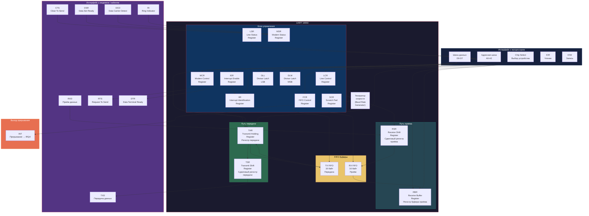
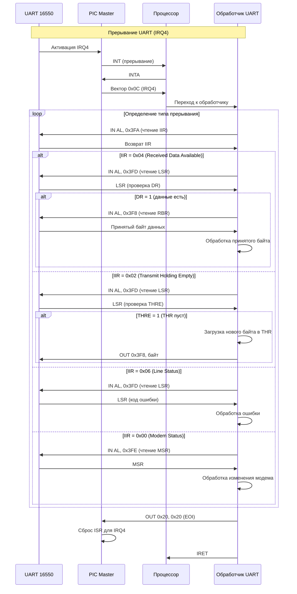
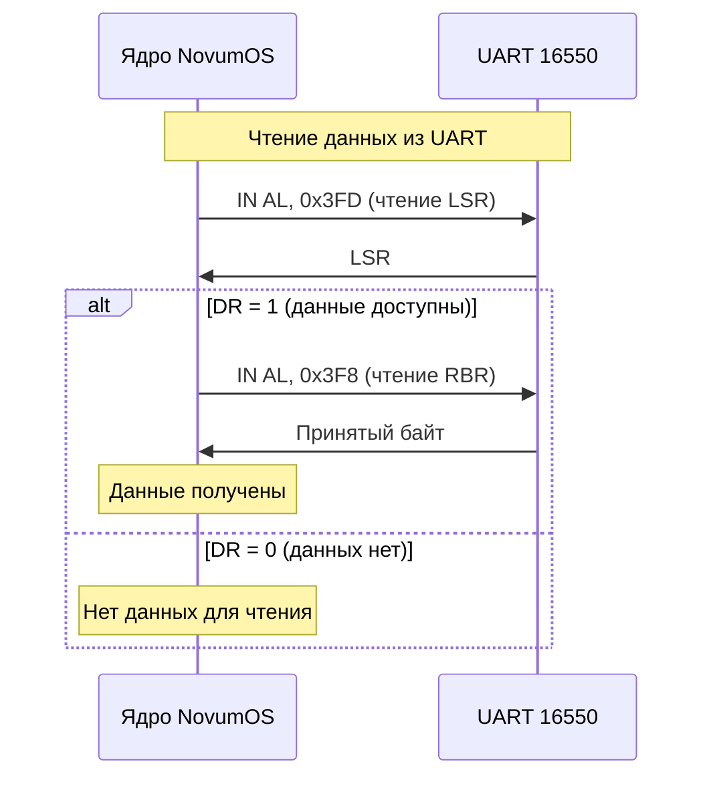
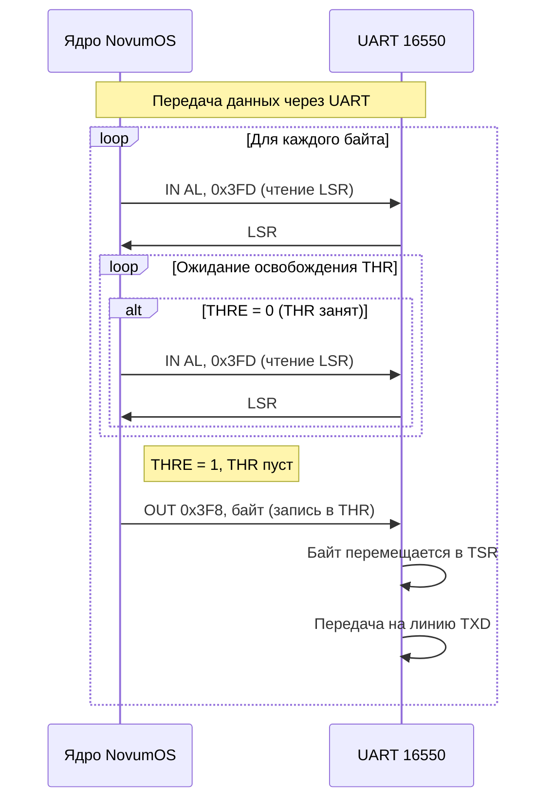
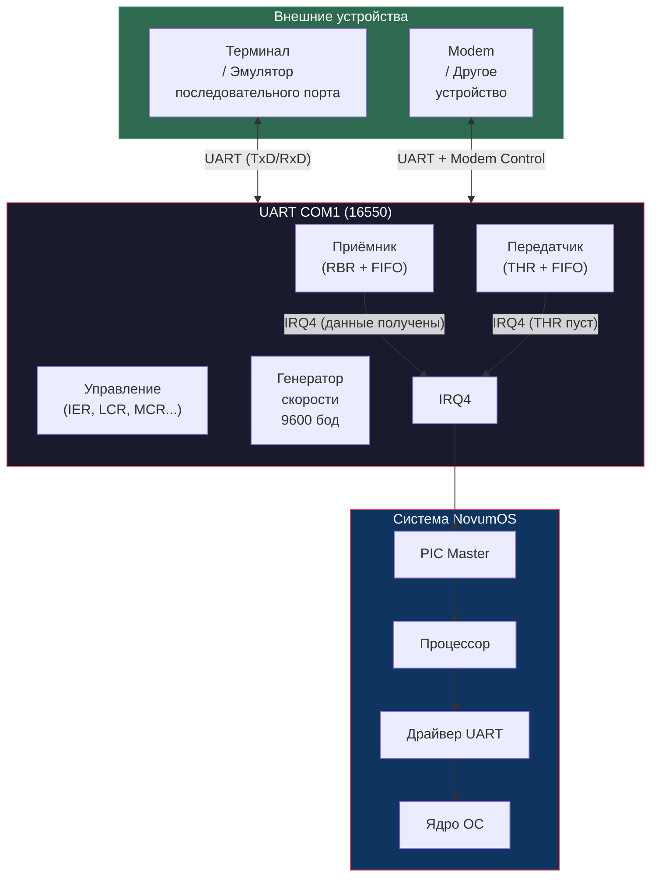

# UART 16550 — Последовательный порт — NovumOS-16bit

## Введение

UART (Universal Asynchronous Receiver/Transmitter) — универсальный асинхронный приёмопередатчик — обеспечивает асинхронный последовательный обмен данными между процессором и внешними устройствами. NovumOS-16bit использует совместимый с 16550 UART, который является стандартом для последовательных портов PC.

### Характеристики UART 16550:

- **Скорость передачи:** от 50 до 115 200 бод (бит в секунду)
- **Формат данных:** 5–8 данных, 0–2 стоп-бит, без чётности / чёт/нечёт
- **Буфер приёма и передачи:** 16-байтовые FIFO (First In, First Out)
- **Прерывания:** 4 типа прерываний (приём, передача, статус линии, модем)
- **Контроль модема:** RTS, CTS, DSR, DTR, DCD, RI

### COM1 в NovumOS-16bit:

UART для порта COM1 подключён к IRQ4 и использует I/O порты по адресу 0x3F8–0x3FF.

---

## Блок-схема UART 16550



---

## I/O порты COM1

COM1 использует 8 последовательных I/O портов по адресам 0x3F8–0x3FF. Адрес устройства определяется младшими 3 битами адресной шины (A0–A2).

### Таблица 1: Карта регистров COM1

| Адрес | A2:A1:A0 | DLAB=0 — Регистр | DLAB=1 — Регистр | Доступ | Описание |
|---|---|---|---|---|---|
| 0x3F8 | 000 | **RBR** (чтение) / **THR** (запись) | **DLL** | Read / Write | Регистр приёма / Передачи / Делитель LSB |
| 0x3F9 | 001 | **IER** | **DLM** | Read / Write | Разрешение прерываний / Делитель MSB |
| 0x3FA | 010 | **IIR** | **IIR** | Read | Идентификация прерывания (только чтение) |
| 0x3FB | 011 | **LCR** | **LCR** | Read / Write | Управление линией |
| 0x3FC | 100 | **MCR** | **MCR** | Read / Write | Управление модемом |
| 0x3FD | 101 | **LSR** | **LSR** | Read | Статус линии (только чтение) |
| 0x3FE | 110 | **MSR** | **MSR** | Read | Статус модема (только чтение) |
| 0x3FF | 111 | **SCR** | **SCR** | Read / Write | Скретч-пад (произвольные данные) |

**DLAB** (Divisor Latch Access Bit) — бит D7 регистра LCR. Когда DLAB=1, регистры DLL и DLM доступны по адресам 0x3F8 и 0x3F9 соответственно. Для доступа к RBR/THR и IER DLAB должен быть 0.

---

## Описание регистров

### RBR — Receive Buffer Register (0x3F8, DLAB=0, чтение)

Регистр буфера приёма. Содержит принятый байт данных. При чтении UART возвращает oldest байт из RX FIFO (или последний принятый байт, если FIFO отключён).

### THR — Transmit Holding Register (0x3F8, DLAB=0, запись)

Регистр передачи. Записанный байт помещается в TX FIFO. Когда TSR (сдвиговый регистр передачи) свободен, байт из FIFO перемещается в TSR и передаётся на линию TXD.

### IER — Interrupt Enable Register (0x3F9, DLAB=0)

Регистр разрешения прерываний. Управляет тем, какие типы прерываний разрешены.

#### Таблица 2: Формат IER

| Бит | Название | Описание |
|---|---|---|
| D7 | 0 | Не используется |
| D6 | 0 | Не используется |
| D5 | PTHRE | Paused THRE Interrupt. Разрешает прерывание при приостановке передачи (если FIFO полон или передача завершена). |
| D4 | RDAI | Received Data Available Interrupt. Разрешает прерывание при поступлении данных (RBR не пуст / FIFO достиг порога заполнения). |
| D3 | LSI | Line Status Interrupt. Разрешает прерывание при изменении статуса линии (ошибка приёма, переполнение и т.д.). |
| D2 | MSI | Modem Status Interrupt. Разрешает прерывание при изменении состояния линий модема (CTS, DSR, DCD, RI). |
| D1 | 0 | Не используется (reserved). |
| D0 | ERBFI | Enable Receiver Buffer Full Interrupt. **Важно:** этот бит не является стандартным. В 16550 бит 0 IER не используется. |

**NovumOS-16bit рекомендуемые настройки IER:**
- `0x0F` — разрешить все прерывания (RDAI + LSI + MSI)
- `0x01` — разрешить только прерывание приёма данных
- `0x00` — запретить все прерывания

---

### IIR — Interrupt Identification Register (0x3FA, только чтение)

Регистр идентификации прерывания. Доступен только для чтения. Содержит информацию о типе текущего прерывания и состоянии FIFO.

#### Таблица 3: Формат IIR

| Бит | Название | Описание |
|---|---|---|
| D7 | FIFOE1 | FIFO Enable 1. Совместно с D6 указывает состояние FIFO. |
| D6 | FIFOE0 | FIFO Enable 0. `00` = FIFO отключён, `11` = FIFO включён. |
| D5 | 0 | Не используется |
| D4 | 0 | Не используется |
| D3 | IP | Interrupt Pending. 0 = прерывание ожидает обработки, 1 = прерывания нет. |
| D2 | IID1 | Interrupt Identification 1 (старший бит кода прерывания) |
| D1 | IID0 | Interrupt Identification 0 (младший бит кода прерывания) |
| D0 | 0 | Не используется |

#### Таблица 4: Приоритеты и коды прерываний

| Приоритет | IID1 | IID0 | Тип прерывания | Условие |
|---|---|---|---|---|
| 1 (наивысший) | 0 | 0 | **Line Status** | Ошибка приёма (Overrun, Parity, Framing, Break) |
| 2 | 0 | 1 | **Received Data Available** | Данные доступны в RBR (FIFO не пуст) |
| 2 | 0 | 1 | **Character Timeout** | В FIFO нет данных в течение 4-х времяовых интервалов (только 16550A) |
| 3 | 1 | 0 | **Transmit Holding Empty** | THR пуст, готов к приёму нового байта |
| 4 (наименьший) | 1 | 1 | **Modem Status** | Изменение CTS, DSR, DCD или RI |

---

### FCR — FIFO Control Register (0x3FA, только запись)

Регистр управления FIFO. Доступен только для записи. Управляет включением FIFO и их порогом заполнения.

#### Таблица 5: Формат FCR

| Бит | Название | Описание |
|---|---|---|
| D7 | RT2 | Receiver Trigger 2 (старший бит порога) |
| D6 | RT1 | Receiver Trigger 1 (средний бит порога) |
| D5 | RT0 | Receiver Trigger 0 (младший бит порога) |
| D4 | 0 | Не используется |
| D3 | DMA Mode Select | 0 = режим PIO (программный ввод-вывод), 1 = режим DMA |
| D2 | XMIT Reset | 1 = сброс TX FIFO (очистка буфера передачи) |
| D1 | RCVR Reset | 1 = сброс RX FIFO (очистка буфера приёма) |
| D0 | FIFO Enable | 1 = включить FIFO, 0 = отключить |

#### Таблица 6: Порог заполнения RX FIFO (RT2-RT0)

| RT2 | RT1 | RT0 | Порог (байт в FIFO) |
|---|---|---|---|
| 0 | 0 | 0 | 1 |
| 0 | 0 | 1 | 4 |
| 0 | 1 | 0 | 8 |
| 0 | 1 | 1 | 14 |
| 1 | 0 | 0 | 16 (только для 16750) |

**NovumOS-16bit:** FCR = `0xC7` (FIFO включён, порог 14, сброс TX и RX FIFO).

---

### LCR — Line Control Register (0x3FB)

Регистр управления линией. Определяет формат данных: количество данных, стоп-биты, проверка чётности, а также управляет DLAB.

#### Таблица 7: Формат LCR

| Бит | Название | Описание |
|---|---|---|
| D7 | DLAB | Divisor Latch Access Bit. 1 = порты 0x3F8 и 0x3F9 доступны как DLL и DLM (делитель скорости). 0 = обычный режим (RBR/THR и IER). |
| D6 | Break Control | 1 = установить линию TXD в состояние Break (низкий уровень). 0 = нормальная работа. |
| D5 | StPar | Stick Parity. Используется совместно с битами чётности (D4, D3). |
| D4 | EPS | Even Parity Select. 0 = нечётная проверка (при SP=1), 1 = чётная проверка. |
| D3 | PEN | Parity Enable. 1 = проверка чётности включена, 0 = выключена. |
| D2 | STB | Stop Bits. 0 = 1 стоп-бит, 1 = 1.5 стоп-бита (для 5-бит данных) или 2 стоп-бита. |
| D1 | WLS1 | Word Length 1 (старший бит длины слова) |
| D0 | WLS0 | Word Length 0 (младший бит длины слова) |

#### Таблица 8: Длина слова (WLS1, WLS0)

| WLS1 | WLS0 | Количество данных |
|---|---|---|
| 0 | 0 | 5 бит |
| 0 | 1 | 6 бит |
| 1 | 0 | 7 бит |
| 1 | 1 | 8 бит |

**NovumOS-16bit рекомендуемые настройки LCR:**
- `0x80` — DLAB=1 (для настройки делителя скорости)
- `0x03` — 8 данных, 1 стоп-бит, без чётности (8N1), DLAB=0
- `0x1F` — 8 данных, 2 стоп-бита, чётная проверка, DLAB=0

---

### MCR — Modem Control Register (0x3FC)

Регистр управления модемом. Управляет линиями управления подключением.

#### Таблица 9: Формат MCR

| Бит | Название | Описание |
|---|---|---|
| D7 | 0 | Не используется |
| D6 | 0 | Не используется |
| D5 | 0 | Не используется |
| D4 | LOOP | Loopback Mode. 1 = режим петли (все переданные данные возвращаются обратно). 0 = нормальная работа. |
| D3 | OUT2 | Вспомогательный выход 2. В некоторых системах управляет маршрутизацией прерывания UART к IRQ. |
| D2 | OUT1 | Вспомогательный выход 1. |
| D1 | RTS | Request To Send. 1 = активировать линию RTS. |
| D0 | DTR | Data Terminal Ready. 1 = активировать линию DTR. |

**NovumOS-16bit:** MCR = `0x0B` (RTS=1, DTR=1, OUT2=1 для маршрутизации прерываний).

---

### LSR — Line Status Register (0x3FD, только чтение)

Регистр статуса линии. Содержит флаги состояния приёма, передачи и ошибок.

#### Таблица 10: Формат LSR

| Бит | Название | Описание |
|---|---|---|
| D7 | 0 | Не используется (в 16550A: FIFO Error — ошибка FIFO, но не используется) |
| D6 | TEMT | Transmitter Empty. 1 = THR и TSR пусты (передача завершена). 0 = данные передаются. |
| D5 | THRE | Transmitter Holding Register Empty. 1 = THR пуст (можно загружать новый байт). 0 = THR занят. |
| D4 | BI | Break Interrupt. 1 = обнаружен Break-сигнал (длительный низкий уровень на RXD). |
| D3 | FE | Framing Error. 1 = ошибка фрейма (стоп-бит не обнаружен). |
| D2 | PE | Parity Error. 1 = ошибка чётности (данные не соответствуют биту чётности). |
| D1 | OE | Overrun Error. 1 = переполнение (новые данные пришли до чтения предыдущих). |
| D0 | DR | Data Ready. 1 = данные доступны в RBR (принят байт). 0 = данных нет. |

**NovumOS-16bit читает LSR для:**
- Проверки DR перед чтением RBR (убедиться, что данные есть).
- Проверки THRE перед записью в THR (убедиться, что передатчик свободен).
- Обработки ошибок приёма (OE, PE, FE, BI).

---

### MSR — Modem Status Register (0x3FE, только чтение)

Регистр статуса модема. Содержит состояние линий управления модемом и флаги их изменения.

#### Таблица 11: Формат MSR

| Бит | Название | Описание |
|---|---|---|
| D7 | DCD | Data Carrier Detect. 1 = модем обнаружил несущую. |
| D6 | RI | Ring Indicator. 1 = модем получает звонок. |
| D5 | DSR | Data Set Ready. 1 = модем готов к обмену данными. |
| D4 | CTS | Clear To Send. 1 = модем разрешает передачу. |
| D3 | δDCD | Delta DCD. 1 = линия DCD изменилась с момента последнего чтения MSR. |
| D2 | δRI | Delta RI. 1 = линия RI изменилась (переход от 1 к 0). |
| D1 | δDSR | Delta DSR. 1 = линия DSR изменилась. |
| D0 | δCTS | Delta CTS. 1 = линия CTS изменилась. |

---

### SCR — Scratch Pad Register (0x3FF)

Произвольный 8-битный регистр для хранения пользовательских данных. Не влияет на работу UART. Используется для тестирования или хранения конфигурации.

---

## Настройка скорости передачи (Baud Rate Generator)

UART 16550 использует внутренний генератор тактовой частоты **1.8432 МГц**. Эта частота делится на значение делителя (divisor), чтобы получить желаемую скорость передачи (baud rate).

### Формула расчёта делителя

```
Divisor = F_ref / (16 × BaudRate)
```

где:
- `F_ref` = 1,843,200 Гц (опорная частота)
- `BaudRate` = желаемая скорость передачи
- `16` = 16-кратное передискретирование ( стандарт для UART)

### Таблица 12: Типичные значения делителя и скорости

| Скорость (Baud) | Делитель | Делитель (hex) | DLM | DLL |
|---|---|---|---|---|
| 50 | 2304 | 0x0900 | 0x09 | 0x00 |
| 75 | 1536 | 0x0600 | 0x06 | 0x00 |
| 110 | 1047 | 0x0417 | 0x04 | 0x17 |
| 134.5 | 857 | 0x0359 | 0x03 | 0x59 |
| 150 | 768 | 0x0300 | 0x03 | 0x00 |
| 300 | 384 | 0x0180 | 0x01 | 0x80 |
| 600 | 192 | 0x00C0 | 0x00 | 0xC0 |
| 1200 | 96 | 0x0060 | 0x00 | 0x60 |
| 2400 | 48 | 0x0030 | 0x00 | 0x30 |
| 4800 | 24 | 0x0018 | 0x00 | 0x18 |
| **9600** | **12** | **0x000C** | **0x00** | **0x0C** |
| 19200 | 6 | 0x0006 | 0x00 | 0x06 |
| 38400 | 3 | 0x0003 | 0x00 | 0x03 |
| 57600 | 2 | 0x0002 | 0x00 | 0x02 |
| **115200** | **1** | **0x0001** | **0x00** | **0x01** |

### Последовательность настройки скорости

Для настройки скорости передачи необходимо:

1. Установить DLAB=1 в LCR (записать 0x80 в порт 0x3FB).
2. Записать младший байт делителя в DLL (порт 0x3F8).
3. Записать старший байт делителя в DLM (порт 0x3F9).
4. Установить DLAB=0 в LCR (записать 0x03 в порт 0x3FB для формата 8N1).

---

## Последовательность инициализации UART

### Полная последовательность настройки COM1

```mermaid
sequenceDiagram
    participant OS as Ядро NovumOS
    participant UART as UART 16550 (COM1)

    Note over OS,UART: Инициализация UART COM1

    rect rgb(30, 30, 60)
        Note over OS,UART: Шаг 1: Отключение прерываний
        OS->>UART: OUT 0x3F9, 0x00 (IER = 0)
        Note right of UART: Все прерывания<br/>запрещены
    end

    rect rgb(30, 60, 30)
        Note over OS,UART: Шаг 2: Установка скорости передачи
        OS->>UART: OUT 0x3FB, 0x80 (LCR: DLAB=1)
        Note right of UART: Открытие доступа<br/>к регистрам делителя

        OS->>UART: OUT 0x3F8, 0x0C (DLL = 0x0C)
        Note right of UART: Младший байт делителя<br/>для 9600 бод

        OS->>UART: OUT 0x3F9, 0x00 (DLM = 0x00)
        Note right of UART: Старший байт делителя<br/>для 9600 бод
    end

    rect rgb(60, 30, 30)
        Note over OS,UART: Шаг 3: Формат данных (8N1)
        OS->>UART: OUT 0x3FB, 0x03 (LCR = 0x03)
        Note right of UART: 8 данных, 1 стоп-бит,<br/>без чётности, DLAB=0
    end

    rect rgb(60, 60, 30)
        Note over OS,UART: Шаг 4: Включение FIFO
        OS->>UART: OUT 0x3FA, 0xC7 (FCR = 0xC7)
        Note right of UART: FIFO включены,<br/>порог 14 байт,<br/>сброс TX/RX FIFO
    end

    rect rgb(30, 60, 60)
        Note over OS,UART: Шаг 5: Управление модемом
        OS->>UART: OUT 0x3FC, 0x0B (MCR = 0x0B)
        Note right of UART: RTS=1, DTR=1,<br/>OUT2=1 (разрешение<br/>прерываний IRQ4)
    end

    rect rgb(60, 30, 60)
        Note over OS,UART: Шаг 6: Разрешение прерываний
        OS->>UART: OUT 0x3F9, 0x0F (IER = 0x0F)
        Note right of UART: Разрешены:<br/>RDAI + LSI + MSI
    end

    Note over OS,UART: UART COM1 инициализирован:<br/>9600 8N1, FIFO включён,<br/>прерывания разрешены
```



### Таблица 13: Итоговые значения регистров после инициализации

| Регистр | Адрес | Значение | Описание |
|---|---|---|---|
| IER | 0x3F9 | 0x0F | Все прерывания разрешены |
| FCR | 0x3FA | 0xC7 | FIFO включён, порог 14, сброс |
| LCR | 0x3FB | 0x03 | 8N1, DLAB=0 |
| MCR | 0x3FC | 0x0B | RTS, DTR, OUT2 активны |
| DLL | 0x3F8 (DLAB=1) | 0x0C | Делитель LSB (9600 бод) |
| DLM | 0x3F9 (DLAB=1) | 0x00 | Делитель MSB |

---

## Обработка прерываний UART

UART генерирует прерывания на IRQ4 при различных условиях. Процессор должен определить причину прерывания и выполнить соответствующее действие.

### Последовательная диаграмма обработки прерывания UART



### Последовательность чтения данных из UART



### Последовательность передачи данных через UART



---

## Формат данных

### Стандартный формат 8N1

В NovumOS-16bit по умолчанию используется формат **8N1**:

```
 ┌───┐                                          ┌───┐
 │ S │ D0 D1 D2 D3 D4 D5 D6 D7                 │ P │ S
 │ T │ Данные (8 бит, младший бит первый)        │ T │ T
 │ A │                                          │ O │ O
 │ R │                                          │ P │ P
 │ T │                                          │   │
 └───┘                                          └───┘

 S  = Старт-бит (всегда 0)
 D  = Бит данных (D0 первый, D7 последний)
 P  = Бит чётности (не используется в 8N1)
 ST = Стоп-бит (всегда 1)
```

### Таблица 14: Форматы данных

| Формат | Данные | Стоп-биты | Чётность | Общий размер кадра |
|---|---|---|---|---|
| 5N1 | 5 | 1 | Нет | 7 бит |
| 7E1 | 7 | 1 | Чётная | 10 бит |
| 8N1 | 8 | 1 | Нет | 10 бит |
| 8N2 | 8 | 2 | Нет | 11 бит |
| 8E1 | 8 | 1 | Чётная | 11 бит |
| 8O1 | 8 | 1 | Нечётная | 11 бит |
| 8O2 | 8 | 2 | Нечётная | 12 бит |

---

## Режим петли (Loopback)

UART 16550 поддерживает режим петли, при котором все данные, передаваемые через THR, автоматически возвращаются в RBR без физического подключения к внешнему устройству. Это полезно для тестирования.

### Активация режима петли:

Запись 1 в бит D4 (LOOP) регистра MCR (порт 0x3FC).

### Характеристики режима петли:

| Линия | Поведение в режиме петли |
|---|---|
| TXD | Данные возвращаются на RXD |
| RTS | Соединён с CTS |
| DTR | Соединён с DSR и DCD |
| RI | Всегда активен |

---

## FIFO — Буферизация данных

UART 16550 содержит 16-байтовые FIFO для приёма и передачи, что значительно снижает количество прерываний по сравнению с базовым UART 8250.

### Преимущества FIFO:

1. **Снижение нагрузки на CPU:** Вместо прерывания на каждый байт, прерывание генерируется при заполнении FIFO до порога (например, 14 байт).
2. **Предотвращение переполнения:** При высоких скоростях передачи FIFO даёт время на обработку данных до потери.
3. **Эффективность:** Меньше переключений контекста из-за прерываний.

### Таблица 15: Пороги FIFO и количество прерываний

| Порог RX FIFO | Байт до прерывания | Прерываний на 1000 байт |
|---|---|---|
| 1 | 1 | 1000 |
| 4 | 4 | 250 |
| 8 | 8 | 125 |
| 14 | 14 | ~72 |

---

## Схема взаимодействия UART с системой



---

## Резюме

| Параметр | Значение |
|---|---|
| Чип | 16550 (совместимый) |
| I/O порты COM1 | 0x3F8–0x3FF |
| IRQ | IRQ4 |
| Вектор прерывания | 0x0C |
| Опорная частота | 1.8432 МГц |
| Скорость по умолчанию | 9600 бод |
| Формат данных | 8N1 (8 данных, 1 стоп-бит, без чётности) |
| FIFO | 16-байтовый TX и RX |
| Порог RX FIFO | 14 байт |
| Управление модемом | RTS, DTR, OUT2 |
| Режим петли | D4 в MCR |
| Тип прерывания | Level-triggered |
| EOI | Non-Specific (OUT 0x20, 0x20) |
