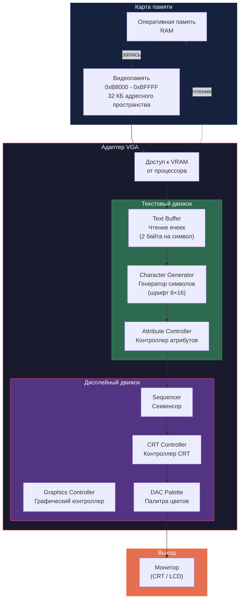
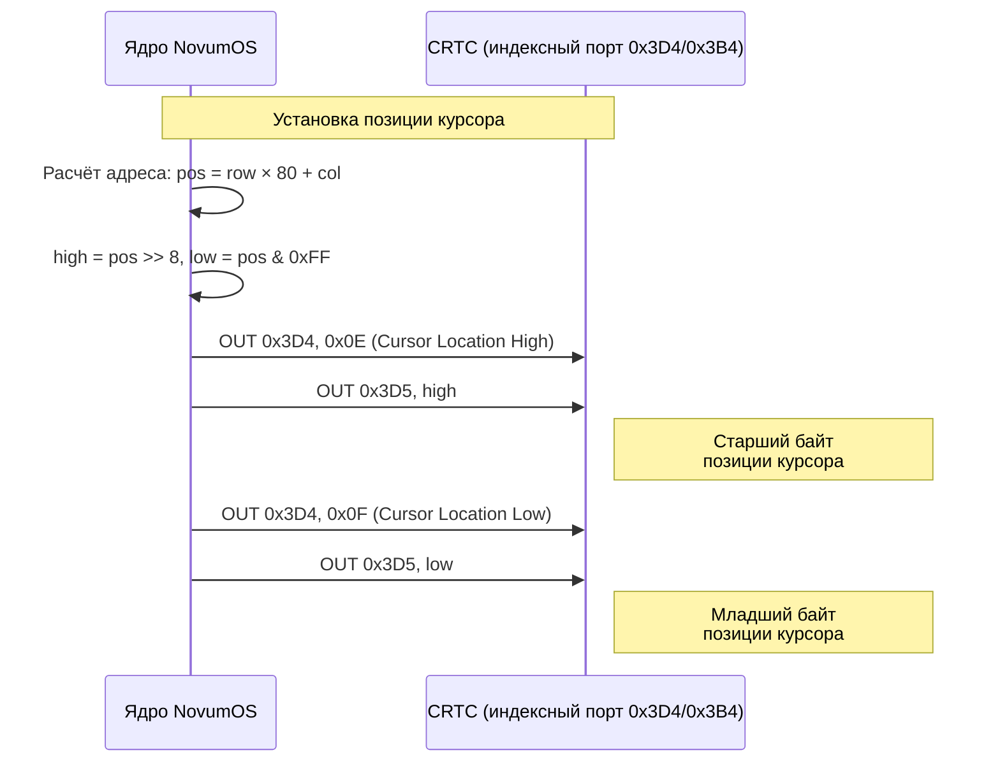
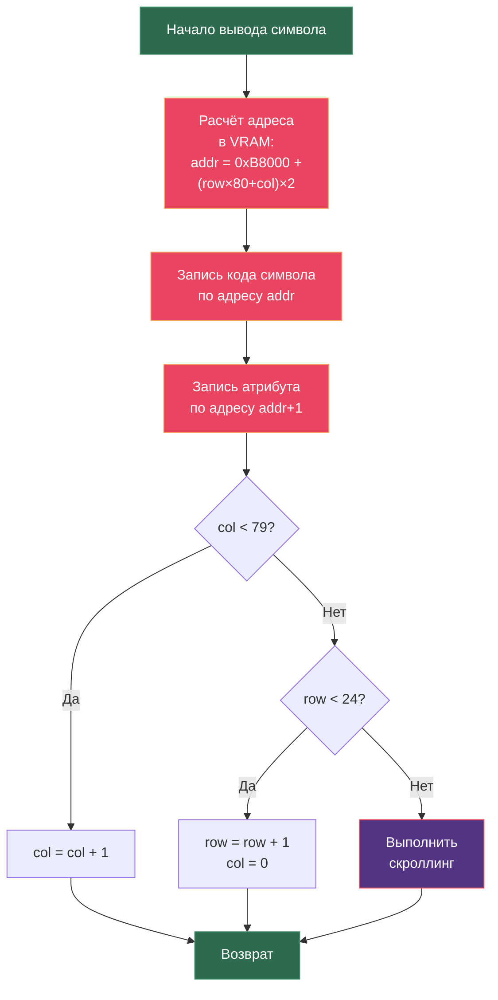
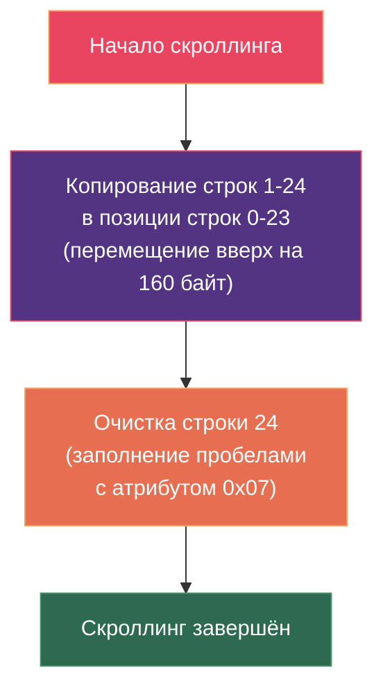
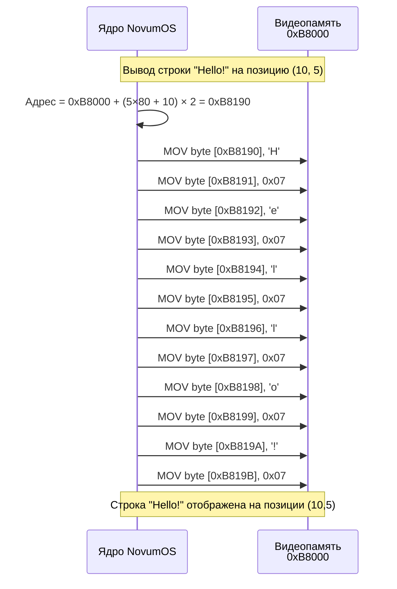
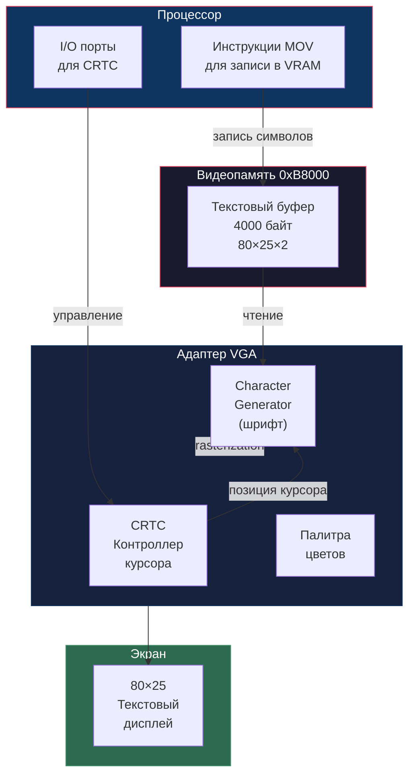

# VGA текстовый режим — NovumOS-16bit

## Введение

VGA (Video Graphics Array) — видеоадаптер, обеспечивающий вывод графической и текстовой информации на экран. NovumOS-16bit использует текстовый режим VGA, в котором экран разделён на ячейки, каждая из которых содержит символ и атрибут (цвет, форматирование). Это наиболее простой и эффективный способ вывода текста в операционной системе.

### Характеристики текстового режима VGA:

| Параметр | Значение |
|---|---|
| Разрешение | 80 столбцов × 25 строк |
| Количество символов | 2000 (80 × 25) |
| Размер ячейки | 2 байта (символ + атрибут) |
| Размер видеобуфера | 4096 байт (4 КБ) |
| Адрес видеобуфера | 0xB8000 |
| Кодировка символов | CP437 (кодовая страница IBM PC) |
| Режим отображения | Текстовый (字符映射) |

---

## Блок-схема VGA текстового режима



---

## Адрес видеобуфера

Текстовый буфер VGA расположен в памяти по фиксированному адресу **0xB8000**. Этот адрес является memory-mapped адресом VIDEO RAM (VRAM), который процессор может читать и писать напрямую через инструкции `MOV` (как обычную память).

### Структура видеобуфера

```
Адрес: 0xB8000
┌─────────────────────────────────────────────────────────────┐
│  Ячейка 0 (0,0)   │  Ячейка 1 (1,0)   │ ... │  Ячейка 79 (79,0)  │
│  [Символ][Атриб]  │  [Символ][Атриб]  │     │  [Символ][Атриб]  │
├─────────────────────────────────────────────────────────────┤
│  Ячейка 80 (0,1)  │  Ячейка 81 (1,1)  │ ... │  Ячейка 159 (79,1) │
│  [Символ][Атриб]  │  [Символ][Атриб]  │     │  [Символ][Атриб]  │
├─────────────────────────────────────────────────────────────┤
│  ...                                                        │
├─────────────────────────────────────────────────────────────┤
│  Ячейка 1920 (0,24)│ Ячейка 1921 (1,24)│ ... │ Ячейка 1999 (79,24)│
└─────────────────────────────────────────────────────────────┘
```

### Формула расчёта адреса ячейки

Для символа в позиции (column, row):

```
Адрес = 0xB8000 + (row × 80 + column) × 2
```

### Таблица 1: Адреса строк

| Строка (row) | Начальный адрес | Конечный адрес | Описание |
|---|---|---|---|
| 0 | 0xB8000 | 0xB809F | Первая строка (80 символов × 2 байта = 160 байт) |
| 1 | 0xB80A0 | 0xB813F | Вторая строка |
| 2 | 0xB8140 | 0xB81DF | Третья строка |
| ... | ... | ... | ... |
| 12 | 0xB9E00 | 0xB9E9F | 13-я строка (середина экрана) |
| ... | ... | ... | ... |
| 24 | 0xBF060 | 0xBF0FF | Последняя (25-я) строка |

**Общий размер:** 25 строк × 80 столбцов × 2 байта = **4000 байт**

---

## Формат ячейки (16 бит)

Каждая ячейка текстового буфера занимает **2 байта (16 бит)**: младший байт содержит код символа, старший байт — атрибут (цвет и форматирование).

### Таблица 2: Формат ячейки

```
Бит: 15  14  13  12  11  10  9   8   7   6   5   4   3   2   1   0
     ┌───┬───┬───┬───┬───┬───┬───┬───┬───┬───┬───┬───┬───┬───┬───┬───┐
     │ B │ I │  BACKGROUND COLOR  │ FLASH │   FOREGROUND COLOR      │
     │ L │   │     (3 бита)       │  (1)  │       (3 бита)          │
     │ I │ N │  RGB: 0-7           │       │   RGB: 0-7              │
     │ N │ K │                     │       │                         │
     │ K │   │                     │       │                         │
     └───┴───┴───┴───┴───┴───┴───┴───┴───┴───┴───┴───┴───┴───┴───┴───┘
     ├─── Атрибут (старший байт) ───┤      ├─── Символ (младший байт) ─┤
```

### Описание битов атрибута

| Бит | Название | Описание |
|---|---|---|
| D7 | BL (Blink) | Мигание. 1 = символ мигает (период ~0.5 с). 0 = без мигания. |
| D6 | I (Intensity) | Яркость. 1 = увеличенная яркость переднего плана. 0 = нормальная яркость. |
| D5-D4 | BG (Background, старшие биты) | Старшие 2 бита цвета фона (в вместе с D3 формируют 3-битный цвет фона). |
| D3 | FG (Background, младший бит) | Младший бит цвета фона. **Внимание:** в стандартном VGA D3 атрибута — это младший бит цвета фона. |
| D2-D0 | FG (Foreground) | Цвет переднего плана (текста). 3 бита → 8 цветов (или 16 с яркостью). |

**Корректная раскладка:**

| Поле | Биты | Количество бит | Диапазон |
|---|---|---|---|
| Цвет переднего плана (Foreground) | D3-D0 | 4 бита | 0–15 |
| Цвет фона (Background) | D6-D4 | 3 бита | 0–7 |
| Мигание (Blink) | D7 | 1 бит | 0/1 |

### Таблица 3: Правильная раскладка байта атрибута

| Бит | 7 | 6 | 5 | 4 | 3 | 2 | 1 | 0 |
|---|---|---|---|---|---|---|---|---|
| Название | BL | B3 | B2 | B1 | F3 | F2 | F1 | F0 |
| Назначение | Мигание | Цвет фона (3 бита) | | | Цвет текста (4 бита) | | | |

- **B3-B0** (биты 6-4 + ?): Цвет фона — 3 бита → 8 возможных цветов фона.
- **F3-F0** (биты 3-0): Цвет текста — 4 бита → 16 возможных цветов текста (8 базовых + 8 ярких).
- **BL** (бит 7): Мигание. Если включен, символ будет мигать.

---

## Таблица цветовых атрибутов

### Базовые 8 цветов (биты яркости = 0)

| Цвет | Код (Foreground) | Код (Background) | HEX | Описание |
|---|---|---|---|---|
| Чёрный (Black) | 0x0 | 0x0 | 0x00 | Фон по умолчанию |
| Синий (Blue) | 0x1 | 0x1 | 0x01 | Тёмно-синий |
| Зелёный (Green) | 0x2 | 0x2 | 0x02 | Тёмно-зелёный |
| Голубой (Cyan) | 0x3 | 0x3 | 0x03 | Тёмно-голубой |
| Красный (Red) | 0x4 | 0x4 | 0x04 | Тёмно-красный |
| Маджента (Magenta) | 0x5 | 0x5 | 0x05 | Тёмно-розовый/фиолетовый |
| Коричневый (Brown) | 0x6 | 0x6 | 0x06 | Тёмно-жёлтый/коричневый |
| Серый (Light Gray) | 0x7 | 0x7 | 0x07 | Светло-серый |

### Яркие 8 цветов (бит яркости I = 1)

| Цвет | Код (Foreground) | HEX | Описание |
|---|---|---|---|
| Тёмно-серый (Dark Gray) | 0x8 | 0x08 | Яркость 1, чёрный фон → тёмно-серый |
| Светло-синий (Light Blue) | 0x9 | 0x09 | Яркость 1, синий |
| Светло-зелёный (Light Green) | 0xA | 0x0A | Яркость 1, зелёный |
| Светло-голубой (Light Cyan) | 0xB | 0x0B | Яркость 1, голубой |
| Светло-красный (Light Red) | 0xC | 0x0C | Яркость 1, красный |
| Розовый (Light Magenta) | 0xD | 0x0D | Яркость 1, маджента |
| Жёлтый (Yellow) | 0xE | 0x0E | Яркость 1, коричневый → жёлтый |
| Белый (White) | 0xF | 0x0F | Яркость 1, серый → белый |

### Таблица 4: Полная таблица атрибутов

| Атрибут (hex) | Бит 7 (BL) | Биты 6-4 (BG) | Биты 3-0 (FG) | Описание |
|---|---|---|---|---|
| 0x00 | 0 | Чёрный | Чёрный | Пустой/невидимый |
| 0x07 | 0 | Чёрный | Серый | Обычный текст (по умолчанию) |
| 0x0F | 0 | Чёрный | Белый | Яркий белый на чёрном |
| 0x10 | 0 | Синий | Чёрный | Чёрный текст на синем фоне |
| 0x17 | 0 | Синий | Серый | Серый текст на синем фоне |
| 0x1F | 0 | Синий | Белый | Белый текст на синем фоне |
| 0x20 | 0 | Зелёный | Чёрный | Чёрный текст на зелёном фоне |
| 0x2A | 0 | Зелёный | Светло-зелёный | Ярко-зелёный на зелёном |
| 0x30 | 0 | Голубой | Чёрный | Чёрный текст на голубом фоне |
| 0x40 | 0 | Красный | Чёрный | Чёрный текст на красном фоне |
| 0x4E | 0 | Красный | Жёлтый | Жёлтый текст на красном фоне |
| 0x50 | 0 | Маджента | Чёрный | Чёрный текст на маджента |
| 0x70 | 0 | Серый | Чёрный | Чёрный текст на сером фоне (инверсия) |
| 0x87 | 1 | Чёрный | Серый | Мигающий серый текст |
| 0x8F | 1 | Чёрный | Белый | Мигающий белый текст |
| 0x9F | 1 | Синий | Белый | Мигающий белый на синем |
| 0xCF | 1 | Красный | Белый | Мигающий белый на красном |
| 0xFF | 1 | Серый | Белый | Мигающий белый на сером |

### Типичные комбинации атрибутов

| Назначение | Атрибут (hex) | Описание |
|---|---|---|
| Обычный текст | 0x07 | Серый на чёрном |
| Заголовок | 0x0F | Белый на чёрном (яркий) |
| Ошибка | 0x4F | Белый на красном |
| Предупреждение | 0x4E | Жёлтый на красном |
| Успех | 0x2A | Светло-зелёный на зелёном |
| Информация | 0x1F | Белый на синем |
| Статус-бар | 0x70 | Чёрный на светло-сером |
| Мигающий текст | 0x87 | Серый на чёрном с миганием |
| Скролл-бар | 0x20 | Чёрный на зелёном |
| Пункт меню | 0x30 | Чёрный на голубом |
| Активный пункт | 0x1F | Белый на синем |

---

## Управление курсором

Курсор VGA позиционируется на экране с помощью двух 8-битных регистров CRT Controller (CRTC): **Cursor Location High** и **Cursor Location Low**. Эти регистры определяют позицию курсора в видеобуфере.

### Регистры курсора

| Регистр | Индекс CRTC | Описание |
|---|---|---|
| Cursor Location High | 0x0E | Старший байт адреса позиции курсора |
| Cursor Location Low | 0x0F | Младший байт адреса позиции курсора |

### Формула расчёта позиции курсора

Для позиции (column, row):

```
Адрес курсора = row × 80 + column
```

Это 16-битное значение записывается в регистры:
- **Cursor Location High** = старший байт (адрес >> 8)
- **Cursor Location Low** = младший байт (адрес & 0xFF)

### Управление формой курсора

Форма (высота) курсора управляется регистрами CRTC:

| Регистр | Индекс CRTC | Описание |
|---|---|---|
| Cursor Start | 0x0A | Начальная строка курсора (биты D4-D0) + мигание (биты D6-D5) |
| Cursor End | 0x0B | Конечная строка курсора (биты D4-D0) |

#### Биты регистра Cursor Start (0x0A)

| Бит | Название | Описание |
|---|---|---|
| D6-D5 | Cursor Scan Mode | 00 = всегда включён, 01 = мигает, 10 = мигает (медленно), 11 = выключен |
| D4 | 0 | Не используется |
| D3-D0 | Cursor Start | Начальная строка курсора (0–15) |

#### Биты регистра Cursor End (0x0B)

| Бит | Название | Описание |
|---|---|---|
| D7 | 0 | Не используется |
| D6-D5 | Skew | Задержка отображения курсора |
| D4-D0 | Cursor End | Конечная строка курсора (0–15) |

### Типичные формы курсора

| Форма | Cursor Start | Cursor End | Описание |
|---|---|---|---|
| Подчёркивание | 0x0D | 0x0E | Тонкая линия внизу символа (1 строка) |
| Нижняя половина | 0x08 | 0x0E | Нижняя половина блока |
| Полный блок | 0x00 | 0x0F | Полная высота символа (16 строк) |
| Верхняя половина | 0x00 | 0x07 | Верхняя половина блока |
| Скрытый | 0x20 | — | Курсор отключён (биты D6-D5 = 10) |

---

## Последовательность установки позиции курсора



---

## Вывод символа на экран

### Алгоритм вывода одного символа



---

## Скроллинг экрана

Когда текст выходит за нижнюю границу экрана (строка 24), необходимо выполнить скроллинг — сдвинуть всё содержимое экрана на одну строку вверх.

### Алгоритм скроллинга



**Детали:**
- Копирование: memmove(0xB8000, 0xB80A0, 24×80×2) — сдвиг на 160 байт (одна строка).
- Очистка строки 24: запись 80 пар байтов [0x20, 0x07] (пробел, серый на чёрном).

---

## Очистка экрана

Очистка экрана означает заполнение всего видеобуфера символами пробела (0x20) с атрибутом по умолчанию (0x07) и установку позиции курсора в (0,0).

### Алгоритм очистки

1. Заполнить 4000 байт (0xB8000–0xB8F9F) парами [0x20, 0x07].
2. Установить курсор в позицию 0 (строка 0, столбец 0).

---

## VGA порты ввода-вывода

Хотя текстовый буфер VGA является memory-mapped (адрес 0xB8000), некоторые функции управления (курсор, режимы отображения) требуют обращения к I/O портам VGA.

### Таблица 5: I/O порты VGA для текстового режима

| Диапазон | Название | Описание |
|---|---|---|
| 0x3B0 – 0x3BA | VGA Mono I/O | Порты VGA в монохромном режиме |
| 0x3C0 – 0x3CF | VGA Attribute Controller | Контроллер атрибутов |
| 0x3D0 – 0x3DF | VGA Color I/O | Порты VGA в цветном режиме |

### Ключевые порты для текстового режима

| Порт | Имя | Доступ | Описание |
|---|---|---|---|
| 0x3D4 | CRTC Index | Write | Индексный регистр CRT Controller ( выбор регистра) |
| 0x3D5 | CRTC Data | Read/Write | Данные регистра CRT Controller |
| 0x3DA | Input Status | Read | Регистр статуса ввода (сигнал обратного хода) |
| 0x3C0 | Attribute Controller | Write | Управление атрибутами (после чтения 0x3DA) |

### Регистры CRT Controller (CRTC)

| Индекс | Регистр | Описание |
|---|---|---|
| 0x00 | Horizontal Total | Общая длина строки (в символах) |
| 0x01 | Horizontal Display Enable End | Количество видимых столбцов |
| 0x09 | Maximum Scan Line | Максимальная строка символа (высота - 1) |
| 0x0A | Cursor Start | Начальная строка и форма курсора |
| 0x0B | Cursor End | Конечная строка курсора |
| 0x0C | Start Address High | Старший байт начального адреса |
| 0x0D | Start Address Low | Младший байт начального адреса |
| 0x0E | Cursor Location High | Старший байт позиции курсора |
| 0x0F | Cursor Location Low | Младший байт позиции курсора |

---

## Кодовая страница CP437

VGA использует кодовую страницу CP437 для отображения символов. Каждому 8-битному коду (0x00–0xFF) соответствует определённый символ.

### Таблица 6: Основные символы CP437

| Код (hex) | Символ | Код (hex) | Символ | Код (hex) | Символ |
|---|---|---|---|---|---|
| 0x20 | Пробел | 0x30-0x39 | 0-9 | 0x41-0x5A | A-Z |
| 0x01 | ☺ | 0x02 | ☻ | 0x03 | ♥ |
| 0x04 | ♦ | 0x05 | ♣ | 0x06 | ♠ |
| 0x07 | • | 0x08 | ◘ | 0x09 | ○ |
| 0x0A | ◙ | 0x0B | ♂ | 0x0C | ♀ |
| 0x0D | ♪ | 0x0E | ♫ | 0x0F | ☼ |
| 0x10 | ► | 0x11 | ◄ | 0x12 | ↕ |
| 0x13 | ‼ | 0x14 | ¶ | 0x15 | § |
| 0x16 | ▬ | 0x17 | ↨ | 0x18 | ↑ |
| 0x19 | ↓ | 0x1A | → | 0x1B | ← |
| 0x1C | ∟ | 0x1D | ↔ | 0x1E | ▲ |
| 0x1F | ▼ | 0x7F | ⌂ | 0x80 | Ç |
| 0xB0 | ░ | 0xB1 | ▒ | 0xB2 | ▓ |
| 0xB3 | │ | 0xB4 | ┤ | 0xB5 | ╡ |
| 0xB6 | ╢ | 0xB7 | ╖ | 0xB8 | ╕ |
| 0xB9 | ╣ | 0xBA | ║ | 0xBB | ╗ |
| 0xBC | ╝ | 0xBD | ╜ | 0xBE | ╛ |
| 0xBF | ┐ | 0xC0 | └ | 0xC1 | ┴ |
| 0xC2 | ┬ | 0xC3 | ├ | 0xC4 | ─ |
| 0xC5 | ┼ | 0xC6 | ╞ | 0xC7 | ╟ |
| 0xC8 | ╚ | 0xC9 | ╔ | 0xCA | ╩ |
| 0xCB | ╦ | 0xCC | ╠ | 0xCD | ═ |
| 0xCE | ╬ | 0xCF | ╧ | 0xD0 | ╨ |
| 0xD1 | ╤ | 0xD2 | ╥ | 0xD3 | ╙ |
| 0xD4 | ╘ | 0xD5 | ╒ | 0xD6 | ╓ |
| 0xD7 | ╫ | 0xD8 | ╪ | 0xD9 | ┘ |
| 0xDA | ┌ | 0xDB | █ | 0xDC | ▄ |
| 0xDD | ▌ | 0xDE | ▐ | 0xDF | ▀ |
| 0xE0 | α | 0xE1 | ß | 0xE2 | Γ |
| 0xE3 | π | 0xE4 | Σ | 0xE5 | σ |
| 0xE6 | µ | 0xE7 | τ | 0xE8 | Φ |
| 0xE9 | Θ | 0xEA | Ω | 0xEB | δ |
| 0xEC | ∞ | 0xED | φ | 0xEE | ε |
| 0xEF | ∩ | 0xF0 | ≡ | 0xF1 | ± |
| 0xF2 | ≥ | 0xF3 | ≤ | 0xF4 | ⌠ |
| 0xF5 | ⌡ | 0xF6 | ÷ | 0xF7 | ≈ |
| 0xF8 | ° | 0xF9 | ∙ | 0xFA | · |
| 0xFB | √ | 0xFC | ⁿ | 0xFD | ² |
| 0xFE | ■ | 0xFF | NBSP (неразрывный пробел) | | |

---

## Работа с видеобуфером — пошагово

### Запись строки на экран



### Расчёт адреса ячейки (row=5, column=10)

```
Адрес = 0xB8000 + (5 × 80 + 10) × 2
       = 0xB8000 + (400 + 10) × 2
       = 0xB8000 + 410 × 2
       = 0xB8000 + 820
       = 0xB8000 + 0x0334
       = 0xB8334
```

---

## Итоговая схема VGA в системе



---

## Резюме

| Параметр | Значение |
|---|---|
| Режим | Текстовый, 80×25 |
| Адрес VRAM | 0xB8000 |
| Размер ячейки | 2 байта (символ + атрибут) |
| Кодировка | CP437 |
| Код символа | Младший байт (0–255) |
| Атрибут | Старший байт (бит 7: мигание, бит 6: яркость, биты 5-4: фон, биты 3-0: текст) |
| Курсор | CRTC регистры 0x0E (high), 0x0F (low) |
| Форма курсора | CRTC регистры 0x0A (start), 0x0B (end) |
| Управление | CRTC Index 0x3D4, CRTC Data 0x3D5 |
| Частота обновления | ~70 Гц (NTSC-compatible) |
| Тип доступа | Memory-mapped (VRAM) + I/O ports (CRTC) |
