[← Back to Main](../README.md) | [← Overview](overview.md) | [← Registers](registers.md) | [Memory Map →](memory-map.md)

---

## Cycle Overview

Every instruction goes through a four-phase execution cycle:

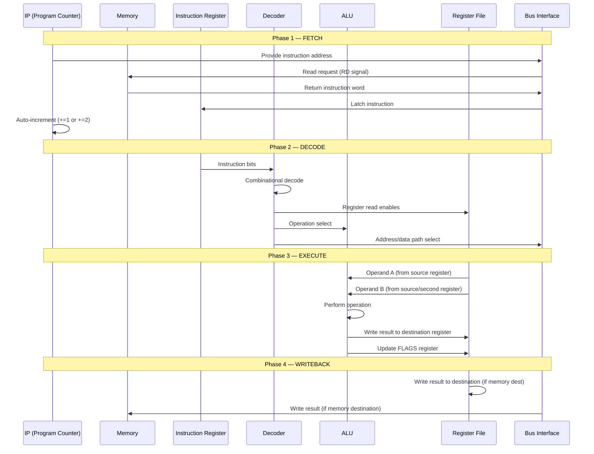

---

## Detailed Phase Descriptions

### Phase 1: Fetch

The CPU retrieves the next instruction from memory.

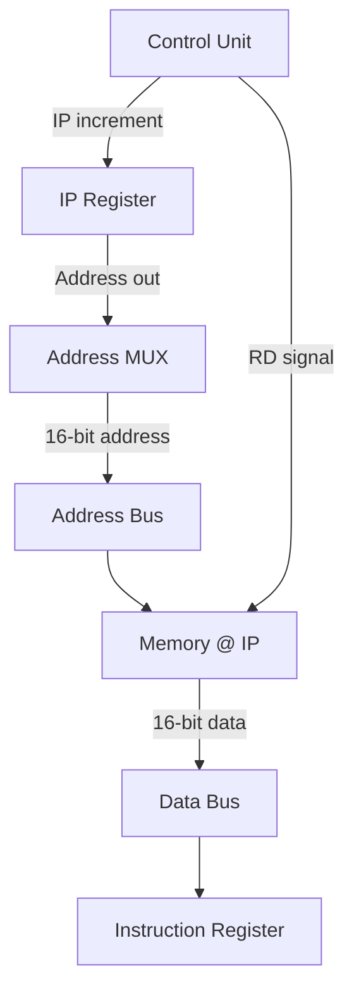

**Operations performed:**

| Step | Action | Detail |
|------|--------|--------|
| 1.1 | Assert address | IP value placed on address bus via BIU |
| 1.2 | Assert RD | Control unit asserts read strobe (active low) |
| 1.3 | Wait for data | Memory returns instruction word on data bus |
| 1.4 | Latch instruction | IR captures the data bus value |
| 1.5 | Increment IP | IP += 2 (16-bit instruction) or IP += 4 (32-bit instruction) |

**Timing:**

| Parameter | Value |
|-----------|-------|
| Cycles | 1 clock cycle |
| Address setup | Before rising edge |
| Data valid | After memory access time (may require WAIT state) |

**Note on 32-bit instructions:** If the instruction format is 32-bit (determined by opcode), a second fetch cycle occurs immediately to load the upper 16 bits into IR. Total fetch time: 2 cycles.

---

### Phase 2: Decode

The instruction decoder examines the IR contents and generates all control signals for the execute phase.

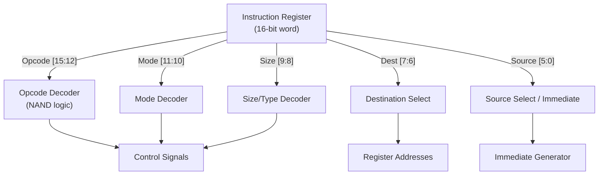

**Decode fields:**

| Field | Bits | Description |
|-------|------|-------------|
| Opcode | [15:12] | 4-bit operation code |
| Mode | [11:10] | Addressing mode (register, immediate, memory) |
| Size | [9:8] | Instruction size/type indicator |
| Destination | [7:6] | 2-bit destination register encoding |
| Source | [5:0] | 6-bit source (register code, immediate, or offset) |

**Control signals generated:**

| Signal | Purpose |
|--------|---------|
| `ALU_OP[3:0]` | Selects ALU operation (ADD, SUB, AND, etc.) |
| `REG_READ_A` | Enable read from register port A |
| `REG_READ_B` | Enable read from register port B |
| `REG_WRITE` | Enable write to destination register |
| `REG_DEST[1:0]` | Destination register address |
| `REG_SRC[1:0]` | Source register address |
| `ALU_SRC_B` | Select ALU input B (register or immediate) |
| `MEM_RD` | Memory read enable |
| `MEM_WR` | Memory write enable |
| `IO_RD` | I/O port read enable |
| `IO_WR` | I/O port write enable |
| `IP_LOAD` | Load new value into IP (for jumps) |
| `SP_PUSH` | Decrement SP (for PUSH) |
| `SP_POP` | Increment SP (for POP) |

**Timing:**

| Parameter | Value |
|-----------|-------|
| Cycles | 1 clock cycle |
| Logic type | Purely combinational |
| Propagation | Propagation delay through NAND gates |

---

### Phase 3: Execute

The ALU performs the requested operation using operands from the register file.

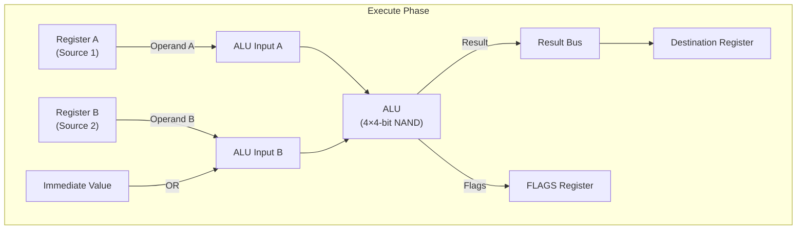

**Operations by instruction type:**

#### Register-Register Operations

| Step | Action |
|------|--------|
| 3.1 | Read source register A (port A output) |
| 3.2 | Read source register B (port B output) |
| 3.3 | ALU performs operation on A and B |
| 3.4 | Result written to destination register |
| 3.5 | FLAGS updated based on result |

#### Register-Immediate Operations

| Step | Action |
|------|--------|
| 3.1 | Read source register (port A output) |
| 3.2 | Immediate value from instruction word to ALU input B |
| 3.3 | ALU performs operation |
| 3.4 | Result written to destination register |
| 3.5 | FLAGS updated |

#### Memory Load (MOV reg, [addr])

| Step | Action |
|------|--------|
| 3.1 | Compute effective address (from BX + offset, or direct) |
| 3.2 | Place address on address bus |
| 3.3 | Assert RD signal |
| 3.4 | Wait for memory data (may require WAIT state) |
| 3.5 | Latch data into destination register |

#### Memory Store (MOV [addr], reg)

| Step | Action |
|------|--------|
| 3.1 | Compute effective address |
| 3.2 | Place address on address bus |
| 3.3 | Place register value on data bus |
| 3.4 | Assert WR signal |
| 3.5 | Memory captures data on WR deassertion |

**Timing:**

| Operation | Cycles |
|-----------|--------|
| Register-register ALU | 1 |
| Register-immediate ALU | 1 |
| Memory read | 1 (+ WAIT states if needed) |
| Memory write | 1 (+ WAIT states if needed) |
| I/O read | 1 (+ WAIT states) |
| I/O write | 1 |

---

### Phase 4: Writeback

The result of the execution is committed to the destination (register or memory).

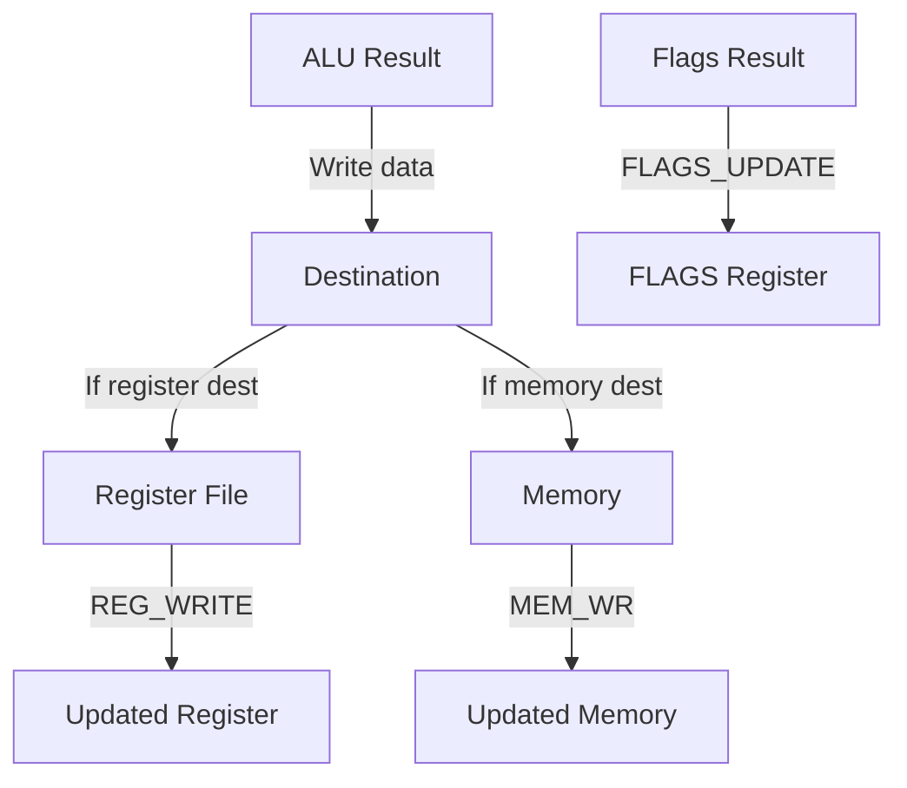

**Writeback paths:**

| Destination | Action |
|-------------|--------|
| Register | Result latched into destination register on clock edge |
| Memory | Result written to memory at computed address |
| FLAGS | Zero, Carry, Sign flags latched simultaneously |

**Timing:**

| Parameter | Value |
|-----------|-------|
| Cycles | 1 clock cycle (overlaps with execute for ALU ops) |
| Register write | On rising edge of next clock |
| Memory write | During WR pulse |

---

## Complete Instruction Timing

### Instruction Cycle Diagrams

#### Register-Register (e.g., ADD AX, BX)

```mermaid
gantt
    title ADD AX, BX — 2 Cycle Execution
    dateFormat X
    axisFormat %s

    section Fetch
    Fetch instruction    :a1, 0, 1
    section Decode
    Decode & setup       :a2, 1, 2
    section Execute
    ALU operation        :a3, 1, 2
    section Writeback
    Write result         :a4, 1, 2
```

| Cycle | Phase | Description |
|-------|-------|-------------|
| 1 | Fetch | Fetch instruction from memory[IP], IP += 2 |
| 2 | Decode+Execute+Writeback | Decode, ALU compute, write result to AX, update FLAGS |

#### Memory Load (e.g., MOV AX, [BX])

```mermaid
gantt
    title MOV AX, [BX] — 3 Cycle Execution
    dateFormat X
    axisFormat %s

    section Cycle 1
    Fetch instruction    :a1, 0, 1
    section Cycle 2
    Decode & addr calc   :a2, 1, 2
    section Cycle 3
    Memory read & write  :a3, 2, 3
```

| Cycle | Phase | Description |
|-------|-------|-------------|
| 1 | Fetch | Fetch instruction from memory[IP], IP += 2 |
| 2 | Decode + Address | Decode instruction, compute effective address from BX |
| 3 | Memory + Writeback | Read memory at BX, write result to AX |

#### Jump Conditional (e.g., JZ target)

```mermaid
gantt
    title JZ target (taken) — 2 Cycle Execution
    dateFormat X
    axisFormat %s

    section Cycle 1
    Fetch instruction    :a1, 0, 1
    section Cycle 2
    Decode, test, branch :a2, 1, 2
```

| Cycle | Phase | Description |
|-------|-------|-------------|
| 1 | Fetch | Fetch JZ instruction, IP += 2 |
| 2 | Decode + Execute | Decode, test Z flag, if Z=1 load target into IP |

If Z=0 (not taken), only 1 cycle: fetch, detect condition false, continue.

---

## PC Auto-Increment

The Program Counter automatically advances after each instruction fetch:

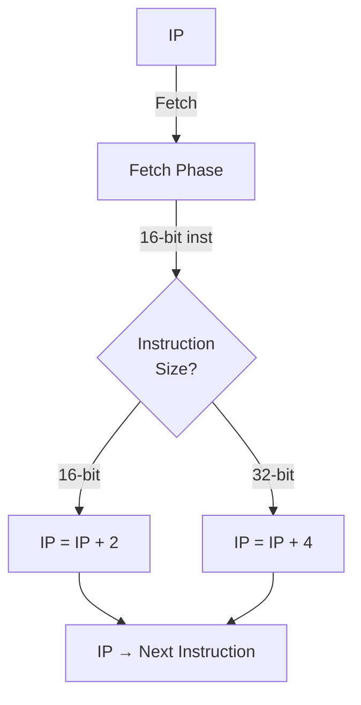

| Instruction Format | IP Change | Rationale |
|--------------------|-----------|-----------|
| 16-bit (short) | +2 bytes | Next instruction is 1 word (2 bytes) away |
| 32-bit (long) | +4 bytes | Instruction occupies 2 words (4 bytes) |
| Jump (taken) | = target | IP overwritten by target address |
| Jump (not taken) | +2 or +4 | No change, already incremented |

**Critical:** IP is incremented during the fetch phase, **before** any jump instruction can modify it. Jump instructions load a new value into IP, overriding the auto-increment.

---

## Flag Update Timing

Flags are updated at the **end** of the execute phase, after the ALU operation completes:

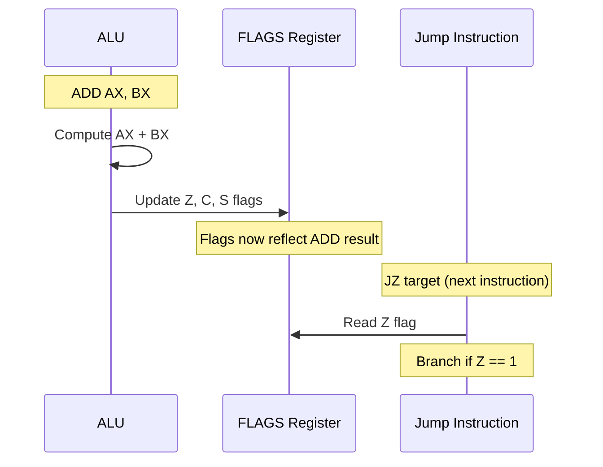

**Key rules:**

1. Flags are only modified by ALU instructions (ADD, SUB, AND, OR, XOR, SHL, SHR)
2. MOV, PUSH, POP, JMP, IN, OUT do **not** affect FLAGS
3. Flags persist until the next ALU instruction modifies them
4. Conditional jumps (JZ, JNZ) test flags set by a **previous** ALU instruction
5. After CALL/INT, FLAGS are saved to stack; after RET/IRET, FLAGS are restored

---

## Multi-Cycle Operations

Some instructions require more than the standard 2-cycle execution:

### 32-bit Instruction Fetch

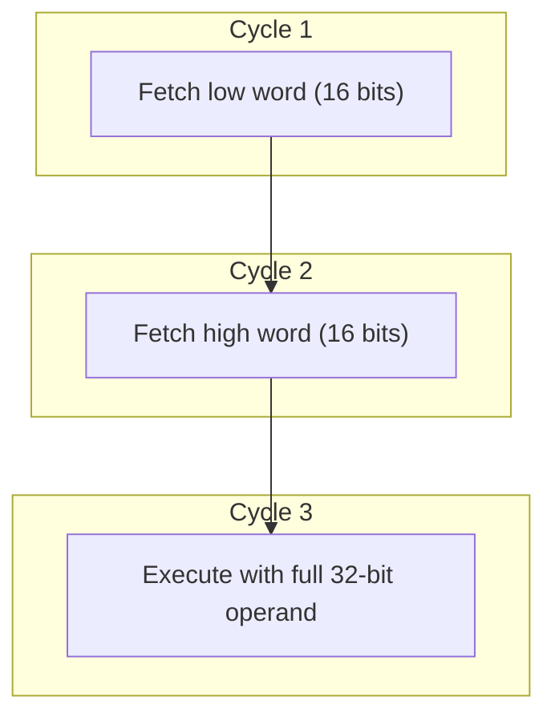

| Cycle | Action |
|-------|--------|
| 1 | Fetch low word of instruction into IR[15:0] |
| 2 | Fetch high word into IR[31:16] |
| 3 | Decode and execute using full 32-bit operand |

### Memory Indirect Addressing

When using indirect addressing (e.g., `MOV AX, [[BX]]` — load address from BX, then load data from that address):

| Cycle | Action |
|-------|--------|
| 1 | Fetch instruction |
| 2 | Read memory at BX → get effective address |
| 3 | Read memory at effective address → get data |
| 4 | Write data to AX |

### WAIT States

Slow memory or peripherals can insert wait states:

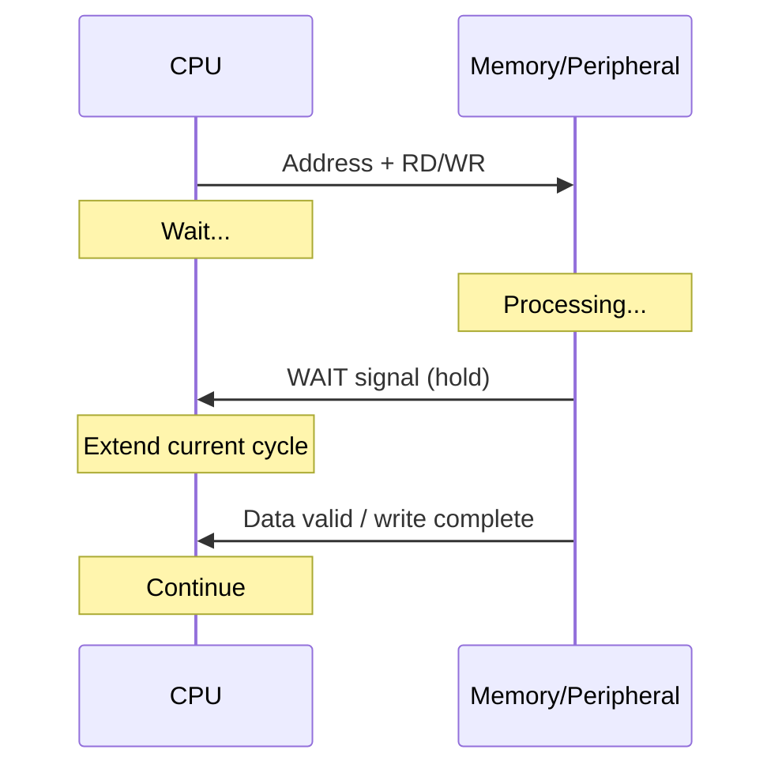

The `WAIT` input to the CPU extends the current cycle until the device is ready.

---

## Interrupt-Driven Cycle Extension

When an interrupt is received via the `INT` instruction (after the current instruction completes):

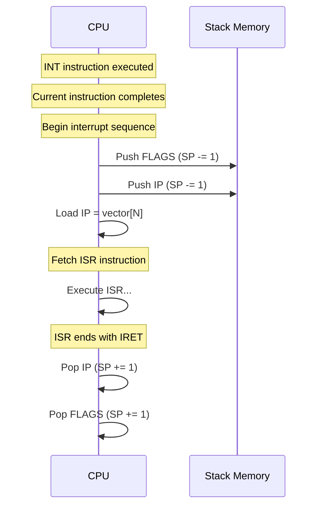

| Step | Action | Cycles |
|------|--------|--------|
| 1 | Complete current instruction | varies |
| 2 | INT recognized | 1 |
| 3 | Push FLAGS to stack | 1 |
| 4 | Push IP to stack | 1 |
| 5 | Load IP from vector table | 1 |
| **Total overhead** | | **3 cycles** |

---

## Summary

| Phase | Duration | Key Action |
|-------|----------|------------|
| Fetch | 1 cycle | Retrieve instruction from memory, increment IP |
| Decode | 1 cycle | Generate control signals from instruction bits |
| Execute | 1+ cycles | ALU operation, memory access, or branch |
| Writeback | 1 cycle | Store result to register/memory, update flags |

**Minimum instruction time:** 2 cycles (register-register ALU)
**Maximum instruction time:** 4+ cycles (memory indirect + WAIT states)

---

*See [Registers](registers.md) for register details and [Memory Map](memory-map.md) for address space layout.*