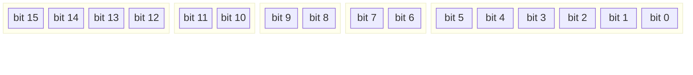
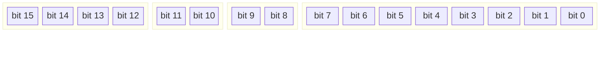
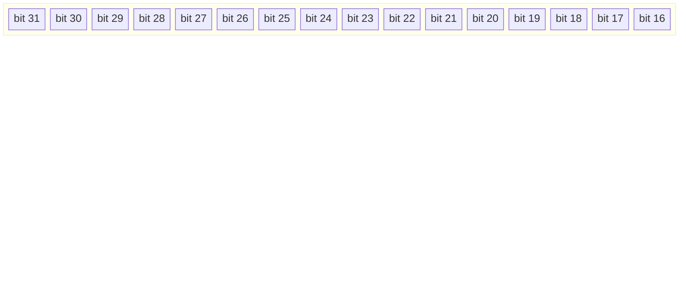
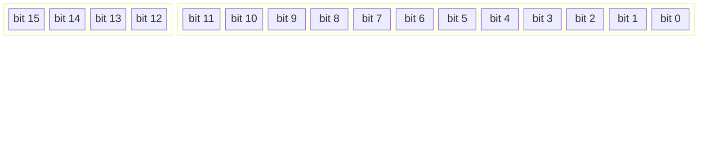
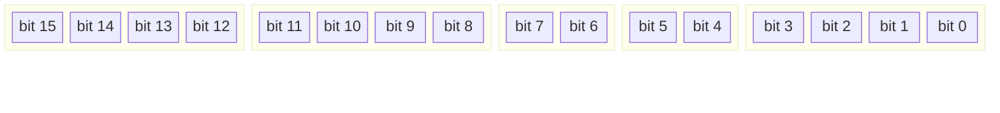
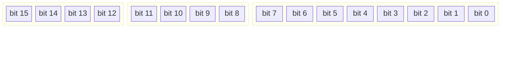

[← Back to Main](../README.md) | [← Overview](overview.md) | [Registers →](registers.md)

---

## Overview

The NovumOS-16bit CPU uses a hybrid 16/32-bit instruction format with 4-bit opcodes. Instructions are divided into **simple** (one opcode = one command) and **group** (one opcode = multiple commands, sub-decoded by Mode/Size bits).

---

## Instruction Formats

### 16-bit Format

| Field | Bits | Width | Description |
|-------|------|-------|-------------|
| `Opcode` | 15:12 | 4 | Operation code |
| `Dst` | 11:10 | 2 | Destination register |
| `Src` | 9:8 | 2 | Source register |
| `Mode` | 7:6 | 2 | Addressing mode |
| `Unused` | 5:0 | 6 | Not used |

### 32-bit Format (with immediate)

| Field | Bits | Width | Description |
|-------|------|-------|-------------|
| `Opcode` | 15:12 | 4 | Operation code |
| `Dst` | 11:10 | 2 | Destination register |
| `Mode` | 9:8 | 2 | Addressing mode |
| `Unused` | 7:0 | 8 | Not used |
| `Immediate` | 31:16 | 16 | Immediate value |

### Group Command Format (ALU, CondJump, PushPop)

For group commands, bits [11:8] are repurposed as **Mode** and **Size** (4-bit sub-opcode):

| Field | Bits | Width | Description |
|-------|------|-------|-------------|
| `Opcode` | 15:12 | 4 | Operation code |
| `Sub-opcode` | 11:0 | 12 | Sub-opcode (Mode+Size) or Dst/Src |

---

## Opcode Map

| Opcode | Mnemonic | Type | Description |
|--------|----------|------|-------------|
| `0x0` | NOP | Simple | No operation |
| `0x1` | MOV | Simple | Move data between registers/memory |
| `0x2` | JMP | Simple | Unconditional jump |
| `0x3` | CALL | Simple | Call subroutine |
| `0x4` | RET | Simple | Return from subroutine |
| `0x5` | INT | Simple | Software interrupt |
| `0x6` | IRET | Simple | Return from interrupt |
| `0x7` | HLT | Simple | Halt CPU |
| `0x8` | IN | Simple | Read from I/O port |
| `0x9` | OUT | Simple | Write to I/O port |
| `0xA` | ALU | Group | ALU operations (16 sub-ops) |
| `0xB` | CondJump | Group | Conditional jumps (6 sub-ops) |
| `0xC` | PushPop | Group | Stack operations (2 sub-ops) |
| `0xD` | — | Reserved | Future use |
| `0xE` | — | Reserved | Future use |
| `0xF` | — | Reserved | Future use |

---

## ALU Group (0xA)

Sub-decoded by Mode[11:10] + Size[9:8]:

| Sub-op | Binary | Mnemonic | Description | Flags |
|--------|--------|----------|-------------|-------|
| 0 | `0000` | ADD | Addition | Z, C, S |
| 1 | `0001` | ADC | Add with carry | Z, C, S |
| 2 | `0010` | SUB | Subtraction | Z, C, S |
| 3 | `0011` | SBB | Subtract with borrow | Z, C, S |
| 4 | `0100` | CMP | Compare (flags only) | Z, C, S |
| 5 | `0101` | TEST | Test (flags only) | Z, S |
| 6 | `0110` | AND | Bitwise AND | Z, S |
| 7 | `0111` | OR | Bitwise OR | Z, S |
| 8 | `1000` | XOR | Bitwise XOR | Z, S |
| 9 | `1001` | SHL | Shift left | Z, C, S |
| 10 | `1010` | SHR | Shift right | Z, C, S |
| 11 | `1011` | INC | Increment | Z, S |
| 12 | `1100` | DEC | Decrement | Z, S |
| 13 | `1101` | NOT | Bitwise NOT | — |
| 14 | `1110` | NEG | Negate (two's complement) | Z, C, S |
| 15 | `1111` | XCHG | Exchange registers | — |

### ALU Instruction Encoding

| Field | Bits | Width | Description |
|-------|------|-------|-------------|
| `Opcode` | 15:12 | 4 | 0xA (ALU group) |
| `ALU sub-opcode` | 11:8 | 4 | ALU operation sub-opcode |
| `Dst` | 7:6 | 2 | Destination register |
| `Src` | 5:4 | 2 | Source register |
| `Unused` | 3:0 | 4 | Not used |

---

## Conditional Jump Group (0xB)

Sub-decoded by Mode[11:10] + Size[9:8]:

| Sub-op | Binary | Mnemonic | Condition | Description |
|--------|--------|----------|-----------|-------------|
| 0 | `0000` | JZ / JE | Z = 1 | Jump if Zero / Equal |
| 1 | `0001` | JNZ / JNE | Z = 0 | Jump if Not Zero / Not Equal |
| 2 | `0010` | JC / JB | C = 1 | Jump if Carry / Below (unsigned) |
| 3 | `0011` | JNC / JAE | C = 0 | Jump if No Carry / Above or Equal |
| 4 | `0100` | JS | S = 1 | Jump if Sign (negative) |
| 5 | `0101` | JNS | S = 0 | Jump if No Sign (positive) |

### Conditional Jump Encoding

| Field | Bits | Width | Description |
|-------|------|-------|-------------|
| `Opcode` | 15:12 | 4 | 0xB (conditional jump group) |
| `CondJump sub-opcode` | 11:8 | 4 | Condition sub-opcode |
| `Unused` | 7:0 | 8 | Not used |
| `Target` | 31:16 | 16 | Jump target address |

---

## PUSH/POP Group (0xC)

Sub-decoded by Mode[9:8]:

| Sub-op | Binary | Mnemonic | Description |
|--------|--------|----------|-------------|
| 0 | `00` | PUSH | Push register to stack |
| 1 | `01` | POP | Pop from stack to register |

### PUSH/POP Encoding

| Field | Bits | Width | Description |
|-------|------|-------|-------------|
| `Opcode` | 15:12 | 4 | 0xC (stack operations group) |
| `Reg` | 11:10 | 2 | Operand register |
| `Mode` | 9:8 | 2 | Mode (00=PUSH, 01=POP) |
| `Unused` | 7:0 | 8 | Not used |

---

## Simple Instructions

### NOP (0x0)

No operation. Processor continues to next instruction.

### MOV (0x1)

Move data between registers or between register and memory.

| Encoding | Example | Description |
|----------|---------|-------------|
| Reg→Reg | `MOV AX, BX` | Copy BX to AX |
| Imm→Reg | `MOV AX, 0x1234` | Load immediate (32-bit format) |
| [Reg]→Reg | `MOV AX, [BX]` | Load from memory address in BX |
| Reg→[Reg] | `MOV [BX], AX` | Store AX to memory address in BX |
| [Reg+off]→Reg | `MOV AX, [BX+0x10]` | Load from BX + offset |

### JMP (0x2)

Unconditional jump to target address.

### CALL (0x3)

Call subroutine. Pushes return address (IP+4) onto stack, then jumps to target.

### RET (0x4)

Return from subroutine. Pops return address from stack into IP.

### INT (0x5)

Software interrupt. Pushes FLAGS and IP onto stack, loads IP from interrupt vector table.

### IRET (0x6)

Return from interrupt. Pops IP and FLAGS from stack.

### HLT (0x7)

Halt CPU until next interrupt.

### IN (0x8)

Read 16-bit value from I/O port.

### OUT (0x9)

Write 16-bit value to I/O port.

---

## Addressing Modes

| Mode | Binary | Description |
|------|--------|-------------|
| Reg→Reg | `00` | Register to register |
| Immediate | `01` | Immediate value (32-bit format) |
| Indirect | `10` | Memory at address in register |
| Indirect+Offset | `11` | Memory at register + immediate offset |

---

## Flags

| Flag | Bit | Name | Description |
|------|-----|------|-------------|
| Z | 0 | Zero | Set if ALU result is zero |
| C | 1 | Carry | Set if arithmetic produces carry out |
| S | 2 | Sign | Set if result bit 15 is 1 (negative) |
| 3–15 | — | Reserved | Unused |

---

## Register Encoding

| Binary | Register | Name |
|--------|----------|------|
| `00` | AX | Accumulator |
| `01` | BX | Base |
| `10` | CX | Counter |
| `11` | DX | Data |

---

*See [Registers](registers.md) for detailed register specifications.*