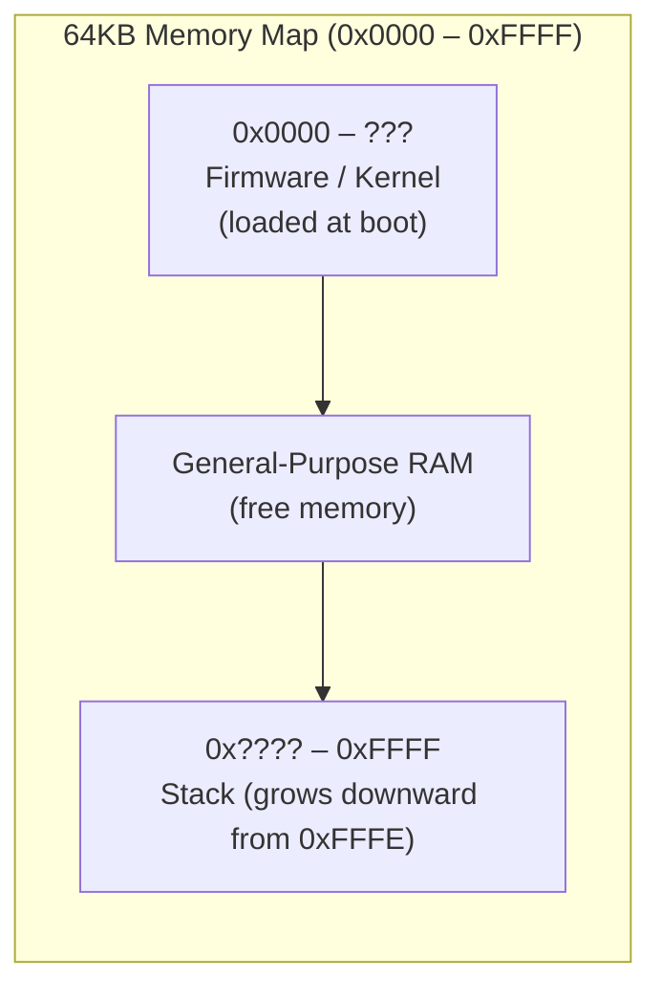
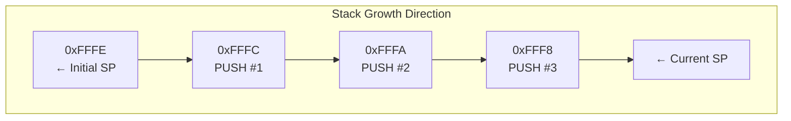
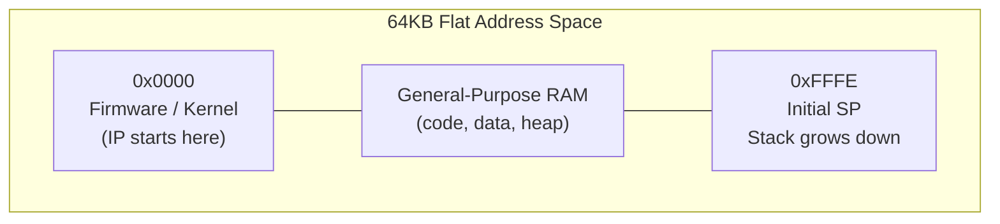
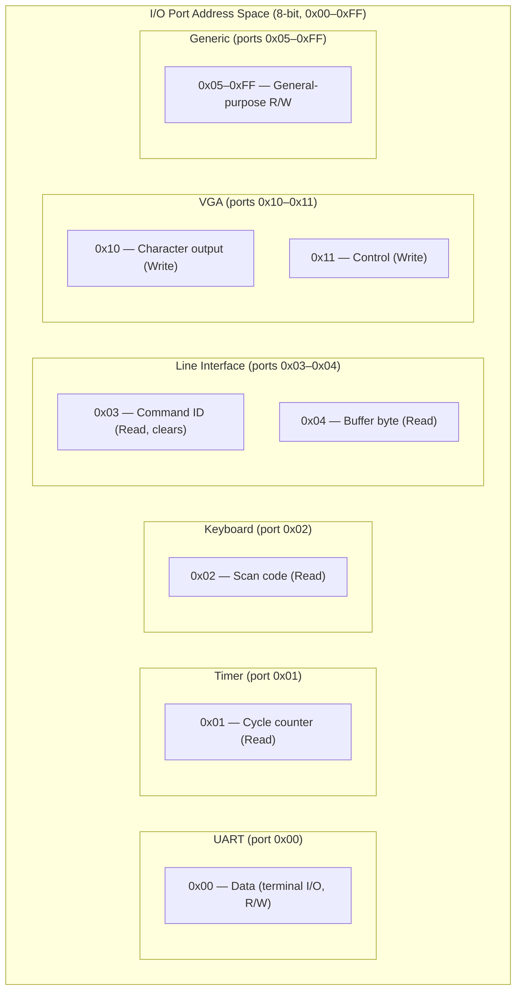
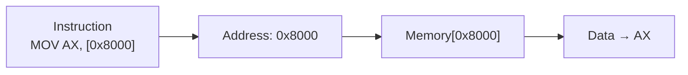
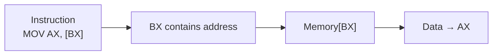

[← Back to Main](../README.md) | [← Overview](overview.md) | [← Registers](registers.md) | [← Execution Cycle](execution-cycle.md)

---

## 64 KB Flat Address Space

The NovumOS-16bit CPU uses a flat 64 KB (65,536 byte) address space. There are no segments, no paging, and no memory protection. The entire 16-bit address bus maps directly to physical RAM.

| Address Range | Size | Description |
|---------------|------|-------------|
| 0x0000 | varies | Firmware/kernel loaded here at boot |
| 0x0000 – 0xFFFF | 64 KB | Flat RAM — no segments, no protection |
| 0xFFFE – 0xFFFF | 2 bytes | Initial stack pointer location |

The CPU boots with `IP = 0x0000` and begins executing the first instruction at address 0. Firmware is loaded into memory starting at 0x0000. There is no reset vector indirection — execution starts directly at address zero.

---

## Memory Layout

### Firmware / Kernel Region (0x0000 onward)

The firmware binary is loaded into memory starting at 0x0000. The kernel may occupy any portion of the 64 KB space; there is no fixed boundary between kernel and user memory.

- The `INT n` instruction sets `IP = n × 4`, enabling simple interrupt dispatch by placing handler code at those addresses
- The first 256 bytes (0x0000–0x00FF) can serve as interrupt vector entry points (64 handlers, each 4 bytes apart)
- Everything else is general-purpose RAM — code, data, and stack all share the same address space

### Stack Region (0xFFFE downward)

The stack starts at the top of memory and grows downward.

| Property | Value |
|----------|-------|
| Initial SP | `0xFFFE` (top of memory; first PUSH writes to 0xFFFC) |
| Growth direction | Downward (toward lower addresses) |
| Word size | 16-bit (2 bytes per push/pop) |

| Operation | SP Change | Memory Access |
|-----------|-----------|---------------|
| `PUSH AX` | SP = SP - 2 | word[SP] = AX |
| `POP AX` | SP = SP + 2 | AX = word[SP] |
| `CALL subroutine` | SP = SP - 2 | word[SP] = IP (return address) |
| `RET` | SP = SP + 2 | IP = word[SP] |
| `INT n` | SP = SP - 4 | word[SP+2] = FLAGS; word[SP] = IP |
| `IRET` | SP = SP + 4 | IP = word[SP-2]; FLAGS = word[SP-4] |

### Stack Frame Convention

For function calls, a standard stack frame convention is used:

| Offset | Content |
|--------|---------|
| SP+0 | Return address (pushed by CALL) |
| SP+2 | Local variable 1 |
| SP+4 | Local variable 2 |
| ... | ... |

---

## Complete Address Map

---

## Memory Map Table

| Start | End | Size | Description |
|-------|-----|------|-------------|
| 0x0000 | varies | — | Firmware/kernel, loaded at boot |
| 0x0000 | 0x00FF | 256 B | Optional: interrupt vector entry points |
| 0x0000 | 0xFFFF | 64 KB | Flat RAM — all addresses are general purpose |
| 0xFFFE | 0xFFFF | 2 B | Initial stack pointer value |

No segments, no partitions, no reserved ranges beyond what the firmware chooses to use.

---

## I/O Port Map

The CPU uses **isolated I/O** (separate address space from memory) for peripherals. I/O ports are accessed via `IN` and `OUT` instructions using an 8-bit port address (0x00–0xFF).

### Peripheral Port Allocation

### Detailed Port Table

| Port | Peripheral | R/W | Description |
|------|------------|:---:|-------------|
| 0x00 | UART | R/W | Terminal I/O: read = receive byte, write = transmit byte |
| 0x01 | Timer | Read | Cycle counter (low 16 bits of instruction count) |
| 0x02 | Keyboard | Read | Scancode ring buffer; returns 0 if empty |
| 0x03 | Line Cmd | Read | Command ID: 0=none, 1=help, 2=clear, 3=reboot, 4=info, 5=dump, 6=halt, 7=unknown. **Clears to 0 on read.** |
| 0x04 | Line Buffer | Read | Next byte from line buffer; returns 0 if exhausted |
| 0x10 | VGA Char | Write | Output character to VGA text buffer (low byte = char) |
| 0x11 | VGA Control | Write | 0x0001 = clear screen, 0x0002 = flush render |
| 0x05–0xFF | Generic | R/W | 256 × 16-bit general-purpose storage locations |

### Port Descriptions

**UART (0x00):** A simple terminal I/O port. Writing transmits a byte; reading receives a byte (0 if buffer empty). The emulator mirrors VGA output to UART TX for terminal display.

**Timer (0x01):** Returns the low 16 bits of the CPU's cycle counter. The counter increments once per instruction cycle. Read-only.

**Keyboard (0x02):** Returns the next scancode from a ring buffer. The emulator injects keypresses; returns 0 when the buffer is empty.

**Line Cmd (0x03):** Returns the command ID of the last parsed command line. Written by the keyboard handler when Enter is pressed. Self-clearing — reading resets to 0.

**Line Buffer (0x04):** Returns bytes from the buffered command line one at a time. The kernel uses this to read the command after detecting a non-zero cmd_id at port 0x03.

**VGA (0x10–0x11):** I/O-port-mapped text display. Port 0x10 outputs a character to the current cursor position (ANSI-style scrolling). Port 0x11 accepts control commands (clear, flush). VGA is **not** memory-mapped — all display interaction goes through these two ports.

---

## Memory Access Patterns

### Direct Addressing

The instruction contains the full 16-bit address.

| Instruction | Address Source |
|-------------|----------------|
| `MOV AX, [0x8000]` | Direct: 0x8000 |
| `MOV [0x8000], AX` | Direct: 0x8000 |

### Register Indirect Addressing

The address is held in a register (typically BX).

| Instruction | Address Source |
|-------------|----------------|
| `MOV AX, [BX]` | Address = BX |
| `MOV [BX], AX` | Address = BX |
| `MOV AX, [BX+imm]` | Address = BX + offset |

### Immediate Addressing

The operand is embedded in the instruction (no memory access for the operand).

| Instruction | Value Source |
|-------------|--------------|
| `MOV AX, 0x1234` | Immediate: 0x1234 |
| `ADD AX, 5` | Immediate: 5 |

---

## Byte Ordering (Endianness)

The NovumOS-16bit CPU uses **little-endian** byte ordering:

| Address | Value (16-bit word 0x1234) |
|---------|---------------------------|
| N | 0x34 (low byte) |
| N+1 | 0x12 (high byte) |

This affects:
- Multi-byte data storage in memory
- Instruction word encoding
- I/O port data transfer order

---

## Summary

| Region | Address Range | Size | Description |
|--------|---------------|------|-------------|
| Firmware | 0x0000–??? | varies | Boot code loaded at address 0 |
| General RAM | 0x0000–0xFFFF | 64 KB | Flat address space, no segments |
| Stack | 0xFFFE↓ | grows down | SP initialized to 0xFFFE, grows toward lower addresses |

**Total:** 64 KB (0x0000–0xFFFF), all flat, all general-purpose.

No segments, no paging, no memory-mapped I/O, no VGA framebuffer in memory space. Peripherals are accessed exclusively through I/O ports.

---

*See [Overview](overview.md) for how the bus interface accesses this memory and [Execution Cycle](execution-cycle.md) for timing of memory operations.*