Complete reference for processor flag behavior, transitions, and interactions.

---

## Table of Contents

1. [Flags Register Overview](#flags-register-overview)
2. [Flag Definitions](#flag-definitions)
3. [Instruction Flag Effects](#instruction-flag-effects)
4. [Flag State Machine](#flag-state-machine)
5. [Carry Propagation in Multi-Word Arithmetic](#carry-propagation-in-multi-word-arithmetic)
6. [Shift Flag Behavior](#shift-flag-behavior)
7. [Comparison and Testing](#comparison-and-testing)
8. [Flag Interaction Patterns](#flag-interaction-patterns)

---

## Flags Register Overview

The FLAGS register is a 16-bit register, but only the lower 3 bits are defined. All upper bits (15–3) read as zero and are reserved for future use.

### FLAGS Register Layout

```
Bit:  15 14 13 12 11 10  9  8  7  6  5  4  3  2  1  0
      ──────────── reserved (read as 0) ────────────  S  C  Z
```

| Bit | Name | Set when... | Cleared when... |
|-----|------|-------------|-----------------|
| 0   | **Z** (Zero) | Operation result equals 0x0000 | Operation result is non-zero |
| 1   | **C** (Carry) | Unsigned overflow (ADD: result > 0xFFFF) or unsigned borrow (SUB: source > dest) or shift-out bit is 1 (SHL/SHR) | Operation does not produce carry/borrow or shift-out bit is 0 |
| 2   | **S** (Sign) | Result MSB (bit 15) is 1 | Result MSB (bit 15) is 0 |
| 3–15| Reserved | Always 0 | Always 0 |

### Flags and Arithmetic Interpretation

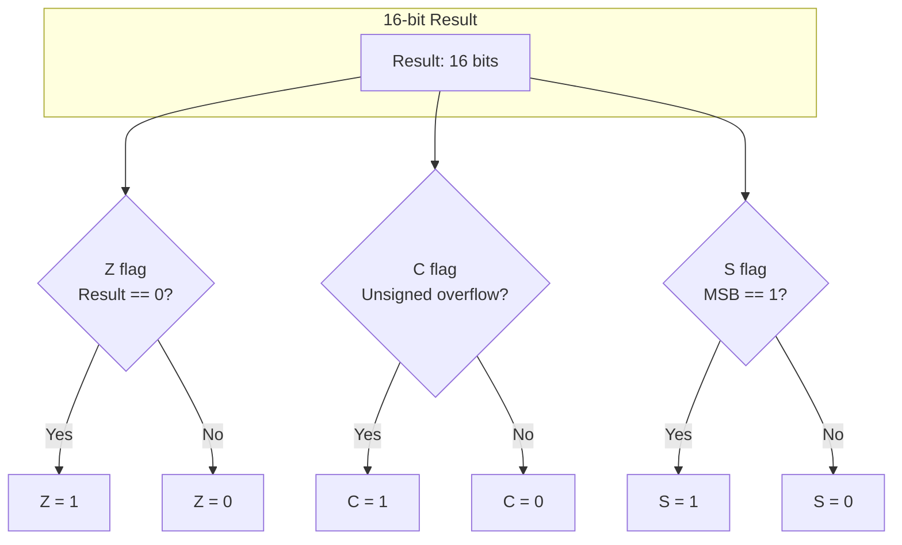

---

## Flag Definitions

### Z — Zero Flag

**Purpose:** Indicates whether the result of the last operation was zero.

**Semantics:**

- **Z = 1:** The operation produced a result of exactly `0x0000`
- **Z = 0:** The operation produced a non-zero result

**How it works:**

The zero flag is computed by OR-reducing all 16 bits of the result. If the OR of all bits is zero, the Z flag is set. This is a single-cycle operation in hardware.

```mermaid
flowchart LR
    subgraph "Result bits"
        B15["b15"] B14["b14"] B13["..."] B1["b1"] B0["b0"]
    end

    B15 --> OR["16-input OR gate"]
    B14 --> OR
    B13 --> OR
    B1 --> OR
    B0 --> OR
    OR --> NOT["NOT gate"]
    NOT --> ZF["Z flag"]
```

**Usage:**

- After ALU SUB/CMP: check if values are equal
- After loop counter decrement (DEC): check if loop is complete
- After AND with mask (TEST): test if specific bits are set

### C — Carry Flag

**Purpose:** Indicates unsigned overflow or borrow in arithmetic operations, or captures the last shifted-out bit in shift operations.

**Semantics for ADD (ALU sub-op 0x0):**


- **C = 1:** The addition produced a carry out of bit 15 (result > 0xFFFF unsigned)
- **C = 0:** No carry out occurred

**Semantics for SUB and CMP (ALU sub-ops 0x2, 0x4):**

- **C = 1:** A borrow occurred (source > destination unsigned)
- **C = 0:** No borrow (destination ≥ source unsigned)

**Semantics for ADC (ALU sub-op 0x1):**

- **C = 1:** The addition including carry in produced a carry out of bit 15
- **C = 0:** No carry out occurred

**Semantics for SBB (ALU sub-op 0x3):**

- **C = 1:** A borrow occurred (source + borrow > destination unsigned)
- **C = 0:** No borrow

**Semantics for NEG (ALU sub-op 0xE):**

- **C = 1:** Result is non-zero (input was non-zero)
- **C = 0:** Result is zero (input was zero)

**Semantics for SHL (ALU sub-op 0x9):**

- **C = 1:** The last bit shifted out of the MSB was 1
- **C = 0:** The last bit shifted out of the MSB was 0

**Semantics for SHR (ALU sub-op 0xA):**

- **C = 1:** The last bit shifted out of the LSB was 1
- **C = 0:** The last bit shifted out of the LSB was 0

**Semantics for INC/DEC (ALU sub-ops 0xB, 0xC):**

- Carry is **not affected** by INC or DEC. This preserves the carry flag across loop counter updates in multi-word arithmetic.

**Semantics for AND/OR/XOR (ALU sub-ops 0x6, 0x7, 0x8):**

- Carry is **cleared** to 0.

**Note on SUB carry inversion:**

For subtraction, the carry flag represents a **borrow** — it is the logical inverse of what ADD would produce for the same operands. This is standard for processors that implement SUB as `A + (~B) + 1`:

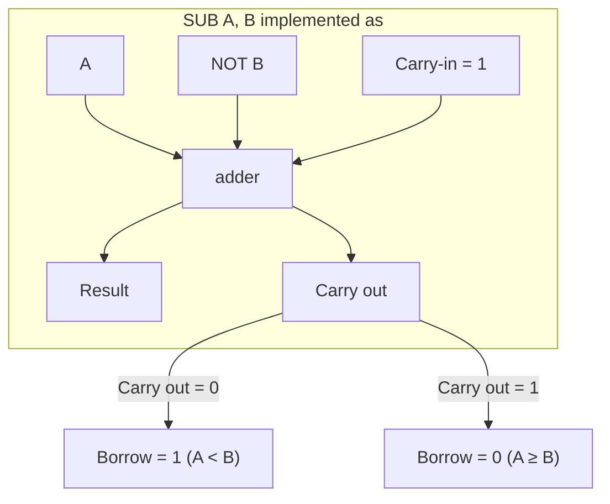

This inversion means:

| Condition | C flag after CMP/SUB A, B |
|-----------|---------------------------|
| A > B (unsigned) | 0 |
| A = B (unsigned) | 0 |
| A < B (unsigned) | 1 |

### S — Sign Flag

**Purpose:** Indicates the sign of the result when interpreted as a signed 16-bit integer (two's complement).

**Semantics:**

- **S = 1:** Result MSB is 1 (negative in signed interpretation)
- **S = 0:** Result MSB is 0 (non-negative in signed interpretation)

**Note:** The S flag is a direct copy of bit 15 of the result. It does not account for overflow in signed arithmetic. For signed comparison, both S and V (overflow, not available in base ISA) are needed.

**Practical limitation:** Without a signed overflow (V) flag, the S flag alone is insufficient for reliable signed comparison. For signed arithmetic, the software must manually check for overflow conditions.

---

## Instruction Flag Effects

### Complete Flag Reference Table

| Instruction     | Z | C | S | Notes |
|-----------------|---|---|---|-------|
| **NOP**         | — | — | — | No flags modified |
| **MOV**         | — | — | — | No flags modified |
| **JMP**         | — | — | — | No flags tested or modified |
| **CALL**        | — | — | — | No flags modified |
| **RET**         | — | — | — | No flags modified |
| **INT**         | — | — | — | FLAGS saved to stack, not modified |
| **IRET**        | ✓ | ✓ | ✓ | FLAGS restored from stack |
| **HLT**         | — | — | — | No flags modified |
| **IN**          | — | — | — | No flags modified |
| **OUT**         | — | — | — | No flags modified |
| **PUSH**        | — | — | — | No flags modified |
| **POP**         | — | — | — | No flags modified |
| **ALU ADD**     | ✓ | ✓ | ✓ | Z = (result == 0); C = (carry out); S = (MSB) |
| **ALU SUB**     | ✓ | ✓ | ✓ | Z = (result == 0); C = (borrow); S = (MSB) |
| **ALU CMP**     | ✓ | ✓ | ✓ | Same as SUB, result discarded |
| **ALU TEST**    | ✓ | — | ✓ | Z = (result == 0); S = (MSB); C cleared |
| **ALU AND**     | ✓ | — | ✓ | Z = (result == 0); S = (MSB); C cleared |
| **ALU OR**      | ✓ | — | ✓ | Z = (result == 0); S = (MSB); C cleared |
| **ALU XOR**     | ✓ | — | ✓ | Z = (result == 0); S = (MSB); C cleared |
| **ALU SHL**     | ✓ | ✓ | ✓ | Z = (result == 0); C = (last bit out MSB); S = (MSB) |
| **ALU SHR**     | ✓ | ✓ | ✓ | Z = (result == 0); C = (last bit out LSB); S = (MSB) |
| **ALU INC**     | ✓ | — | ✓ | Z = (result == 0); S = (MSB); C unchanged |
| **ALU DEC**     | ✓ | — | ✓ | Z = (result == 0); S = (MSB); C unchanged |
| **ALU NOT**     | — | — | — | No flags modified |
| **ALU NEG**     | ✓ | ✓ | ✓ | Z = (result == 0); C = (result ≠ 0); S = (MSB) |
| **ALU ADC**     | ✓ | ✓ | ✓ | Z = (result == 0); C = (carry out with carry in); S = (MSB) |
| **ALU SBB**     | ✓ | ✓ | ✓ | Z = (result == 0); C = (borrow with borrow in); S = (MSB) |
| **ALU XCHG**    | — | — | — | No flags modified |
| **JZ**          | — | — | — | Tests Z, does not modify flags |
| **JNZ**         | — | — | — | Tests Z, does not modify flags |
| **JC**          | — | — | — | Tests C, does not modify flags |
| **JNC**         | — | — | — | Tests C, does not modify flags |
| **JS**          | — | — | — | Tests S, does not modify flags |
| **JNS**         | — | — | — | Tests S, does not modify flags |

**Legend:** ✓ = modified, — = unchanged

### Flag Update Timing

Flags are updated at the **end** of the execute stage, after the operation completes. This means:

1. The instruction fetches operands
2. The ALU performs the operation
3. The result is written back to the destination register
4. Flags are updated from the result
5. The next instruction can use the updated flags

There is no pipeline hazard for flag-dependent branches because the flag update occurs before the next instruction's decode stage.

---

## Flag State Machine

### Z Flag State Diagram

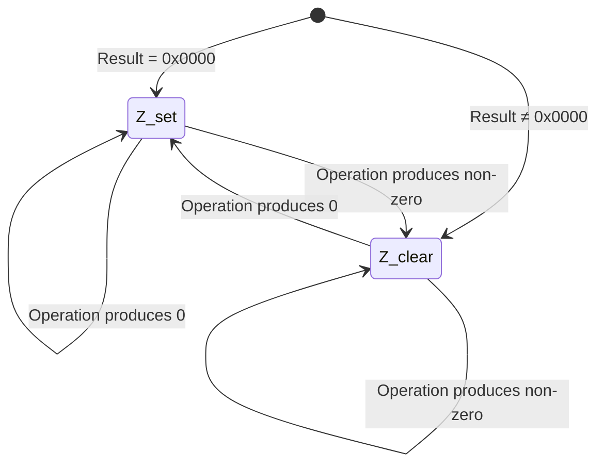

### C Flag State Diagram

```mermaid
stateDiagram-v2
    [*] --> C_set: Carry/borrow occurred
    [*] --> C_clear: No carry/borrow

    C_set --> C_set: Next op: carry/borrow again
    C_set --> C_clear: Next op: no carry/borrow
    C_clear --> C_set: Next op: carry/borrow
    C_clear --> C_clear: Next op: no carry/borrow

    note right of C_set: ADD: result > 0xFFFF\nSUB: source > dest\nSHL: last bit out = 1\nSHR: last bit out = 1
```

### S Flag State Diagram

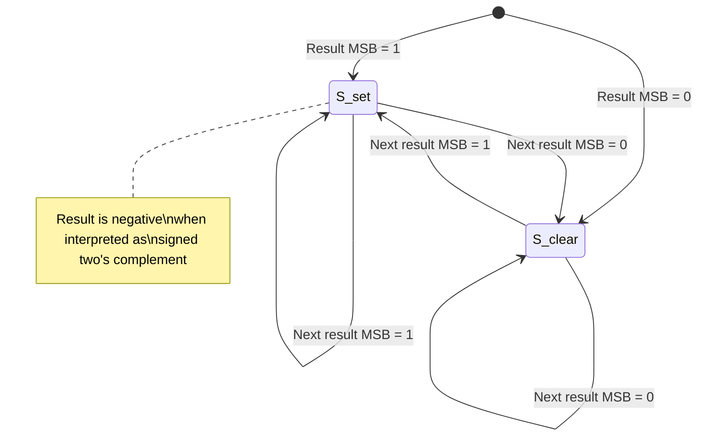

### Combined Flag State Diagram

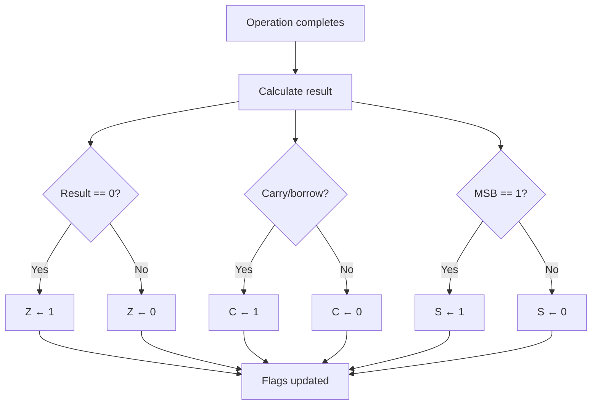

---

## Carry Propagation in Multi-Word Arithmetic

The carry flag enables arithmetic on values larger than 16 bits by chaining operations across multiple words. The ISA includes ADC (add with carry) and SBB (subtract with borrow) for efficient multi-word arithmetic without branches.

### 32-bit Addition

To add two 32-bit values stored in register pairs:

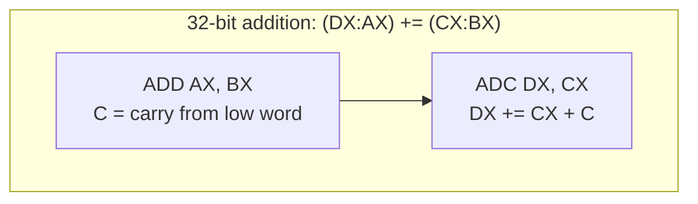

**Step-by-step:**

1. `ADD AX, BX` — adds the low 16 bits. The Carry flag is set if a carry out occurs.
2. `ADC DX, CX` — adds the high 16 bits plus the carry from the low word. Single-cycle, no branch needed.

```
ADD  AX, low_word       ; C = carry from low word
ADC  DX, high_word      ; DX = DX + high_word + C
; 32-bit addition complete in 2 cycles
```

### 32-bit Subtraction

To subtract two 32-bit values:

```
SUB  AX, low_word       ; C = borrow from low word
SBB  DX, high_word      ; DX = DX - high_word - C
; 32-bit subtraction complete in 2 cycles
```

### Carry Preservation with INC/DEC

INC and DEC (ALU sub-ops 0xB, 0xC) do **not** affect the carry flag. This allows loop counters to be updated without disturbing the carry state:

```
ADD AX, BX              ; C = carry from addition
...                     ; (no ALU operations that modify C)
DEC CX                  ; CX--, C preserved
JNZ loop                ; continue loop without losing carry
; Carry from the original ADD is still available
```

---

## Shift Flag Behavior

### SHL — Shift Left (ALU sub-op 0x9)

SHL shifts all bits toward the MSB. The MSB is shifted into the carry flag. The LSB is filled with zero.

**Single-bit shift:**

```mermaid
flowchart LR
    subgraph "Before SHL AX, 1"
        A15["b15"] A14["b14"] A13["..."] A1["b1"] A0["b0"]
    end

    subgraph "After SHL AX, 1"
        N14["b14"] N13["b13"] N12["..."] N0["b0"] ZERO["0"]
    end

    A15 -->|"→ C flag"| CF["C"]
    A14 --> N14
    A13 --> N13
    A1 --> N0
    A0 --> ZERO
```

**Multi-bit shift:**

For a shift by N bits, the carry flag is set to bit (15 − N) of the original value. Intermediate carry values from each individual bit shift are lost.

| Shift count | C flag after SHL | Z flag | S flag |
|-------------|-------------------|--------|--------|
| 0           | Unchanged         | Unchanged | Unchanged |
| 1           | Original bit 15   | (result == 0) | New MSB |
| 2           | Original bit 14   | (result == 0) | New MSB |
| 4           | Original bit 12   | (result == 0) | New MSB |
| 8           | Original bit 8    | (result == 0) | New MSB |
| 16          | Original bit 0    | Always 1 (result=0) | 0 |

**Special case: SHL by 16**

Shifting a 16-bit register left by 16 produces zero. The carry flag is set to the original LSB (bit 0), which is the last bit to exit the register.

### SHR — Shift Right (ALU sub-op 0xA)

SHR shifts all bits toward the LSB. The LSB is shifted into the carry flag. The MSB is filled with zero (logical shift, not arithmetic).

**Single-bit shift:**

```mermaid
flowchart LR
    subgraph "Before SHR AX, 1"
        A15["b15"] A14["b14"] A13["..."] A1["b1"] A0["b0"]
    end

    subgraph "After SHR AX, 1"
        ZERO["0"] N15["b15"] N14["b14"] N13["..."] N1["b1"]
    end

    A0 -->|"→ C flag"| CF["C"]
    A15 --> N15
    A14 --> N14
    A1 --> N1
```

**Multi-bit shift:**

For a shift by N bits, the carry flag is set to bit (N − 1) of the original value.

| Shift count | C flag after SHR | Z flag | S flag |
|-------------|-------------------|--------|--------|
| 0           | Unchanged         | Unchanged | Unchanged |
| 1           | Original bit 0    | (result == 0) | 0 (MSB always 0) |
| 2           | Original bit 1    | (result == 0) | 0 |
| 4           | Original bit 3    | (result == 0) | 0 |
| 8           | Original bit 7    | (result == 0) | 0 |
| 16          | Original bit 15   | Always 1 (result=0) | 0 |

**Special case: SHR by 16**

Shifting a 16-bit register right by 16 produces zero. The carry flag is set to the original MSB (bit 15), which is the last bit to exit the register.

**Note:** SHR always clears the S flag because it fills the MSB with zero. For sign-preserving right shift, a SAR instruction would be needed (not in base ISA).

---

## Comparison and Testing

The NovumOS-16bit provides CMP (ALU sub-op 0x4) and TEST (ALU sub-op 0x5) for comparison without modifying register values.

### Equality Test

To test if AX equals BX using CMP:

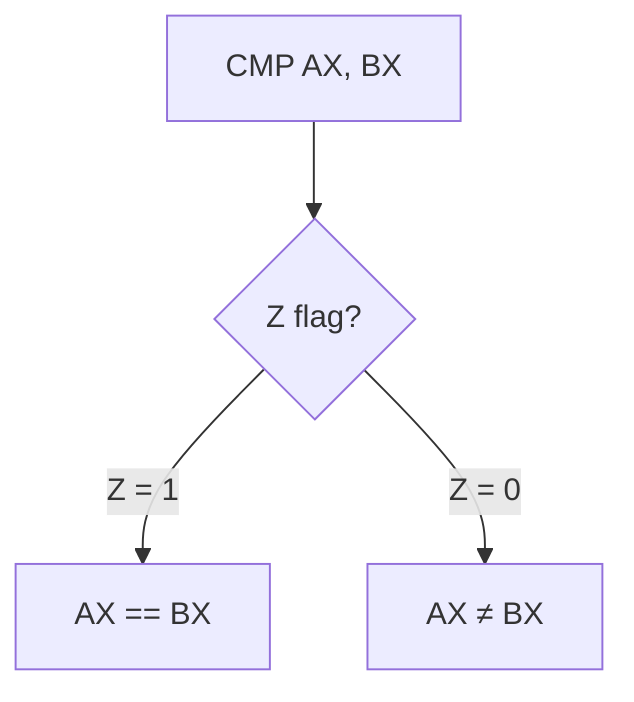

CMP is non-destructive — it only sets flags. For a destructive test that also zeros a register: `XOR AX, AX` (sets Z=1).

### Unsigned Greater Than

To test if AX > BX (unsigned) using CMP:

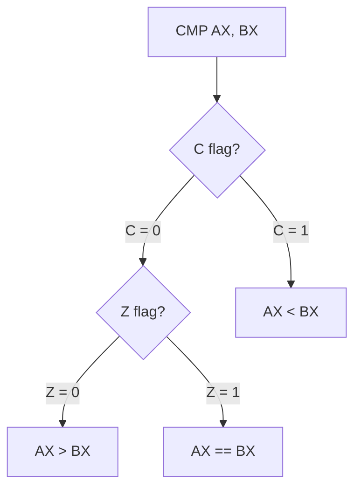

**Logic:** After `CMP AX, BX`:
- C = 0 and Z = 0: no borrow, not equal → AX > BX
- C = 0 and Z = 1: no borrow, equal → AX == BX
- C = 1: borrow occurred → AX < BX

### Unsigned Less Than

To test if AX < BX (unsigned):

After `CMP AX, BX`: if C = 1, then AX < BX.

### Signed Comparison

Signed comparison is more complex without an overflow flag. The S flag alone is unreliable for signed comparison because it does not detect overflow.

**Approximate signed comparison (works when no overflow occurs):**

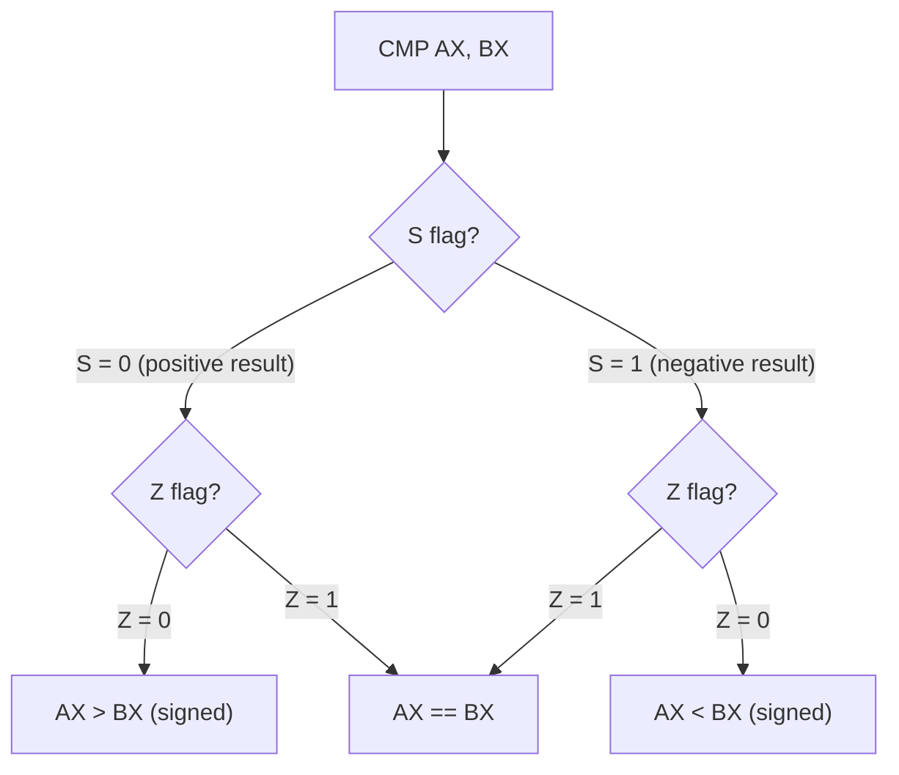

**Warning:** This fails when overflow occurs (e.g., large positive − large negative = overflow). For reliable signed comparison, the software must check for overflow conditions manually.

### Bit Testing with TEST

To test if specific bits are set in a value:

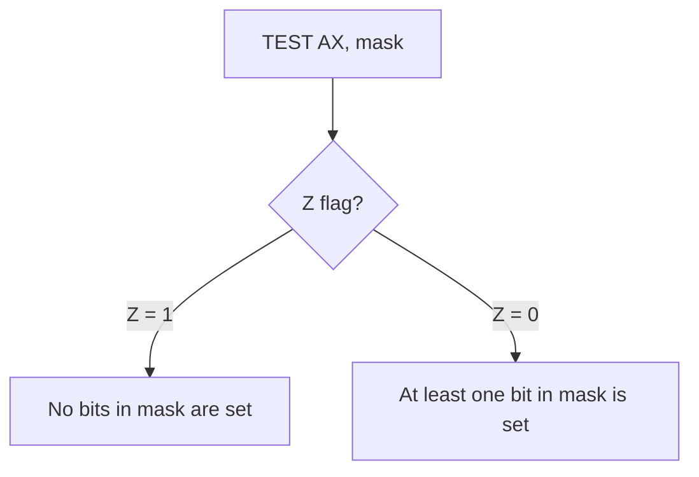

TEST performs the AND operation but discards the result, only updating flags. This is non-destructive — the original register value is preserved.

**Example: Test bit 3 of AX**

`TEST AX, 0x0008` — if Z = 1, bit 3 is clear; if Z = 0, bit 3 is set.

---

## Flag Interaction Patterns

### Setting Specific Flag Combinations

| Desired Flags | How to achieve |
|---------------|----------------|
| Z=1, C=0, S=0 | `XOR AX, AX` or `SUB AX, AX` |
| Z=0, C=0, S=0 | `MOV AX, 1` or `OR AX, AX` (if AX was already non-zero) |
| Z=0, C=0, S=1 | `MOV AX, 0x8000` |
| Z=0, C=1, S=0 | `ADD AX, 0xFFFF` when AX = 1 (produces carry, result = 0x0000... need careful) |
| Z=1, C=1, S=0 | `SUB AX, AX` (Z=1, C=0, S=0) then impossible to set C with 16-bit ops without changing Z |

**Note:** Some flag combinations are impossible to achieve naturally in 16-bit arithmetic. The CPU does not provide direct manipulation of individual flags.

### Flag Preservation Across Instructions

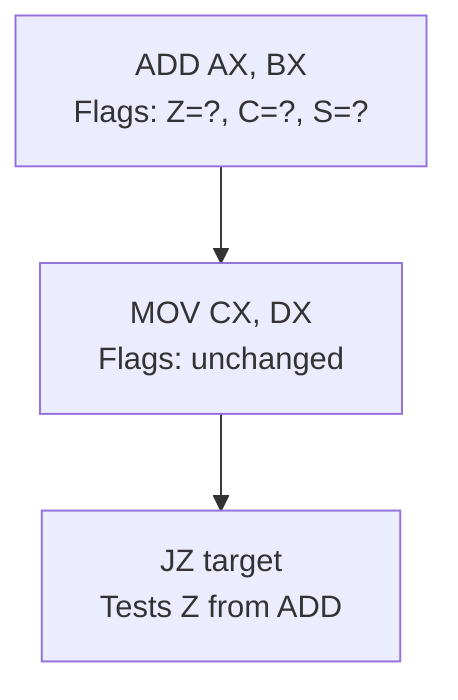

Data transfer instructions (MOV, PUSH, POP) do not modify flags. This means flags set by a previous ALU instruction persist until the next ALU instruction modifies them.

**Safe flag-consuming instructions:**

- JZ, JNZ: test Z without modifying flags
- JC, JNC: test C without modifying flags
- JS, JNS: test S without modifying flags
- Any subsequent ALU instruction: overwrites all flags

**Flag-destructive instructions:**

- All ALU operations: flags updated from result (except NOT which doesn't modify flags)
- MOV, PUSH, POP, IN, OUT, JMP, CALL, RET, NOP, HLT: flags unchanged
- INT: FLAGS saved to stack, not modified
- IRET: FLAGS restored from stack (all flags potentially modified)

### Flag Hazards

There are no flag hazards in the NovumOS-16bit because:

1. Flags are updated at the end of the execute stage
2. The next instruction's decode stage reads the updated flags
3. There is no out-of-order execution
4. There is no flag forwarding needed

### Common Flag Patterns

**Zero-test after operation:**

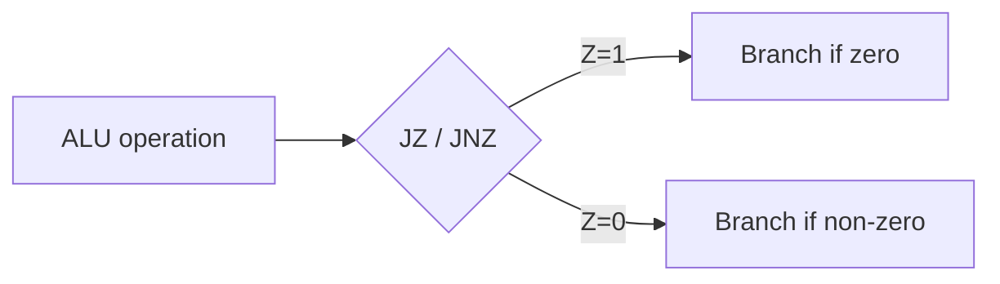

**Carry-chain arithmetic:**

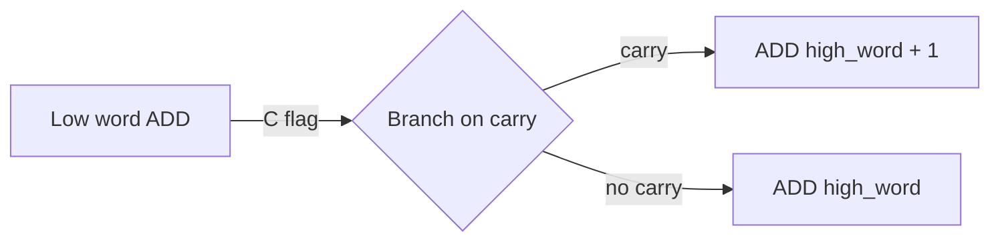

**Loop with counter (carry-preserving):**

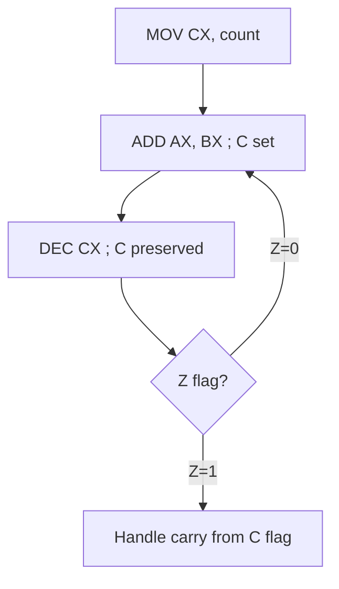

**Sign test:**

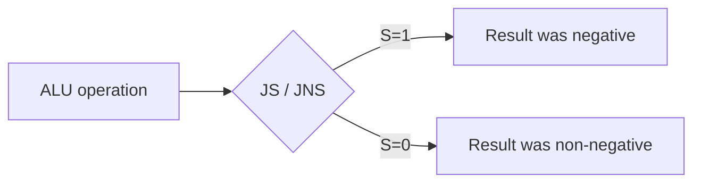

**Carry test:**

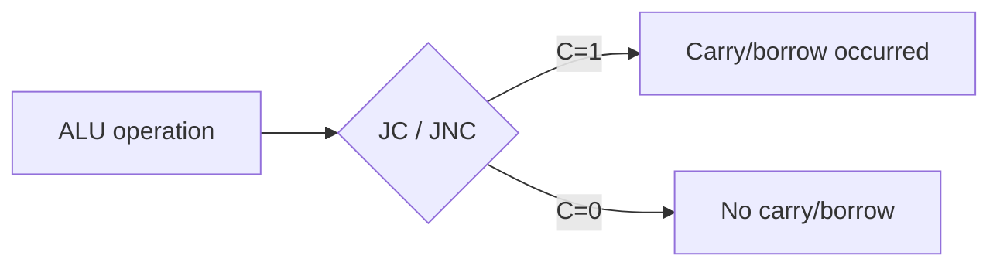

---

## Quick Reference: Flag Behavior by Instruction

### ALU ADD (AluOp 0x0)

```
Result = dst + src
Z ← (Result == 0)
C ← (carry out of bit 15)
S ← (Result[15] == 1)
```

### ALU ADC (AluOp 0x1)

```
Result = dst + src + C
Z ← (Result == 0)
C ← (carry out of bit 15, including carry in)
S ← (Result[15] == 1)
```

### ALU SUB / CMP (AluOp 0x2 / 0x4)

```
Result = dst - src
Z ← (Result == 0)
C ← (src > dst)        // unsigned borrow
S ← (Result[15] == 1)
```

### ALU SBB (AluOp 0x3)

```
Result = dst - src - C
Z ← (Result == 0)
C ← (src + C > dst)   // unsigned borrow with borrow in
S ← (Result[15] == 1)
```

### ALU TEST (AluOp 0x5)

```
Result = dst & src
Z ← (Result == 0)
C ← 0 (cleared)
S ← (Result[15] == 1)
```

### ALU AND / OR / XOR (AluOp 0x6 / 0x7 / 0x8)

```
Result = dst OP src
Z ← (Result == 0)
C ← 0 (cleared)
S ← (Result[15] == 1)
```

### ALU SHL (AluOp 0x9)

```
for i in 1..count:
    C ← dst[15]
    dst ← dst << 1
Z ← (dst == 0)
S ← (dst[15] == 1)
```

### ALU SHR (AluOp 0xA)

```
for i in 1..count:
    C ← dst[0]
    dst ← dst >> 1
Z ← (dst == 0)
S ← (dst[15] == 1)   // always 0 if count > 0
```

### ALU INC (AluOp 0xB)

```
Result = dst + 1
Z ← (Result == 0)
C ← unchanged
S ← (Result[15] == 1)
```

### ALU DEC (AluOp 0xC)

```
Result = dst - 1
Z ← (Result == 0)
C ← unchanged
S ← (Result[15] == 1)
```

### ALU NOT (AluOp 0xD)

```
dst ← ~dst
(no flags affected)
```

### ALU NEG (AluOp 0xE)

```
Result = 0 - dst
Z ← (Result == 0)
C ← (Result != 0)     // set if input was non-zero
S ← (Result[15] == 1)
```

### ALU ADC (AluOp 0x1)

```
Result = dst + src + C
Z ← (Result == 0)
C ← (carry out after including carry in)
S ← (Result[15] == 1)
```

### ALU SBB (AluOp 0x3)

```
Result = dst - src - C
Z ← (Result == 0)
C ← (borrow after including borrow in)
S ← (Result[15] == 1)
```

### ALU XCHG (AluOp 0xF)

```
Swap dst and src
(no flags affected)
```

---

*This document describes the complete flags behavior for the NovumOS-16bit CPU. All flag updates follow these rules precisely and consistently.*