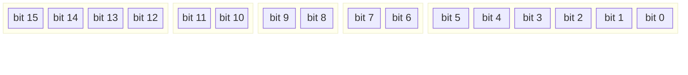
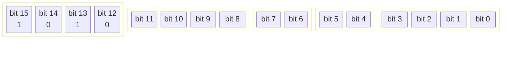
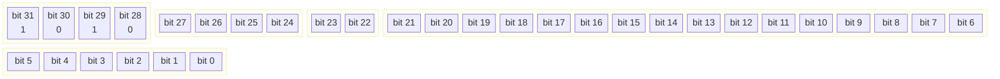
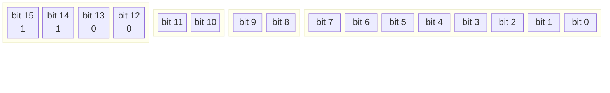
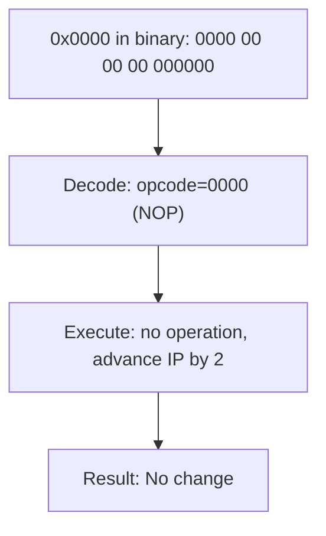

Complete reference for binary instruction formats, opcode maps, and encoding rules.

---

## Table of Contents

1. [Encoding Overview](#encoding-overview)
2. [16/32-bit Instruction Detection](#1632-bit-instruction-detection)
3. [16-bit Instruction Format](#16-bit-instruction-format)
4. [32-bit Instruction Format](#32-bit-instruction-format)
5. [Opcode Map](#opcode-map)
6. [ALU Encoding](#alu-encoding)
7. [CondJump Encoding](#condjump-encoding)
8. [PushPop Encoding](#pushpop-encoding)
9. [Operand Encoding](#operand-encoding)
10. [Addressing Modes](#addressing-modes)
11. [NOP Encoding](#nop-encoding)
12. [I/O Port Map](#io-port-map)
13. [Encoding Examples](#encoding-examples)
14. [Illegal and Reserved Encodings](#illegal-and-reserved-encodings)

---

## Encoding Overview

The NovumOS-16bit uses a hybrid instruction encoding scheme with two formats:

```mermaid
flowchart LR
    F[Instruction Fetch] --> D{Check hi_mode<br/>bits 25:24}
    D -- "hi_mode = 0b01" --> S32[32-bit Format<br/>opcode from bits 31:28<br/>immediate in bits 23:8]
    D -- "hi_mode ≠ 0b01" --> S16_CT{lo_opcode?}
    S16_CT -- "0xA" --> ALU_16[Always 16-bit ALU]
    S16_CT -- "0xC" --> PP_CT{hi_opcode in<br/>32-bit set?}
    S16_CT -- "other" --> S16_OK[16-bit Format<br/>opcode from bits 15:12]
    PP_CT -- "yes" --> S32_PP[32-bit instruction<br/>(false positive)]
    PP_CT -- "no" --> S16_PP[16-bit PushPop]
```

The CPU determines the instruction format primarily by examining the **hi_mode** bits (bits 25:24) of the raw 32-bit fetched value:

- If **hi_mode == 0b01**: **32-bit format** — opcode from bits 31:28, immediate from bits 23:8
- If **hi_mode ≠ 0b01**: **16-bit format** — opcode from bits 15:12

**Exception: ALU opcode (0xA):** The ALU instruction at bits 15:12 is **always** 16-bit regardless of hi_mode. This is because a 32-bit instruction's immediate field can coincidentally have 0xA in bits 15:12.

**Exception: PushPop opcode (0xC):** PushPop at bits 15:12 can be a false positive when followed by certain 32-bit instructions. The CPU cross-checks hi_opcode (bits 31:28): if it matches a known 32-bit opcode (1, 2, 3, 5, 8, 9, 0xB), follow hi_mode; otherwise the instruction is 16-bit PushPop.

All instructions are fetched on 16-bit word boundaries. The IP always points to the next word to fetch.

---

## 16/32-bit Instruction Detection

The CPU always speculatively fetches 32 bits (two consecutive 16-bit words) from memory at IP:

```
lo16   = Memory[IP]   | (Memory[IP+1]  << 8)
hi16   = Memory[IP+2] | (Memory[IP+3]  << 8)
raw32  = lo16 | (hi16 << 16)
```

The decoder then applies these rules in priority order:

| Condition | Size | Opcode source | Notes |
|-----------|------|---------------|-------|
| lo_opcode == 0xA | 16-bit | bits 15:12 | ALU exception — always 16-bit |
| lo_opcode == 0xC AND hi_opcode in {1,2,3,5,8,9,0xB} | follow hi_mode | bits 31:28 | PushPop false positive — check hi_mode |
| lo_opcode == 0xC AND hi_opcode not in 32-bit set | 16-bit | bits 15:12 | True PushPop |
| hi_mode (bits 25:24) == 0b01 | 32-bit | bits 31:28 | Standard 32-bit detection |
| Otherwise | 16-bit | bits 15:12 | Standard 16-bit |

---

## 16-bit Instruction Format

Used for register-to-register operations, ALU, PushPop, RET, NOP, HLT.

### Bit Field Layout



### Field Descriptions

| Field   | Bits    | Width | Description                                     |
|---------|---------|-------|-------------------------------------------------|
| Opcode  | 15–12   | 4     | Instruction type (0x0–0xC)                      |
| Dst     | 11–10   | 2     | Destination register encoding (00–11)            |
| Src     | 9–8     | 2     | Source register encoding (00–11)                 |
| Mode    | 7–6     | 2     | Operation mode (see addressing modes)            |
| Unused  | 5–0     | 6     | Reserved, must be zero. Reads as 0.              |

### Hex Notation

A 16-bit instruction is written as four hexadecimal digits: `0xODSMUU` where:
- `O` = opcode nibble (1 hex digit)
- `D` = destination register (1 hex digit, 0–3)
- `S` = source register (1 hex digit, 0–3)
- `M` = mode (1 hex digit, 0–3)
- `UU` = unused bits, always 0

Example: `MOV AX, BX` encodes as `0x1100` (opcode=1, dst=00, src=01, mode=00, unused=00)

---

## 32-bit Instruction Format

Used for register-immediate operations, jumps, calls, I/O, and conditional jumps. The mode field is **always** set to `0b01` (Imm) which is the marker the CPU uses to detect a 32-bit instruction.

### Bit Field Layout — Single 32-bit Value

```mermaid
block-beta
    columns 16
    block:opcode:4
        columns 4
        O3["bit 31"] O2["bit 30"] O1["bit 29"] O0["bit 28"]
    end
    block:dst:2
        columns 2
        D1["bit 27"] D0["bit 26"]
    end
    block:mode:2
        columns 2
        M1["bit 25"] M0["bit 24"]
    end
    block:imm:16
        columns 16
        I15["bit 23"] I14["bit 22"] I13["bit 21"] I12["bit 20"]
        I11["bit 19"] I10["bit 18"] I9["bit 17"] I8["bit 16"]
        I7["bit 15"] I6["bit 14"] I5["bit 13"] I4["bit 12"]
        I3["bit 11"] I2["bit 10"] I1["bit 9"] I0["bit 8"]
    end
    block:unused:8
        columns 8
        X7["bit 7"] X6["bit 6"] X5["bit 5"] X4["bit 4"]
        X3["bit 3"] X2["bit 2"] X1["bit 1"] X0["bit 0"]
    end
```



### Field Descriptions

| Field     | Bits    | Width | Description                                         |
|-----------|---------|-------|-----------------------------------------------------|
| Opcode    | 31–28   | 4     | Instruction type (0x0–0xC)                          |
| Dst       | 27–26   | 2     | Destination register encoding (00–11)                |
| Mode      | 25–24   | 2     | MUST be `0b01` (Imm) — this marks 32-bit format      |
| Immediate | 23–8    | 16    | 16-bit immediate value or address operand            |
| Unused    | 7–0     | 8     | Reserved, must be zero. Reads as 0.                  |

**Critical:** The mode field (bits 25:24) is hardcoded to `0b01` (AddrMode.Imm) for all 32-bit instructions generated by encode32(). The CPU uses this to distinguish 32-bit from 16-bit instructions during decode.

### Hex Notation

A 32-bit instruction is written as eight hexadecimal digits: `0xODMIIIIU` where:
- `O` = opcode nibble (1 hex digit)
- `D` = destination register (1 hex digit, 0–3)
- `M` = mode (always 1 for Imm encoding)
- `IIII` = 16-bit immediate value (4 hex digits)
- `U` = unused nibble, always 0

The 32-bit value is stored in memory as two consecutive 16-bit words in little-endian byte order:
- Word at IP: low 16 bits of the 32-bit value
- Word at IP+2: high 16 bits of the 32-bit value

Example: `MOV AX, #0x1234` encodes as the single 32-bit value `0x11123400`
- Bits 31:28 = 1 (MOV), bits 27:26 = 0 (AX), bits 25:24 = 01 (Imm), bits 23:8 = 0x1234, bits 7:0 = 0
- In memory (little-endian): `0x3400` at IP, `0x1112` at IP+2

---

## Opcode Map

### Complete Opcode Table

| Binary  | Hex | Mnemonic    | Category      | Description                     |
|---------|-----|-------------|---------------|---------------------------------|
| `0000`  | 0x0 | NOP         | System        | No operation                    |
| `0001`  | 0x1 | MOV         | Data Transfer | Move / Load                    |
| `0010`  | 0x2 | JMP         | Control Flow  | Unconditional jump             |
| `0011`  | 0x3 | CALL        | Control Flow  | Call subroutine                |
| `0100`  | 0x4 | RET         | Control Flow  | Return from subroutine         |
| `0101`  | 0x5 | INT         | System        | Software interrupt             |
| `0110`  | 0x6 | IRET        | System        | Return from interrupt          |
| `0111`  | 0x7 | HLT         | System        | Halt CPU                       |
| `1000`  | 0x8 | IN          | I/O           | Input from port                |
| `1001`  | 0x9 | OUT         | I/O           | Output to port                 |
| `1010`  | 0xA | ALU         | Arithmetic    | ALU operation (see sub-opcodes)|
| `1011`  | 0xB | CondJump    | Control Flow  | Conditional jump               |
| `1100`  | 0xC | PushPop     | Stack         | Push or pop register           |

### Opcode Map Visualization


### Mode Encoding — 16-bit Format

| Mode (bits 7–6) | Value | Meaning |
|------------------|-------|---------|
| `00`             | 0     | Register-register operation |
| `01`             | 1     | Immediate value (next word) |
| `10`             | 2     | Register-indirect (address in src register) |
| `11`             | 3     | Register-indirect with offset (next word) |

### Mode Encoding — 32-bit Format

| Mode (bits 25–24) | Value | Meaning |
|--------------------|-------|---------|
| `01`               | 1     | Immediate — MUST be 01 for standard 32-bit encoding |

---

## ALU Encoding

ALU instructions use opcode `0xA` and are distinguished by a 4-bit `AluOp` sub-opcode field. The ALU is the only opcode that can appear in both 16-bit (register-register) and 32-bit (register-immediate) forms.

### 16-bit ALU Format

Bits 15:12 = ALU (0xA), bits 11:8 = alu_op, bits 7:6 = dst, bits 5:4 = src, bits 3:0 = unused



### 32-bit ALU Format

Bits 31:28 = ALU (0xA), bits 27:24 = alu_op, bits 23:22 = dst, bits 21:6 = immediate, bits 5:0 = unused



### AluOp Table

| Binary  | Hex | Mnemonic | Description                          | Flags         |
|---------|-----|----------|--------------------------------------|---------------|
| `0000`  | 0x0 | ADD      | dst = dst + src                      | Z, C, S       |
| `0001`  | 0x1 | SUB      | dst = dst - src                      | Z, C, S       |
| `0010`  | 0x2 | CMP      | Compare (subtract, flags only)       | Z, C, S       |
| `0011`  | 0x3 | TEST     | Bitwise AND test (flags only)        | Z, S          |
| `0100`  | 0x4 | AND      | Bitwise AND                          | Z, S          |
| `0101`  | 0x5 | OR       | Bitwise OR                           | Z, S          |
| `0110`  | 0x6 | XOR      | Bitwise exclusive OR                 | Z, S          |
| `0111`  | 0x7 | SHL      | Shift left logical                   | Z, C, S       |
| `1000`  | 0x8 | SHR      | Shift right logical                  | Z, C, S       |
| `1001`  | 0x9 | INC      | Increment: dst = dst + 1             | Z, S          |
| `1010`  | 0xA | DEC      | Decrement: dst = dst - 1             | Z, S          |
| `1011`  | 0xB | NOT      | Bitwise complement                   | None          |
| `1100`  | 0xC | NEG      | Two's complement negate: dst = 0 - dst | Z, C, S     |
| `1101`  | 0xD | MUL      | Multiply (planned)                   | TBD           |
| `1110`  | 0xE | DIV      | Divide (planned)                     | TBD           |
| `1111`  | 0xF | reserved | —                                    | —             |

---

## CondJump Encoding

Conditional jumps use opcode `0xB` and are always **32-bit** format.

Bits 31:28 = CondJump (0xB), bits 27:24 = mode (0b01), bits 23:20 = cond, bits 19:4 = target (16-bit address), bits 3:0 = unused

```mermaid
block-beta
    columns 16
    block:op:4
        columns 4
        A3["bit 31<br/>1"] A2["bit 30<br/>0"] A1["bit 29<br/>1"] A0["bit 28<br/>1"]
    end
    block:mode:4
        columns 4
        M3["bit 27<br/>0"] M2["bit 26<br/>0"] M1["bit 25<br/>0"] M0["bit 24<br/>1"]
    end
    block:cond:4
        columns 4
        C3["bit 23"] C2["bit 22"] C1["bit 21"] C0["bit 20"]
    end
    block:target:16
        columns 16
        T15["bit 19"] T14["bit 18"] T13["bit 17"] T12["bit 16"]
        T11["bit 15"] T10["bit 14"] T9["bit 13"] T8["bit 12"]
        T7["bit 11"] T6["bit 10"] T5["bit 9"] T4["bit 8"]
        T3["bit 7"] T2["bit 6"] T1["bit 5"] T0["bit 4"]
    end
    block:unused:4
        columns 4
        X3["bit 3"] X2["bit 2"] X1["bit 1"] X0["bit 0"]
    end
```



### Condition Codes

| Binary  | Hex | Mnemonic | Condition    | Flag Test     |
|---------|-----|----------|--------------|---------------|
| `0000`  | 0x0 | JZ       | Zero         | Z == 1        |
| `0001`  | 0x1 | JNZ      | Not zero     | Z == 0        |
| `0010`  | 0x2 | JC       | Carry        | C == 1        |
| `0011`  | 0x3 | JNC      | No carry     | C == 0        |
| `0100`  | 0x4 | JS       | Sign (negative) | S == 1     |
| `0101`  | 0x5 | JNS      | No sign (non-negative) | S == 0 |

---

## PushPop Encoding

Stack operations use opcode `0xC` and are always **16-bit** format.

Bits 15:12 = PushPop (0xC), bits 11:10 = reg, bits 9:8 = stack_op, bits 7:0 = unused



### Stack Operation Modes

| Bits 9–8 | Value | Mnemonic | Operation |
|----------|-------|----------|-----------|
| `00`     | 0     | PUSH     | SP ← SP − 2; Memory[SP] ← reg |
| `01`     | 1     | POP      | reg ← Memory[SP]; SP ← SP + 2 |

---

## Operand Encoding

### Register Operands

Registers are encoded as 2-bit fields within the instruction.

| Encoding | Register | Alias |
|----------|----------|-------|
| `00`     | AX       | Accumulator |
| `01`     | BX       | Base |
| `10`     | CX       | Counter |
| `11`     | DX       | Data |

Register operands can appear in:

- **Dst field** (bits 11–10 in 16-bit, bits 27–26 in 32-bit): Target of the operation
- **Src field** (bits 9–8 in 16-bit): Source of the operation (register-register mode only)
- **Reg field** (bits 11–10 in PushPop): Register to push or pop
- **Dst/Src fields** (bits 7–6 and 5–4 in 16-bit ALU): ALU destination and source

### Immediate Operands

In the 32-bit format, immediate values occupy bits 23:8 of the instruction. The immediate is a full 16-bit unsigned value (0x0000–0xFFFF).

**Immediate representation:**

- Stored as a raw 16-bit value in bits 23:8
- Range: 0 to 65535 (unsigned) or −32768 to +32767 (signed)
- The CPU treats the immediate as a raw bit pattern; signedness depends on the instruction

---

## Addressing Modes

The NovumOS-16bit supports four addressing modes, selected by the mode field.

### Mode 0: Register-Register (RegReg)

All operands are in registers. No memory access occurs (except instruction fetch).

**Instruction format:** 16-bit

```
[opcode:4][dst:2][src:2][00:2][unused:6]
```

**Operation:** `R[dst] ← R[dst] op R[src]`

**Examples:**

| Instruction | Opcode | Dst | Src | Mode | Hex |
|-------------|--------|-----|-----|------|-----|
| MOV AX, BX  | 0001   | 00  | 01  | 00   | 0x1100 |
| MOV CX, DX  | 0001   | 10  | 11  | 00   | 0x13A0 |
| MOV AX, AX  | 0001   | 00  | 00  | 00   | 0x1000 |

### Mode 1: Immediate (16-bit format)

The immediate value is read from the next instruction word.

**Instruction format:** 16-bit with inline immediate word

```
Word 1: [opcode:4][dst:2][src:2][01:2][unused:6]
Word 2: [immediate:16]
```

**Operation:** `R[dst] ← R[dst] op imm16`

**Example:**

| Instruction | Opcode | Dst | Mode | Immediate | Hex words |
|-------------|--------|-----|------|-----------|-----------|
| MOV AX, #0x1234 | 0001 | 00 | 01 | 0x1234 | 0x1040, 0x1234 |

### Mode 2: Indirect

The source operand is a memory location pointed to by the source register.

**Instruction format:** 16-bit

```
[opcode:4][dst:2][src:2][10:2][unused:6]
```

**Operation:** `R[dst] ← Memory[R[src]]`

**Examples:**

| Instruction | Opcode | Dst | Src | Mode | Hex |
|-------------|--------|-----|-----|------|-----|
| MOV AX, [BX] | 0001 | 00 | 01 | 10 | 0x1180 |

### Mode 3: Indirect with Offset (IndirectOff)

The source operand is a memory location pointed to by the source register plus an offset from the next instruction word.

**Instruction format:** 16-bit with inline offset word

```
Word 1: [opcode:4][dst:2][src:2][11:2][unused:6]
Word 2: [offset:16]
```

**Operation:** `R[dst] ← Memory[R[src] + offset]`

**Example:**

| Instruction | Opcode | Dst | Src | Mode | Hex words |
|-------------|--------|-----|-----|------|-----------|
| MOV AX, [BX+4] | 0001 | 00 | 01 | 11 | 0x11C0, 0x0004 |

---

## NOP Encoding

**NOP (No Operation)** is encoded as `0x0000`. This is a dedicated instruction at opcode 0x0.

### Why 0x0000 is NOP



### NOP Properties

| Property | Value |
|----------|-------|
| Encoding | `0x0000` |
| Opcode   | 0x0 (NOP) |
| Flags affected | None |
| Cycles | 1 |
| Side effects | None |

The canonical NOP is `0x0000` — the all-zero encoding. Additional NOP-like instructions include any operation with no observable side effects, such as `MOV AX, AX` (0x1000).

---

## I/O Port Map

The NovumOS-16bit uses a dedicated I/O address space with 256 ports (0x00–0xFF). Some ports are mapped to specific peripherals.

| Port | Peripheral | Direction | Description |
|------|------------|-----------|-------------|
| 0x00 | UART       | R/W       | Terminal I/O (Read = receive, Write = transmit) |
| 0x01 | Timer      | Read      | Cycle counter (low 16 bits of cycle_count) |
| 0x02 | Keyboard   | Read      | Scan code ring buffer (0 if empty) |
| 0x03 | Line cmd_id| Read      | Command ID, clears on read: 0=none, 1=help, 2=clear, 3=reboot, 4=info, 5=dump, 6=halt, 7=unknown |
| 0x04 | Line buffer| Read      | Next byte from line buffer (0 if empty) |
| 0x10 | VGA char   | Write     | Character output to VGA cursor position |
| 0x11 | VGA control| Write     | Control: 0x0001=clear, 0x0002=flush |
| 0x05–0xFF | Generic | R/W    | General purpose I/O ports |

---

## Encoding Examples

### Example 1: Register-Register MOV

**Instruction:** `MOV AX, BX`

**Binary breakdown:**

```
Opcode: MOV = 0001
Dst:    AX  = 00
Src:    BX  = 01
Mode:   reg-reg = 00
Unused: 000000

Binary: 0001 00 01 00 000000
Hex:    0x1100
```

### Example 2: Register-Immediate MOV

**Instruction:** `MOV CX, #0xBEEF`

**32-bit breakdown:**

```
Opcode: MOV = 0001
Dst:    CX  = 10
Mode:   Imm = 01 (bits 25:24)
Imm:    0xBEEF (bits 23:8)
Unused: 00 (bits 7:0)

Binary: 0001 10 01 1011111011101111 00000000
Hex:    0x19BEEF00
```

### Example 3: Conditional Jump (JZ)

**Instruction:** `JZ #0x0100`

**32-bit breakdown:**

```
Opcode: CondJump = 1011
Mode:   01 (bits 27:24, for 32-bit detection)
Cond:   JZ = 0000
Target: 0x0100 (bits 19:4)
Unused: 0000

Binary: 1011 0001 0000 0000000100000000 0000
Hex:    0xB1001000
```

### Example 4: OUT to VGA Port

**Instruction:** `OUT #0x10, AX`

**32-bit breakdown:**

```
Opcode: OUT = 1001
Dst:    AX  = 00 (source register)
Mode:   Imm = 01
Imm:    0x0010 (port number)
Unused: 00

Binary: 1001 00 01 0000000000010000 00000000
Hex:    0x91001000
```

### Example 5: ALU Addition

**Instruction:** `ADD AX, BX`

**16-bit breakdown:**

```
Opcode: ALU = 1010
AluOp:  ADD = 0000
Dst:    AX  = 00
Src:    BX  = 01
Unused: 0000

Binary: 1010 0000 00 01 0000
Hex:    0xA010
```

### Example 6: ALU AND

**Instruction:** `AND AX, BX`

**16-bit breakdown:**

```
Opcode: ALU = 1010
AluOp:  AND = 0100
Dst:    AX  = 00
Src:    BX  = 01
Unused: 0000

Binary: 1010 0100 00 01 0000
Hex:    0xA410
```

### Example 7: PUSH Register

**Instruction:** `PUSH AX`

**16-bit breakdown:**

```
Opcode: PushPop = 1100
Reg:    AX = 00
StkOp:  PUSH = 00
Unused: 00000000

Binary: 1100 00 00 00000000
Hex:    0xC000
```

### Example 8: POP Register

**Instruction:** `POP BX`

**16-bit breakdown:**

```
Opcode: PushPop = 1100
Reg:    BX = 01
StkOp:  POP = 01
Unused: 00000000

Binary: 1100 01 01 00000000
Hex:    0xC500
```

---

## Illegal and Reserved Encodings

### Undefined Opcode Behavior

Opcodes in the range `1101`–`1111` (0xD–0xF) are undefined. The CPU halts on encountering an undefined opcode.

### Reserved Mode Bits

Mode values in the 16-bit format that do not correspond to implemented addressing modes are treated as NOP (instruction ignored).

### Unused Bits

The unused bits in both instruction formats must be written as zero during normal operation. The CPU ignores these bits during decoding. However:

- The assembler must set unused bits to zero
- The CPU may use these bits in future extensions
- Debug tools may use them for metadata (e.g., breakpoints)

### Encoding Sanity Rules

| Rule | Description |
|------|-------------|
| Word alignment | All instructions start on 16-bit word boundaries |
| 32-bit alignment | 32-bit instructions occupy exactly two consecutive words |
| Unused zeros | All unused bits must be zero |
| Stack bounds | PUSH/POP must not cause SP to go below 0x0000 or above 0xFFFF |
| Jump targets | Jump targets must be word-aligned (even addresses) |

---

*This document defines the complete binary encoding for the NovumOS-16bit instruction set. Assembler implementations must follow these encoding rules exactly.*