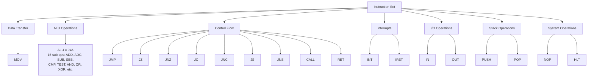
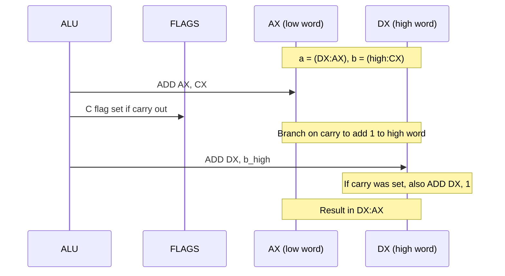
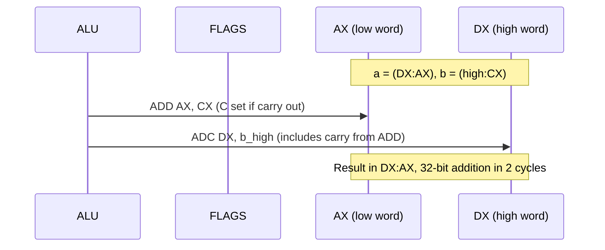
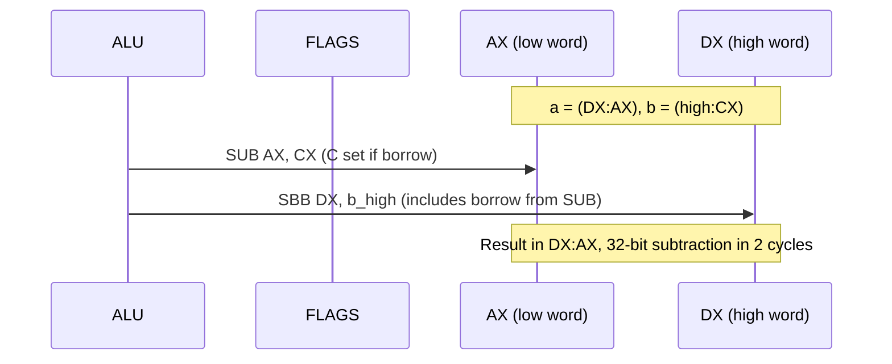
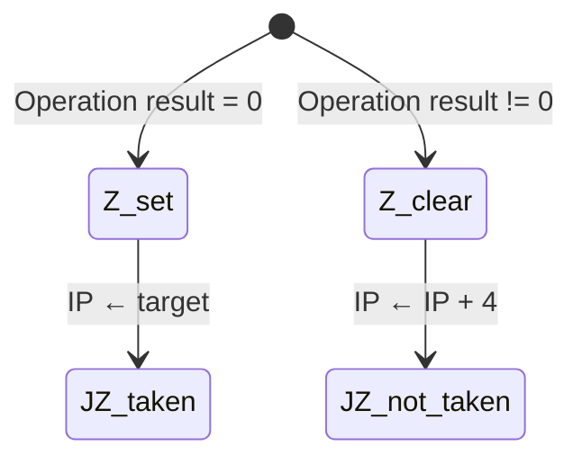
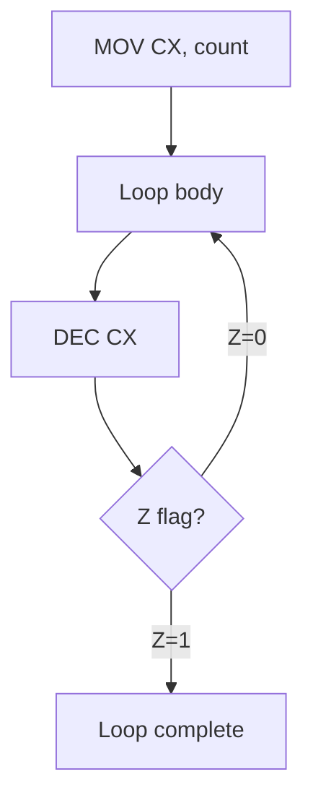
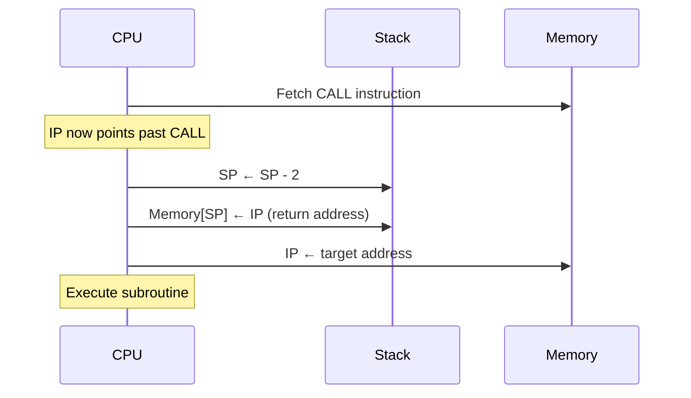
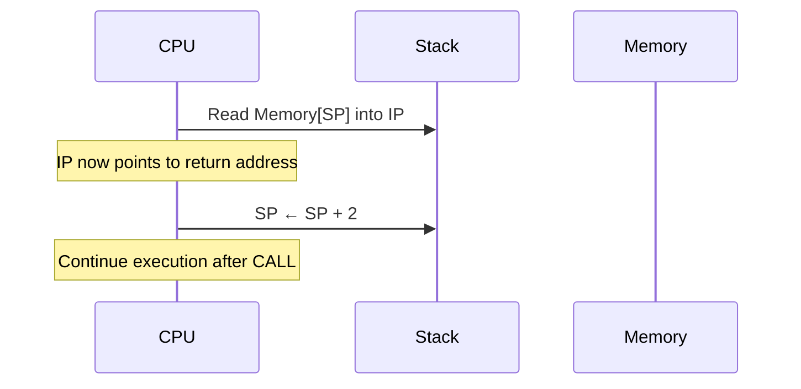
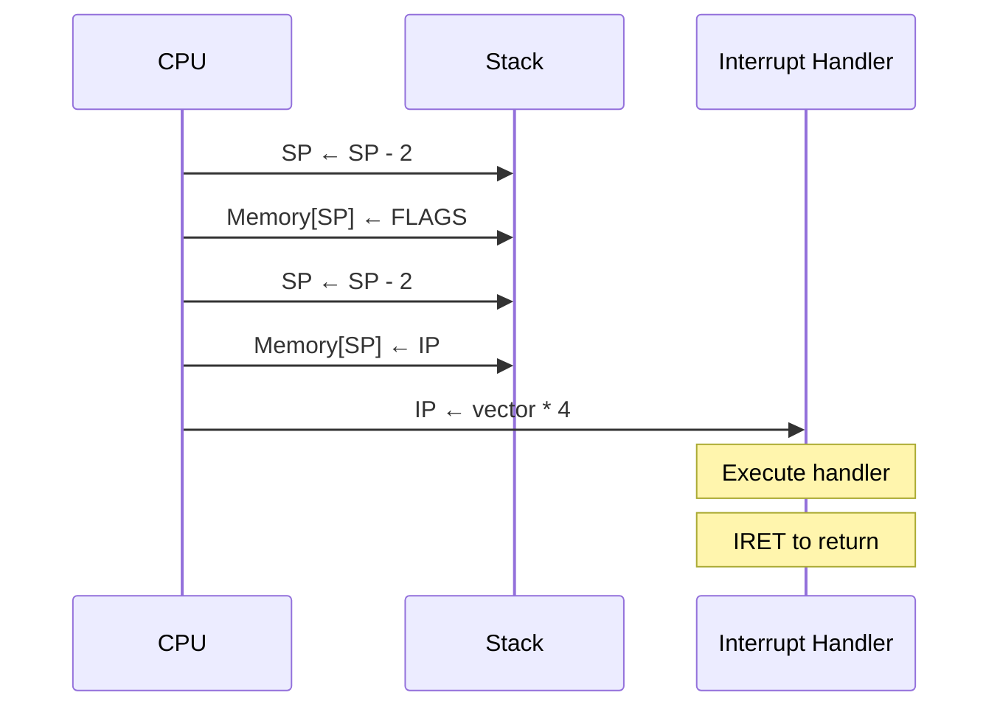
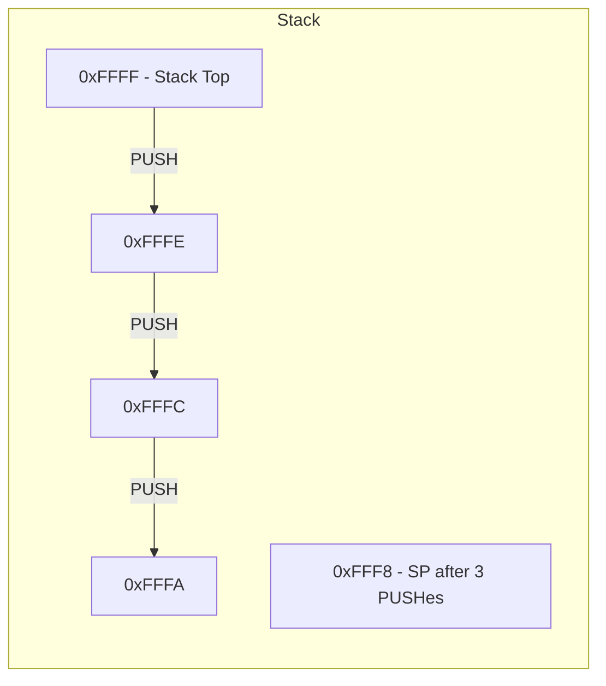

Complete reference for the NovumOS-16bit CPU instruction set.

---

## Table of Contents

1. [CPU Overview](#cpu-overview)
2. [Registers](#registers)
3. [Instruction Categories](#instruction-categories)
   - [Data Transfer](#data-transfer)
   - [ALU Operations](#alu-operations)
   - [Control Flow](#control-flow)
   - [Interrupt Operations](#interrupt-operations)
   - [I/O Operations](#io-operations)
   - [Stack Operations](#stack-operations)
   - [System Operations](#system-operations)
4. [Flag Behavior Summary](#flag-behavior-summary)
5. [Instruction Timing](#instruction-timing)

---

## CPU Overview

The NovumOS-16bit CPU is a RISC-like processor built entirely from TTL logic gates. It features a hybrid 16/32-bit instruction format, four general-purpose 16-bit registers, and a simplified flag register.

Key characteristics:

- **Word size:** 16 bits
- **Data bus:** 16 bits
- **Address bus:** 16 bits (64 KiB addressable memory)
- **Instruction formats:** 16-bit (register-register, ALU, PushPop, RET, NOP, HLT) and 32-bit (register-immediate, jumps, calls, I/O, CondJump)
- **Pipeline stages:** Fetch, Decode, Execute, Writeback
- **Clock:** Single-phase synchronous

---

## Registers

| Register | Encoding | Size    | Purpose                                 |
|----------|----------|---------|-----------------------------------------|
| **AX**   | `00`     | 16-bit  | Accumulator — primary arithmetic target |
| **BX**   | `01`     | 16-bit  | Base — secondary operand / address base |
| **CX**   | `10`     | 16-bit  | Counter — loop counter / shift count    |
| **DX**   | `11`     | 16-bit  | Data — I/O port operand / temp storage  |
| **IP**   | (hidden) | 16-bit  | Instruction Pointer — next instruction  |
| **SP**   | (hidden) | 16-bit  | Stack Pointer — top of stack            |
| **FLAGS**| (hidden) | 16-bit  | Processor status flags                  |

### FLAGS Register Layout

```
Bit:  15 14 13 12 11 10  9  8  7  6  5  4  3  2  1  0
      [  unused (reserved, reads as 0)  ]  S  C  Z
```

| Bit | Flag | Name  | Description                                |
|-----|------|-------|--------------------------------------------|
| 0   | **Z** | Zero  | Set when an operation result equals zero   |
| 1   | **C** | Carry | Set on unsigned overflow / borrow          |
| 2   | **S** | Sign  | Set when the result's MSB is 1 (negative)  |
| 3–15| —    | Reserved | Reads as zero; do not rely on value     |

---

## Instruction Categories

### Overview Diagram



---

### Data Transfer

Data transfer instructions move values between registers, between registers and memory, or load immediate values.

---

#### MOV — Move

**Mnemonic:** `MOV`  
**Opcode:** `0001`  
**Operands:** `dst, src`  
**Format:** 16-bit (reg-reg, reg-indirect) or 32-bit (reg-imm)

| Aspect | Detail |
|--------|--------|
| **Operation** | `dst ← src` |
| **16-bit encoding** | `MOV Rdst, Rsrc` — copies the value of source register into destination register |
| **32-bit encoding** | `MOV Rdst, #imm16` — loads a 16-bit immediate value into destination register |
| **Flags affected** | None |
| **Cycles** | 1 (reg-reg, reg-indirect), 1 (reg-imm), 2 (reg-indirect-offset) |

**Description:**

The MOV instruction transfers data without modifying it. The source operand is unchanged. In register-register mode, the copy completes in a single cycle. In register-immediate mode (32-bit format), the immediate is embedded in bits 23:8 of the instruction.

MOV can also load from memory using indirect addressing (mode=10, `MOV Rdst, [Rsrc]`) or indirect with offset (mode=11, `MOV Rdst, [Rsrc + offset]`).

**Operand combinations:**

| Source | Destination | Format | Notes |
|--------|-------------|--------|-------|
| Register | Register | 16-bit | Single-cycle register-to-register transfer |
| Immediate | Register | 32-bit | Immediate in bits 23:8 of instruction |
| [Register] | Register | 16-bit | Load from memory address in register |
| [Register+offset] | Register | 16-bit+ext | Load with base+offset |

**Encoding examples:**

`MOV AX, BX` → `0x1100` (16-bit: opcode=1, dst=00, src=01, mode=00)

`MOV AX, #0x1234` → `0x11123400` (32-bit: opcode=1, dst=00, mode=01, imm=0x1234)

---

### ALU Operations

All arithmetic, logic, and shift operations are encoded as sub-opcodes of the ALU instruction (opcode `0xA`). The 4-bit AluOp field selects the specific operation.

ALU operations follow the same pattern: the result is stored in the destination register (except CMP and TEST which only set flags), and the FLAGS register is updated based on the result.

**16-bit ALU encoding:** bits 15:12=0xA, 11:8=alu_op, 7:6=dst, 5:4=src, 3:0=unused

**32-bit ALU encoding:** bits 31:28=0xA, 27:24=alu_op, 23:22=dst, 21:6=imm, 5:0=unused

#### ALU Operations Table

| Mnemonic | AluOp | Operation | Flags | Description |
|----------|-------|-----------|-------|-------------|
| **ADD**  | 0x0   | `dst ← dst + src` | Z, C, S | Integer addition. C set on unsigned overflow (result > 0xFFFF) |
| **ADC**  | 0x1   | `dst ← dst + src + C` | Z, C, S | Add with carry — includes the Carry flag as an input. Used for multi-word addition |
| **SUB**  | 0x2   | `dst ← dst - src` | Z, C, S | Integer subtraction. C set on unsigned borrow (src > dst) |
| **SBB**  | 0x3   | `dst ← dst - src - C` | Z, C, S | Subtract with borrow — includes the Carry flag as a borrow input |
| **CMP**  | 0x4   | `dst - src` (flags only) | Z, C, S | Compare — subtract without storing result. Sets flags for conditional jumps |
| **TEST** | 0x5   | `dst & src` (flags only) | Z, S | Bitwise AND test — result discarded, flags only. C cleared |
| **AND**  | 0x6   | `dst ← dst & src` | Z, S | Bitwise AND. C cleared |
| **OR**   | 0x7   | `dst ← dst \| src` | Z, S | Bitwise OR. C cleared |
| **XOR**  | 0x8   | `dst ← dst ^ src` | Z, S | Bitwise exclusive OR. C cleared |
| **SHL**  | 0x9   | `dst ← dst << src` | Z, C, S | Shift left logical. C = last bit shifted out of MSB |
| **SHR**  | 0xA   | `dst ← dst >> src` | Z, C, S | Shift right logical. C = last bit shifted out of LSB |
| **INC**  | 0xB   | `dst ← dst + 1` | Z, S | Increment. Does NOT affect Carry flag |
| **DEC**  | 0xC   | `dst ← dst - 1` | Z, S | Decrement. Does NOT affect Carry flag |
| **NOT**  | 0xD   | `dst ← ~dst` | None | Bitwise complement (one's complement). No flags affected |
| **NEG**  | 0xE   | `dst ← 0 - dst` | Z, C, S | Two's complement negate. C set if result ≠ 0 |
| **XCHG** | 0xF   | Swap `dst` and `src` | None | Exchange values between two registers. No flags affected |

---

#### ADD — Integer Addition (ALU sub-op 0x0)

**Mnemonic:** `ADD`  
**AluOp:** `0000` (0x0)  
**Operands:** `dst, src`  
**Format:** 16-bit (reg-reg) or 32-bit (reg-imm)

| Aspect | Detail |
|--------|--------|
| **Operation** | `dst ← dst + src` |
| **Flags affected** | Z (set if result is 0), C (set on unsigned overflow), S (set if MSB is 1) |
| **Cycles** | 1 (reg-reg), 1 (reg-imm) |

**Description:**

ADD performs unsigned binary addition of the source and destination operands. The 16-bit result is stored in the destination register. If the addition produces a result greater than 0xFFFF (65535), the carry flag is set, indicating unsigned overflow.

For signed interpretation, the S flag indicates a negative result. The C flag for ADD indicates unsigned overflow regardless of signed/unsigned interpretation.

**Multi-word addition flow (using carry check and branch):**



---

---

#### ADC — Add with Carry (ALU sub-op 0x1)

**Mnemonic:** `ADC`  
**AluOp:** `0001` (0x1)  
**Operands:** `dst, src`  
**Format:** 16-bit (reg-reg) or 32-bit (reg-imm)

| Aspect | Detail |
|--------|--------|
| **Operation** | `dst ← dst + src + C` |
| **Flags affected** | Z (set if result is 0), C (set on carry out), S (set if MSB is 1) |
| **Cycles** | 1 (reg-reg), 1 (reg-imm) |

**Description:**

ADC performs addition with an incoming carry flag. The operation is `dst + src + C`, where C is the current value of the Carry flag. This enables multi-word arithmetic — after adding the low words with ADD (which sets C), ADC chains subsequent words with the carry included.

**Multi-word addition with ADC:**



---

#### SUB — Integer Subtraction (ALU sub-op 0x2)

**Mnemonic:** `SUB`  
**AluOp:** `0010` (0x2)  
**Operands:** `dst, src`  
**Format:** 16-bit (reg-reg) or 32-bit (reg-imm)

| Aspect | Detail |
|--------|--------|
| **Operation** | `dst ← dst - src` |
| **Flags affected** | Z (set if result is 0), C (set on unsigned borrow), S (set if MSB is 1) |
| **Cycles** | 1 (reg-reg), 1 (reg-imm) |

**Description:**

SUB subtracts the source operand from the destination operand and stores the result in the destination. The subtraction is performed as `dst + (~src) + 1` using two's complement arithmetic.

The carry flag acts as a **borrow flag** for subtraction: it is SET when the source is greater than the destination (unsigned), indicating a borrow occurred.

**Unsigned comparison:** After `CMP A, B` (implemented as `SUB A, B` without storing):
- If A ≥ B (unsigned): C = 0
- If A < B (unsigned): C = 1

---

#### SBB — Subtract with Borrow (ALU sub-op 0x3)

**Mnemonic:** `SBB`  
**AluOp:** `0011` (0x3)  
**Operands:** `dst, src`  
**Format:** 16-bit (reg-reg) or 32-bit (reg-imm)

| Aspect | Detail |
|--------|--------|
| **Operation** | `dst ← dst - src - C` |
| **Flags affected** | Z (set if result is 0), C (set on unsigned borrow), S (set if MSB is 1) |
| **Cycles** | 1 (reg-reg), 1 (reg-imm) |

**Description:**

SBB performs subtraction with an incoming borrow from the Carry flag. The operation is `dst - src - C`, where C is the current value of the Carry flag. This enables multi-word subtraction — after subtracting low words with SUB (which sets C on borrow), SBB chains subsequent words with the borrow included.

**Multi-word subtraction with SBB:**



---

#### AND — Bitwise AND (ALU sub-op 0x6)

**Mnemonic:** `AND`  
**AluOp:** `0110` (0x6)  
**Operands:** `dst, src`  
**Format:** 16-bit (reg-reg) or 32-bit (reg-imm)

| Aspect | Detail |
|--------|--------|
| **Operation** | `dst ← dst & src` |
| **Flags affected** | Z (set if result is 0), S (set if MSB is 1), C (cleared) |
| **Cycles** | 1 (reg-reg), 1 (reg-imm) |

**Description:**

AND performs a bitwise logical AND of the destination and source operands. Each bit of the result is 1 only if both corresponding bits of the operands are 1. AND is commonly used for bit masking — isolating or clearing specific bits.

**Common uses:**

- **Masking:** `AND AX, 0x00FF` — isolates the lower 8 bits of AX
- **Clearing bits:** `AND AX, ~0x0010` — clears bit 4
- **Testing if zero:** After AND, check Z flag

---

#### OR — Bitwise OR (ALU sub-op 0x7)

**Mnemonic:** `OR`  
**AluOp:** `0111` (0x7)  
**Operands:** `dst, src`  
**Format:** 16-bit (reg-reg) or 32-bit (reg-imm)

| Aspect | Detail |
|--------|--------|
| **Operation** | `dst ← dst \| src` |
| **Flags affected** | Z (set if result is 0), S (set if MSB is 1), C (cleared) |
| **Cycles** | 1 (reg-reg), 1 (reg-imm) |

**Description:**

OR performs a bitwise logical OR. Each bit of the result is 1 if at least one of the corresponding bits is 1. OR is commonly used for setting specific bits without affecting others.

**Common uses:**

- **Setting bits:** `OR AX, 0x0008` — sets bit 3
- **Combining flags:** Build a combined status byte from individual flags
- **Force non-zero:** `OR AX, AX` — sets flags based on AX without changing AX (used as a test)

---

#### XOR — Bitwise Exclusive OR (ALU sub-op 0x8)

**Mnemonic:** `XOR`  
**AluOp:** `1000` (0x8)  
**Operands:** `dst, src`  
**Format:** 16-bit (reg-reg) or 32-bit (reg-imm)

| Aspect | Detail |
|--------|--------|
| **Operation** | `dst ← dst ^ src` |
| **Flags affected** | Z (set if result is 0), S (set if MSB is 1), C (cleared) |
| **Cycles** | 1 (reg-reg), 1 (reg-imm) |

**Description:**

XOR performs a bitwise exclusive OR. Each bit of the result is 1 if exactly one of the corresponding bits is 1. XOR with the same value twice returns the original value, making it useful for temporary swaps and toggling.

**Common uses:**

- **Zeroing a register:** `XOR AX, AX` — sets AX to 0 (also clears C and S, sets Z)
- **Toggling bits:** `XOR AX, 0x00FF` — flips all bits in the low byte
- **Comparing values:** `XOR AX, BX` — result is zero if AX equals BX

---

#### SHL — Shift Left Logical (ALU sub-op 0x9)

**Mnemonic:** `SHL`  
**AluOp:** `1001` (0x9)  
**Operands:** `dst, count`  
**Format:** 16-bit (reg-reg, count in src register) or 32-bit (reg-imm, count as immediate)

| Aspect | Detail |
|--------|--------|
| **Operation** | `dst ← dst << count; C ← last bit shifted out` |
| **Flags affected** | Z (set if result is 0), C (set to last bit shifted out), S (set if MSB is 1) |
| **Cycles** | 1 + count (each bit shift is one cycle) |

**Description:**

SHL shifts all bits of the destination register to the left by the count value (0–15). Bits shifted out of the MSB are captured in the carry flag. Zeros are shifted into the LSB position.

For multi-bit shifts, the carry flag contains the value of the bit that was shifted out of the MSB on the **final** shift operation. Intermediate carry values from individual bit shifts are lost.

**Shift behavior:**

| Count | Effect on dst | C flag after |
|-------|---------------|--------------|
| 0     | No change     | Unchanged    |
| 1     | All bits shift left by 1; LSB=0 | Previous MSB |
| 2     | All bits shift left by 2; bits 0–1=0 | Bit (MSB-1) of original |
| 8     | Low byte zeroed, high byte = original low byte | Bit 7 of original |
| 16    | Result is 0   | Bit 0 of original |

**SHL by N is equivalent to multiplication by 2^N** (unsigned).

---

#### SHR — Shift Right Logical (ALU sub-op 0xA)

**Mnemonic:** `SHR`  
**AluOp:** `1010` (0xA)  
**Operands:** `dst, count`  
**Format:** 16-bit (reg-reg, count in src register) or 32-bit (reg-imm, count as immediate)

| Aspect | Detail |
|--------|--------|
| **Operation** | `dst ← dst >> count; C ← last bit shifted out` |
| **Flags affected** | Z (set if result is 0), C (set to last bit shifted out), S (set if MSB is 1) |
| **Cycles** | 1 + count (each bit shift is one cycle) |

**Description:**

SHR shifts all bits of the destination register to the right by the count value (0–15). Bits shifted out of the LSB are captured in the carry flag. Zeros are shifted into the MSB position (logical shift, not arithmetic).

**SHR by N is equivalent to unsigned division by 2^N** (truncated).

**Important:** SHR performs a **logical** shift — it fills with zeros from the left. For arithmetic right shift (sign-extending), use SAR (not in base ISA; must be emulated).

---

#### INC — Increment (ALU sub-op 0xB)

**Mnemonic:** `INC`  
**AluOp:** `1011` (0xB)  
**Operands:** `dst`  
**Format:** 16-bit (src register ignored for this operation)

| Aspect | Detail |
|--------|--------|
| **Operation** | `dst ← dst + 1` |
| **Flags affected** | Z (set if result is 0), S (set if MSB is 1) |
| **Cycles** | 1 |

**Description:**

INC adds 1 to the destination register. Unlike ADD, INC does **not** affect the Carry flag. This allows loop counters to be incremented without disturbing the carry state from a previous multi-word arithmetic operation.

---

#### DEC — Decrement (ALU sub-op 0xC)

**Mnemonic:** `DEC`  
**AluOp:** `1100` (0xC)  
**Operands:** `dst`  
**Format:** 16-bit (src register ignored for this operation)

| Aspect | Detail |
|--------|--------|
| **Operation** | `dst ← dst - 1` |
| **Flags affected** | Z (set if result is 0), S (set if MSB is 1) |
| **Cycles** | 1 |

**Description:**

DEC subtracts 1 from the destination register. Like INC, DEC does **not** affect the Carry flag, allowing loop counters to be decremented without disturbing carry state.

---

#### CMP — Compare (ALU sub-op 0x4)

**Mnemonic:** `CMP`  
**AluOp:** `0100` (0x4)  
**Operands:** `dst, src`  
**Format:** 16-bit (reg-reg) or 32-bit (reg-imm)

| Aspect | Detail |
|--------|--------|
| **Operation** | `dst - src` (result discarded, flags only) |
| **Flags affected** | Z, C, S |
| **Cycles** | 1 |

**Description:**

CMP performs the same subtraction as SUB but discards the result. Only the flags are updated. This allows comparison without modifying the destination register.

**Comparison results:**

| Condition after CMP A, B | Z | C | S |
|---------------------------|---|---|---|
| A == B                    | 1 | 0 | 0 |
| A < B (unsigned) | 0 | 1 | depends |
| A > B (unsigned) | 0 | 0 | depends |

---

#### TEST — Bitwise Test (ALU sub-op 0x5)

**Mnemonic:** `TEST`  
**AluOp:** `0101` (0x5)  
**Operands:** `dst, src`  
**Format:** 16-bit (reg-reg) or 32-bit (reg-imm)

| Aspect | Detail |
|--------|--------|
| **Operation** | `dst & src` (result discarded, flags only) |
| **Flags affected** | Z, S (C cleared) |
| **Cycles** | 1 |

**Description:**

TEST performs the same bitwise AND operation but discards the result. Only the flags are updated. This is used to test if specific bits are set without modifying the destination register.

**Bit testing:**

| Test | Z flag | Meaning |
|------|--------|---------|
| TEST AX, mask | 1 | No bits in mask are set |
| TEST AX, mask | 0 | At least one bit in mask is set |

---

#### NOT — Bitwise Complement (ALU sub-op 0xD)

**Mnemonic:** `NOT`  
**AluOp:** `1101` (0xD)  
**Operands:** `dst`  
**Format:** 16-bit

| Aspect | Detail |
|--------|--------|
| **Operation** | `dst ← ~dst` |
| **Flags affected** | None |
| **Cycles** | 1 |

**Description:**

NOT performs a bitwise one's complement of the destination register. Every 0 bit becomes 1 and every 1 bit becomes 0. No flags are affected.

---

#### NEG — Two's Complement Negate (ALU sub-op 0xE)

**Mnemonic:** `NEG`  
**AluOp:** `1110` (0xE)  
**Operands:** `dst`  
**Format:** 16-bit

| Aspect | Detail |
|--------|--------|
| **Operation** | `dst ← 0 - dst` |
| **Flags affected** | Z, C, S (C set if dst was non-zero) |
| **Cycles** | 1 |

**Description:**

NEG computes the two's complement negation of the destination register. This is equivalent to `0 - dst`. The carry flag is set if the result is non-zero (i.e., if the input was non-zero). NEG of 0 produces 0 and clears the carry flag.

---

#### XCHG — Exchange Registers (ALU sub-op 0xF)

**Mnemonic:** `XCHG`  
**AluOp:** `1111` (0xF)  
**Operands:** `dst, src`  
**Format:** 16-bit (reg-reg)

| Aspect | Detail |
|--------|--------|
| **Operation** | Swap `dst` and `src` |
| **Flags affected** | None |
| **Cycles** | 1 |

**Description:**

XCHG exchanges the values of two registers atomically. After execution, the destination register contains the original value of the source register, and vice versa. No flags are affected. This is useful for implementing swap operations, sorting, and register allocation. It is the only ALU operation that modifies both operand registers.

---

### Control Flow

Control flow instructions modify the instruction pointer (IP), causing execution to jump to a different location in the program.

---

#### JMP — Unconditional Jump

**Mnemonic:** `JMP`  
**Opcode:** `0010`  
**Operands:** `target` (register or immediate address)  
**Format:** 16-bit (reg-reg, target in src register) or 32-bit (reg-imm, target as immediate)

| Aspect | Detail |
|--------|--------|
| **Operation** | `IP ← target` |
| **Flags affected** | None |
| **Cycles** | 2 |

**Description:**

JMP unconditionally sets the instruction pointer to the target address. Execution continues from the new location on the next cycle. JMP does not save the return address — it is a permanent redirection.

The target can be a register containing the address or an immediate value embedded in the 32-bit instruction format.

**Flow:**


---

#### JZ — Jump if Zero

**Mnemonic:** `JZ`  
**Opcode:** `1011` (CondJump), condition code `0000`  
**Operands:** `target`  
**Format:** 32-bit

| Aspect | Detail |
|--------|--------|
| **Operation** | `if (Z == 1) then IP ← target` |
| **Flags affected** | None (tests Z, does not modify it) |
| **Cycles** | 2 (taken), 1 (not taken) |

**Description:**

JZ tests the zero flag. If Z is set (result of previous operation was zero), execution jumps to the target address. If Z is clear, execution continues with the next sequential instruction.

JZ is typically used after CMP or TEST instructions to branch based on equality or zero result.

**Flag dependency:**



---

#### JNZ — Jump if Not Zero

**Mnemonic:** `JNZ`  
**Opcode:** `1011` (CondJump), condition code `0001`  
**Operands:** `target`  
**Format:** 32-bit

| Aspect | Detail |
|--------|--------|
| **Operation** | `if (Z == 0) then IP ← target` |
| **Flags affected** | None (tests Z, does not modify it) |
| **Cycles** | 2 (taken), 1 (not taken) |

**Description:**

JNZ tests the zero flag. If Z is clear (result was non-zero), execution jumps to the target. If Z is set, execution falls through to the next instruction.

JNZ is commonly used for loop constructs — decrement a counter with DEC (which doesn't affect carry), then JNZ back to the loop body.

**Loop pattern:**



---

#### JC — Jump if Carry

**Mnemonic:** `JC`  
**Opcode:** `1011` (CondJump), condition code `0010`  
**Operands:** `target`  
**Format:** 32-bit

| Aspect | Detail |
|--------|--------|
| **Operation** | `if (C == 1) then IP ← target` |
| **Flags affected** | None (tests C, does not modify it) |
| **Cycles** | 2 (taken), 1 (not taken) |

**Description:**

JC tests the carry flag. If C is set (overflow from ADD, borrow from SUB, or last shifted bit from SHL/SHR), execution jumps to the target. JC is used to check for unsigned overflow, unsigned borrow, or to branch on the last shifted-out bit.

---

#### JNC — Jump if No Carry

**Mnemonic:** `JNC`  
**Opcode:** `1011` (CondJump), condition code `0011`  
**Operands:** `target`  
**Format:** 32-bit

| Aspect | Detail |
|--------|--------|
| **Operation** | `if (C == 0) then IP ← target` |
| **Flags affected** | None (tests C, does not modify it) |
| **Cycles** | 2 (taken), 1 (not taken) |

**Description:**

JNC tests the carry flag. If C is clear (no overflow/borrow), execution jumps to the target. JNC is the complement of JC.

---

#### JS — Jump if Sign (Negative)

**Mnemonic:** `JS`  
**Opcode:** `1011` (CondJump), condition code `0100`  
**Operands:** `target`  
**Format:** 32-bit

| Aspect | Detail |
|--------|--------|
| **Operation** | `if (S == 1) then IP ← target` |
| **Flags affected** | None (tests S, does not modify it) |
| **Cycles** | 2 (taken), 1 (not taken) |

**Description:**

JS tests the sign flag. If S is set (result's MSB was 1, interpreted as negative in signed arithmetic), execution jumps to the target.

---

#### JNS — Jump if No Sign (Non-negative)

**Mnemonic:** `JNS`  
**Opcode:** `1011` (CondJump), condition code `0101`  
**Operands:** `target`  
**Format:** 32-bit

| Aspect | Detail |
|--------|--------|
| **Operation** | `if (S == 0) then IP ← target` |
| **Flags affected** | None (tests S, does not modify it) |
| **Cycles** | 2 (taken), 1 (not taken) |

**Description:**

JNS tests the sign flag. If S is clear (result's MSB was 0, non-negative), execution jumps to the target. JNS is the complement of JS.

---

#### CALL — Call Subroutine

**Mnemonic:** `CALL`  
**Opcode:** `0011`  
**Operands:** `target`  
**Format:** 16-bit (reg-reg) or 32-bit (reg-imm)

| Aspect | Detail |
|--------|--------|
| **Operation** | `SP ← SP - 2; Memory[SP] ← IP + instruction_size; IP ← target` |
| **Flags affected** | None |
| **Cycles** | 3 |

**Description:**

CALL saves the return address (the address of the instruction immediately following the CALL) onto the stack, then jumps to the target address. For a 32-bit CALL, IP + 4 bytes is saved; for a 16-bit CALL, IP + 2 bytes is saved.

The saved return address allows RET to resume execution after the CALL.

**CALL flow:**



---

#### RET — Return from Subroutine

**Mnemonic:** `RET`  
**Opcode:** `0100`  
**Operands:** None  
**Format:** 16-bit

| Aspect | Detail |
|--------|--------|
| **Operation** | `IP ← Memory[SP]; SP ← SP + 2` |
| **Flags affected** | None |
| **Cycles** | 3 |

**Description:**

RET pops the return address from the stack into the instruction pointer. Execution resumes at the instruction following the original CALL. The stack pointer is incremented by 2 after the read.

RET must be called with a valid return address on the stack. Calling RET without a prior CALL corrupts the instruction pointer with unpredictable data.

**RET flow:**



---

### Interrupt Operations

The NovumOS-16bit supports software interrupts for system calls and handler dispatch.

---

#### INT — Software Interrupt

**Mnemonic:** `INT`  
**Opcode:** `0101`  
**Operands:** `vector` (immediate)  
**Format:** 32-bit

| Aspect | Detail |
|--------|--------|
| **Operation** | `SP ← SP - 2; Memory[SP] ← FLAGS; SP ← SP - 2; Memory[SP] ← IP; IP ← vector × 4` |
| **Flags affected** | None directly (FLAGS is saved to stack, not modified) |
| **Cycles** | 4 |

**Description:**

INT triggers a software interrupt by pushing the current FLAGS and IP onto the stack, then jumping to the handler address at `vector × 4` in the Interrupt Vector Table (IVT). The vector is a 16-bit value from bits 23:8 of the instruction.

The interrupt handler must restore state and return with IRET.

**INT flow:**



**Standard interrupt vectors (recommended):**

| Vector | Offset | Purpose |
|--------|--------|---------|
| `0x0000` | 0x0000 | System call handler |
| `0x0001` | 0x0004 | Reserved |
| `0x0002` | 0x0008 | Reserved |
| `0x0003` | 0x000C | Reserved |
| `0x00FF` | 0x03FC | Breakpoint / debug |

---

#### IRET — Return from Interrupt

**Mnemonic:** `IRET`  
**Opcode:** `0110`  
**Operands:** None  
**Format:** 16-bit

| Aspect | Detail |
|--------|--------|
| **Operation** | `IP ← Memory[SP]; SP ← SP + 2; FLAGS ← Memory[SP]; SP ← SP + 2` |
| **Flags affected** | All flags restored from stack |
| **Cycles** | 3 |

**Description:**

IRET restores the CPU state after a software interrupt. It pops the saved IP (return address) and FLAGS from the stack in that order. Execution resumes at the instruction following the original INT.

IRET must be paired with a prior INT instruction to ensure valid return state on the stack.

---

### I/O Operations

The NovumOS-16bit uses a dedicated I/O address space with 256 ports. I/O operations transfer 16-bit values between registers and I/O ports.

---

#### IN — Input from Port

**Mnemonic:** `IN`  
**Opcode:** `1000`  
**Operands:** `dst, port`  
**Format:** 32-bit (port as immediate)

| Aspect | Detail |
|--------|--------|
| **Operation** | `dst ← Port[port]` |
| **Flags affected** | None |
| **Cycles** | 3 |

**Description:**

IN reads a 16-bit value from the specified I/O port and stores it in the destination register. The port number (0–255) is in bits 23:8 of the instruction.

**Typical usage:**

- Read keyboard scan code from port `0x02`
- Read timer counter from port `0x01`
- Read UART receive data from port `0x00`
- Read command ID from port `0x03`
- Read line buffer byte from port `0x04`

---

#### OUT — Output to Port

**Mnemonic:** `OUT`  
**Opcode:** `1001`  
**Operands:** `port, src`  
**Format:** 32-bit (port as immediate)

| Aspect | Detail |
|--------|--------|
| **Operation** | `Port[port] ← src` |
| **Flags affected** | None |
| **Cycles** | 3 |

**Description:**

OUT writes the source register value to the specified I/O port. The port number (0–255) is in bits 23:8 of the instruction. The data value comes from the register in bits 27:26.

**Typical usage:**

- Write character to VGA display port `0x10`
- Send serial data to UART port `0x00`
- Send VGA control command to port `0x11`

---

### Stack Operations

Stack operations use the PushPop opcode (0xC) to push and pop register values. The stack grows downward (toward lower addresses).

---

#### PUSH — Push to Stack

**Mnemonic:** `PUSH`  
**Opcode:** `1100` (PushPop), stack_op `00`  
**Operands:** `reg`  
**Format:** 16-bit

| Aspect | Detail |
|--------|--------|
| **Operation** | `SP ← SP - 2; Memory[SP] ← reg` |
| **Flags affected** | None |
| **Cycles** | 2 |

**Description:**

PUSH decrements the stack pointer by 2 (one word), then writes the register value to the memory location pointed to by SP. The stack grows downward — toward lower addresses.

**Stack growth:**



---

#### POP — Pop from Stack

**Mnemonic:** `POP`  
**Opcode:** `1100` (PushPop), stack_op `01`  
**Operands:** `reg`  
**Format:** 16-bit

| Aspect | Detail |
|--------|--------|
| **Operation** | `reg ← Memory[SP]; SP ← SP + 2` |
| **Flags affected** | None |
| **Cycles** | 2 |

**Description:**

POP reads the 16-bit value at the current stack pointer, stores it in the destination register, then increments SP by 2. The popped value remains in memory until overwritten — POP does not clear the source location.

---

### System Operations

System operations interact with the CPU control logic or perform no operation.

---

#### NOP — No Operation

**Mnemonic:** `NOP`  
**Opcode:** `0000`  
**Operands:** None  
**Format:** 16-bit

| Aspect | Detail |
|--------|--------|
| **Operation** | No operation; `IP ← IP + 2` |
| **Flags affected** | None |
| **Cycles** | 1 |

**Description:**

NOP performs no operation and advances the instruction pointer by 2 bytes. The canonical NOP encoding is `0x0000` (all bits zero).

**Usage:**

- Padding for alignment
- Placeholder during development
- Timing delays in I/O sequences
- Breakpoint targets

---

#### HLT — Halt

**Mnemonic:** `HLT`  
**Opcode:** `0111`  
**Operands:** None  
**Format:** 16-bit

| Aspect | Detail |
|--------|--------|
| **Operation** | `CPU ← HALTED` |
| **Flags affected** | None |
| **Cycles** | 1 |

**Description:**

HLT stops instruction execution. The CPU enters a low-power halted state and does not fetch or execute instructions until a hardware reset occurs. The instruction pointer retains the address of the HLT instruction.

HLT is used at the end of the operating system idle loop or after a fatal error.

---

## Flag Behavior Summary

| Instruction | Z | C | S | Notes |
|-------------|---|---|---|-------|
| NOP         | — | — | — | No flags affected |
| MOV         | — | — | — | No flags affected |
| JMP         | — | — | — | No flags affected |
| CALL        | — | — | — | No flags affected |
| RET         | — | — | — | No flags affected |
| INT         | — | — | — | FLAGS saved to stack, not modified |
| IRET        | ✓ | ✓ | ✓ | FLAGS restored from stack |
| HLT         | — | — | — | No flags affected |
| IN          | — | — | — | No flags affected |
| OUT         | — | — | — | No flags affected |
| PUSH        | — | — | — | No flags affected |
| POP         | — | — | — | No flags affected |
| **ALU ADD** | ✓ | ✓ | ✓ | C = unsigned overflow |
| **ALU ADC** | ✓ | ✓ | ✓ | C = unsigned overflow (includes carry in) |
| **ALU SUB** | ✓ | ✓ | ✓ | C = unsigned borrow (src > dst) |
| **ALU SBB** | ✓ | ✓ | ✓ | C = unsigned borrow (includes borrow in) |
| **ALU CMP** | ✓ | ✓ | ✓ | Same as SUB, result discarded |
| **ALU TEST**| ✓ | — | ✓ | C cleared |
| **ALU AND** | ✓ | — | ✓ | C cleared |
| **ALU OR**  | ✓ | — | ✓ | C cleared |
| **ALU XOR** | ✓ | — | ✓ | C cleared |
| **ALU SHL** | ✓ | ✓ | ✓ | C = last bit shifted out of MSB |
| **ALU SHR** | ✓ | ✓ | ✓ | C = last bit shifted out of LSB |
| **ALU INC** | ✓ | — | ✓ | C unchanged |
| **ALU DEC** | ✓ | — | ✓ | C unchanged |
| **ALU NOT** | — | — | — | No flags affected |
| **ALU NEG** | ✓ | ✓ | ✓ | C set if result != 0 |
| **ALU XCHG**| — | — | — | No flags affected |
| JZ          | — | — | — | Tests Z, does not modify it |
| JNZ         | — | — | — | Tests Z, does not modify it |
| JC          | — | — | — | Tests C, does not modify it |
| JNC         | — | — | — | Tests C, does not modify it |
| JS          | — | — | — | Tests S, does not modify it |
| JNS         | — | — | — | Tests S, does not modify it |

**Legend:** ✓ = modified, — = unchanged

---

## Instruction Timing

All timing values assume single-phase clock with no wait states. Actual cycle counts may vary based on memory access speed and hardware configuration.

| Instruction | 16-bit format | 32-bit format | Notes |
|-------------|---------------|---------------|-------|
| NOP         | 1 cycle       | N/A           | |
| MOV         | 1 cycle       | 1 cycle       | 32-bit immediate embedded in instruction |
| JMP         | 2 cycles      | 2 cycles      | Pipeline flush |
| JZ/JNZ/JC/JNC/JS/JNS (taken) | N/A | 2 cycles | Pipeline flush on taken branch |
| JZ/JNZ/JC/JNC/JS/JNS (not taken) | N/A | 1 cycle | No pipeline flush |
| CALL        | 3 cycles      | 3 cycles      | Stack write + branch |
| RET         | 3 cycles      | N/A           | Stack read + branch |
| INT         | N/A           | 4 cycles      | FLAGS save + IP save + branch |
| IRET        | 3 cycles      | N/A           | IP restore + FLAGS restore |
| IN          | N/A           | 3 cycles      | I/O bus cycle |
| OUT         | N/A           | 3 cycles      | I/O bus cycle |
| PUSH        | 2 cycles      | N/A           | Stack write |
| POP         | 2 cycles      | N/A           | Stack read |
| ALU (all)   | 1 cycle       | 1 cycle       | |
| HLT         | 1 cycle       | N/A           | |

---

*This document describes the complete base instruction set of the NovumOS-16bit CPU.*