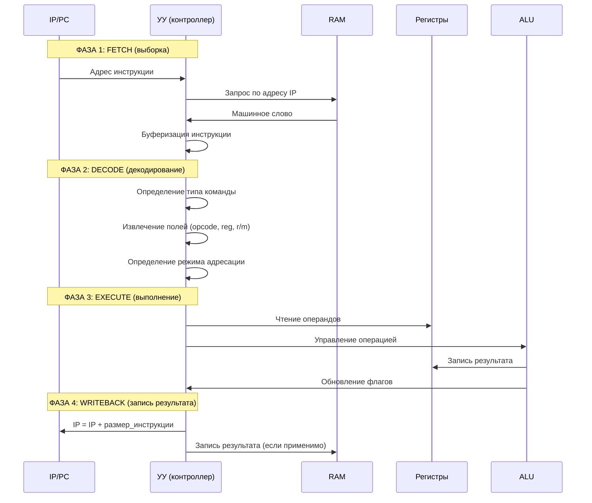
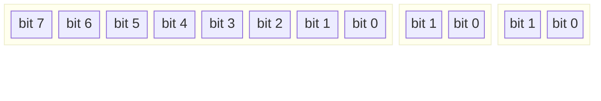
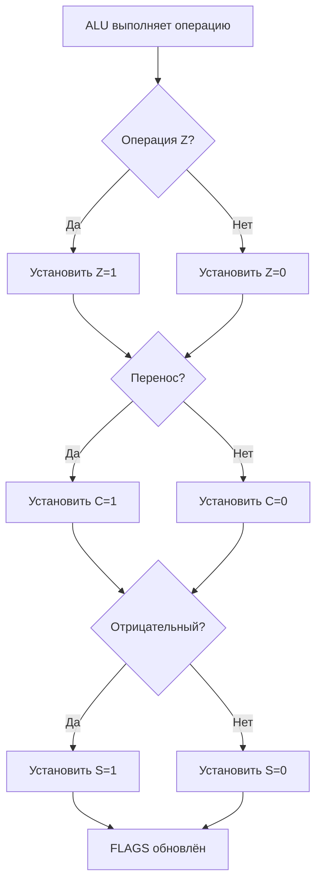

> Пошаговое описание процесса выполнения инструкции в процессоре NovumOS-16bit

---

## Навигация

| Предыдущий | Текущий | Следующий |
|------------|---------|-----------|
| [Регистры](registers.md) | Цикл выполнения | [Карта памяти](memory-map.md) |

---

## Общая последовательность

Каждая инструкция проходит 4 фазы:



---

## Фаза 1: FETCH (Выборка инструкции)

### Что происходит

1. УУ берёт адрес из регистра IP/PC
2. Формируется адресный запрос к RAM
3. Из ячейки памяти считывается машинное слово
4. Инструкция буферизируется во внутреннем регистре УУ

### Временные характеристики

| Параметр | Значение |
|----------|----------|
| Адресная задержка | 1 такт |
| Считывание из RAM | 1–2 такта (зависит от реализации RAM) |
| Итого | 2–3 такта |

### Автоинкремент IP

После FETCH IP автоматически увеличивается:
- Для 16-битных инструкций: IP ← IP + 2 (одно слово = 2 байта)
- Для 32-битных инструкций: IP ← IP + 4 (два слова = 4 байта)

**Важно**: автоинкремент происходит в конце фазы FETCH, до начала DECODE.

---

## Фаза 2: DECODE (Декодирование)

### Что происходит

1. Декодер анализирует opcode (старшие биты инструкции)
2. Определяется тип операции (MOV, ADD, SUB и т.д.)
3. Извлекаются поля операндов:
   - `reg` — номер регистра (2 бита)
   - `r/m` — режим адресации (2 бита)
   - `imm` — непосредственное значение (если есть)
4. Определяется формат инструкции (16 или 32 бита)

### Форматы инструкций

#### 16-битный формат ( register-register )



| Поле | Биты | Описание |
|------|------|----------|
| `opcode` | 8 бит | Код операции |
| `reg` | 2 бита | Номер регистра |
| `r/m` | 2 бита | Режим адресации |

#### 32-битный формат ( register-immediate или register-memory )

```mermaid
block-beta
    columns 16
    block:opcode:8
        columns 8
        O7["bit 7"] O6["bit 6"] O5["bit 5"] O4["bit 4"]
        O3["bit 3"] O2["bit 2"] O1["bit 1"] O0["bit 0"]
    end
    block:reg:2
        columns 2
        R1["bit 1"] R0["bit 0"]
    end
    block:rm:2
        columns 2
        M1["bit 1"] M0["bit 0"]
    end
    block:operand:16
        columns 16
        I15["bit 15"] I14["bit 14"] I13["bit 13"] I12["bit 12"]
        I11["bit 11"] I10["bit 10"] I9["bit 9"] I8["bit 8"]
        I7["bit 7"] I6["bit 6"] I5["bit 5"] I4["bit 4"]
        I3["bit 3"] I2["bit 2"] I1["bit 1"] I0["bit 0"]
    end
```



| Поле | Биты | Описание |
|------|------|----------|
| `opcode` | 8 бит | Код операции |
| `reg` | 2 бита | Номер регистра |
| `r/m` | 2 бита | Режим адресации |
| `operand` | 16 бит | Непосредственное значение / адрес |

### Временные характеристики

| Параметр | Значение |
|----------|----------|
| Декодирование | 1 такт |
| Извлечение полей | 1 такт |
| Итого | 2 такта |

---

## Фаза 3: EXECUTE (Выполнение)

### Что происходит

1. УУ читает операнды из регистров или памяти
2. Формируются управляющие сигналы для ALU
3. ALU выполняет операцию
4. Результат записывается в целевой регистр
5. Обновляются флаги в регистре FLAGS

### Последовательность для различных типов инструкций

#### Арифметическая операция (ADD reg, reg)

```
AX → ALU (вход A)
Регистр r/m → ALU (вход B)
ALU выполняет сложение
Результат → AX
Обновление FLAGS (Z, C)
```

#### Инструкция MOV (регистр-память)

```
Формирование адреса из BX (или BX+CX)
Запрос чтения к RAM
Данные из RAM → целевой регистр
```

#### Инструкция перехода (JMP)

```
Целевой адрес из операнда → IP
Цикл прерывается
```

### Временные характеристики

| Тип операции | Количество тактов |
|--------------|-------------------|
| Регистр-регистр | 1 такт |
| Регистр-память (чтение) | 2 такта |
| Память-регистр (запись) | 2 такта |
| Условный переход (выполнено) | 1 такт |
| Условный переход (не выполнено) | 1 такт |

---

## Фаза 4: WRITEBACK (Запись результата)

### Что происходит

1. Результат из внутреннего регистра ALU записывается в целевой регистр
2. Если операция предполагала запись в память — формируется запрос записи
3. Обновляются флаги (если не были обновлены в фазе EXECUTE)
4. Возвращается к фазе FETCH

---

## Полный цикл — Пример

### Инструкция: ADD AX, BX

| Фаза | Такты | Действие |
|------|-------|----------|
| FETCH | 1–3 | Считывание инструкции из RAM[IP] |
| DECODE | 4–5 | Определение: ADD, operands: AX, BX |
| EXECUTE | 6 | ALU: AX + BX → temp, обновление Z, C |
| WRITEBACK | 7 | temp → AX, IP ← IP + 2 |
| **Итого** | **7** | |

### Инструкция: MOV AX, [BX+CX]

| Фаза | Такты | Действие |
|------|-------|----------|
| FETCH | 1–3 | Считывание инструкции из RAM[IP] |
| DECODE | 4–5 | Определение: MOV, косвенная адресация |
| EXECUTE | 6–7 | Адрес = BX + CX, запрос к RAM |
| WRITEback | 8 | Данные → AX, IP ← IP + 2 |
| **Итого** | **8** | |

### Инструкция: JZ 0x1000

| Фаза | Такты | Действие |
|------|-------|----------|
| FETCH | 1–3 | Считывание инструкции из RAM[IP] |
| DECODE | 4–5 | Определение: JZ, адрес: 0x1000 |
| EXECUTE | 6 | Проверка флага Z в FLAGS |
| WRITEBACK | 7 | Если Z=1: IP ← 0x1000; иначе: IP ← IP + 4 |
| **Итого** | **7** | |

---

## Обновление флагов

### Правила обновления

1. Флаги обновляются **только** после арифметико-логических операций
2. MOV, PUSH, POP **не влияют** на флаги
3. Флаги обновляются в фазе EXECUTE
4. Флаги остаются неизменными до следующей арифметико-логической операции

### Порядок обновления



---

## Остановка процессора

### HLT (рекомендуемая инструкция)

После выполнения HLT процессор приостанавливает работу и ожидает прерывания:

| Состояние | Описание |
|-----------|----------|
| Работа | Процессор выполняет инструкции |
| HLT | Процессор остановлен, ожидает прерывание |
| Прерывание | Процессор обрабатывает прерывание и продолжает работу |

---

## См. также

- [Регистры](registers.md) — какие регистры обновляются
- [Обзор](overview.md) — общая архитектура
- [Карта памяти](memory-map.md) — куда обращается IP
