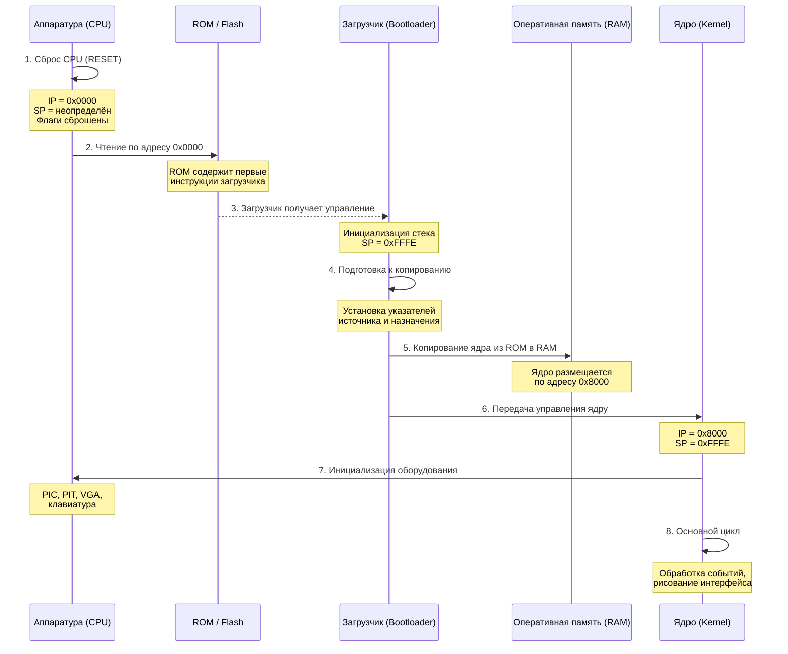
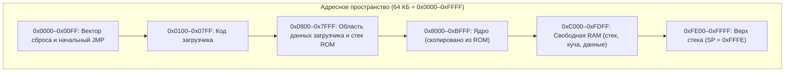
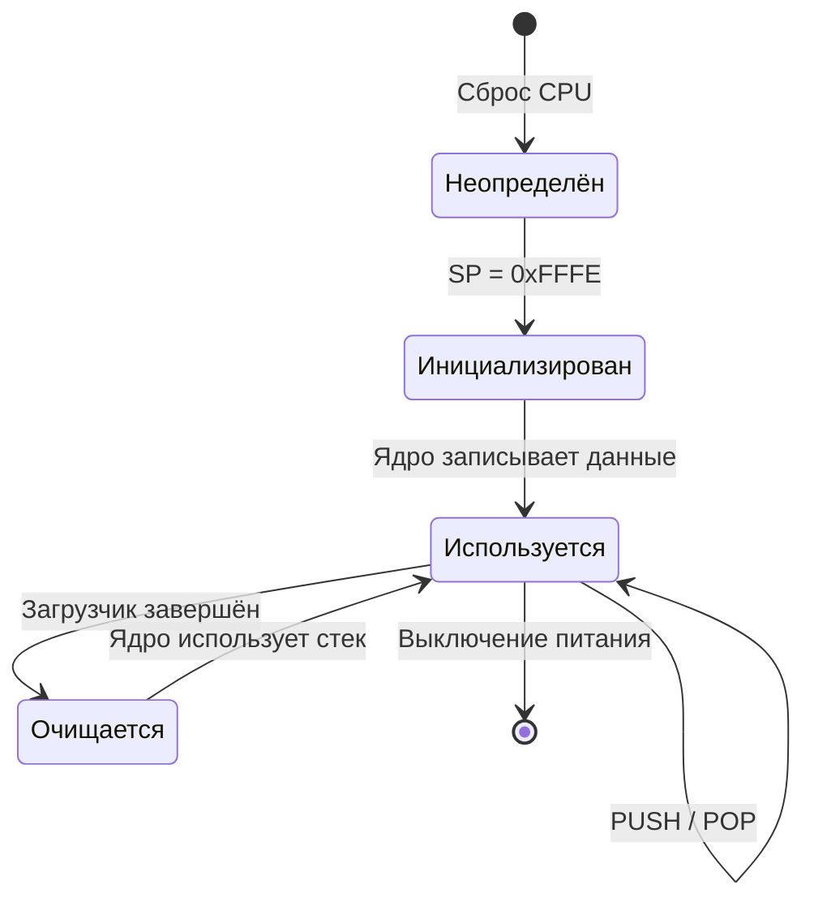
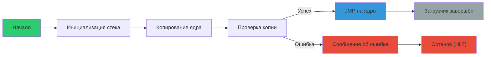
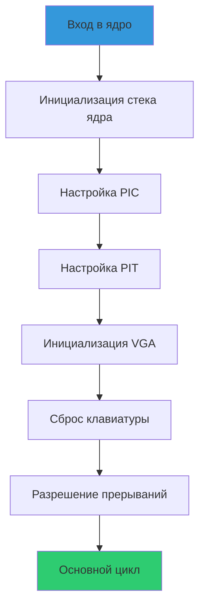
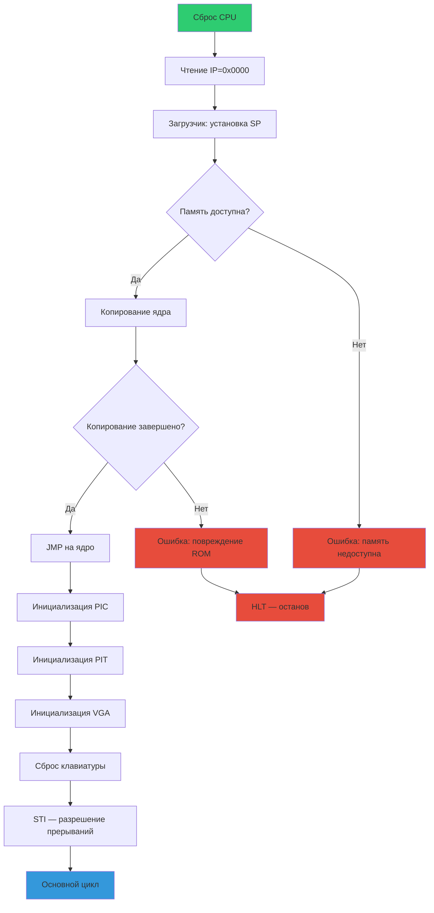

## Обзор

NovumOS-16bit загружается поэтапно: от аппаратного сброса CPU до входа в основной цикл ядра. Каждый этап выполняет строго определённую последовательность операций, а регистры CPU переходят через предсказуемую цепочку состояний.

---

## Диаграмма последовательности загрузки

---

## Пошаговая последовательность загрузки

### Этап 1: Сброс CPU

При включении питания или нажатии кнопки сброса происходит аппаратный сброс процессора.

**Состояние регистров:**

| Регистр | Значение | Описание |
|---------|----------|----------|
| IP (Instruction Pointer) | `0x0000` | Указывает на первый байт ROM |
| SP (Stack Pointer) | Неопределённое | Стек не инициализирован |
| FLAGS | `0x0000` | Все флаги сброшены |
| AX–DX | Неопределённые | Содержимое не гарантировано |

**Что происходит:**

- Все внутренние регистры сбрасываются в начальные значения
- Сигнал сброса блокирует обращения к шине на несколько тактов
- После стабилизации сигнала сброса CPU начинает исполнение с адреса `0x0000`
- Шина адреса выставляет значение `0x0000`, шина данных считывает первый байт

---

### Этап 2: Чтение начального вектора

**Состояние регистров:**

| Регистр | Значение | Описание |
|---------|----------|----------|
| IP | `0x0000` | Начальный адрес ROM |
| SP | Неопределённое | Стек не инициализирован |

**Что происходит:**

- CPU выполняет первый fetch — чтение слова по адресу `0x0000`
- По этому адресу расположен переход на начало кода загрузчика (инструкция `JMP`)
- Адрес `0x0000` в ROM зарезервирован для начального вектора — он всегда содержит первую инструкцию загрузчика

---

### Этап 3: Загрузчик получает управление

**Состояние регистров:**

| Регистр | Значение | Описание |
|---------|----------|----------|
| IP | `0x0002` (после JMP) | Адрес следующей инструкции загрузчика |
| SP | `0xFFFE` | Инициализирован верхом стека |
| FLAGS | `0x0000` | Флаги сброшены |

**Что происходит:**

- Выполняется инструкция установки стекового указателя: SP = 0xFFFE
- Стек растёт вниз — первый элемент стека будет записан по адресу 0xFFFC
- Стек размещается в верхней части адресного пространства RAM
- Загрузчик проверяет, что память доступна (опциональный тест)

---

### Этап 4: Подготовка к копированию ядра

**Состояние регистров:**

| Регистр | Значение | Описание |
|---------|----------|----------|
| IP | Адрес функции копирования | Адрес строки копирования |
| SP | `0xFFFE` | Стек инициализирован |
| SI | Адрес источника в ROM | Откуда копировать |
| DI | `0x8000` | Куда копировать (начало ядра в RAM) |
| CX | Размер ядра (слов) | Количество слов для копирования |

**Что происходит:**

- Загрузчик устанавливает SI на начало образа ядра в ROM
- DI устанавливается на `0x8000` — начало области ядра в RAM
- CX загружается размером ядра в словах
- Область ROM с ядром расположена сразу после кода загрузчика

---

### Этап 5: Копирование ядра из ROM в RAM

**Состояние регистров:**

| Регистр | Значение | Описание |
|---------|----------|----------|
| IP | Внутри цикла копирования | Текущая инструкция копирования |
| SP | `0xFFFE` | Стек не используется |
| SI | Увеличивается на 2 | Текущий адрес источника |
| DI | Увеличивается на 2 | Текущий адрес назначения |
| CX | Уменьшается на 1 | Оставшееся количество слов |

**Что происходит:**

- Выполняется цикл копирования: чтение слова из [SI], запись в [DI]
- SI и DI увеличиваются на 2 (размер слова — 2 байта)
- CX декрементируется на каждой итерации
- Цикл продолжается, пока CX ≠ 0
- Итог: ядро полностью скопировано в RAM по адресам `0x8000`–`0x8000 + размер`

---

### Этап 6: Передача управления ядру

**Состояние регистров:**

| Регистр | Значение | Описание |
|---------|----------|----------|
| IP | `0x8000` | Точка входа ядра |
| SP | `0xFFFE` | Стек в верхней части RAM |
| Остальные | Неопределённые | Загрузчик не очищает регистры |

**Что происходит:**

- Загрузчик выполняет безусловный переход `JMP 0x8000`
- Управление передаётся ядру, которое теперь выполняется из RAM
- Загрузчик больше не нужен — его код остаётся в ROM, но не вызывается

---

### Этап 7: Инициализация оборудования

**Состояние регистров:**

| Регистр | Значение | Описание |
|---------|----------|----------|
| IP | Внутри функции init | Код инициализации |
| SP | `0xFFFE` | Стек используется для вызовов |
| Остальные | Устанавливаются ядром | Используются для работы с оборудованием |

**Что происходит:**

- **PIC (Programmable Interrupt Controller):** настройка векторов прерываний, масок, режима
- **PIT (Programmable Interval Timer):** настройка частоты таймера для квантования
- **VGA:** инициализация текстового режима 80×25, очистка экрана
- **Клавиатура:** сброс контроллера, включение сканирования
- Каждое устройство настраивается записью в соответствующие порты ввода-вывода

---

### Этап 8: Вход в основной цикл

**Состояние регистров:**

| Регистр | Значение | Описание |
|---------|----------|----------|
| IP | Адрес основного цикла | Бесконечный цикл обработки |
| SP | `0xFFFE` | Стек стабилен |
| FLAGS | Установлены нужные флаги | Разрешены прерывания (IF=1) |

**Что происходит:**

- Ядро устанавливает флаг разрешения прерываний (STI)
- Начинается основной цикл: обработка событий, обновление дисплея, реагирование на прерывания
- В прерываниях обрабатываются: клавиатура, таймер, программные прерывания
- Интерфейс пользователя обновляется в каждом кадре

---

## Раскладка памяти во время загрузки

### Таблица раскладки памяти

| Диапазон | Назначение | Доступ |
|----------|------------|--------|
| `0x0000–0x00FF` | Вектор сброса, начальный переход | Только ROM |
| `0x0100–0x07FF` | Код загрузчика | Только ROM |
| `0x0800–0x7FFF` | Данные и стек загрузчика | ROM |
| `0x8000–0xBFFF` | Образ ядра (копия) | RAM |
| `0xC000–0xFDFF` | Стек ядра, куча, глобальные данные | RAM |
| `0xFE00–0xFFFF` | Верх стека | RAM |

### Порты ввода-вывода

| Порт | Устройство | Назначение |
|------|-----------|------------|
| `0x20–0x21` | PIC (Master) | Управление прерываниями |
| `0x40–0x43` | PIT | Таймер |
| `0x60` | Клавиатура | Данные сканирования |
| `0x64` | Клавиатура | Статус и команды |
| `0x00–0x0F` | VGA | Адрес и данные |
| `0x03D4–0x03D5` | VGA CRT | Управление курсором |

---

## Содержимое регистров на каждом этапе

### Сводная таблица

| Этап | IP | SP | SI | DI | CX | FLAGS |
|------|----|----|----|----|----|-------|
| 1. Сброс | `0x0000` | ? | ? | ? | ? | `0x0000` |
| 2. Чтение вектора | `0x0000` | ? | ? | ? | ? | `0x0000` |
| 3. Загрузчик: стек | `0x0002` | `0xFFFE` | ? | ? | ? | `0x0000` |
| 4. Подготовка копирования | `init_func` | `0xFFFE` | `ROM_addr` | `0x8000` | `size` | `0x0000` |
| 5. Копирование (итерации) | `loop_addr` | `0xFFFE` | `incr+2` | `incr+2` | `decr-1` | `0x0000` |
| 6. Передача ядру | `0x8000` | `0xFFFE` | ? | ? | ? | `0x0000` |
| 7. Инициализация | `kernel_init` | `0xFFFE` | device-specific | device-specific | device-specific | varies |
| 8. Основной цикл | `main_loop` | `0xFFFE` | event-specific | event-specific | event-specific | `IF=1` |

---

## Диаграмма состояний стека

---

## Диаграмма жизненного цикла загрузчика

---

## Диаграмма инициализации оборудования

---

## Критические моменты

### 1. Начальный вектор всегда по адресу 0x0000

CPU не может начать выполнение по другому адресу. Это аппаратное ограничение. Поэтому всегда по адресу `0x0000` должна быть инструкция перехода на загрузчик.

### 2. Стек инициализируется до первого PUSH/POP

Если попытаться использовать стек до установки SP, произойдёт обращение к неопределённому адресу — поведение непредсказуемо. Поэтому первая инструкция загрузчика — установка SP.

### 3. Ядро копируется до передачи управления

Загрузчик выполняется из ROM (нелинейная память). Для быстрой работы ядро должно находиться в RAM. Копирование обязательно.

### 4. PIC настраивается до разрешения прерываний

Если разрешить прерывания до настройки PIC, процессор может получить некорректные векторы прерываний и перейти в неизвестный код.

---

## Полная диаграмма загрузки (с ошибками)

---

## Таймлайн загрузки

```mermaid
gantt
    title Последовательность загрузки NovumOS-16bit
    dateFormat X
    axisFormat %s

    section Аппаратура
    Сброс CPU           :a1, 0, 1
    Fetch по адресу 0x0 :a2, 1, 2

    section Загрузчик
    Установка SP        :b1, 2, 3
    Подготовка копирования :b2, 3, 4
    Копирование ядра    :b3, 4, 8
    JMP на ядро         :b4, 8, 9

    section Ядро
    Инициализация PIC   :c1, 9, 10
    Инициализация PIT   :c2, 10, 11
    Инициализация VGA   :c3, 11, 12
    Сброс клавиатуры   :c4, 12, 13
    Разрешение прерываний :c5, 13, 14
    Основной цикл       :c6, 14, 20
```

---

## Резюме

Процесс загрузки NovumOS-16bit — детерминированная последовательность из 8 этапов:

1. **Аппаратный сброс** — CPU переходит в начальное состояние
2. **Чтение вектора** — начальный переход по адресу `0x0000`
3. **Инициализация стека** — SP = `0xFFFE`
4. **Подготовка копирования** — установка указателей и счётчика
5. **Копирование ядра** — перенос образа из ROM в RAM
6. **Передача управления** — JMP на `0x8000`
7. **Инициализация оборудования** — PIC, PIT, VGA, клавиатура
8. **Основной цикл** — работа операционной системы

Каждый этап предсказуем и детерминирован. Поля регистрации доступны для отладки на любом этапе.