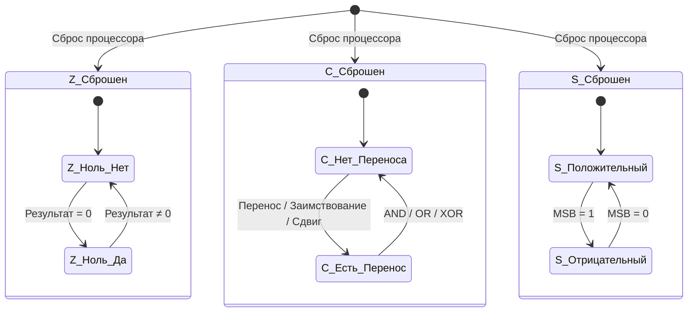
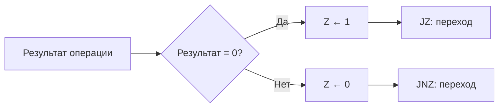
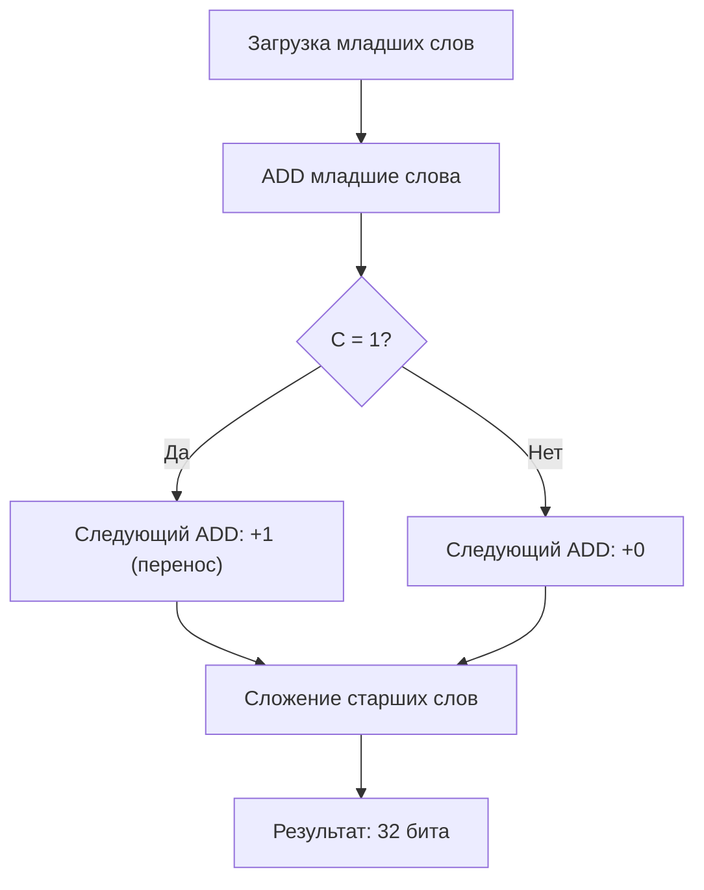
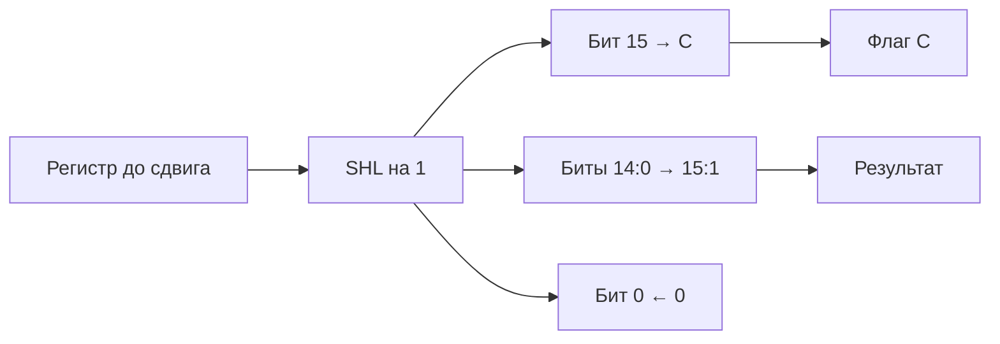
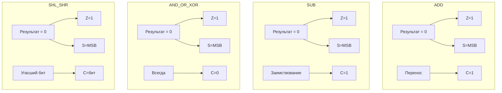

## Обзор

Регистр FLAGS процессора NovumOS-16bit содержит три флага, которые устанавливаются
или сбрасываются АЛУ-инструкциями и определяют поведение условных переходов.

---

## Флаги

| Флаг | Бит | Название | Описание |
|------|-----|----------|----------|
| **Z** | 0 | Zero (Ноль) | Устанавливается в 1, если результат последней АЛУ-операции равен нулю. Сбрасывается в 0, если результат не равен нулю. |
| **C** | 1 | Carry (Перенос) | Устанавливается в 1 при переносе за старший бит (при сложении) или заимствовании (при вычитании). Также устанавливается при логическом сдвиге, когда бит «улетает» за пределы регистра. |
| **S** | 2 | Sign (Знак) | Отражает старший бит результата: 1 — результат отрицательный (в дополнительном коде), 0 — положительный или ноль. |

### Остальные биты

| Бит | Описание |
|-----|----------|
| 3:15 | Резервные. Всегда 0. Не модифицируются пользовательскими инструкциями. |

---

## Установка флагов по командам

| Команда | Z | C | S | Описание |
|---------|---|---|---|----------|
| `MOV` | — | — | — | Не затрагивает флаги |
| `ADD` | ✓ | ✓ | ✓ | Z=1 если результат=0, C=1 если перенос, S=MSB результата |
| `SUB` | ✓ | ✓ | ✓ | Z=1 если результат=0, C=1 если заимствование, S=MSB результата |
| `AND` | ✓ | 0 | ✓ | Z=1 если результат=0, C всегда сброшен, S=MSB результата |
| `OR` | ✓ | 0 | ✓ | Z=1 если результат=0, C всегда сброшен, S=MSB результата |
| `XOR` | ✓ | 0 | ✓ | Z=1 если результат=0, C всегда сброшен, S=MSB результата |
| `SHL` | ✓ | ✓ | ✓ | Z=1 если результат=0, C=последний сдвинутый бит, S=MSB результата |
| `SHR` | ✓ | ✓ | ✓ | Z=1 если результат=0, C=последний сдвинутый бит, S=MSB результата |
| `JMP` | — | — | — | Не затрагивает флаги |
| `JZ` | — | — — | — | Только читает флаг Z, не изменяет |
| `JNZ` | — | — | — | Только читает флаг Z, не изменяет |
| `PUSH` | — | — | — | Не затрагивает флаги |
| `POP` | — | — | — | Не затрагивает флаги |
| `IN` | — | — | — | Не затрагивает флаги |
| `OUT` | — | — | — | Не затрагивает флаги |
| `CALL` | — | — | — | Не затрагивает флаги |
| `RET` | — | — | — | Не затрагивает флаги |
| `INT` | — | — | — | Сохраняет FLAGS в стеке, но не изменяет в процессе |
| `HLT` | — | — | — | Не затрагивает флаги |

> **Важно:** Команды `AND`, `OR`, `XOR` всегда сбрасывают флаг C в 0.

---

## Диаграмма состояний флагов

---

## Описание каждого флага

### Флаг Z (Zero)

Флаг Z отражает результат последней АЛУ-операции.

| Условие | Значение Z |
|---------|-----------|
| Результат операции = 0 | 1 |
| Результат операции ≠ 0 | 0 |

**Команды, влияющие на Z:** ADD, SUB, AND, OR, XOR, SHL, SHR

**Использование:** Основной флаг для условных переходов JZ/JNZ. Позволяет проверять
результат сравнения (если SUB дал 0, значит операнды равны).

### Флаг C (Carry)

Флаг C отражает перенос или заимствование при арифметических операциях,
а также «улетевший» бит при сдвиге.

| Операция | Условие | Значение C |
|----------|---------|-----------|
| `ADD` | Перенос за старший бит (результат > 0xFFFF) | 1 |
| `ADD` | Нет переноса | 0 |
| `SUB` | Заимствование (результат < 0) | 1 |
| `SUB` | Нет заимствования | 0 |
| `SHL` | Старший бит до сдвига = 1 | 1 |
| `SHL` | Старший бит до сдвига = 0 | 0 |
| `SHR` | Младший бит до сдвига = 1 | 1 |
| `SHR` | Младший бит до сыва = 0 | 0 |
| `AND/OR/XOR` | Всегда | 0 |

**Использование:** Многобайтная арифметика (сложение/вычитание чисел длиннее 16 бит).

### Флаг S (Sign)

Флаг S отражает знак результата в дополнительном коде.

| Условие | Значение S |
|---------|-----------|
| Старший бит результата = 1 | 1 (отрицательное) |
| Старший бит результата = 0 | 0 (положительное или ноль) |

**Команды, влияющие на S:** ADD, SUB, AND, OR, XOR, SHL, SHR

---

## Условные переходы

| Команда | Условие перехода | Проверяемый флаг |
|---------|-----------------|-----------------|
| `JZ addr` | Z = 1 | Z |
| `JNZ addr` | Z = 0 | Z |

> **Примечание:** В текущей версии ISA поддерживаются только условные переходы по флагу Z.
> Переходы по флагам C и S не реализованы в базовом наборе, но могут быть добавлены
> как расширение ISA.

---

## Многобайтная арифметика

Для сложения или вычитания чисел шире 16 бит (например, 32-битных) используется
флаг C для передачи переноса между словами.

### Сложение 32-битных чисел

**Алгоритм:**

1. Сложить младшие 16-битные слова инструкцией `ADD`
2. Флаг C автоматически указывает, был ли перенос
3. Сложить старшие 16-битные слова инструкцией `ADD` с учётом переноса
4. Результат — 32-битное число, старшее слово в آخرнем сложении

### Вычитание 32-битных чисел

Аналогично, но флаг C указывает на заимствование. Если при вычитании младших слов
результат отрицательный, C=1, и к вычитанию старших слов нужно добавить 1.

---

## Влияние SHL и SHR на флаги

### SHL (Сдвиг влево)

При сдвиге влево на N бит:

| Бит | Источник | Назначение |
|-----|----------|-----------|
| Старший бит (бит 15) | Уходит в флаг C | — |
| Бит 14:0 | Сдвигаются влево на 1 позицию | Заполняется нулём |
| Z | — | 1 если результат = 0 |
| S | — | Копия нового бита 15 |

### SHR (Сдвиг вправо)

При сдвиге вправо на N бит:

| Бит | Источник | Назначение |
|-----|----------|-----------|
| Младший бит (бит 0) | Уходит в флаг C | — |
| Биты 15:1 | Сдвигаются вправо на 1 позицию | Заполняется нулём |
| Z | — | 1 если результат = 0 |
| S | — | Копия нового бита 15 (всегда 0 для логического сдвига) |

---

## Сводная таблица поведения флагов

