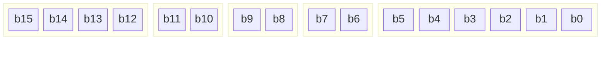
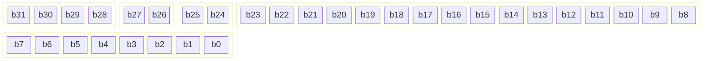
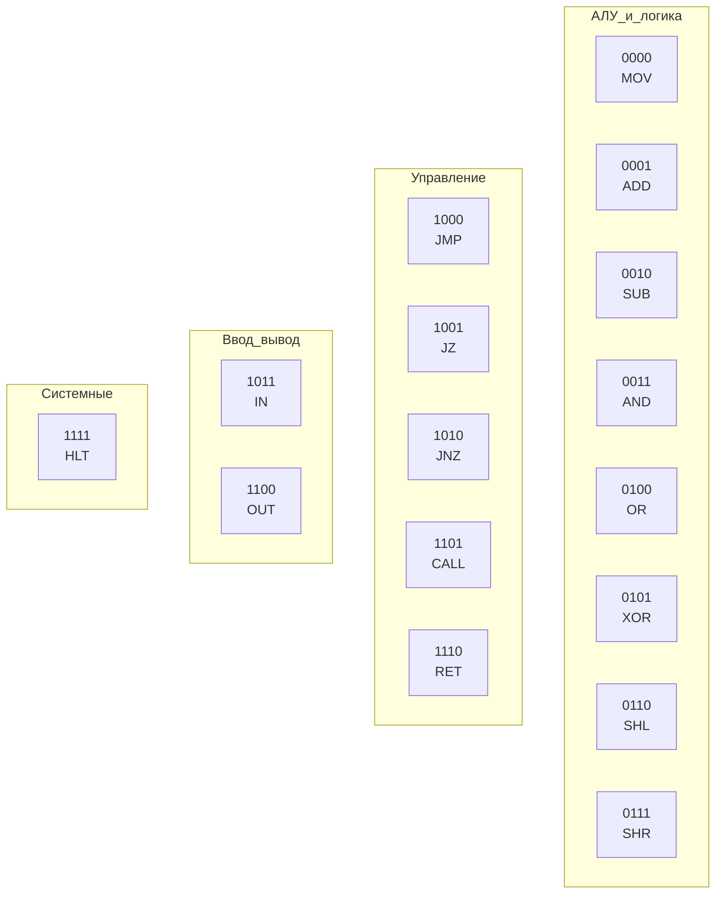
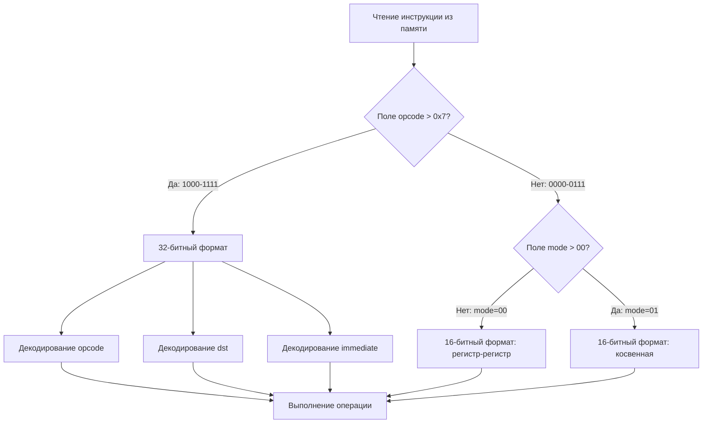

## Обзор

Процессор NovumOS-16bit поддерживает два формата кодирования инструкций:
16-битный (стандартный) и 32-битный (для инструкций с непосредственным операндом).
Все инструкции выровнены по границе 16-битных слов. Длинные инструкции занимают
два последовательных слота в памяти.

---

## 16-битный формат

Стандартный формат для большинства команд. Используется при работе
с операндами-регистрами или для команд без операндов.



### Описание полей 16-битного формата

| Поле | Биты | Ширина | Описание |
|------|------|--------|----------|
| `opcode` | 15:12 | 4 бита | Код операции. Определяет тип команды. |
| `dst` | 11:10 | 2 бита | Регистр назначения (приёмник результата). |
| `src` | 9:8 | 2 бита | Регистр источника (второй операнд). |
| `mode` | 7:6 | 2 бита | Режим адресации / модификатор операции. |
| `unused` | 5:0 | 6 бит | Резервные биты. Должны быть нулями. |

---

## 32-битный формат

Используется для инструкций с непосредственным (immediate) операндом:
загрузка константы, переход на абсолютный адрес, порт ввода/вывода.



### Описание полей 32-битного формата

| Поле | Биты | Ширина | Описание |
|------|------|--------|----------|
| `opcode` | 31:28 | 4 бита | Код операции. Аналогично 16-битному формату. |
| `dst` | 27:26 | 2 бита | Регистр назначения. |
| `mode` | 25:24 | 2 бита | Режим адресации / модификатор. |
| `immediate` | 23:8 | 16 бит | Непосредственное значение (адрес, константа, порт). |
| `unused` | 7:0 | 8 бит | Резервные биты. Должны быть нулями. |

> **Примечание:** В 32-битном формате отсутствует поле `src`. Второй операнд
> — это всегда значение `immediate`. Поле `mode` определяет тип операнда.

---

## Таблица опкодов

| Опкод (bin) | Опкод (hex) | Мнемоника | Формат | Описание |
|-------------|-------------|-----------|--------|----------|
| `0000` | `0x0` | MOV | 16/32 | Пересылка данных |
| `0001` | `0x1` | ADD | 16/32 | Сложение |
| `0010` | `0x2` | SUB | 16/32 | Вычитание |
| `0011` | `0x3` | AND | 16/32 | Побитовое И |
| `0100` | `0x4` | OR | 16/32 | Побитовое ИЛИ |
| `0101` | `0x5` | XOR | 16/32 | Побитовое исключающее ИЛИ |
| `0110` | `0x6` | SHL | 16/32 | Сдвиг влево |
| `0111` | `0x7` | SHR | 16/32 | Сдвиг вправо |
| `1000` | `0x8` | JMP | 32 | Безусловный переход |
| `1001` | `0x9` | JZ | 32 | Переход при Z=1 |
| `1010` | `0xA` | JNZ | 32 | Переход при Z=0 |
| `1011` | `0xB` | IN | 32 | Чтение из порта |
| `1100` | `0xC` | OUT | 32 | Запись в порт |
| `1101` | `0xD` | CALL | 32 | Вызов подпрограммы |
| `1110` | `0xE` | RET | 16 | Возврат из подпрограммы |
| `1111` | `0xF` | HLT | 16 | Останов процессора |

### Визуальная карта опкодов



---

## Кодирование режимов (mode)

Поле `mode` (2 бита) определяет тип второго операнда или модификатор
адресации в обоих форматах.

| mode (bin) | mode (hex) | Описание |
|------------|------------|----------|
| `00` | `0x0` | Регистр ( операнд = поле `src` в 16-бит / иммедиат в 32-бит ) |
| `01` | `0x1` | Косвенная адресация по регистру (операнд = [регистр]) |
| `10` | `0x2` | Иммедиат — непосредственное значение (только 32-битный формат) |
| `11` | `0x3` | Резерв / специальный режим |

### Кодирование операндов

| Тип операнда | mode | Формат | Описание |
|-------------|------|--------|----------|
| Регистр ← Регистр | `00` | 16-бит | `dst` и `src` указывают на регистры |
| Регистр ← [Регистр] | `01` | 16-бит | Чтение из памяти по адресу в `src` |
| [Регистр] ← Регистр | `01` | 16-бит | Запись в память по адресу в `dst` |
| Регистр ← imm16 | `10` | 32-бит | Загрузка 16-битного значения в регистр |
| Регистр ← [imm16] | `10` | 32-бит | Чтение из памяти по 16-битному адресу |
| Адрес перехода | `10` | 32-бит | JMP/JZ/JNZ/_CALL используют imm16 как адрес |
| Порт ввода/вывода | `10` | 32-бит | IN/OUT используют imm16 как номер порта |

---

## NOP кодировка

`NOP` (No Operation) — специальная инструкция, которая не выполняет никаких действий.
Она используется для выравнивания, заполнения задержек и как заглушка в таблице векторов.

| Формат | Бинарное представление | Hex |
|--------|----------------------|-----|
| 16-бит | `0000 00 00 00 000000` | `0x0000` |
| Альтернатива | `0000 00 00 01 000000` | `0x0040` (MOV AX, AX) |

### Выравнивание с NOP

Для выравнивания начала подпрограммы или обработчика прерывания на границу слова
используют NOP-заполнители:


---

## Примеры кодировки

### MOV AX, BX (регистр-регистр)

| Поле | Значение | Биты |
|------|----------|------|
| opcode | `0000` (MOV) | 15:12 |
| dst | `00` (AX) | 11:10 |
| src | `01` (BX) | 9:8 |
| mode | `00` (регистр) | 7:6 |
| unused | `000000` | 5:0 |

**Результат:** `0000 00 01 00 000000` = `0x0100`

### ADD CX, 0x1234 (регистр-иммедиат)

| Поле | Значение | Биты |
|------|----------|------|
| opcode | `0001` (ADD) | 31:28 |
| dst | `10` (CX) | 27:26 |
| mode | `10` (иммедиат) | 25:24 |
| immediate | `0001 0010 0011 0100` (0x1234) | 23:8 |
| unused | `00000000` | 7:0 |

**Результат:** `0001 10 10 0001001000110100 00000000` = `0x1A123400`

### JMP 0x0200 (безусловный переход)

| Поле | Значение | Биты |
|------|----------|------|
| opcode | `1000` (JMP) | 31:28 |
| dst | `00` (не используется) | 27:26 |
| mode | `10` (адрес) | 25:24 |
| immediate | `0000 0010 0000 0000` (0x0200) | 23:8 |
| unused | `00000000` | 7:0 |

**Результат:** `1000 00 10 0000001000000000 00000000` = `0x82020000`

---

## Порядок байтов (Endianness)

Процессор NovumOS-16bit использует **little-endian** порядок байтов.
16-битное слово хранится в памяти младшим байтом первым:

```
Адрес:     [A]     [A+1]
Значение:  LSB     MSB
```

32-битная инструкция хранится как два последовательных 16-битных слова:

```
Адрес:     [A]     [A+1]   [A+2]   [A+3]
Значение:  LSB1    MSB1    LSB2    MSB2
```

---

## Механизм декодирования

