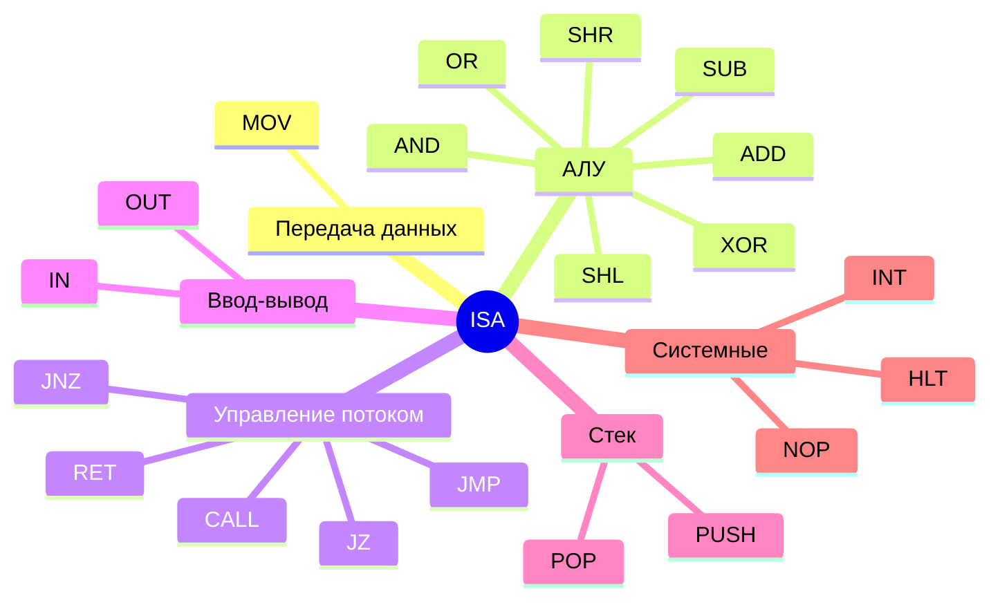
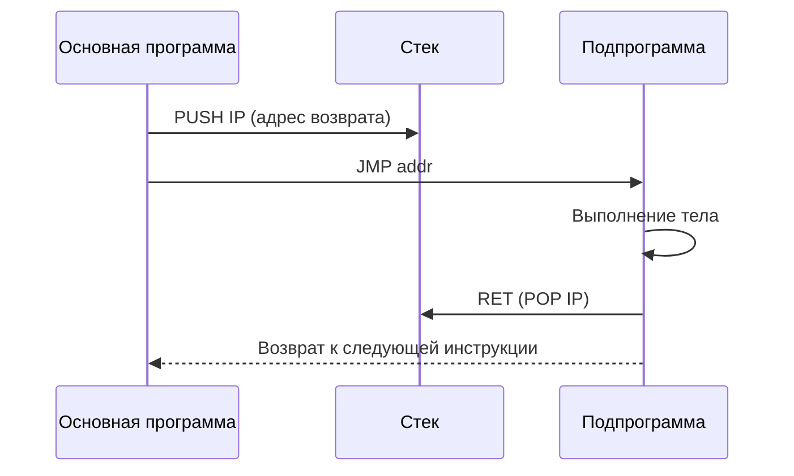
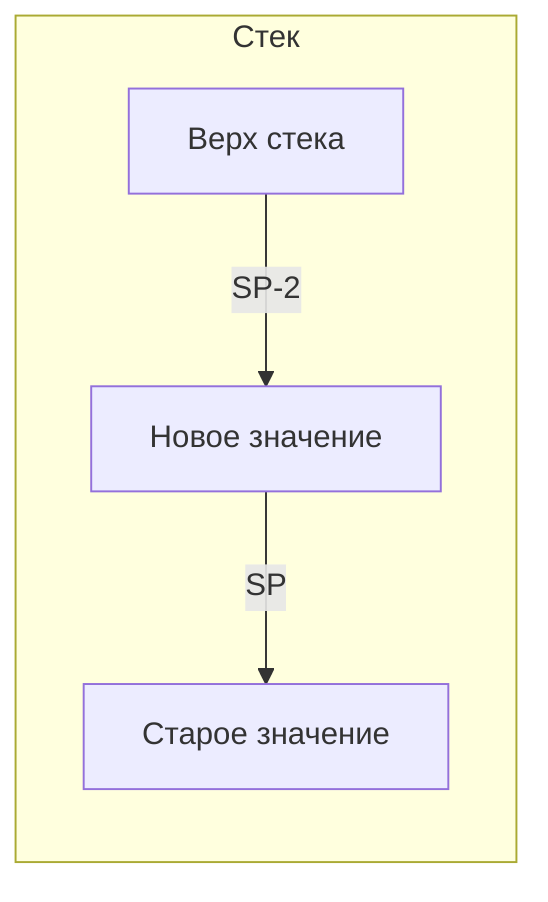
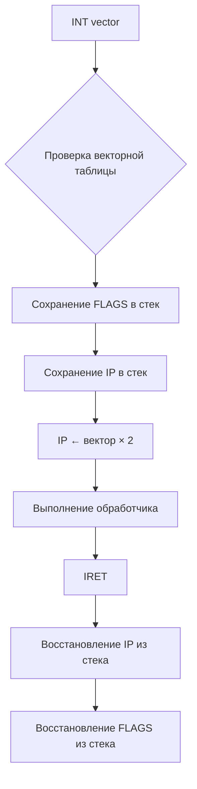

## Обзор

Процессор NovumOS-16bit использует гибридный RISC-подобный набор команд с поддержкой
16-битного и 32-битного форматов инструкций. Все команды выравнены по границе слов
(16 бит), для длинных инструкций используется два подряд идущих слова.

---

## Категории команд

| Категория | Описание |
|-----------|----------|
| **Передача данных** | Копирование данных между регистрами и памятью |
| **Арифметика и логика** | АЛУ-операции над операндами |
| **Управление потоком** | Безусловные и условные переходы, подпрограммы |
| **Ввод/вывод** | Обмен данными с периферийными устройствами |
| **Системные** | Останов процессора, программные прерывания |

---

## Полная таблица команд

### Передача данных

| Мнемоника | Операнды | Описание | Флаги |
|-----------|----------|----------|-------|
| `MOV dst, src` | регистр ↔ регистр / регистр ← иммедиат | Пересылка значения из источника в приёмник. Если источник — иммедиат, значение загружается напрямую в указанный регистр. Не затрагивает флаги. | — |

### Арифметические и логические операции

| Мнемоника | Операнды | Описание | Флаги |
|-----------|----------|----------|-------|
| `ADD dst, src` | регистр, регистр/иммедиат | Сложение: `dst = dst + src`. Результат записывается в `dst`. | Z, C, S |
| `SUB dst, src` | регистр, регистр/иммедиат | Вычитание: `dst = dst - src`. Результат записывается в `dst`. | Z, C, S |
| `AND dst, src` | регистр, регистр/иммедиат | Побитовое И: `dst = dst & src`. | Z, S |
| `OR dst, src` | регистр, регистр/иммедиат | Побитовое ИЛИ: `dst = dst \| src`. | Z, S |
| `XOR dst, src` | регистр, регистр/иммедиат | Побитовое исключающее ИЛИ: `dst = dst ^ src`. | Z, S |
| `SHL dst, count` | регистр, иммедиат/регистр CL | Логический сдвиг влево: `dst = dst << count`. Старший бит уходит в флаг C. | Z, C, S |
| `SHR dst, count` | регистр, иммедиат/регистр CL | Логический сдвиг вправо: `dst = dst >> count`. Младший бит уходит в флаг C. | Z, C, S |

### Управление потоком

| Мнемоника | Операнды | Описание | Флаги |
|-----------|----------|----------|-------|
| `JMP addr` | адрес/метка | Безусловный переход. IP ← addr. | — |
| `JZ addr` | адрес/метка | Переход, если Z=1 (результат равен нулю). | — |
| `JNZ addr` | адрес/метка | Переход, если Z=0 (результат не равен нулю). | — |
| `CALL addr` | адрес/метка | Вызов подпрограммы. В стек сохраняется текущий IP+2, затем IP ← addr. | — |
| `RET` | — | Возврат из подпрограммы. IP ← [SP], SP = SP + 2. | — |

### Ввод/вывод

| Мнемоника | Операнды | Описание | Флаги |
|-----------|----------|----------|-------|
| `IN dst, port` | регистр, порт | Чтение данных из порта ввода в регистр `dst`. Адрес порта задаётся иммедиатом. | — |
| `OUT src, port` | регистр, порт | Запись данных из регистра `src` в порт вывода. Адрес порта задаётся иммедиатом. | — |

### Системные

| Мнемоника | Операнды | Описание | Флаги |
|-----------|----------|----------|-------|
| `PUSH src` | регистр/иммедиат | Сохранение значения в стек. SP = SP - 2, [SP] ← src. | — |
| `POP dst` | регистр | Извлечение значения из стека. dst ← [SP], SP = SP + 2. | — |
| `INT vector` | вектор (иммедиат) | Вызов программного прерывания. В стек сохраняются FLAGS и IP, затем IP ← [вектор × 2]. | — |
| `HLT` | — | Останов процессора. Выполнение инструкций приостанавливается до аппаратного сброса или прерывания. | — |
| `NOP` | — | Операция без действия. Эквивалентна `MOV AX, AX` или специальному коду 0x0000. | — |

---

## Разделение по категориям

---

## Рекомендуемые дополнения

Ниже перечислены команды, которые не входят в базовый опкод-мап, но рекомендуются
для расширения ISA при реализации полного набора системных возможностей.

### CALL и RET

| Команда | Формат | Описание |
|---------|--------|----------|
| `CALL addr` | 32-бит: [1101][addr:16] | Сохраняет адрес возврата (IP текущей следующей инструкции) в стеке и выполняет прыжок на указанный адрес. Адрес возврата — это IP инструкции, следующей за CALL. |
| `RET` | 16-бит: [1110][0000000000] | Извлекает адрес возврата из стека и загружает его в IP. |

**Цикл вызова подпрограммы:**

### PUSH и POP

| Команда | Формат | Описание |
|---------|--------|----------|
| `PUSH src` | 16/32-бит | Уменьшает SP на 2, затем записывает значение по адресу [SP]. Это стандартный порядок для стека, растущего вниз. |
| `POP dst` | 16-бит | Читает значение по адресу [SP], затем увеличивает SP на 2. |

**Порядок PUSH/POP:**

### INT и HLT

| Команда | Формат | Описание |
|---------|--------|----------|
| `INT vector` | 32-бит: [вектор:8] | Вызывает обработчик прерывания по векторной таблице. В стеке сохраняются FLAGS и IP. |
| `HLT` | 16-бит: [1111][0000000000] | Полная остановка процессора. Возобновляется только при аппаратном сбросе или внешнем прерывании (NMI). |

**Обработка прерывания:**

---

## Ограничения операндов

| Тип операнда | Доступные регистры | Описание |
|-------------|-------------------|----------|
| Регистр назначения | AX(00), BX(01), CX(10), DX(11) | 2-битное поле `dst` в заголовке инструкции |
| Регистр источника | AX(00), BX(01), CX(10), DX(11) | 2-битное поле `src` в заголовке инструкции (16-битный формат) |
| Иммедиат | 16-бит | Непосредственное значение в 32-битном формате |
| Порт ввода/вывода | 16-бит | Адрес порта в иммедиате |

> **Примечание:** Регистры SP, IP и FLAGS не могут быть явными операндами команд
> передачи данных и АЛУ. Они управляются только системными инструкциями (PUSH, POP, CALL, RET, INT, HLT).

---

## Типы операндов

| Тип | Обозначение | Описание |
|-----|------------|----------|
| Регистр | `R` | Адрес регистра编码 в поле dst/src |
| Иммедиат | `imm16` | 16-битное непосредственное значение в 32-битном формате |
| Адрес памяти | `[R]` | Косвенная адресация: адрес берётся из регистра |
| Адрес/метка | `addr` | 16-битный адрес перехода или вызова |
| Порт | `port` | 16-битный адрес порта ввода/вывода |
| Вектор | `vec` | 8-битный номер вектора прерывания (INT) |

---

## Длительность выполнения

| Тип операции | Циклы (типичные) | Описание |
|-------------|-------------------|----------|
| MOV (регистр-регистр) | 1 | Прямая передача |
| MOV (регистр-иммедиат) | 1 | Загрузка константы |
| ADD / SUB | 1 | АЛУ-операция |
| AND / OR / XOR | 1 | Логическая операция |
| SHL / SHR | 2-3 | Сдвиг (зависит от величины сдвига) |
| JMP / JZ / JNZ | 2 | Переход (+1 если переход выполняется) |
| CALL | 3 | Сохранение в стеке + переход |
| RET | 2 | Чтение из стека + переход |
| PUSH / POP | 2 | Доступ к стеку |
| IN / OUT | 2-4 | Обмен с портом |
| INT | 4+ | Полный цикл прерывания |
| HLT | ∞ | Останов |